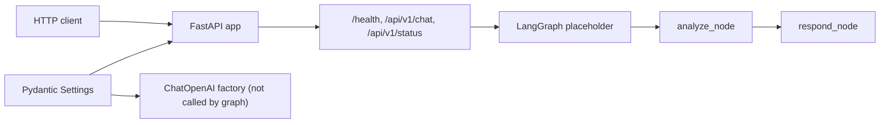
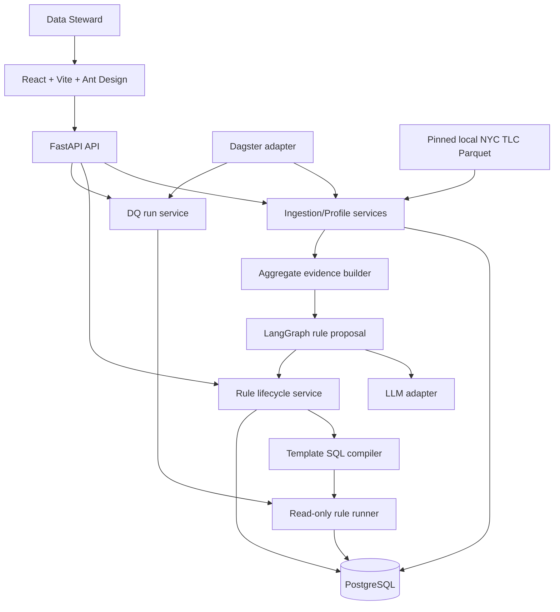
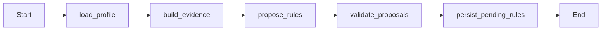
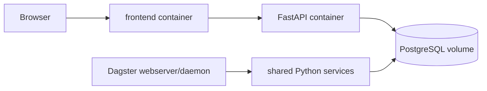

# RidePulse DQ — Architecture

> **Current:** starter FastAPI/LangGraph scaffold.
>
> **Target:** Proposed MVP; chưa được implement.
>
> Chi tiết quyết định: [docs/DECISIONS.md](docs/DECISIONS.md).

## 1. Current architecture

### Current components

| Component | Evidence in code | Limitation |
|---|---|---|
| FastAPI | `src/main.py`, `src/api/routes.py` | Generic chat/status only |
| Pydantic | `src/config.py`, `src/models/schemas.py` | Chưa có product schemas |
| LangGraph | `src/agents/graph.py` | Hai placeholder nodes |
| LLM service | `src/services/llm.py` | Được cấu hình nhưng chưa gọi |
| Storage | `database_url` setting | Không ORM/model/migration/query |
| Frontend | `ui_test/` | Static prototype, không API integration |
| Runtime | Dockerfile + Compose | Backend service only |

`ChatRequest` được validate trước khi graph chạy. Route `/chat` catch mọi exception và
trả detail string; đây là behavior hiện tại cần harden, không phải target error design.

## 2. Proposed MVP architecture

## 3. Layer boundaries

### UI — Proposed

- Hiển thị dataset, profile, proposals, run results và audit summary.
- Gọi API contract; không tự tính rule semantics hoặc health score khác backend.
- Có loading, empty và error states.

### FastAPI

- Validate request/response và map domain error sang HTTP.
- Route không chứa profiling/compiler/database business logic.
- Long-running operation trả run ID/status.

### Services — Proposed

- `ingestion`: manifest → chunked immutable raw rows.
- `profiling`: SQL aggregates → versioned profiles.
- `evidence`: profile → LLM-safe aggregate payload.
- `rules`: proposal/HITL state machine và audit.
- `rule_compiler`: typed rule → one allow-listed `SELECT`.
- `rule_runner`: execute read-only với timeout → persisted result.

### LangGraph — Proposed

Graph kết thúc sau khi persist proposal. HITL diễn ra qua API/database; không giữ một
in-memory graph chờ người dùng.

### PostgreSQL — Proposed

- Raw/source-derived rows và application workflow state.
- SQL pushdown cho profile/rule checks.
- Migration bằng Alembic.
- Rule runner dùng credential read-only riêng.

### Dagster — Proposed

Dagster chỉ wrap service đã được test; không duplicate logic. MVP có manual job và một
schedule disabled-by-default sau khi synchronous vertical slice ổn định.

## 4. Main data flow

1. Server validate server-side dataset manifest/checksum.
2. Ingestion service ghi raw rows + ingestion metadata idempotently.
3. Profiler compute/persist aggregate profile.
4. Evidence builder chỉ chọn aggregate fields/data dictionary.
5. LangGraph/LLM tạo structured proposals; backend validate/persist `PROPOSED`.
6. Steward approve/edit/reject; mỗi transition ghi audit.
7. Approved rule được compiler sinh `SELECT` từ template.
8. Read-only runner execute và persist count/bounded failed IDs.
9. API/UI hiển thị kết quả và Data Health Score có underlying counts.

## 5. Trust boundaries và security

- Browser input, LLM output và dataset manifest đều là untrusted input.
- Client không cung cấp arbitrary local path, URL, table, column hoặc SQL.
- LLM không nhận raw trip rows/secret/system prompt.
- Compiler allow-list identifiers/operators; một statement `SELECT` duy nhất.
- Database role thực thi không có quyền mutate `trips_raw`.
- Logs/errors không chứa API key, `DATABASE_URL` hoặc raw records.
- Authentication/RBAC thật chưa có; demo actor không được mô tả như production auth.

## 6. Deployment

### Current

Một backend container chạy Uvicorn port 8000. Compose chưa có PostgreSQL, frontend
hoặc Dagster. CI chạy Ruff và pytest.

### Proposed local MVP

Cloud deployment là post-MVP và chưa có provider/config quyết định.

## 7. Scalability assumptions

- MVP: 100k, 300k và tối đa 1M rows.
- Chunked ingestion; không load toàn dataset vào RAM.
- Profile/rule checks ưu tiên SQL aggregate/pushdown.
- Không claim scale >1M trước benchmark có hardware/DB context.

## 8. Open Questions

- Sync hay async PostgreSQL driver?
- React/Vite/Ant Design có được team chốt không?
- Dagster có bắt buộc trong final MVP demo không?
- Authentication tối thiểu có cần trước demo không?
- Data source month và performance target cuối cùng là gì?
