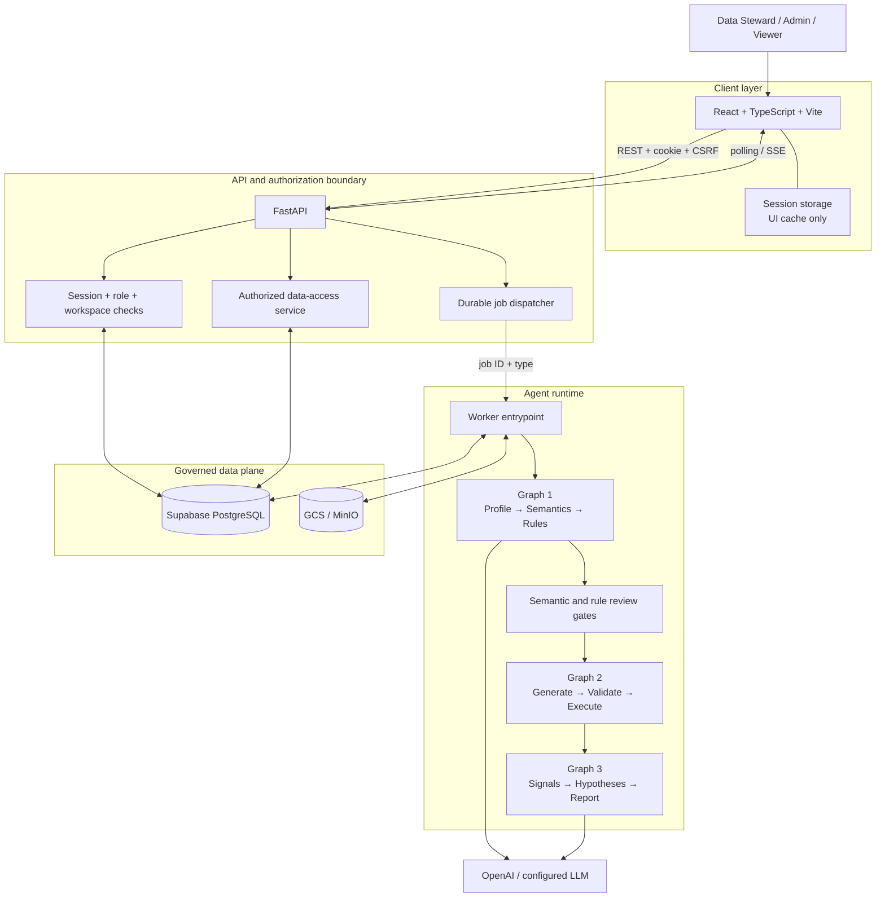
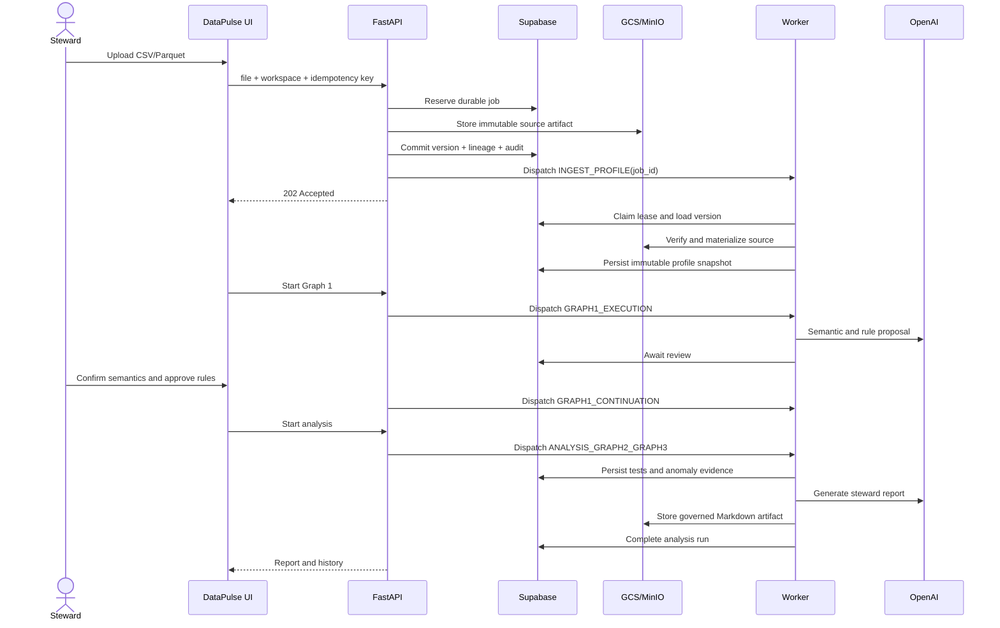
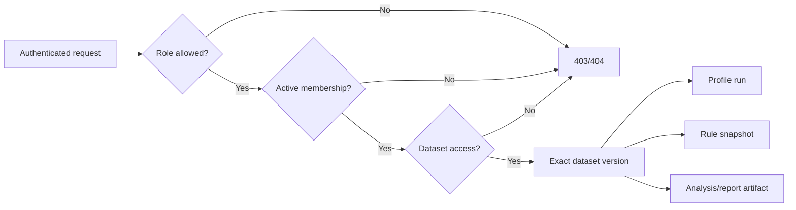
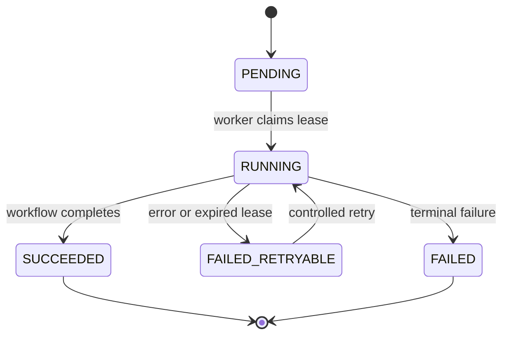
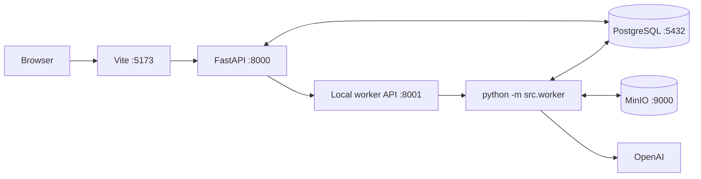
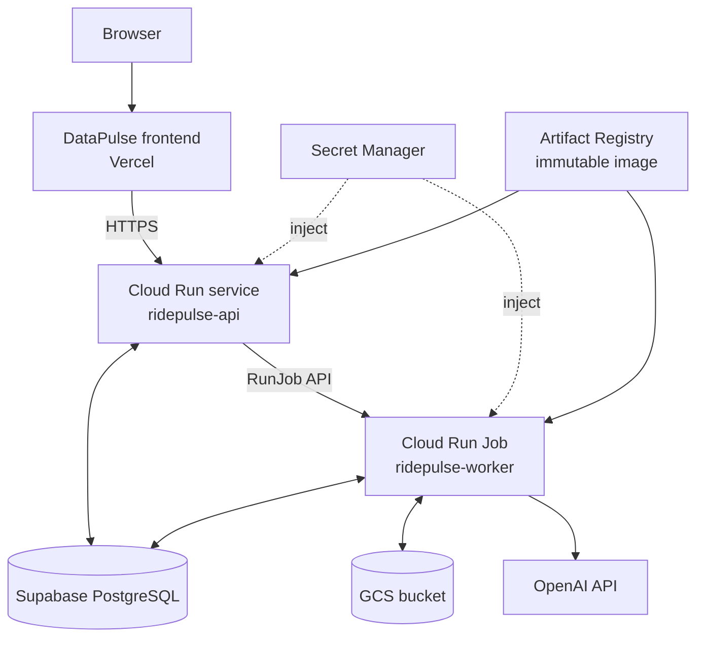

# DataPulse Architecture

## Tổng quan

DataPulse dùng kiến trúc web ba lớp với durable background execution. FastAPI xử lý authorization và tạo job bền vững; worker nhận `job_id`, tải lại state từ PostgreSQL và chạy LangGraph. Dataset nguồn và báo cáo nằm trên object storage, còn metadata, lineage, rules và run history nằm trong Supabase PostgreSQL.

## Kiến trúc logic

## Luồng dataset versioned

## Agent graphs

```mermaid
flowchart LR
    Start([Graph 1]) --> Profile[Generic profiler]
    Profile --> Understand[Dataset understanding]
    Understand --> Semantic[Semantic contract]
    Semantic --> SemanticGate{Steward confirms?}
    SemanticGate -->|No| Wait1[Await review]
    SemanticGate -->|Yes| Candidate[Rule candidate builder]
    Candidate --> Propose[Rule proposer]
    Propose --> Validate[Evidence/schema validation]
    Validate --> RuleGate{Steward approves?}
    RuleGate -->|No| Wait2[Await rule review]
    RuleGate -->|Yes| Snapshot[Approved snapshot]
    Snapshot --> Generate[Graph 2: generate tests]
    Generate --> ArtifactValidate[Validate artifacts]
    ArtifactValidate --> Execute[Execute rules]
    Execute --> PersistDQ[Persist DQ results]
    PersistDQ --> Detect[Graph 3: detect signals]
    Detect --> Decision{Decision}
    Decision -->|Anomaly| Hypothesis[Generate hypotheses]
    Decision -->|Normal / insufficient history| Skip[No hypothesis required]
    Hypothesis --> PersistAnalysis[Persist analysis]
    Skip --> PersistAnalysis
    PersistAnalysis --> Report[Steward report]
```

`INSUFFICIENT_HISTORY` là trạng thái cold-start hợp lệ, không phải execution failure và không đồng nghĩa với `NORMAL`.

## Mô hình lưu trữ

| Nhóm | Thành phần | Vai trò |
|---|---|---|
| Identity | users, sessions, workspace memberships | Authentication và workspace context |
| Catalog | datasets, versions, profile snapshots | Dataset identity, lineage và history |
| Governance | access/grants, review snapshots, audit events | Quyền và Human-in-the-loop |
| Execution | jobs, Graph 1/analysis runs và nodes | Durable orchestration state |
| Quality | approved rules, DQ results, anomaly signals | Test và anomaly evidence |
| Artifacts | governed/workflow artifacts | Source, dbt và report metadata |
| Object storage | GCS/MinIO objects | Immutable file payloads |

`DATABASE_URL` và `SUPABASE_DATABASE_URL` phải trỏ cùng production database trong deployment hiện tại để control plane và execution plane không bị tách state.

## Authorization flow

Frontend visibility không thay thế authorization. API/service phải kiểm tra dataset context trước khi trả profile, rules, reports hoặc artifacts.

## Judge access và quota

Production seed thêm tài khoản `demo-steward` với role `STEWARD` và membership
trong workspace cấu hình bởi `DEMO_WORKSPACE_ID` (mặc định `ws-browser`).
Frontend điền sẵn credential công khai `demo-steward` /
`DEMO_STEWARD_PASSWORD` do nhà vận hành cấu hình trong môi trường không production để giám khảo có thể vào nhanh; credential này không được
coi là secret hay là lớp bảo vệ duy nhất.

Mọi request ghi của tài khoản demo đi qua quota guard ở dependency xác thực.
Guard phân loại upload, profiling, analysis và mutation API; mỗi reservation
được ghi vào `audit_events` và tính theo rolling window 24 giờ. Giới hạn hiện
tại là 40 mutation API, 3 upload, 3 lần bắt đầu profiling và 2 lần bắt đầu
analysis. Request đọc và polling (`GET`, `HEAD`, `OPTIONS`) không tiêu quota.
Reservation được lưu trong database dùng chung nên có hiệu lực xuyên instance
Cloud Run, tab và thiết bị.

## Durable job lifecycle

Heartbeat gia hạn lease khi workflow dài. Handler phải idempotent vì worker có thể retry sau lỗi transport hoặc process restart.

## Local deployment

Docker Compose cung cấp PostgreSQL, MinIO, API và local worker transport. Frontend chạy riêng bằng Vite để có hot reload.

## Cloud deployment

Production API and worker run on Google Cloud Run, with Vercel serving the
DataPulse frontend and Supabase PostgreSQL retaining durable workflow state.

| Resource | Giá trị |
|---|---|
| GCP project | `asignmentvinuni` |
| Region | `asia-southeast1` |
| API service | `ridepulse-api` |
| Worker Job | `ridepulse-worker` |
| Artifact Registry | `ridepulse` |
| GCS bucket | `ridepulse-dbt-artifacts-asignmentvinuni` |
| Frontend | `https://c3-app-028.vercel.app` |
| Backend | `https://ridepulse-api-gbnhdahaya-as.a.run.app` |

Runtime production hiện dùng `PROVIDER=openai`, `AGENT_MODE=graph` và
`DQ_EXECUTION_BACKEND=supabase`. `OPENAI_MODEL` không bắt buộc; nếu bỏ trống,
configuration dùng `gpt-5.6-luna`. Frontend production phải build với
`VITE_USE_MOCK_API=false`, `VITE_API_BASE_URL` trỏ tới API và
`VITE_WORKSPACE_ID=ws-browser` (workspace logic, không phải browser ID).

Tên cloud resource giữ prefix `ridepulse-` để tương thích. DataPulse là tên sản phẩm hiển thị.

### Deployment order

```mermaid
flowchart LR
    Test[Regression] --> Build[Build immutable image]
    Build --> Push[Push registry]
    Push --> Worker[Create/update worker]
    Worker --> API[Deploy API revision]
    API --> Health[Health + dispatch smoke]
    Health --> Frontend[Deploy Vercel]
    Frontend --> Small[Small dataset smoke]
    Small --> E2E[Full browser E2E]
```

API và worker phải dùng cùng image digest. Worker được deploy trước API để revision mới không tạo job khi execution target chưa sẵn sàng.

## Security và rollback

- Secret nằm trong Secret Manager; repository không chứa giá trị thật. Public
  demo credential là ngoại lệ có chủ đích và được bảo vệ bằng quota backend.
- Runtime account chỉ nhận secret, object và Job permissions cần thiết.
- Source/report object có immutable key, checksum và version lineage.
- Upload collision được kiểm tra trước object-storage side effect; failure sau upload cần compensation.
- Report access kế thừa authorization từ dataset version.
- Giữ API revision, image digest và secret version cũ để rollback.
- API và worker phải đổi database secrets đồng thời.
- Không xóa Supabase cũ ngay sau cutover.
- Không tuyên bố GO nếu chỉ health endpoint pass; ít nhất một worker workflow phải hoàn tất trên cloud.

## Quyết định thiết kế

| Quyết định | Lựa chọn | Lý do |
|---|---|---|
| API | FastAPI | Typed contracts và dependency-based authorization |
| Agent | LangGraph | Observable node state và HITL checkpoints |
| Metadata DB | Supabase PostgreSQL | Durable runs, lineage và persistence |
| File payloads | GCS/MinIO | Không phụ thuộc filesystem tạm của container |
| Long-running work | Dedicated worker Job | Tránh mất FastAPI background work khi restart |
| Dataset execution | Immutable version adapter | Không hardcode theo một domain |
| Frontend | Vercel | Static Vite deployment và Git integration |
