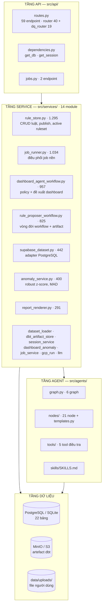
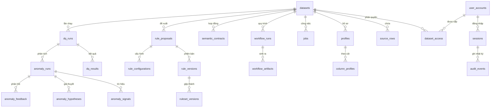
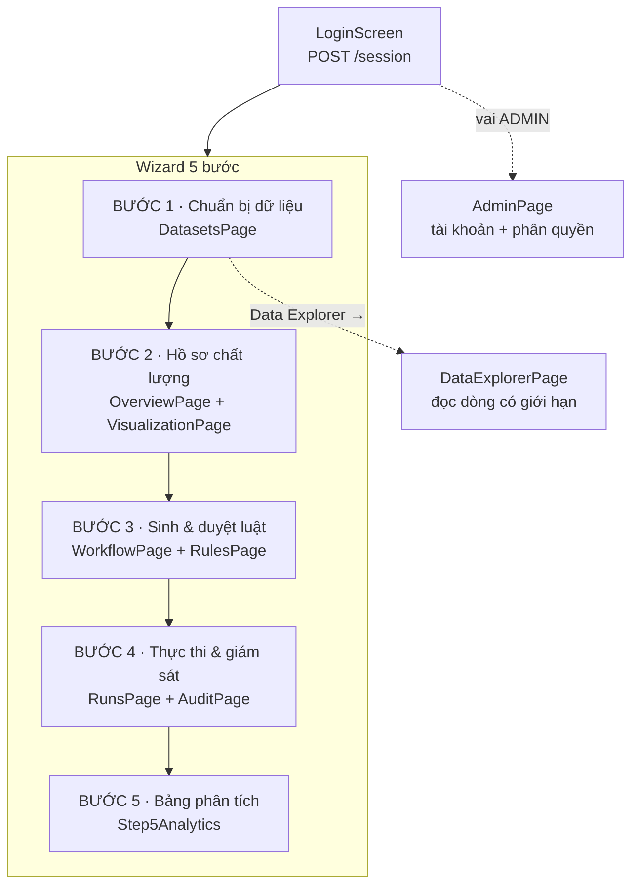

# BÁO CÁO ĐỐI CHIẾU BACKEND — FRONTEND — GRAPH

## P-028 · RidePulse DQ / DataPulse

> **Phạm vi:** đọc toàn bộ `src/`, `frontend/src/`, đối chiếu với `analyze_ete.md`
> **Nhánh:** `feature/new-graph-1` @ `121dcaa`
> **Tính chất:** chỉ đọc và phân tích — không thay đổi mã nguồn
> **Ngày:** 28/08/2026
> **Bản:** v2 — đã hiệu đính. Xem [phụ lục B](#phụ-lục-b--những-gì-đã-sửa-so-với-bản-v1) để biết bản v1 sai ở đâu.

---

## MỤC LỤC

1. [Phương pháp và số liệu nền](#1-phương-pháp-và-số-liệu-nền)
2. [Phân tích `analyze_ete.md`](#2-phân-tích-analyze_etemd)
3. [Backend chi tiết](#3-backend-chi-tiết)
4. [Frontend chi tiết](#4-frontend-chi-tiết)
5. [Những chỗ chưa khớp](#5-những-chỗ-chưa-khớp)
6. [Đề xuất cải thiện](#6-đề-xuất-cải-thiện)

---

## 1. PHƯƠNG PHÁP VÀ SỐ LIỆU NỀN

Mọi con số dưới đây đo trực tiếp từ mã nguồn, loại trừ `__pycache__`. Lệnh tái lập ghi ở [phụ lục A](#phụ-lục-a--lệnh-tái-lập-số-liệu).

| Khu vực | File | Dòng |
| --- | ---: | ---: |
| `src/` | 68 | 18.910 |
| `frontend/src/` | 13 | 7.496 |
| `tests/` | 47 | 6.586 |
| `scripts/` | 18 | 3.186 |

| Thành phần | Số lượng |
| --- | ---: |
| Endpoint API | **61** (`routes.py` 59 · `jobs.py` 2) |
| Bảng cơ sở dữ liệu | **22** |
| Service module | **14** |
| Node agent | **21** (+ `templates.py` là module prompt dùng chung, không phải node) |
| Graph LangGraph | **6** |
| Tool điều tra | **5** |
| Test | **225 passed · 2 skipped** (191s) |
| Lint | `ruff check src/ tests/` → **All checks passed** |

> `.venv` ban đầu trống (chỉ `pip` + `setuptools`), nên bản v2 từng ghi hai dòng cuối là "không đo
> được". Sau khi cài `requirements.txt` (179 gói), cả hai đã được đo trực tiếp và ghi lại ở trên.

---

## 2. PHÂN TÍCH `analyze_ete.md`

### 2.1 Tài liệu mô tả gì

Tài liệu trình bày kiến trúc **Agentic Data Quality Platform** theo nguyên tắc *AI đề xuất — Con người kiểm soát — Công cụ tất định thực thi*, chia thành ba Run:

| Run | Vai trò | Bản chất |
| --- | --- | --- |
| **Run 1 (Graph 1)** | Sinh đề xuất luật, tách 1A hiểu ngữ nghĩa và 1B sinh luật | LLM + HITL |
| **Run 2 (Graph 2)** | Biên dịch luật sang dbt, kiểm định, thực thi | Tất định |
| **Run 3 (Graph 3)** | Phát hiện bất thường, điều tra nguyên nhân gốc bằng DeepAgent | Thống kê + LLM ReAct |

### 2.2 Những khẳng định kiểm chứng được là **đúng**

| Khẳng định | Bằng chứng trong mã nguồn |
| --- | --- |
| Tách Graph 1A và 1B thành hai đồ thị độc lập | `graph.py:41` `build_understanding_graph`, `graph.py:58` `build_rule_proposal_graph` |
| Không dùng checkpoint trong RAM, DB là nguồn sự thật | Không có `langgraph-checkpoint-*` trong `requirements.txt` |
| Artifact có `input_fingerprint` băm SHA-256 | `rule_proposer_workflow.py:54` — `hashlib.sha256(json.dumps(payload, sort_keys=True…))` |
| Cột `version` tăng dần và cờ `stale` | `database.py` — `WorkflowArtifactModel` |
| **LLM không nhận dòng dữ liệu thô** | `profile_digest.py:57` — `sample_info = {"rate": …, "n": …}` chỉ chứa siêu dữ liệu lấy mẫu |
| Fail-closed khi dbt không hợp lệ | `graph.py:250` — nhánh điều kiện dẫn tới `dbt_validation_failed` |
| Graph 2 nối sang Graph 3 | `job_runner.py:989` — `run_anomaly_graph(execution_run_id=…)` |
| Cô lập test qua SQLite | `tests/conftest.py` — `StaticPool`, `sqlite://` in-memory |

Khẳng định về quyền riêng tư dữ liệu là điểm mạnh nhất và **đã được kiểm chứng cụ thể**: digest gửi cho LLM chứa `null_pct`, `type`, `role`, `cross_column_hints`, `schema_constraints` — toàn số liệu thống kê. Trường `sample` chỉ mang tỉ lệ lấy mẫu và số dòng mẫu, kèm cảnh báo rằng `distinct_in_sample` là ước lượng.

---

## 3. BACKEND CHI TIẾT

### 3.1 Kiến trúc tầng



### 3.2 Bản đồ 61 endpoint

Phân bố theo phương thức:

| Router | GET | POST | PATCH | PUT | DELETE | Tổng |
| --- | ---: | ---: | ---: | ---: | ---: | ---: |
| `router` | 18 | 15 | 3 | 1 | 3 | **40** |
| `dq_router` | 9 | 8 | 2 | — | — | **19** |
| `jobs.router` | 1 | 1 | — | — | — | **2** |
| | | | | | | **61** |

#### Nhóm phiên và quản trị

| Method | Đường dẫn | Hàm | Quyền |
| --- | --- | --- | --- |
| POST | `/session` | `login` | công khai |
| DELETE | `/session` | `logout` | mọi vai |
| GET | `/status` | `status_endpoint` | STEWARD, ADMIN |
| GET | `/audit-logs` | `list_audit_logs` | mọi vai |
| GET · POST | `/admin/users` | `list_users` · `create_user` | ADMIN |
| PATCH | `/admin/users/{username}` | `update_user` | ADMIN |
| GET | `/admin/datasets/{id}/access` | `list_dataset_access` | ADMIN |
| PUT · DELETE | `/admin/datasets/{id}/access/{username}` | `grant` · `revoke` | ADMIN |

#### Nhóm dataset và hồ sơ

| Method | Đường dẫn | Hàm | Quyền |
| --- | --- | --- | --- |
| GET | `/datasets` | `list_datasets` | mọi vai |
| POST | `/datasets/import` | `import_dataset` | STEWARD, ADMIN |
| GET | `/datasets/{id}/profile` | `get_dataset_profile` | mọi vai |
| GET | `/datasets/{id}/rows` | `query_dataset_rows` | mọi vai |
| GET | `/datasets/{id}/quality-trends` | `get_quality_trends` | mọi vai |
| POST | `/datasets/{id}/ingestions` | `start_ingestion` | STEWARD, ADMIN |
| GET | `/datasets/{id}/semantic-contract` | `get_semantic_contract` | mọi vai |
| POST | `/datasets/{id}/semantic-contract/confirm` | `confirm_semantic_contract` | STEWARD, ADMIN |

#### Nhóm workflow (điều phối HITL)

| Method | Đường dẫn | Hàm |
| --- | --- | --- |
| POST | `/datasets/{id}/workflows` | `create_workflow` |
| GET | `/workflows/{id}` | `get_workflow` |
| GET | `/workflows/{id}/artifacts` | `list_workflow_artifacts` |
| POST | `/workflows/{id}/steps/{step}` | `run_workflow_step` |
| POST | `/workflows/{id}/advance` | `advance_workflow_stage` |
| POST | `/workflows/{id}/rewind` | `rewind_workflow_stage` |
| POST | `/workflows/{id}/semantic-contract/confirm` | `confirm_workflow_contract` |
| POST | `/workflow-artifacts/{id}/review` | `review_workflow_artifact` |

#### Nhóm đề xuất luật

| Method | Đường dẫn | Hàm |
| --- | --- | --- |
| POST | `/datasets/{id}/rule-proposals` | `start_rule_proposals` |
| POST | `/datasets/{id}/rule-proposals/manual` | `create_manual_rule` |
| GET | `/rule-proposals` | `list_proposals` |
| PATCH · DELETE | `/rule-proposals/{id}` | `review_proposal` · `delete_proposal` |
| PATCH | `/rule-proposals/{id}/configuration` | `update_rule_configuration` |
| GET | `/rule-configurations` | `list_rule_configurations` |

#### Nhóm thực thi và kết quả

| Method | Đường dẫn | Hàm |
| --- | --- | --- |
| POST | `/dq-runs` | `start_dq_run` |
| GET | `/dq-runs/{id}` · `/results` · `/anomalies` | 3 endpoint đọc |
| GET | `/datasets/{id}/dq-runs/latest` | `get_latest_dq_run` |
| POST | `/jobs` · GET `/jobs/{id}` | job tương thích (`jobs.py`) |

#### Nhóm `/dq/` — bộ luật, duyệt, điều tra (19 endpoint)

| Method | Đường dẫn | Hàm |
| --- | --- | --- |
| GET | `/dq/active-rules` | `list_active_rules` |
| PATCH | `/dq/active-rules/{id}/deactivate` | `deactivate_active_rule` |
| GET | `/dq/runs/{id}/rules` · `/review-summary` · `/approved-rules` | 3 endpoint đọc |
| PATCH | `/dq/runs/{id}/rules/{rule_id}` | `review_proposal_rule` |
| POST | `/dq/runs/{id}/rules/bulk-review` | `bulk_review_proposal_rules` |
| POST | `/dq/runs/{id}/publish` · `/dq/rule-runs/{id}/publish` | 2 endpoint xuất bản |
| POST | `/dq/runs/{id}/generate-tests` · `/execute-tests` | sinh và chạy test |
| GET | `/dq/test-runs/{id}` · `/results` | trạng thái + kết quả |
| POST | `/dq/execution-runs` · GET `/{id}/results` | đường thực thi thứ hai |
| POST | `/dq/execute-active-tests` | chạy toàn bộ luật đang bật |
| GET | `/dq/anomaly-runs/{id}/signals` · `/hypotheses` | **đầu ra Graph 3** |
| POST | `/dq/anomaly-runs/{id}/feedback` | vòng phản hồi Steward |

#### ✅ Ghi chú quyền — đây là **điểm mạnh**, không phải rủi ro

Một số endpoint trong `dq_router` không khai `require_role` trên chính route. Điều này **có chủ đích và an toàn**: [`main.py:161-164`](src/main.py#L161) mount `dq_router` kèm `dependencies=[Depends(require_role(["USER","STEWARD","ADMIN"]))]`, tức **mọi** endpoint của router đều bắt buộc có phiên đăng nhập.

Mã nguồn có 15 dòng comment giải thích lý do: `dq_router` được khởi tạo ở `routes.py:122`, **trước khi** `require_role` được định nghĩa ở `routes.py:142`, nên không thể gắn ở route. Gắn một lần ở tầng mount còn bảo đảm **endpoint mới thêm vào không thể lọt lưới**. Tầng này là *xác thực*; *phân quyền* vẫn khai riêng trên từng route (approve / publish / deactivate yêu cầu STEWARD hoặc ADMIN).

### 3.3 Sơ đồ 22 bảng dữ liệu



**Bảng giàu thông tin nhất:** `anomaly_hypotheses` với 14 cột, gồm `supporting_signal_ids`, `contradicting_signal_ids`, `recommended_checks`, `missing_evidence`, `limitations`, `fallback_used`, `model_name`, `prompt_version`, `latency_ms`.

### 3.4 Sáu graph LangGraph

| Graph | Hàm dựng | Dòng | Node | Mục đích |
| --- | --- | ---: | ---: | --- |
| 1A | `build_understanding_graph` | 41 | 3 | Hiểu ngữ nghĩa, dừng ở HITL 1 |
| 1B | `build_rule_proposal_graph` | 58 | 3 | Sinh luật từ hợp đồng đã duyệt |
| 1 đầy đủ | `build_proposal_graph` | 75 | 9 | Toàn bộ Run 1 kèm 2 chốt HITL |
| Dashboard | `build_dashboard_proposal_graph` | 183 | 1 | Chỉ `rule_proposer`, dùng cho dashboard |
| 2 | `build_execution_graph` | 225 | 5 | Sinh test dbt → kiểm định → chạy → lưu |
| 3 | `build_anomaly_graph` | 268 | 4 | Phát hiện → điều tra → lưu → viết báo cáo |

Tài liệu chỉ mô tả **ba** graph. Thực tế có **sáu** — hai graph phụ (`build_rule_proposal_graph`, `build_dashboard_proposal_graph`) không được nhắc tới.

`build_anomaly_graph` nhận tham số `investigation_mode`: `"deepagent"` dùng `anomaly_investigation_node`, `"legacy"` dùng `steward_insights_node`. Xem [rủi ro #7](#52-tài-liệu-bỏ-sót-những-rủi-ro-thật).

### 3.5 Phân loại 21 node

**LLM (9):** `rule_proposer` (811), `report_writer` (343), `anomaly_investigation` (300), `steward_insights` (262), `llm_repair` (229), `prompt_customizer` (120), `dataset_understanding` (118), `data_dictionary_generator` (87), `llm_dbt_repair` (80)

**Tất định (12):** `test_generator` (730), `test_runner` (639), `persist_report` (302), `profiler` (254), `rule_candidate_builder` (253), `persist_analysis` (178), `validate_sql` (172), `hitl_gate` (168), `dbt_validation` (109), `anomaly_detector` (87), `validate_dbt_project` (84), `hitl_semantic_gate` (65)

**Không phải node:** `templates.py` (579) — thư viện prompt template dùng chung.

### 3.6 Năm tool điều tra — tất cả chỉ đọc

Định nghĩa trong [`src/agents/tools/anomaly_investigation_tools.py`](src/agents/tools/anomaly_investigation_tools.py), đều mang decorator `@tool`:

| Tool | Dòng | Chức năng |
| --- | ---: | --- |
| `get_anomaly_case` | 41 | Nạp toàn bộ ngữ cảnh một lần chạy bất thường |
| `get_metric_history` | 139 | Lịch sử chỉ số theo luật, mặc định 30 lần chạy |
| `get_related_quality_results` | 187 | Kết quả liên quan cùng lần thực thi |
| `get_dataset_profile` | 216 | Hồ sơ cơ sở của dataset |
| `query_readonly_evidence` | 256 | **Chỉ hai thao tác có tên** — `failed_rules`, `rule_summary`. Không nhận SQL tuỳ ý |

Thiết kế này là điểm mạnh: giới hạn thao tác thay vì cho phép SQL tự do, nên agent không thể vượt ranh giới đọc.

---

## 4. FRONTEND CHI TIẾT

### 4.1 Cấu trúc

13 file, 7.496 dòng. [`App.tsx`](frontend/src/App.tsx) chiếm **5.387 dòng** — chứa gần như toàn bộ giao diện wizard 5 bước. Chỉ bước 5 được tách thành [`components/wizard/Step5Analytics.tsx`](frontend/src/components/wizard/Step5Analytics.tsx) (248 dòng) vì dùng recharts.

```
App.tsx                              5.387
components/wizard/Step5Analytics.tsx   248
api/client.ts                          320
api/index.ts · api/mockApi.ts · types.ts
i18n/context.tsx · locales/{en,vi}.ts
LanguageToggle.tsx · ThemeControl.tsx · main.tsx
```

> Bốn file `Step1DatasetPrep.tsx` … `Step4Execution.tsx` **đã bị xoá** trên nhánh này (git status: `D`); nội dung đã được gộp ngược vào `App.tsx`. Đây là nguyên nhân khiến `App.tsx` phình to.

### 4.2 Luồng người dùng tổng thể



### 4.3 Từng trang — hiển thị gì, nút nào làm gì

#### Bước 1 · `DatasetsPage`

**Hiển thị:** thẻ từng dataset (tên, nguồn, số dòng, trạng thái), khu vực kéo thả tải lên, và khi đã có hợp đồng ngữ nghĩa thì thêm bảng `SEMANTIC CONTRACT` gồm cột · kiểu ngữ nghĩa · nullable · độ tin cậy · lý do.

| Nút | Hành động | Endpoint |
| --- | --- | --- |
| Chọn thẻ dataset | `selectDataset(id)` | `GET /datasets/{id}/profile` |
| **Import dataset** | `importDataset(file)` | `POST /datasets/import` |
| **Run agent understanding** | `startWorkflowStep("UNDERSTAND_DATA")` | `POST /workflows/{id}/steps/UNDERSTAND_DATA` |
| **Data Explorer →** | `setShowDataExplorer(true)` | chuyển trang, không gọi API |
| Xoá dataset | `deleteDataset(id)` | `DELETE /datasets/{id}` |

#### Bước 2 · `OverviewPage` + `VisualizationPage`

**Hiển thị:** tiêu đề là tên dataset đang chọn, sáu thẻ chỉ số, bảng *Quality by dataset*, *Readiness distribution*, rồi *Data quality observatory* với điểm chất lượng, xu hướng, và `AnomalyMonitoringPanel`.

| Nút | Hành động | Endpoint |
| --- | --- | --- |
| **Start profiling →** | `startAnalysis()` | `POST /datasets/{id}/ingestions` |
| **Dataset catalog →** | `onNavigate("datasets")` | về bước 1 |
| **Open observatory →** | `onNavigate("visualization")` | cuộn xuống |
| Bấm hàng dataset | `onSelectDataset(id)` | `GET /datasets/{id}/profile` |
| **View audit trail** | `onNavigate("audit")` | `GET /audit-logs` |

#### Bước 3 · `WorkflowPage` + `RulesPage`

**Hiển thị:** *Dataset to decision* với hai pha (Propose & review · Publish & monitor), khung `AGENT ARTIFACT` hiện kết quả từng chặng, và khi tới chặng `REVIEW_RULES` thì hiện hàng đợi duyệt với các thẻ `ProposalCard`.

| Nút | Hành động | Endpoint |
| --- | --- | --- |
| **Run agent understanding** | `startWorkflowStep(step)` | `POST /workflows/{id}/steps/{step}` |
| **Continue →** | `advanceWorkflowStep()` | `POST /workflows/{id}/advance` |
| **← Back** | `rewindWorkflowStage(step)` | `POST /workflows/{id}/rewind` |
| **Change dataset** | `onBackToDatasetSelection()` | về bước 1 |
| Duyệt artifact | `reviewWorkflowArtifact(id, input)` | `POST /workflow-artifacts/{id}/review` |
| **Approve rule →** | `reviewProposal(id, "approve")` | `PATCH /rule-proposals/{id}` |
| **Reject** | `reviewProposal(id, "reject")` | `PATCH /rule-proposals/{id}` |
| **Edit** | mở `EditDialog` → `saveEdit` | `PATCH /rule-proposals/{id}` |
| **Delete** | `deleteProposal(id)` | `DELETE /rule-proposals/{id}` |
| Thêm luật thủ công | mở `ManualRuleDialog` | `POST /datasets/{id}/rule-proposals/manual` |
| Lưu cấu hình luật | `saveRuleConfiguration` | `PATCH /rule-proposals/{id}/configuration` |

#### Bước 4 · `RunsPage` + `AuditPage`

**Hiển thị:** bảng *Rule outcomes* (luật · trạng thái · đã kiểm · trượt · ID dòng lỗi), bảng bộ luật đang chạy, panel điều tra nguyên nhân gốc, và nhật ký kiểm toán.

| Nút | Hành động | Endpoint |
| --- | --- | --- |
| **Run approved rules →** | `runApprovedRules()` | `POST /dq-runs` rồi poll `GET /dq-runs/{id}` |
| Phản hồi giả thuyết | `sendFeedback(label)` | `POST /dq/anomaly-runs/{id}/feedback` |

#### Bước 5 · `Step5Analytics`

**Hiển thị:** bốn thẻ chỉ số (điểm DQ, số luật kiểm, số trượt, số bất thường), biểu đồ cột đạt/trượt, biểu đồ tròn theo loại bất thường, đường xu hướng chất lượng, bảng kết quả.

| Nút | Hành động |
| --- | --- |
| **← Back** | về bước 4 |
| **Start new run** | về bước 1 |

#### Trang phụ · `DataExplorerPage`

**Hiển thị:** `BOUNDED READ ACCESS`, bộ lọc (vendor, payment type, khoảng giá trị), bảng dòng dữ liệu có phân trang.

| Nút | Hành động | Endpoint |
| --- | --- | --- |
| Áp bộ lọc | `loadRows(query)` | `GET /datasets/{id}/rows` |
| **← Catalog view** | `setShowDataExplorer(false)` | quay lại |

#### Trang phụ · `AdminPage`

**Hiển thị:** `ACCOUNT DIRECTORY` danh sách tài khoản, `DATASET ACCESS` danh sách phân quyền.

| Nút | Hành động | Endpoint |
| --- | --- | --- |
| **Create account** | `createAdminUser(input)` | `POST /admin/users` |
| Đổi vai / trạng thái | `updateAdminUser` | `PATCH /admin/users/{username}` |
| **Grant access** | `grantAdminAccess` | `PUT /admin/datasets/{id}/access/{username}` |
| Thu hồi | `revokeAdminAccess` | `DELETE /admin/datasets/{id}/access/{username}` |

### 4.4 Sơ đồ: nút bấm → hàm xử lý → endpoint

```mermaid
flowchart LR
    subgraph UI["Nút trên giao diện"]
        B1["Import dataset"]
        B2["Start profiling"]
        B3["Run agent understanding"]
        B4["Approve / Reject rule"]
        B5["Run approved rules"]
        B6["Phản hồi giả thuyết"]
        B7["Create account"]
    end

    subgraph H["Hàm xử lý cấp App"]
        H1["importDataset"]
        H2["startAnalysis"]
        H3["startWorkflowStep"]
        H4["reviewProposal"]
        H5["runApprovedRules"]
        H6["sendFeedback"]
        H7["createAdminUser"]
    end

    subgraph E["Endpoint"]
        E1["POST /datasets/import"]
        E2["POST /datasets/{id}/ingestions"]
        E3["POST /workflows/{id}/steps/{step}"]
        E4["PATCH /rule-proposals/{id}"]
        E5["POST /dq-runs"]
        E6["POST /dq/anomaly-runs/{id}/feedback"]
        E7["POST /admin/users"]
    end

    B1 --> H1 --> E1
    B2 --> H2 --> E2
    B3 --> H3 --> E3
    B4 --> H4 --> E4
    B5 --> H5 --> E5
    B6 --> H6 --> E6
    B7 --> H7 --> E7
```



### 4.5 Cơ chế làm mới dữ liệu

`refreshWorkspace` là hàm nạp trung tâm, gọi **chín** endpoint mỗi lần chạy:

```
listDatasets · getProfile · listProposals · listRuleConfigurations
getLatestDqRun · getDqResults · getDqAnomalies · getQualityTrends · listAuditLogs
```

Hầu hết hành động ghi đều gọi lại `listProposals` + `listAuditLogs` sau khi thành công, nên giao diện luôn phản ánh trạng thái server.

---

## 5. NHỮNG CHỖ CHƯA KHỚP

### 5.1 Tài liệu sai so với mã nguồn

| # | Tài liệu nói | Thực tế | Mức |
| - | --- | --- | --- |
| 1 | Output của `rule_candidate_builder_node` lưu vào bảng **`rule_candidates`** | **Bảng này không tồn tại.** `grep -c rule_candidates src/models/database.py` → **0**. Candidate chỉ nằm trong state LangGraph, không được lưu bền | Cao |
| 2 | HITL 1 gọi `POST /artifacts/{id}/review` | Đường dẫn thật là `POST /workflow-artifacts/{artifact_id}/review` | Trung bình |
| 3 | HITL 2 gọi `POST /steps/PUBLISH_RULESET` | Đường dẫn thật là `POST /workflows/{workflow_run_id}/steps/{step}` với `step=PUBLISH_RULESET` | Trung bình |
| 4 | Hệ thống có **3 graph** | Có **6**: thiếu `build_rule_proposal_graph` và `build_dashboard_proposal_graph` | Trung bình |
| 5 | "214+ pytest cases" | Đã cài `pytest` và chạy: **225 passed · 2 skipped** (191s) — con số của bản v1 là **đúng**. Tài liệu ghi "214+" vẫn thấp hơn thực tế | Thấp |
| 6 | `report_writer_node` "xuất báo cáo phục vụ cấp quản lý" | Báo cáo ghi ra `output/steward_reports/steward_report_{ts}_{id}.md` ([report_writer_node.py:237-242](src/agents/nodes/report_writer_node.py#L237)) nhưng **không endpoint nào đọc được** (`grep steward src/api/routes.py` → không có route) — người dùng không bao giờ thấy | **Cao** |

### 5.2 Tài liệu bỏ sót những rủi ro thật

Sắp theo mức độ cấp bách thực tế.

| # | Vấn đề | Bằng chứng | Mức |
| - | --- | --- | --- |
| 7 | **Run 3 crash 100%.** `anomaly_investigation_mode` mặc định `"deepagent"`, `ANOMALY_INVESTIGATION_MODE` **không có trong `.env`**, và `deepagents` **chưa được cài** | `python -c "import deepagents"` → `ModuleNotFoundError`; [config.py:50](src/config.py#L50); [anomaly_investigation_node.py:91](src/agents/nodes/anomaly_investigation_node.py#L91) `raise RuntimeError("Install deepagents…")` | 🔴 **Chặn** |
| 8 | ~~Docker chạy AI giả~~ — **BÁC BỎ, xem mục 5.4** | Đo trực tiếp trong container đang chạy: `agent_mode = graph`, khoá OpenAI có | ✅ Không phải lỗi |
| 9 | **Timeout LLM 25s, và trần cứng là 120s.** Lời gọi thật có thể mất tới 110 giây — sát trần, không còn biên an toàn | [config.py:33](src/config.py#L33) `Field(default=25, ge=5, le=120)` | 🟠 Cao |
| 10 | **Frontend gọi endpoint không tồn tại.** `continueLoop()` gọi `POST /workflows/{id}/loop-decision` — backend không có route này | [client.ts:308-313](frontend/src/api/client.ts#L308); `grep -rn "loop-decision\|loop_decision" src/` → **0** kết quả. Hàm cũng không được `App.tsx` gọi → code chết cả hai phía | 🟠 Trung bình |
| 11 | Ba module Run 3 **không có test**: `anomaly_investigation_node`, `anomaly_investigation_tools`, `persist_analysis_node` — chính là đường mặc định của Run 3 | `ls tests/test_agents/` — không có file tương ứng (nhưng **có** `test_report_writer_node.py` và `test_persist_report_node.py`) | 🟠 Cao |
| 12 | File người dùng tải lên ghi thẳng ra `data/uploads/` bằng `write_bytes`, không qua object storage — mất khi container khởi động lại | [routes.py:583-586](src/api/routes.py#L583) | 🟠 Cao |
| 13 | Hai đường API song song cùng làm một việc: `/dq-runs/*` và `/dq/execution-runs/*`, `/dq/test-runs/*` | Nhóm `/dq/execution-runs`, `/dq/test-runs`, `/dq/generate-tests`, `/dq/execute-tests`, `/dq/execute-active-tests` không xuất hiện trong `frontend/src/api/client.ts` | 🟡 Trung bình |
| 14 | Không có observability: `openinference-instrumentation-langchain` bị comment | `requirements.txt:43` | 🟡 Thấp |

### 5.3 Chênh lệch giữa năng lực backend và giao diện

| Backend sinh ra | Giao diện hiển thị |
| --- | --- |
| `anomaly_hypotheses` — 14 cột gồm bằng chứng hai chiều, kiểm tra khuyến nghị, giới hạn tự khai | ✅ Đã có panel điều tra đọc `signals` + `hypotheses` |
| Báo cáo Markdown của `report_writer_node` | ❌ **Không có endpoint, không có chỗ hiển thị** |
| `rule_proposals` — 22 trường gồm `business_rationale`, `parameter_provenance`, `confidence_breakdown` | ✅ Đã có panel "Vì sao có luật này" |
| 61 endpoint | ~7 endpoint nhóm thực thi thứ hai chưa được frontend dùng |
| — | ⚠️ Frontend có 1 lời gọi tới endpoint **không tồn tại** (`/loop-decision`) |

### 5.4 Kiểm chứng trên hệ thống ĐANG CHẠY (28/08/2026)

Toàn bộ stack được khởi động và đo trực tiếp, thay vì suy luận từ file cấu hình.

```
ridepulse-api      Up 4 hours (healthy)      0.0.0.0:8000->8000/tcp
ridepulse-worker   Up 4 hours (unhealthy)    8001/tcp
ridepulse-db       Up 7 days (healthy)       5432
ridepulse-minio    Up 6 days (healthy)       9000-9001
frontend (vite)                              5173, 5174
```

`GET /health` → `{"status":"ok","env":"local"}` · `GET /docs` → 200 · proxy `5174/api/v1/datasets` → 401 (đúng, cần phiên).

Giá trị cấu hình **thực tế bên trong container `ridepulse-api`**:

| Biến | Giá trị shell | `get_settings()` trả về | Kết luận |
| --- | --- | --- | --- |
| `AGENT_MODE` | *(rỗng)* | **`graph`** | ✅ AI chạy thật |
| `OPENAI_API_KEY` | *(rỗng)* | **có** | ✅ |
| `DATABASE_URL` | postgres | postgres | ✅ compose ghi đè `.env`, đúng thứ tự ưu tiên |
| `LLM_REQUEST_TIMEOUT_SECONDS` | *(rỗng)* | **25** | ⚠️ rủi ro #9 vẫn còn |
| `ANOMALY_INVESTIGATION_MODE` | *(rỗng)* | **`deepagent`** | 🔴 rủi ro #7 vẫn còn |

**Vì sao biến shell rỗng mà cấu hình vẫn đúng:** `docker-compose.yml` mount `volumes: - .:/app`, nên `.env` **đi vào container theo bind mount** (`ls /app/.env` → tồn tại). [config.py:9,13-15](src/config.py#L9) gọi `load_dotenv()` và khai `SettingsConfigDict(env_file=".env")`, nên pydantic-settings đọc file này. **Không cần thêm `env_file:` vào compose.**

**Rủi ro #7 xác nhận trong runtime:** `docker exec ridepulse-api python -c "import deepagents"` → `ModuleNotFoundError`, trong khi `anomaly_investigation_mode = "deepagent"`. **Run 3 sẽ crash trên chính hệ thống đang chạy.** Đây là lỗi duy nhất còn lại ở mức chặn.

**Ghi chú:** `ridepulse-worker` bị đánh dấu `unhealthy` dù log cho thấy `Application startup complete` và uvicorn lắng nghe `0.0.0.0:8001` — nhiều khả năng healthcheck trỏ sai đường dẫn, cần soát lại.

---

## 6. ĐỀ XUẤT CẢI THIỆN

### 6.1 Ưu tiên cao — đang gãy hoặc chặn giá trị sản phẩm

| # | Việc | Vì sao | Ước lượng |
| - | --- | --- | --- |
| 1 | `pip install deepagents` **hoặc** đặt `ANOMALY_INVESTIGATION_MODE=legacy` trong `.env` | Run 3 hiện ném `RuntimeError` ngay khi chạy — **đây là thứ duy nhất đang hỏng hoàn toàn** | 15 phút |
| 2 | Sửa healthcheck của service `worker` trong `docker-compose.yml` | Container bị đánh dấu `unhealthy` suốt 4 giờ dù ứng dụng khởi động thành công và lắng nghe `:8001` — healthcheck nhiều khả năng trỏ sai đường dẫn, làm mất tín hiệu giám sát thật | 30 phút |
| 3 | Nâng trần `le=120` → `le=300` ở [config.py:33](src/config.py#L33), rồi đặt `LLM_REQUEST_TIMEOUT_SECONDS=180` | Đặt 120 là chạm đúng trần cứng hiện tại, không còn biên cho lời gọi 110 giây | 15 phút |
| 4 | Thêm endpoint đọc báo cáo Markdown, ví dụ `GET /dq-runs/{id}/steward-report` | `report_writer_node` là node cuối của Graph 3; sản phẩm của nó hiện không đến được người dùng. Đường dẫn thật: `output/steward_reports/` | Nửa ngày |
| 5 | Đưa file tải lên vào object storage | MinIO đã chạy, `boto3` đã có, `dbt_artifact_store` đã là client S3 hoàn chỉnh — chỉ cần dùng lại | 1 ngày |

### 6.2 Ưu tiên trung bình — độ tin cậy

| # | Việc | Vì sao |
| - | --- | --- |
| 6 | Cài `pytest` + `ruff` vào `.venv` và chạy lại | Hiện **không đo được** trạng thái test và lint — mọi con số về chất lượng đều là suy đoán |
| 7 | Viết test cho 3 module Run 3 chưa có test | Chúng là đường mặc định nhưng bộ test hiện tại không chạm tới |
| 8 | Xoá `continueLoop` trong `client.ts` **hoặc** cài route `/workflows/{id}/loop-decision` | Lời gọi API tới endpoint không tồn tại, không ai dùng — tàn dư của tính năng bỏ dở |
| 9 | Hợp nhất hai đường API thực thi | ~7 endpoint trùng chức năng làm người bảo trì không biết đường nào là chuẩn |
| 10 | Lưu `rule_candidates` xuống DB **hoặc** sửa tài liệu | Tài liệu mô tả một bảng không tồn tại; mất khả năng truy vết candidate |

### 6.3 Ưu tiên thấp — vệ sinh mã nguồn

| # | Việc |
| -- | --- |
| 11 | Cập nhật `analyze_ete.md`: sửa hai đường dẫn API sai, đổi "3 graph" thành 6, bỏ con số test không kiểm chứng được |
| 12 | Bật `observability` — bỏ comment `openinference-instrumentation-langchain` ở `requirements.txt:43` |
| 13 | Tách lại `App.tsx` (5.387 dòng) thành các file theo trang — bốn file `Step*.tsx` đã từng tồn tại và bị xoá; cân nhắc khôi phục hướng đó |
| 14 | Dọn `__pycache__` cũ khỏi cây làm việc — các file `.pyc` mồ côi (ví dụ chứa `DATA_DICTIONARY_PATH` đã bị xoá khỏi mã nguồn) gây kết quả grep sai lệch |

### 6.4 Điều nên giữ nguyên

Bốn thiết kế dưới đây khuyến nghị **không đổi**:

**Tách Graph 1A và 1B.** Cho phép retry phần sinh luật mà không chạy lại phần hiểu ngữ nghĩa, tiết kiệm token thật.

**Tool điều tra chỉ nhận thao tác có tên.** `query_readonly_evidence` giới hạn ở `failed_rules` và `rule_summary` thay vì nhận SQL tuỳ ý — agent không thể vượt ranh giới đọc dù prompt bị thao túng.

**LLM chỉ nhận số liệu thống kê.** Đã kiểm chứng: `sample_info` chỉ chứa `{rate, n, caveat}`, không có giá trị dòng thật. Đây là khẳng định mạnh nhất của tài liệu và nó đúng.

**Gắn `require_role` ở tầng mount cho `dq_router`.** [main.py:161-164](src/main.py#L161) — bảo đảm endpoint mới thêm vào không thể ship mà thiếu xác thực. Phân quyền chi tiết vẫn khai riêng trên từng route.

---

## PHỤ LỤC A — LỆNH TÁI LẬP SỐ LIỆU

```bash
# Dòng mã, loại trừ __pycache__
find src -name "*.py" | grep -v __pycache__ | xargs wc -l | tail -1

# Endpoint
grep -cE '^@router\.'    src/api/routes.py   # 40
grep -cE '^@dq_router\.' src/api/routes.py   # 19
grep -cE '^@'            src/api/jobs.py     #  2

# Bảng dữ liệu
grep -c "__tablename__" src/models/database.py            # 22

# Graph
grep -n "^def build_" src/agents/graph.py                 #  6

# Node (trừ templates.py)
ls src/agents/nodes/*.py | grep -v __init__ | wc -l        # 22 → 21 node

# Tool điều tra
grep -c "^@tool" src/agents/tools/anomaly_investigation_tools.py   # 5

# Hàm test
grep -rh "^\s*\(async \)\?def test_" tests/ --include=*.py | wc -l  # 217

# Kiểm tra rủi ro
python -c "import deepagents"                             # ModuleNotFoundError
grep -c rule_candidates src/models/database.py            # 0
grep -rn "loop-decision" src/                             # 0
grep -n "env_file\|AGENT_MODE" docker-compose.yml         # không khớp
```

**Đã chạy sau khi cài `requirements.txt`:** `python -m pytest -q` → **225 passed · 2 skipped** ·
`python -m ruff check src/ tests/` → **All checks passed**.

---

## PHỤ LỤC B — NHỮNG GÌ ĐÃ SỬA SO VỚI BẢN v1

| Mục | Bản v1 nói | Bản v2 (đo lại) |
| --- | --- | --- |
| **Rủi ro #7 (cũ)** | *"`AGENT_MODE` không được đặt trong `docker-compose.yml` hay `.env`"* → đề xuất ưu tiên #1 | ❌ **Sai hoàn toàn.** `.env:28` có `AGENT_MODE=graph`, và `.env` **đi vào container qua bind mount `- .:/app`** rồi được `load_dotenv()` + `SettingsConfigDict(env_file=".env")` đọc. Đo trong container đang chạy: `agent_mode = graph`. Không có vấn đề gì cần sửa — xem [mục 5.4](#54-kiểm-chứng-trên-hệ-thống-đang-chạy-28082026) |
| **Rủi ro #12 (cũ)** | `DATA_DICTIONARY_PATH` chưa định nghĩa → `NameError` | ❌ **Lỗi thời.** Chỉ còn trong `__pycache__/*.pyc` mồ côi, đã bị xoá khỏi mã nguồn `.py`. Đã gỡ bỏ, thay bằng đề xuất #14 (dọn `__pycache__`) |
| **Ghi chú quyền mục 3.2** | *"6 endpoint `/dq/` không khai `require_role`… chỉ được bảo vệ nếu…"* | ❌ **Gây hiểu nhầm.** `main.py:161-164` mount có `require_role`, kèm 15 dòng comment giải thích. Đã chuyển sang mục "Điều nên giữ nguyên" |
| **Rủi ro `/loop-decision`** | không có | ✅ **Bổ sung.** `client.ts:308` gọi endpoint backend không tồn tại → rủi ro #10 mới |
| **Endpoint** | 58 | **61** (`router` 40 + `dq_router` 19 + `jobs.py` 2) |
| **Service module** | 15 | **14** |
| **Node agent** | 22 | **21** node + `templates.py` (không phải node) |
| **File `src/`** | 71 file · 18.867 dòng | **68** file · **18.910** dòng |
| **File `scripts/`** | 28 file · 4.542 dòng | **18** file · **3.186** dòng |
| **Test** | *"225 pass · 2 skip"* trình bày là số đo | ✅ **Đúng.** Sau khi cài `pytest` vào `.venv` và chạy lại: **225 passed · 2 skipped**. Bản v2 từng hạ xuống "không đo được" khi `pytest` chưa có; nay đã xác nhận |
| **ruff** | *"3 lỗi (I001, W293, F841)"* | ✅ **Đã sạch.** `ruff check src/ tests/` → *All checks passed* |
| **Đường dẫn báo cáo** | `output/reports/steward_report_*.md` | `output/steward_reports/steward_report_{ts}_{id}.md` |
| **Thứ tự ưu tiên** | deepagents xếp #3 | Đưa lên **#1** — đây là thứ duy nhất đang crash 100% |

---

*Báo cáo lập bằng cách đọc trực tiếp mã nguồn. Mọi con số kèm lệnh tái lập ở phụ lục A. Những gì không đo được đều ghi rõ là không đo được. Không có thay đổi nào được thực hiện lên mã nguồn trong quá trình phân tích.*
