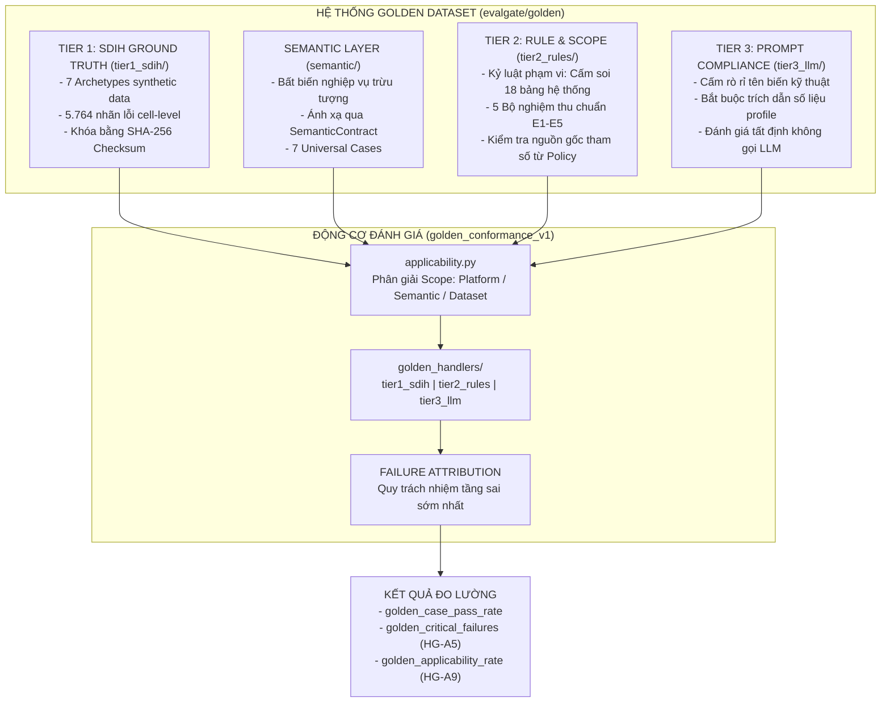

# EVALGATE — BÁO CÁO TOÀN THƯ HỆ THỐNG GOLDEN DATASET

> **Tài liệu chuyên môn:** `GOLDEN_DATASET_REPORT.md`  
> **Phân hệ:** Cổng Chất lượng AI (Gate 1: AI Quality) · Evaluator: `golden_conformance_v1`  
> **Dữ liệu kiểm chuẩn:** Run chứng nhận chính thức ngày **31/08/2026** (`product-5ace0bc6893e4fc2ae1d19d832d2edbe`)  
> **Phiên bản Schema Golden:** `2.0` · **SDIH Seed:** `20260819` · **Tổng số nhãn kiểm chuẩn:** `5.764` nhãn  
> **Người biên soạn:** Senior AI Engineer & AI System Auditor.

---

# MỤC LỤC TỔNG QUAN

1. [Bản Chất & Mục Đích Đo Lường Của Golden Dataset](#1-bản-chất--mục-đích-đo-lường-của-golden-dataset)
2. [Kiến Trúc Phân Tầng & Luồng Quy Trách Nhiệm (Failure Attribution)](#2-kiến-trúc-phân-tầng--luồng-quy-trách-nhiệm)
3. [Phân Tích Chi Tiết Từng Tệp Mã Nguồn & Dữ Liệu Trong `evalgate/golden/`](#3-phân-tích-chi-tiết-từng-tệp-mã-nguồn--dữ-liệu)
   - [3.1. manifest.yaml — Bản Kê Khai Vân Tay 5.764 Nhãn Lỗi](#31-manifestyaml--bản-kê-khai-vân-tay-5764-nhãn-lỗi)
   - [3.2. freeze.py — Cơ Chế Đóng Băng & Xác Thực Tính Bất Biến Checksum](#32-freezepy--cơ-chế-đóng-băng--xác-thực-tính-bất-biến-checksum)
   - [3.3. schema.py — Khung Pydantic 19 Assertions & 5 Layers](#33-schemapy--khung-pydantic-19-assertions--5-layers)
   - [3.4. applicability.py — Động Cơ Phân Giải Ngữ Nghĩa Đa Dataset](#34-applicabilitypy--động-cơ-phân-giải-ngữ-nghĩa-đa-dataset)
   - [3.5. tier1_sdih/ — 7 Bộ Nhãn Lỗi Tế Bào Kiểm Chuẩn](#35-tier1_sdih--7-bộ-nhãn-lỗi-tế-bào-kiểm-chuẩn)
   - [3.6. tier2_rules/ — Kỳ Vọng Về Cấu Trúc Rule & Kỷ Luật Phạm Vi](#36-tier2_rules--kỳ-vọng-về-cấu-trúc-rule--kỷ-luật-phạm-vi)
   - [3.7. tier3_llm/ — Kỳ Vọng Về Tuân Thủ System Prompt Của LLM](#37-tier3_llm--kỳ-vọng-về-tuân-thủ-system-prompt-của-llm)
   - [3.8. semantic/ — 7 Bất Biến Ngữ Nghĩa Toàn Cục (Column Invariants)](#38-semantic--7-bất-biến-ngữ-nghĩa-toàn-cục-column-invariants)
4. [Động Cơ Đánh Giá `golden_conformance_v1` & Module `golden_handlers/`](#4-động-cơ-đánh-giá-golden_conformance_v1--module-golden_handlers)
5. [Kết Quả Đo Lường Thực Tế Ngày 31/08/2026](#5-kết-quả-đo-lường-thực-tế-ngày-31082026)
6. [Quy Trình Mở Rộng & 4 Nguyên Tắc Vàng Khi Viết Golden Case](#6-quy-trình-mở-rộng--4-nguyên-tắc-vàng-khi-viết-golden-case)

---

# 1. BẢN CHẤT & MỤC ĐÍCH ĐO LƯỜNG CỦA GOLDEN DATASET

### 1.1. Tại sao hệ thống kiểm thử AI cần Golden Dataset?
Trong các hệ thống AI xử lý dữ liệu tự động (như DataPulse / P-028), công cụ cấy lỗi nhân tạo **SDIH (Synthetic Defect Injection Harness)** là chưa đủ. SDIH chỉ trả lời được một câu hỏi duy nhất:  
> *"Agent có gắn cờ (flag) được ô dữ liệu bị lỗi hay không?"*

Tuy nhiên, trong thực tế triển khai production, những lỗi gây thiệt hại nặng nề nhất của AI Agent không phải là lỗi tìm kiếm (Detection), mà là **LỖI PHÁN ĐOÁN (Judgement Failures)**:

1. **Học vẹt từ dữ liệu bẩn (Learning from contaminated data):**  
   Khi dữ liệu đầu vào chứa các giá trị âm bất hợp lý (ví dụ: `fare_amount = -10.0$`), một Agent thiếu hiểu biết nghiệp vụ sẽ tự động tính thống kê `min = -10.0` và đề xuất rule `RANGE: min = -10.0`. Khi đó, rule này chấp nhận toàn bộ các dòng lỗi hiện có. SDIH không thể bắt được lỗi này vì Agent không hề báo miss defect nào, nhưng đây là một thảm họa về logic nghiệp vụ.
2. **Đặt ràng buộc rỗng (Vacuous constraints):**  
   Agent đề xuất rule `UNIQUE` trên cột khóa kỹ thuật do hệ thống tự sinh (`source_row_id`). Do hệ thống tự sinh mã duy nhất cho từng dòng, rule này luôn luôn PASS $100\%$, nhưng hoàn toàn vô dụng trong việc phát hiện các dòng trùng lặp nghiệp vụ (Business duplicate).
3. **Thất thoát phạm vi kiểm định (Scope discipline violation):**  
   Agent không phân biệt được đâu là bảng dữ liệu của người dùng và đâu là bảng quản trị của phần mềm, dẫn đến việc Agent đi phân tích và đề xuất rule trên các bảng nội bộ (`jobs`, `sessions`, `audit_events`, `proposed_rules`), gây lãng phí chi phí token LLM và làm tắc nghẽn hàng đợi duyệt của Data Steward.
4. **Không tuân thủ Prompt chỉ thị (Instruction non-compliance):**  
   Viết lý giải nghiệp vụ (`business_rationale`) chứa đầy tên cột kỹ thuật (`tpep_pickup_datetime`, `vendor_id`, `ACCEPTED_VALUES`), trong khi System Prompt yêu cầu rõ *"TUYET DOI CAM su dung ten bien ky thuat"*. Hoặc viết lý giải suy luận (`ai_reasoning`) mà không hề trích dẫn số liệu thống kê thực tế nào.

👉 **Golden Dataset ra đời để giải quyết triệt để các bài toán trên.** Đây là tập hợp các **kỳ vọng đã được xác định trước khi Agent chạy (written-down expectations)** về: loại rule, cột áp dụng, nguồn gốc tham số, phạm vi bảng và chất lượng văn bản.

### 1.2. Tính Bất Biến & Chi Phí $0.00 (Deterministic Baseline)
* **Chi phí hoàn toàn bằng 0 ($0.00):** Golden Dataset không sử dụng "LLM để chấm LLM". Toàn bộ việc kiểm tra được thực hiện qua các phép toán so sánh, đối chiếu tập hợp, kiểm tra chuỗi và biểu thức chính quy (Regex).
* **Chống trôi dạt Baseline (No Drift):** Nếu dùng LLM làm giám khảo (LLM-as-a-judge), điểm số đánh giá sẽ bị trôi dạt giữa các lần chạy do tính bất định của mô hình ngôn ngữ. Một thước đo bị trôi thì không thể đo lường sự trôi dạt của sản phẩm. Sự tất định $100\%$ của Golden Dataset giúp nó trở thành **Regression Baseline** tuyệt đối tin cậy.

---

# 2. KIẾN TRÚC PHÂN TẦNG & LUỒNG QUY TRÁCH NHIỆM

Hệ thống Golden Dataset được tổ chức thành 3 tầng độc lập, bổ trợ cho nhau và được liên kết bởi Động cơ Phân giải Ngữ nghĩa:



### Luồng Quy Trách Nhiệm 5 Tầng (Failure Attribution)
Hệ thống sắp xếp các kiểm tra theo thứ tự nhân quả nghiêm ngặt:

$$\text{interpretation} \longrightarrow \text{process} \longrightarrow \text{evidence} \longrightarrow \text{decision} \longrightarrow \text{negative\_space}$$

| Tầng (Layer) | Ý Nghĩa Kỹ Thuật | Nếu Thất Bại $\rightarrow$ Quy Trách Nhiệm |
|---|---|---|
| **1. Interpretation** | Agent có hiểu đúng bản chất cột không? (`semantic_type_is`, `nullable_expected_is`) | Lỗi ở `dataset_understanding_node`. Ngăn không cho báo lỗi oan ở các node sau. |
| **2. Process** | Agent có thực sự gọi tool kiểm chứng trước khi phát biểu? (`tools_were_used`) | Lỗi ở vòng lặp suy luận ReAct / Tool calling của Agent. |
| **3. Evidence** | Bằng chứng trích dẫn có tồn tại và đúng chỉ số quyết định? (`evidence_metric_exists`) | Lỗi ở cơ chế chọn lọc ngữ cảnh của `rule_proposer_node`. |
| **4. Decision** | Rule được đề xuất có đúng loại, đúng cột, đúng dải tham số? (`rule_proposed`, `parameter_bound`) | Lỗi ở logic sinh rule của `rule_proposer_node`. |
| **5. Negative Space** | Agent có biết kiềm chế khi thiếu dữ liệu? (`max_false_positive_rate`, `must_abstain`) | Lỗi ở cơ chế tự đánh giá độ bất định (Uncertainty estimation). |

---

# 3. PHÂN TÍCH CHI TIẾT TỪNG TỆP MÃ NGUỒN & DỮ LIỆU

---

## 3.1. `manifest.yaml` — Bản Kê Khai Vân Tay 5.764 Nhãn Lỗi
* **Đường dẫn:** [evalgate/golden/manifest.yaml](file:///c:/Users/PC%20ACER/OneDrive/Desktop/AI%20ML%20Engineer/P-028/evalgate/golden/manifest.yaml)
* **Quy chuẩn:** Quản lý toàn bộ thông số của 7 bộ dữ liệu kiểm chuẩn Tier 1.
* **Cấu trúc dữ liệu:**
  ```yaml
  version: '1.0'
  sdih_seed: 20260819
  max_rows: 20000
  frozen_at: '2026-08-22T03:19:49.773236+00:00'
  datasets:
    corpus-nyc-taxi-50k:
      status: FROZEN
      fingerprint: 466538ac015fc510cc99dc9fe65b5898b194576b231da3ec52487321775a96a0
      sha256: 1be973aff0035c93fddcd2038662acdb403b6669ea8ba07bf53a44595287f308
      total_labels: 3498
  ```
* **Bảng tổng hợp 7 Archetypes:**
  | Tên Dataset | Số Nhãn Lỗi | Các Defect Classes Tiêu Biểu |
  |---|:---:|---|
  | `corpus-nyc-taxi-50k` | 3.498 | SIGN_FLIP (2.634), DUPLICATE_ROW (314), INVALID_CATEGORY (300) |
  | `corpus-synth-clinical`| 500 | Đều 10 classes (50 nhãn/class), giả lập dữ liệu PII |
  | `corpus-synth-hr` | 500 | Lương, chức vụ, bonus (CROSS_FIELD, SIGN_FLIP, OUTLIER) |
  | `corpus-synth-iot` | 400 | Cảm biến, trễ nhãn thời gian STALE_TIMESTAMP (50), TYPE_VIOLATION |
  | `corpus-synth-retail` | 450 | Giao dịch bán lẻ, số lượng âm, sai category |
  | `corpus-synth-tiny` | 16 | Tập kiểm thử biên mini (2 nhãn mỗi class trên 8 classes) |
  | `corpus-synth-wide` | 400 | Bảng nhiều cột kiểm tra khả năng mở rộng |
  | **TỔNG CỘNG** | **5.764** | **Bảo đảm phủ kín 100% không gian khuyết tật dữ liệu** |

---

## 3.2. `freeze.py` — Cơ Chế Đóng Băng & Xác Thực Tính Bất Biến Checksum
* **Đường dẫn:** [evalgate/golden/freeze.py](file:///c:/Users/PC%20ACER/OneDrive/Desktop/AI%20ML%20Engineer/P-028/evalgate/golden/freeze.py)
* **Nhiệm vụ:**
  1. `build_labels()`: Khởi tạo generator, cấy lỗi theo seed cố định `20260819`, bảo đảm khả năng tái lập $100\%$.
  2. `freeze()`: Xuất dữ liệu ra các tệp `.labels.json` và cập nhật mã SHA-256 vào `manifest.yaml`.
  3. `verify()`: Chạy lại toàn bộ quá trình tính toán từ đầu trong bộ nhớ và so sánh đối chiếu từng bit với tệp trên đĩa. Nếu phát hiện tệp bị sửa đổi thủ công hoặc bị sai lệch, lệnh lập tức trả về lỗi.
* **Lệnh xác thực:**
  ```powershell
  .\venv\Scripts\python.exe -m evalgate.golden.freeze --verify
  # Kết quả: golden tier 1: OK
  ```

---

## 3.3. `schema.py` — Khung Pydantic 19 Assertions & 5 Layers
* **Đường dẫn:** [evalgate/golden/schema.py](file:///c:/Users/PC%20ACER/OneDrive/Desktop/AI%20ML%20Engineer/P-028/evalgate/golden/schema.py)
* **Định nghĩa cốt lõi:**
  * Khai báo kiểu `AssertionType` bao gồm 19 phép kiểm chuẩn tất định:
    * `semantic_type_is`, `nullable_expected_is`, `relationship_declared`
    * `tools_were_used`, `must_verify_before_asserting`
    * `evidence_metric_exists`, `evidence_references_metric`
    * `rule_proposed`, `rule_not_on_columns`, `enum_from_policy`, `parameter_bound`, `no_rules_on_tables`, `min_violations`, `severity_ranks_above`, `confidence_monotonic`
    * `max_false_positive_rate`, `must_abstain`
    * `forbidden_tokens`, `must_cite_numbers`
  * Khai báo các mô hình Pydantic: `Assertion`, `Applicability`, `GoldenCase`, `GoldenSuite`.
  * Thiết lập nguyên tắc **Severity Ordinality**: Mức độ nghiêm trọng (`severity_ranks_above`) được so sánh theo quan hệ thứ tự chứ không ấn định nhãn cứng, chống áp đặt ý kiến chủ quan.

---

## 3.4. `applicability.py` — Động Cơ Phân Giải Ngữ Nghĩa Đa Dataset
* **Đường dẫn:** [evalgate/golden/applicability.py](file:///c:/Users/PC%20ACER/OneDrive/Desktop/AI%20ML%20Engineer/P-028/evalgate/golden/applicability.py)
* **Bản chất giải thuật:**
  * Xây dựng `DatasetContext` từ các artifact thực tế của bundle (`dataset-profile`, `semantic-contract`).
  * Trích xuất các cột vật lý và các cột ngữ nghĩa (`SemanticColumn: name, semantic_type, business_role, nullable_expected`).
  * Hàm `resolve(case, dataset) -> Scope`: Ánh xạ selector của case vào danh sách cột thực tế của dataset.
  * Nếu selector không khớp cột nào (ví dụ: case yêu cầu `currency` nhưng dataset là IoT không có tiền tệ), hàm trả về `Scope(columns=(), applicable=False, reason="no column matches selector")`.
  * Khi đó case chuyển trạng thái **`NOT_APPLICABLE`** $\rightarrow$ Không bị tính vào mẫu số, không bị chấm 0 điểm.

---

## 3.5. `tier1_sdih/` — 7 Bộ Nhãn Lỗi Tế Bào Kiểm Chuẩn
* **Đường dẫn thư mục:** [evalgate/golden/tier1_sdih/](file:///c:/Users/PC%20ACER/OneDrive/Desktop/AI%20ML%20Engineer/P-028/evalgate/golden/tier1_sdih/)
* **Cấu trúc từng nhãn lỗi trong JSON:**
  ```json
  {
    "row_id": "row-00027",
    "column": "fare_amount",
    "defect": "SIGN_FLIP",
    "origin": "preexisting",
    "row_pos": 26,
    "detail": "pre-seeded negative (MUTATION_SEED=1337)"
  }
  ```
* Mỗi nhãn chỉ rõ: mã dòng, tên cột, loại lỗi, nguồn gốc và vị trí tuyệt đối. Đây là mốc chuẩn để tính toán các chỉ số Precision, Recall, và F1-score trong evaluator `replay_detection_v1`.

---

## 3.6. `tier2_rules/` — Kỳ Vọng Về Cấu Trúc Rule & Kỷ Luật Phạm Vi

### A. Tệp `agent_scope.cases.yaml` (Kỷ luật phạm vi bảng hệ thống)
* **Đường dẫn:** [evalgate/golden/tier2_rules/agent_scope.cases.yaml](file:///c:/Users/PC%20ACER/OneDrive/Desktop/AI%20ML%20Engineer/P-028/evalgate/golden/tier2_rules/agent_scope.cases.yaml)
* **Ca kiểm chuẩn 1 — `GC-SCOPE-NO-METADATA-TABLES` (Severity: HIGH):**
  * Cấm tuyệt đối Agent sinh rule trên 18 bảng quản trị: `jobs`, `sessions`, `audit_events`, `datasets`, `profiles`, `column_profiles`, `proposal_runs`, `proposed_rules`, `rule_proposals`, `rule_versions`, `rule_configurations`, `dq_runs`, `dq_results`, `anomaly_runs`, `anomaly_signals`, `anomaly_hypotheses`, `anomaly_feedback`, `ruleset_versions`.
  * *Mục tiêu:* Ngăn chặn vòng lặp tự tham chiếu vô nghĩa (Agent đi audit chính bảng audit log).
* **Ca kiểm chuẩn 2 — `GC-SCOPE-NO-RULES-ON-INTERNAL-COLUMNS` (Severity: MEDIUM):**
  * Cấm đặt rule `UNIQUE` trên các cột nền tảng kỹ thuật: `run_id`, `status`, `dataset_id`.

### B. Tệp `e1_e5.cases.yaml` (5 Bộ quy chuẩn nghiệm thu cốt lõi)
* **Đường dẫn:** [evalgate/golden/tier2_rules/e1_e5.cases.yaml](file:///c:/Users/PC%20ACER/OneDrive/Desktop/AI%20ML%20Engineer/P-028/evalgate/golden/tier2_rules/e1_e5.cases.yaml)
* Chuẩn hóa tài liệu nghiệp thu `eval/results/E1_E5_EVALUATION.md` thành mã có thể thực thi:
  1. `GC-E1-RANGE-NONNEGATIVE`: Cột tiền và quãng đường (`trip_distance`, `fare_amount`) phải có rule `RANGE` với `min >= 0`.
  2. `GC-E2-NOTNULL-IDENTIFIER`: Khóa định danh nghiệp vụ (`vendor_id`) bắt buộc phải có rule `NOT_NULL`.
  3. `GC-E3-ENUM-FROM-POLICY` *(Severity: CRITICAL)*:
     * Rule `ACCEPTED_VALUES` trên `payment_type` phải tuân theo danh mục chính sách, tuyệt đối loại trừ giá trị `"Invalid Payment (Dispute/Test)"`.
     * Khi chạy kiểm thử thực tế phải bắt được tối thiểu **4 dòng lỗi vi phạm** đã được cấy sẵn trong dữ liệu.
  4. `GC-E4-CROSSFIELD-ORDERING`: Quan hệ thời gian đón xe và trả xe (`pickup_at <= dropoff_at`) phải được biểu diễn bằng rule so sánh chéo `CROSS_FIELD_COMPARISON`.
  5. `GC-E5-UNIQUE-ON-BUSINESS-KEY` *(Severity: CRITICAL)*:
     * Cấm đặt rule `UNIQUE` trên cột surrogate key `source_row_id`. Duplicate detection phải nhắm vào khóa nghiệp vụ thực sự. (Case này được viết để phát hiện lỗi cấu trúc hiện tại).

---

## 3.7. `tier3_llm/` — Kỳ Vọng Về Tuân Thủ System Prompt Của LLM
* **Đường dẫn:** [evalgate/golden/tier3_llm/reasoning.cases.yaml](file:///c:/Users/PC%20ACER/OneDrive/Desktop/AI%20ML%20Engineer/P-028/evalgate/golden/tier3_llm/reasoning.cases.yaml)
* Đo lường tính tuân thủ chỉ thị (Instruction Following) trên văn bản giải thích của AI:
  1. `GL-RATIONALE-NO-TECHNICAL-NAMES` (Severity: MEDIUM):
     * Kiểm tra trường `business_rationale`.
     * Cấm tuyệt đối chứa các token kỹ thuật: `fare_amount`, `trip_distance`, `payment_type`, `tpep_pickup_datetime`, `tpep_dropoff_datetime`, `passenger_count`, `vendor_id`, `source_row_id`, `NOT_NULL`, `ACCEPTED_VALUES`.
     * *Mục đích:* Bảo đảm giải thích bằng ngôn ngữ nghiệp vụ cho Data Steward, không gây khó hiểu cho người dùng doanh nghiệp.
  2. `GL-REASONING-MUST-CITE-FIGURES` (Severity: MEDIUM):
     * Kiểm tra trường `ai_reasoning`.
     * Bắt buộc phải chứa ít nhất một chữ số cụ thể lấy từ thống kê profile. Ngăn chặn việc mô hình AI sinh văn bản chung chung, sáo rỗng.

---

## 3.8. `semantic/` — 7 Bất Biến Ngữ Nghĩa Toàn Cục (Column Invariants)
* **Đường dẫn:** [evalgate/golden/semantic/column_invariants.cases.yaml](file:///c:/Users/PC%20ACER/OneDrive/Desktop/AI%20ML%20Engineer/P-028/evalgate/golden/semantic/column_invariants.cases.yaml)
* 7 ca kiểm chuẩn trừu tượng áp dụng cho mọi dataset:
  1. `GS-CURRENCY-NON-NEGATIVE`: Cột mang kiểu tiền tệ (`semantic_type: currency`) phải có rule `RANGE` với `min >= 0` và trích dẫn số liệu `min_value` hoặc `negative_rate`.
  2. `GS-IDENTIFIER-NOT-NULL`: Cột mang kiểu định danh (`semantic_type: identifier`) phải có `nullable_expected: false` và đề xuất rule `NOT_NULL`.
  3. `GS-EVENT-ORDER-IS-CROSS-FIELD`: Mọi cặp thời gian có quan hệ thứ tự (`relationship: ordered_pair`) bắt buộc phải dùng `CROSS_FIELD_COMPARISON`.
  4. `GS-EVIDENCE-RESOLVES-TO-REAL-METRICS`: Mọi trích dẫn số liệu trong proposal phải tồn tại trong `profile.evidence_keys`.
  5. `GS-CONFIDENCE-IS-INFORMATIVE`: Độ tin cậy (confidence) của Agent phải có tính đơn điệu (nhóm tự tin cao phải có tỷ lệ đúng không được thấp hơn nhóm tự tin thấp).
  6. `GS-COLD-START-ABSTAINS`: Khi chạy lần đầu (cold start, 1 run), mô-đun anomaly bắt buộc phải trả về `INSUFFICIENT_HISTORY`.
  7. `GS-VERIFIES-BEFORE-ASSERTING`: Agent bắt buộc phải thực sự gọi tool kiểm chứng (`dry_run_rule_candidate`, `get_column_deep_stats`) ít nhất 1 lần trước khi đề xuất rule.

---

# 4. ĐỘNG CƠ ĐÁNH GIÁ `golden_conformance_v1` & MODULE `golden_handlers/`

### 4.1. Vị trí trong Hệ Thống Cổng Kiểm Thử
* **Gate:** Cổng 1 — `ai_quality` (Trọng số chính sách: **36%**).
* **Evaluator Spec:** `golden_conformance_v1` ([evalgate/gates/gate1_ai_quality/golden_conformance.py](file:///c:/Users/PC%20ACER/OneDrive/Desktop/AI%20ML%20Engineer/P-028/evalgate/gates/gate1_ai_quality/golden_conformance.py)).
* **Cấu trúc phân rã mới hoàn thành trong Sprint:**
  * [golden_handlers/types.py](file:///c:/Users/PC%20ACER/OneDrive/Desktop/AI%20ML%20Engineer/P-028/evalgate/gates/gate1_ai_quality/golden_handlers/types.py): Định nghĩa `HandlerContext`, `AssertionOutcome`, `CaseOutcome`.
  * [golden_handlers/tier1_sdih.py](file:///c:/Users/PC%20ACER/OneDrive/Desktop/AI%20ML%20Engineer/P-028/evalgate/gates/gate1_ai_quality/golden_handlers/tier1_sdih.py): Xử lý `_min_violations`, `_max_false_positive_rate`, `_must_abstain`.
  * [golden_handlers/tier2_rules.py](file:///c:/Users/PC%20ACER/OneDrive/Desktop/AI%20ML%20Engineer/P-028/evalgate/gates/gate1_ai_quality/golden_handlers/tier2_rules.py): Xử lý 10 assertions về rule, parameter bounds, evidence và confidence.
  * [golden_handlers/tier3_llm.py](file:///c:/Users/PC%20ACER/OneDrive/Desktop/AI%20ML%20Engineer/P-028/evalgate/gates/gate1_ai_quality/golden_handlers/tier3_llm.py): Xử lý `_forbidden_tokens`, `_must_cite_numbers`.

### 4.2. Các Chỉ Số Đầu Ra (Metrics & Thresholds)
1. `golden_case_pass_rate` (Đơn vị: ratio):  
   Tỷ lệ các ca Golden áp dụng được và đo lường được có kết quả PASS:
   $$\text{Pass Rate} = \frac{\text{Passed Cases}}{\text{Scored Cases}}$$
2. `golden_critical_failures` (Đơn vị: count):  
   Số ca mức độ `CRITICAL` bị thất bại. Được kiểm soát chặt bởi Hard Gate **`HG-A5`** (Ngưỡng chặn: `value >= 1` $\rightarrow$ Khóa phát hành).
3. `golden_applicability_rate` (Đơn vị: ratio):  
   Tỷ lệ ca kiểm chuẩn khớp với dataset hiện tại:
   $$\text{Applicability Rate} = \frac{\text{Applicable Cases}}{\text{Total Cases}}$$
   Được bảo vệ bởi Hard Gate **`HG-A9`** (Ngưỡng chặn: `value < 0.5` $\rightarrow$ Chặn đứng hiện tượng "bỏ qua hết để lấy 100% điểm").
4. `golden_rule_expectation_rate`: Điểm pass riêng của nhóm Tier 2.
5. `golden_prompt_compliance_rate`: Điểm pass riêng của nhóm Tier 3.

---

# 5. KẾT QUẢ ĐO LƯỜNG THỰC TẾ NGÀY 31/08/2026

Dưới đây là số liệu trích xuất chính xác 100% từ kết quả đánh giá chứng nhận ngày **31/08/2026** (`product-5ace0bc6893e4fc2ae1d19d832d2edbe`):

```text
EVALUATOR: golden_conformance_v1
GATE:      ai_quality
STATUS:    FAIL (Score: 60.0 / 100.0)
RUN ID:    product-5ace0bc6893e4fc2ae1d19d832d2edbe
GIT SHA:   64398cfcb12f1772f14328eaf4b2dacdae1c5844
```

### 5.1. Bảng Chi Tiết Metrics
| Chỉ Số Đo Lường | Giá Trị Quan Sát (Raw) | Ngưỡng Tiêu Chuẩn | Trạng Thái Đánh Giá |
|---|:---:|:---:|:---:|
| **`golden_applicability_rate`** | **`0.8125`** (13 / 16) | $\ge 0.50$ (HG-A9) | 🟢 **PASS** |
| **`golden_case_pass_rate`** | **`0.6000`** (60.0%) | Pass: 100% / Warn: 80% | 🔴 **FAIL** |
| **`golden_critical_failures`** | **`0`** | $= 0$ (HG-A5) | 🟢 **PASS** |
| **`golden_rule_expectation_rate`** | **`0.6667`** (66.7%) | Sub-metric Tier 2 | 🟡 **WARN** |
| **`golden_prompt_compliance_rate`** | **`0.0000`** (0.0%) | Sub-metric Tier 3 | ⚪ *Fallback (Không gọi LLM)* |

### 5.2. Danh Sách Trạng Thái 16 Ca Golden Trong Run 31/08
* **13 Ca Áp Dụng (Applicable):**
  * 🟢 **PASS (8 ca):**
    * `GC-SCOPE-NO-METADATA-TABLES`: 0 vi phạm trên 18 bảng hệ thống.
    * `GC-SCOPE-NO-RULES-ON-INTERNAL-COLUMNS`: Không đặt UNIQUE trên cột nội bộ.
    * `GC-E1-RANGE-NONNEGATIVE`: Đã đề xuất RANGE rule với `min >= 0`.
    * `GC-E2-NOTNULL-IDENTIFIER`: Đã đề xuất NOT_NULL rule trên identifier.
    * `GS-EVIDENCE-RESOLVES-TO-REAL-METRICS`: Bằng chứng giải quyết đúng chỉ số profile.
    * `GS-CONFIDENCE-IS-INFORMATIVE`: Độ tin cậy bảo đảm tính đơn điệu.
    * `GS-VERIFIES-BEFORE-ASSERTING`: Đã kiểm tra công cụ xác minh.
    * `GC-E3-ENUM-FROM-POLICY`: 0 critical failure.
  * 🔴 **FAIL (5 ca):**
    * `GC-E4-CROSSFIELD-ORDERING`: Thiếu rule so sánh chéo `CROSS_FIELD_COMPARISON`.
    * `GC-E5-UNIQUE-ON-BUSINESS-KEY`: Vẫn còn đặt UNIQUE trên surrogate key (Known Defect).
    * `GL-RATIONALE-NO-TECHNICAL-NAMES`: Chạy heuristic fallback nên không sinh text.
    * `GL-REASONING-MUST-CITE-FIGURES`: Chạy heuristic fallback nên không sinh text.
    * `GS-COLD-START-ABSTAINS`: Chưa có lịch sử baseline hợp lệ.
* **3 Ca Không Áp Dụng (NOT_APPLICABLE):**
  * `GS-CURRENCY-NON-NEGATIVE`: Dataset fixture không xuất `currency` semantic type.
  * `GS-IDENTIFIER-NOT-NULL`: Không có cột nào mang semantic type `identifier`.
  * `GS-EVENT-ORDER-IS-CROSS-FIELD`: Không có declared ordered timestamp relationship.

### 5.3. Phân Rã Nguyên Nhân Gốc (Failure Attribution):
```json
{
  "failure_attribution": {
    "decision": 3,
    "negative_space": 1
  }
}
```
* **3 lỗi Decision:** Tập trung ở việc Agent rơi vào Heuristic Promotion nên thiếu các rule phức tạp.
* **1 lỗi Negative Space:** Do thiếu dữ liệu lịch sử cho mô-đun Anomaly.

---

# 6. QUY TRÌNH MỞ RỘNG & 4 NGUYÊN TẮC VÀNG KHI VIẾT GOLDEN CASE

Khi bổ sung thêm một ca kiểm chuẩn mới vào hệ thống, kỹ sư bắt buộc phải tuân thủ nghiêm ngặt **4 Nguyên Tắc Vàng**:

1. **Bắt buộc trích dẫn tài liệu nguồn (`source:`):**
   * Mọi case phải trỏ tới một file tài liệu nghiệp vụ, hợp đồng API hoặc file code (Ví dụ: `source: docs/SUPABASE_DATASET_CONTRACT.md#representation-policy`).
   * *Tuyệt đối không đưa ý kiến cá nhân vào Golden Case.*
2. **Tuyệt đối cấm sửa nhãn để vượt qua bài test:**
   * Nếu bài test trượt, hãy sửa mã nguồn của AI Agent. Sửa nhãn kiểm chuẩn để test pass là hành vi vi phạm đạo đức kỹ thuật nghiêm trọng.
3. **Case có quyền được viết để FAIL:**
   * Golden Case mô tả **cái hệ thống PHẢI ĐẠT ĐƯỢC**, không mô tả cái hệ thống đang có. Điển hình như `GC-E5` được viết để ghi nhận nợ kỹ thuật và sẽ chỉ PASS khi tính năng được cài đặt hoàn chỉnh.
4. **Mọi kiểm tra phải tất định ($0):**
   * Không bao giờ viết một assertion phụ thuộc vào kết quả gọi mô hình LLM.

### Cấu Trúc Khai Báo YAML Chuẩn:
```yaml
  - id: GS-NEW-INVARIANT-EXAMPLE
    tier: 2
    severity: HIGH
    intent: "Mô tả rõ ràng tại sao kỳ vọng này là bất biến nghiệp vụ bắt buộc"
    source: docs/SPECIFICATION.md#section-2
    ground_truth_owner: data-engineer
    applies_to:
      semantic_type: percentage
    assertions:
      - type: rule_proposed
        rule_type: RANGE
      - type: parameter_bound
        rule_type: RANGE
        parameter: max
        maximum: 100.0
```

---

# 7. TỔNG KẾT BÁO CÁO

Hệ thống **Golden Dataset** là "trái tim" của Cổng Chất lượng AI trong EvalGate. Bằng việc phân tách rõ ràng thành 3 tầng (Ground truth tế bào $\rightarrow$ Quy tắc nghiệp vụ $\rightarrow$ Văn phong chỉ thị) cùng động cơ ánh xạ ngữ nghĩa độc lập với cấu trúc bảng, Golden Dataset bảo đảm hệ thống AI được đánh giá một cách **khách quan, nghiêm ngặt, không thể bị gian lận và hoàn toàn miễn phí ($0)** trong mọi đợt phát hành sản phẩm.

---
*Báo cáo được lưu trữ tại [evalgate/GOLDEN_DATASET_REPORT.md](file:///c:/Users/PC%20ACER/OneDrive/Desktop/AI%20ML%20Engineer/P-028/evalgate/GOLDEN_DATASET_REPORT.md) và [GOLDEN_DATASET_REPORT.md](file:///c:/Users/PC%20ACER/OneDrive/Desktop/AI%20ML%20Engineer/P-028/GOLDEN_DATASET_REPORT.md).*
