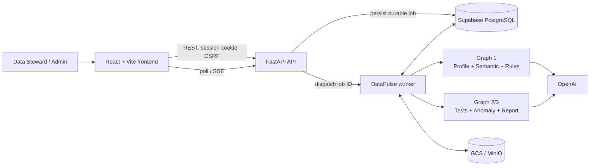
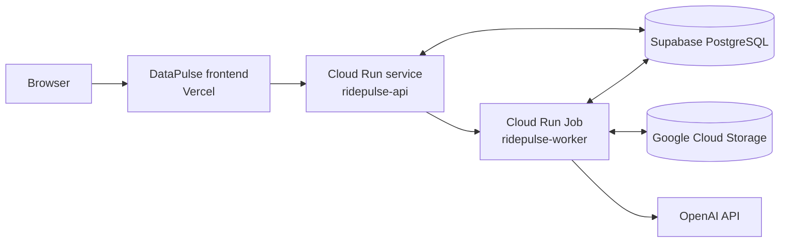

# DataPulse

DataPulse là nền tảng Data Quality dùng AI để tiếp nhận dataset CSV/Parquet, tạo phiên bản dữ liệu bất biến, profiling schema, đề xuất rule có Human-in-the-loop, thực thi kiểm thử và tạo báo cáo phân tích bất thường cho Data Steward.

Ứng dụng hỗ trợ dataset tổng quát; đường chạy versioned không phụ thuộc schema taxi. Một số tên kỹ thuật `ridepulse-*` vẫn được giữ cho cloud resource, database role và browser storage key nhằm tương thích với deployment hiện tại.

## Tính năng chính

- Đăng nhập theo vai trò `USER`, `STEWARD`, `ADMIN`.
- Upload CSV/Parquet với checksum, idempotency và immutable dataset versions.
- Lưu source artifact trên MinIO khi chạy local hoặc Google Cloud Storage khi deploy.
- Profiling schema, row count, completeness, uniqueness và duplicate rate.
- Graph 1: profiling, semantic understanding, review gate và đề xuất rule.
- Data Steward duyệt, từ chối hoặc chỉnh sửa rule trước khi chạy.
- Graph 2: sinh test, validate, thực thi rule và lưu kết quả.
- Graph 3: phát hiện anomaly, tạo hypothesis khi đủ bằng chứng và sinh báo cáo Markdown.
- Durable jobs cho import, Graph 1 continuation và Graph 2/3.
- Khôi phục run/report sau khi reload trình duyệt.
- Dataset lineage, governed artifacts và audit events trên PostgreSQL/Supabase.
- Tài khoản demo Steward được điền sẵn cho giám khảo và có quota ghi phía backend.

## Kiến trúc



Xem thiết kế chi tiết, data flow, deployment và trust boundaries tại [ARCHITECTURE.md](ARCHITECTURE.md).

## Công nghệ

| Lớp | Công nghệ |
|---|---|
| Frontend | React, TypeScript, Vite, Recharts |
| API | FastAPI, Pydantic, SQLAlchemy |
| Agent orchestration | LangGraph, LangChain |
| AI provider | OpenAI; adapter cho Anthropic, Mistral và Google |
| Database | PostgreSQL/Supabase; SQLite cho test/local compatibility |
| Data execution | pandas, dbt Core, dbt-postgres |
| Object storage | Google Cloud Storage; MinIO khi chạy Docker local |
| Deployment | Vercel, Google Cloud Run, Cloud Run Job, Artifact Registry |
| Testing | pytest, Ruff, TypeScript build, browser E2E |

## Cấu trúc repository

```text
.
├── frontend/                 React/Vite application
├── src/
│   ├── agents/              LangGraph graphs, states và nodes
│   ├── api/                 FastAPI routes và dependencies
│   ├── models/              ORM và API schemas
│   └── services/            Dataset, jobs, rules, analysis và storage
├── scripts/migrations/      Ordered PostgreSQL migrations
├── dbt_project/             dbt project và generated test integration
├── tests/                   Unit, contract và integration tests
├── docs/                    Contract và runbook còn hiệu lực
├── Dockerfile               Image dùng chung cho API và worker
├── docker-compose.yml       PostgreSQL + MinIO + API + local worker
└── ARCHITECTURE.md          Kiến trúc hệ thống và deployment
```

## Yêu cầu

- Python 3.11 trở lên.
- Node.js 20 trở lên.
- Docker Desktop nếu chạy stack local đầy đủ.
- PostgreSQL/Supabase cho production-like mode.
- OpenAI API key nếu chạy agent thật.
- GCS credentials hoặc Application Default Credentials khi dùng GCS local.

## Cấu hình môi trường

Sao chép `.env.example` thành `.env`, sau đó điền giá trị phù hợp. Không commit `.env`.

### Backend production-like

| Biến | Ý nghĩa |
|---|---|
| `APP_ENV` | `local`, `development`, `test` hoặc `production` |
| `DATABASE_URL` | Control-plane database chứa jobs, runs và metadata |
| `SUPABASE_DATABASE_URL` | Dataset execution database; bản deploy hiện tại phải cùng target với `DATABASE_URL` |
| `PROVIDER` | LLM provider, deployment mặc định dùng `openai` |
| `OPENAI_API_KEY` | OpenAI API key |
| `OPENAI_MODEL` | Model OpenAI được sử dụng |
| `AGENT_MODE` | Đặt `graph` để chạy workflow thật |
| `DQ_EXECUTION_BACKEND` | `supabase`, `local` hoặc `auto` |
| `FRONTEND_ORIGIN` | Danh sách origin được phép gọi API |
| `OBJECT_STORAGE_PROVIDER` | `gcs` hoặc `s3`; MinIO dùng API tương thích S3 |
| `OBJECT_STORAGE_BUCKET` | Bucket chứa source, dbt và report artifacts |

Production hiện chạy `PROVIDER=openai`, `AGENT_MODE=graph` và
`DQ_EXECUTION_BACKEND=supabase`. Khi không đặt `OPENAI_MODEL`, adapter OpenAI
dùng mặc định `gpt-5.6-luna`.

Production yêu cầu các secret tài khoản độc lập:

```text
DEMO_USER_PASSWORD
DEMO_STEWARD_PASSWORD
DEMO_ADMIN_PASSWORD
```

Tài khoản công khai `demo-steward` chỉ được seed khi `ENABLE_PUBLIC_DEMO=true`
ở môi trường không production và `DEMO_STEWARD_PASSWORD` được cấu hình rõ ràng.

Local có thể dùng username làm password cho database mới; production fail-fast nếu thiếu secret.

### Frontend

Tạo `frontend/.env.local`:

```env
VITE_USE_MOCK_API=false
VITE_API_BASE_URL=http://127.0.0.1:8000
VITE_WORKSPACE_ID=ws-browser
```

Không đặt backend secret trong biến `VITE_*` vì chúng được bundle vào trình duyệt.
`VITE_WORKSPACE_ID` là workspace logic của ứng dụng (production mặc định
`ws-browser`), không phải browser ID hay ID của từng máy người dùng.

## Chạy nhanh bằng Docker

Với database local mới hoàn toàn và không có dữ liệu cần giữ, chạy trình khởi tạo sau. Lệnh này gọi `docker compose down -v`, vì vậy **sẽ xóa volume PostgreSQL/MinIO local hiện có**:

```bash
python scripts/reset_db.py
```

Với database local đã được migrate, chỉ cần khởi động hoặc build lại stack:

```bash
docker compose up --build
```

| Service | URL/port |
|---|---|
| PostgreSQL | `localhost:5432` |
| MinIO API | `http://localhost:9000` |
| MinIO Console | `http://localhost:9001` |
| FastAPI | `http://localhost:8000` |
| Local worker API | `http://localhost:8001` |

Chạy frontend ở terminal khác:

```bash
cd frontend
npm install
npm run dev
```

Mở `http://127.0.0.1:5173`.

## Chạy thủ công

### Backend

```bash
python -m venv .venv
```

Windows PowerShell:

```powershell
.\.venv\Scripts\Activate.ps1
pip install -r requirements.txt
python -m uvicorn src.main:app --host 127.0.0.1 --port 8000 --reload
```

macOS/Linux:

```bash
source .venv/bin/activate
pip install -r requirements.txt
python -m uvicorn src.main:app --host 127.0.0.1 --port 8000 --reload
```

### Local worker

```bash
python -m uvicorn src.local_worker_api:app --host 127.0.0.1 --port 8001
```

Local worker nhận durable job ID rồi spawn `python -m src.worker` trong process riêng.

## Database migrations

Migration nằm trong `scripts/migrations/` và phải chạy theo thứ tự được xác định bởi contract; không chạy mù theo tên file vì `008_rollback_split_schemas.sql` là rollback và `009`/`010` có phạm vi riêng.

- `scripts/reset_db.py` chỉ dành cho database Docker local có thể xóa hoàn toàn.
- Không dùng `reset_db.py` với database cloud hoặc database local chứa dữ liệu cần giữ.
- Kiểm tra schema trước khi chạy migration.
- Production chỉ áp dụng migration additive đã review.
- Sao lưu hoặc giữ database/revision cũ để rollback.

Tài liệu liên quan:

- [Data model](docs/DATA_MODEL.md)
- [Supabase dataset contract](docs/SUPABASE_DATASET_CONTRACT.md)
- [Schema split report](docs/SCHEMA_SPLIT_REPORT.md)

## Workflow E2E

```text
Login
→ Upload CSV/Parquet
→ Immutable dataset version
→ Profiling
→ Graph 1 semantic review
→ Review/approve rules
→ Graph 2 test execution
→ Graph 3 anomaly analysis
→ Governed Markdown report
→ Reload/rerun history
```

Durable job types:

```text
INGEST_PROFILE
GRAPH1_EXECUTION
GRAPH1_CONTINUATION
ANALYSIS_GRAPH2_GRAPH3
```

## Kiểm thử

Backend:

```bash
python -m ruff check src tests
python -m pytest -q
```

Frontend:

```bash
cd frontend
npm run build
```

Docker image:

```bash
docker build -t datapulse:local .
docker run --rm datapulse:local python -c "import src.main; import src.worker"
```

Browser E2E phải xác nhận:

- `VITE_USE_MOCK_API=false`.
- Network request đi tới API thật.
- Upload trùng không tạo HTTP 500 hoặc orphan object.
- Semantic review dispatch continuation thành công.
- Graph 2 không phát sinh lỗi ép kiểu cross-field.
- Report tồn tại sau reload.

## Deployment



Cloud resource vẫn dùng tên legacy `ridepulse-*` để tránh downtime do đổi tên tài nguyên. Đổi tên sản phẩm sang DataPulse không yêu cầu đổi URL, bucket hoặc service account.

Trình tự deploy:

1. Chạy regression và build image theo commit SHA.
2. Push image lên Artifact Registry.
3. Tạo/update Cloud Run Job worker bằng image digest đó.
4. Deploy Cloud Run API bằng cùng image digest.
5. Kiểm tra `/api/v1/status` và worker dispatch.
6. Deploy frontend Vercel với mock tắt.
7. Chạy cloud smoke dataset nhỏ, sau đó full E2E.
8. Giữ revision, image và secret version cũ để rollback.

## Security

- Secret được lưu trong Secret Manager hoặc `.env` local, không nằm trong Git.
- Session cookie production dùng `Secure` và cross-site configuration phù hợp.
- Request thay đổi trạng thái yêu cầu CSRF token.
- Dataset version và profile run tạo lineage bất biến.
- Source/report artifact được gắn với dataset version và run.
- Raw/sample rows phải được giới hạn và kiểm soát quyền.
- Audit events không chứa secret hoặc raw PII.

## Tài liệu

- [Architecture](ARCHITECTURE.md)
- [API contract](docs/API_CONTRACT.md)
- [Product specification](docs/PRODUCT_SPEC.md)
- [Data model](docs/DATA_MODEL.md)
- [Local runbook](docs/RUNBOOK_LOCALHOST.md)
- [Supabase dataset contract](docs/SUPABASE_DATASET_CONTRACT.md)
- [Anomaly detection](docs/anomaly_detection_mechanism.md)
- [Evaluation evidence](docs/EVAL_EVIDENCES.md)

## Production endpoints

- Frontend: `https://c3-app-028.vercel.app`
- Backend: `https://ridepulse-api-gbnhdahaya-as.a.run.app`
- Health: `GET /api/v1/status`

Các URL có thể thay đổi theo revision hoặc custom domain; luôn kiểm tra cấu hình deployment trước khi E2E.
