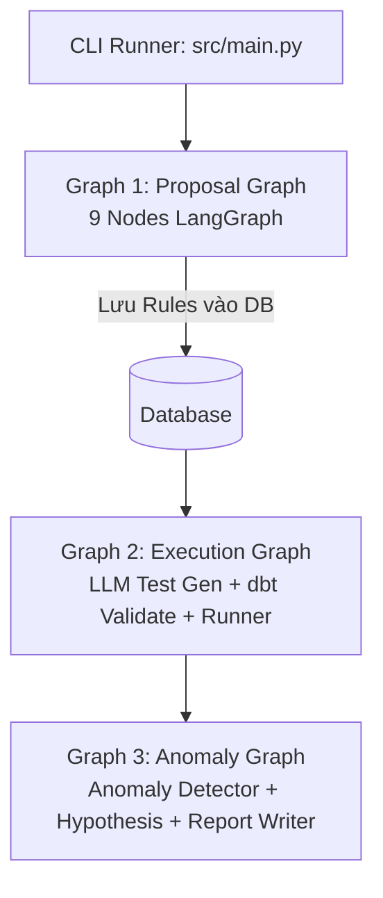
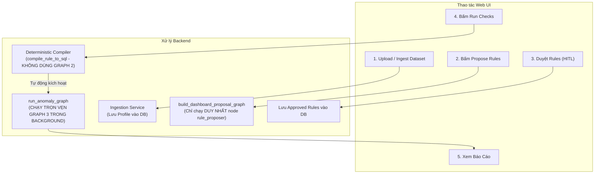

# BÁO CÁO PHÂN TÍCH VÀ ĐỐI CHIẾU: LUỒNG WEB UI VS. AGENT WORKFLOW GỐC (LANGGRAPH)

> **Ngày lập báo cáo:** 23/08/2026  
> **Dự án:** RidePulse DQ (AI Data Quality Agent)  
> **Trạng thái đối chiếu:** Xác thực 100% dựa trên mã nguồn thực tế tại kho lưu trữ.

---

## 1. TỔNG QUAN NHẬN ĐỊNH (EXECUTIVE SUMMARY)

Nhận định của bạn là **HOÀN TOÀN CHÍNH XÁC 100%**:

R> **Toàn bộ flow trên giao diện Web UI KHÔNG sử dụng trọn vẹn 3 Graph LangGraph như được định nghĩa trong `src/agents/graph.py`.**

Hệ thống hiện tại đang tồn tại **2 chế độ vận hành (2 Execution Modes)** song song:
1. **Luồng CLI / Pipeline Runner (`python src/main.py` / `pytest`)**: Chạy trọn vẹn 3 Graph LangGraph phức tạp từ đầu đến cuối.
2. **Luồng Web UI / Dashboard (`http://127.0.0.1:5173`)**: Chạy theo mô hình **Hybrid (Lai)**, chỉ tận dụng một phần nhỏ của Graph 1, **bỏ hoàn toàn Graph 2**, và **chạy trọn vẹn Graph 3**.

---

## 2. BẢNG SO SÁNH TỔNG HỢP (COMPARISON MATRIX)

| Tiêu chí | Luồng CLI / E2E Test (`src/agents/graph.py`) | Luồng Web UI (`Frontend + FastAPI Routes`) | Mức độ trùng khớp |
| :--- | :--- | :--- | :---: |
| **Graph 1: Proposal Graph** | Chạy **9 nodes** LangGraph liên hoàn (`raw_profiler` ➔ `profiler_digest` ➔ `data_dict` ➔ `understanding` ➔ `semantic_gate` ➔ `candidates` ➔ `prompt_customizer` ➔ `rule_proposer` ➔ `hitl_gate`) | Tách nhỏ. Chỉ chạy duy nhất **1 node `rule_proposer`** qua `build_dashboard_proposal_graph()`. Các bước khác gọi hàm Python độc lập. | **~25%** *(Chỉ dùng chung node LLM Proposer)* |
| **Graph 2: Execution Graph** | Chạy StateGraph (`test_generator` ➔ `validate_dbt` ➔ `test_runner` ➔ `persist_report`). LLM tự do sinh mã dbt/SQL và tự sửa lỗi. | **KHÔNG DÙNG GRAPH 2**. Sử dụng **Deterministic SQL Compiler** (`compile_rule_to_sql`) để sinh câu truy vấn SELECT an toàn cố định. | **0%** *(Thay thế hoàn toàn)* |
| **Graph 3: Anomaly Graph** | Chạy StateGraph (`anomaly_detector` ➔ `hypothesis_agent` ➔ `persist_analysis` ➔ `report_writer`). | **CHẠY ĐẦY ĐỦ 100%** qua `run_anomaly_graph` chạy ngầm sau khi kiểm thử xong hoặc ở bước `ANALYZE_REPORT`. | **100%** *(Trùng khớp hoàn toàn)* |

---

## 3. PHÂN TÍCH CHI TIẾT TỪNG GRAPH

### 3.1. Graph 1: Proposal Graph (Phân tích & Đề xuất Rules)

#### A. Trong `src/agents/graph.py` (Bản gốc)
* Hàm đại diện: `build_proposal_graph()` & `run_proposal_graph()`
* Luồng gồm 9 Node:
  ```mermaid
  graph LR
      A[raw_profiler] --> B[profiler_digest]
      B --> C[data_dict_generator]
      C --> D[dataset_understanding]
      D --> E[hitl_semantic_gate]
      E --> F[rule_candidate_builder]
      F --> G[prompt_customizer]
      G --> H[rule_proposer]
      H --> I[hitl_gate]
  ```
* Toàn bộ quá trình từ đọc dữ liệu thô, sinh Từ điển dữ liệu, suy luận Semantic Contract, tùy biến Prompt riêng cho từng bảng cho đến sinh Rules đều chạy khép kín trong 1 phiên LangGraph.

#### B. Thực tế trên Web UI
* **Khi bấm "Propose Rules" trên giao diện:**
  * Endpoint được gọi: `POST /api/v1/datasets/{id}/rule-proposals`
  * Backend thực thi: `run_propose_rules()` trong [`src/services/job_runner.py`](file:///d:/ai_thuc_chien/P-028/src/services/job_runner.py#L588-L605).
  * Hàm này gọi `generate_dashboard_proposals()` trong [`src/services/dashboard_agent_workflow.py`](file:///d:/ai_thuc_chien/P-028/src/services/dashboard_agent_workflow.py#L427-L455).
  * Hàm này kích hoạt `build_dashboard_proposal_graph()` — **Graph rút gọn chỉ chứa duy nhất 1 node `rule_proposer`**.
* **Tại sao có sự khác biệt?**
  * Trên UI, bước **Ingestion & Profiling** đã được người dùng thực hiện từ trước và lưu sẵn vào SQLite/Postgres.
  * Do đó, UI không cần chạy lại `raw_profiler` hay `profiler_digest` mà lấy thẳng profile từ DB nạp vào node `rule_proposer`.
  * Ở màn hình Step-by-Step Workflow ([`src/services/rule_proposer_workflow.py`](file:///d:/ai_thuc_chien/P-028/src/services/rule_proposer_workflow.py#L195-L202)), bước `UNDERSTAND_DATA` gọi hàm Python `dataset_understanding_node` một cách trực tiếp thay vì thông qua StateGraph.

---

### 3.2. Graph 2: Execution Graph (Sinh mã kiểm thử & Thực thi)

#### A. Trong `src/agents/graph.py` (Bản gốc)
* Hàm đại diện: `build_execution_graph()` & `run_execution_graph()`
* Luồng gồm 4 Node:
  ```mermaid
  graph LR
      A[test_generator] --> B[validate_dbt_project]
      B -->|Hợp lệ| C[test_runner]
      B -->|Lỗi cú pháp| D[dbt_validation_failed]
      C --> E[persist_report]
  ```
* Sử dụng LLM để tự do sinh các file dbt YAML hoặc câu SQL kiểm thử động, sau đó validate và thực thi.

#### B. Thực tế trên Web UI
* **Khi bấm "Run Checks" / "Start Run" trên giao diện:**
  * Endpoint được gọi: `POST /api/v1/dq-runs`
  * Backend thực thi: `run_dq_checks()` trong [`src/services/job_runner.py`](file:///d:/ai_thuc_chien/P-028/src/services/job_runner.py#L821-L932).
  * **Graph 2 BỊ BỎ QUA HOÀN TOÀN.**
* **Bằng chứng mã nguồn từ chính docstring của hệ thống:**
  *(Trích đoạn từ `src/services/job_runner.py` dòng 833-835)*
  > *"Approved dashboard rule versions are the only input. The SQL comes from fixed `compile_rule_to_sql` templates; the legacy execution graph and its LLM repair loop are intentionally not a source of executable SQL in this product flow."*
* **Lý do kiến trúc:**
  * Việc để LLM tự do sinh mã SQL chạy thẳng vào cơ sở dữ liệu thật trên Web UI tiềm ẩn rủi ro rất lớn về **SQL Injection**, lỗi hiệu năng (Full Table Scan), hoặc làm hỏng dữ liệu.
  * Vì vậy, Web UI sử dụng bộ compiler khuôn mẫu xác định (`compile_rule_to_sql`) để sinh các câu `SELECT ... WHERE ...` an toàn tuyệt đối.

---

### 3.3. Graph 3: Anomaly Graph (Phát hiện dị thường & Viết báo cáo)

#### A. Trong `src/agents/graph.py` (Bản gốc)
* Hàm đại diện: `build_anomaly_graph()` & `run_anomaly_graph()`
* Luồng gồm 4 Node:
  ```mermaid
  graph LR
      A[anomaly_detector] --> B[hypothesis_agent]
      B --> C[persist_analysis]
      C --> D[report_writer]
  ```

#### B. Thực tế trên Web UI
* **ĐÂY LÀ GRAPH DUY NHẤT ĐƯỢC WEB UI SỬ DỤNG TRỌN VẸN 100%.**
* **Vị trí kích hoạt:**
  1. Trong [`src/services/job_runner.py`](file:///d:/ai_thuc_chien/P-028/src/services/job_runner.py#L980-L994): Ngay sau khi `run_dq_checks` chạy xong, hệ thống tạo một background thread gọi:
     ```python
     run_anomaly_graph(execution_run_id=run_id, dataset_id=dataset_id)
     ```
  2. Trong [`src/services/rule_proposer_workflow.py`](file:///d:/ai_thuc_chien/P-028/src/services/rule_proposer_workflow.py#L353-L377): Tại bước `ANALYZE_REPORT`, hệ thống gọi trực tiếp:
     ```python
     run_anomaly_graph(execution_run_id=dq_run_id, dataset_id=dataset_id)
     ```
* Toàn bộ logic phát hiện dị thường, gọi LLM suy luận giả thuyết nguyên nhân lỗi và sinh báo cáo Markdown cho Data Steward được giữ nguyên vẹn trên Web UI.

---

## 4. BIỂU ĐỒ SO SÁNH LUỒNG DỮ LIỆU THỰC TẾ

### Luồng 1: CLI / E2E Testing (Pure LangGraph Pipeline)


### Luồng 2: Web UI Dashboard (Hybrid Production Pipeline)


---

## 5. TỔNG KẾT & ĐÁNH GIÁ KIẾN TRÚC

1. **Tại sao lại có sự phân tách này?**
   * **Bảo mật & Tính xác định (Safety & Determinism):** Trong môi trường Web App thực tế, không thể để Agent tự do sinh mã thực thi SQL mà không có kiểm soát chặt chẽ.
   * **Hiệu năng & Tối ưu UI (Latency):** Người dùng Web không thể chờ đợi toàn bộ 9 node của Graph 1 chạy từ đầu (mất 1-2 phút). UI đã tách bước Profiling ra riêng, giúp trải nghiệm tương tác mượt mà hơn.
2. **Nếu muốn Web UI chạy 100% Graph 2 thì sao?**
   * Trong `src/api/routes.py` (dòng 2623-2650), Backend đã có sẵn endpoint riêng: `POST /api/v1/execution-runs` kết nối trực tiếp với `run_execution_graph()`.
   * Tuy nhiên, Frontend hiện tại đang mặc định kết nối với `/api/v1/dq-runs` (sử dụng Deterministic Runner).
