# RidePulse DQ — Agent Workflow & Dual dbt Layers Integration

> **Dự án:** RidePulse DQ (Autonomous Data Quality & Anomaly Intelligence Platform)  
> **Tài liệu:** Sơ đồ Quy trình Agent Workflow & Chi tiết 2 Lớp dbt (PR #4 & PR #8)  
> **Mục đích:** Thể hiện rõ nét 2 lớp vị trí của dbt Core trong pipeline: **Lớp 1 (Data Transformation Baseline - Pre-Profiling)** và **Lớp 2 (Rule Test Code Generation & Execution - Post-HITL Approval)**.

---

## 📐 1. AGENT WORKFLOW MERMAID DIAGRAM (HIỂN THỊ CHI TIẾT 2 LỚP DBT)

```mermaid
flowchart TD
    %% Entry Point
    START(["🚀 Trigger: Ingest & Profile Dataset"]) --> Step1["1. Raw Ingestion Layer"]

    %% Step 1: Raw Ingestion
    subgraph Raw_Layer ["1. Raw Data Ingestion Layer"]
        Step1 --> Checksum["Verify Checksum SHA-256 & Manifest"]
        Checksum --> LoadRaw["Ingest Raw Rows into DB Table:<br/>public.trips_raw"]
    end

    %% ==========================================
    %% 🔵 DBT LỚP 1: PR #4 Staging & Transformation Baseline
    %% ==========================================
    LoadRaw --> Step2["2. dbt Core Transformation Stage"]
    subgraph PR4_DBT ["🔵 LỚP 1 DBT (PR #4): dbt Core Staging & Contract Baseline (Pre-Profiling)"]
        Step2 --> DBTBuild["Run dbt build"]
        DBTBuild --> StgTrips["Model 1: analytics.stg_trips<br/>(Cast 21 standardized columns)"]
        StgTrips --> ProfileInput["Model 2: analytics.profile_input<br/>(Extract 12 fixed columns for Agent)"]
        ProfileInput --> SchemaTests["dbt Data Contract Tests:<br/>schema.yml (not_null & unique checks)"]
    end

    %% Step 3: Profiler Agent
    SchemaTests --> Step3["3. Profiler Agent Stage"]
    subgraph Profiler_Stage ["3. Profiler Agent (raw_profiler_node)"]
        Step3 --> DBProfiler["Tool: db_profiler_tool<br/>(Scan analytics.profile_input)"]
        DBProfiler --> GenEvidence["Generate Aggregate Profile Evidence JSON<br/>(null_count, min, max, mean, distinct)"]
    end

    %% Step 4: Rule Proposer Agent
    GenEvidence --> Step4["4. AI Guarded Rule Proposer Stage"]
    subgraph AI_Proposer ["4. Rule Proposer Agent (rule_proposer_node)"]
        Step4 --> SendEvidence["Send Aggregate Evidence ONLY to OpenAI<br/>(No raw rows or PII)"]
        SendEvidence --> OpenAI["OpenAI GPT-4o-mini<br/>(Pydantic Structured Output)"]
        OpenAI --> ProposeRules["Generate 5 Typed Proposals:<br/>numeric_range, not_null, accepted_values,<br/>cross_field_comparison, duplicate_fingerprint"]
    end

    %% Step 5: Human-In-The-Loop (HITL) Review
    ProposeRules --> Step5["5. Human-in-the-Loop (HITL) Review Stage"]
    subgraph HITL_Review ["5. Human-in-the-Loop (HITL) Review"]
        Step5 --> SaveProposed["Persist in DB: proposed_rules (status=PROPOSED)"]
        SaveProposed --> StewardUI["Data Steward HITL Review UI"]
        StewardUI --> Decision{"Steward Action"}
        Decision -->|"Approve"| ApproveRule["Set status = APPROVED<br/>Persist in dq_rules"]
        Decision -->|"Edit"| EditRule["Update Rule Parameters<br/>Set status = APPROVED"]
        Decision -->|"Reject"| RejectRule["Set status = REJECTED<br/>Save Review Note"]
    end

    %% ==========================================
    %% 🟢 DBT LỚP 2: PR #8 Rule Test Compiler & Execution
    %% ==========================================
    ApproveRule --> Step6["6. Rule Test Compilation & Execution Stage"]
    EditRule --> Step6
    subgraph PR8_DBT ["🟢 LỚP 2 DBT (PR #8): dbt / SQL Rule Test Compiler & Execution (Post-HITL Approval)"]
        Step6 --> TestGenNode["Test Generator Agent (test_generator_node):<br/>Compile Approved Rule into Parameterized SQL / dbt Query"]
        TestGenNode --> SyntaxCheck{"Syntax Valid?"}
        SyntaxCheck -->|"No"| RepairLoop["Agentic Loop: LLM Repair Node fixes SQL"]
        RepairLoop --> TestGenNode
        SyntaxCheck -->|"Yes"| RunRunner["Execute via Read-Only Runner (RUNNER_DATABASE_URL)<br/>Statement Timeout + Read-Only Role"]
        RunRunner --> CapResults["Cap Violation Details<br/>(Sample max 20 failure IDs)"]
    end

    %% Step 7: Persistence & Audit Logs
    CapResults --> Step7["7. Output & Audit Layer"]
    subgraph Output_Layer ["7. Persistence & Audit Log"]
        Step7 --> SaveResults["Persist Summary in dq_runs & dq_results"]
        SaveResults --> WriteAudit["Write Immutable Audit Event in audit_logs"]
        WriteAudit --> Dashboard["Render Results on Steward UI Dashboard"]
    end

    Dashboard --> END(["🏁 End Process"])
```

---

## 🔍 2. SO SÁNH NỔI BẬT HAI LỚP DBT TRONG DỰ ÁN

| Tiêu Chí Phân Biệt | 🔵 LỚP 1 DBT: Transformation Baseline (PR #4) | 🟢 LỚP 2 DBT: Rule Test Compiler & Execution (PR #8) |
|:---|:---|:---|
| **Mục đích chính** | Biến đổi dữ liệu thô (`trips_raw`) sang view chuẩn hóa (`stg_trips`, `profile_input`) và chạy dbt schema tests (`schema.yml`). | Biên dịch các `dq_rule` đã được Steward phê duyệt trên UI thành mã SQL/dbt test query để thực thi kiểm thử. |
| **Vị trí trong Workflow** | **Giai đoạn 2 (Pre-Profiling):** Diễn ra ngay sau khi Ingest thô và TRƯỚC KHI Profiler Agent quét thống kê. | **Giai đoạn 6 (Post-HITL Approval):** Diễn ra SAU KHI Data Steward bấm `APPROVE` / `EDIT` trên giao diện HITL Review UI. |
| **Đầu vào (Input)** | Bảng dữ liệu thô `public.trips_raw` từ file Parquet 50k. | Danh sách các quy tắc đã được duyệt `dq_rules` lưu trong Database. |
| **Đầu ra (Output)** | View chuẩn hóa `analytics.profile_input` (12 cột) + Kết quả dbt schema tests (`not_null`, `unique`). | Mã Parameterized SQL query + Kết quả kiểm thử vi phạm (giới hạn tối đa 20 sample violation IDs). |
| **Thành phần phụ trách** | Dự án `ridepulse_dbt` (`dbt_project.yml`, `profiles.yml`, models SQL). | AI Agent Node `test_generator_node` & `test_runner_node` (`RUNNER_DATABASE_URL`). |

---

## 📊 3. BẢNG TỔNG HỢP TOÀN BỘ WORKFLOW 7 GIAI ĐOẠN

| Bước | Tên Giai Đoạn | Thành Phần Phụ Trách | Nhiệm Vụ Kỹ Thuật Chi Tiết |
|:---:|:---|:---|:---|
| **1** | Raw Ingestion Layer | `dataset_loader.py` & Worker | Verify mã hash SHA-256 tệp Parquet và nạp dữ liệu thô vào `public.trips_raw`. |
| **2** | **🔵 Lớp 1 dbt (PR #4)** | **`ridepulse_dbt` (`stg_trips`, `profile_input`)** | **Ép kiểu 21 cột, tạo view `analytics.profile_input` 12 cột, và chạy dbt schema tests (`schema.yml`).** |
| **3** | Profiler Agent Stage | `raw_profiler_node` & `db_profiler_tool` | Quét các chỉ số nén (`null_count`, `min`, `max`, `distinct`) trên view `analytics.profile_input` do dbt Lớp 1 sinh ra. |
| **4** | AI Guarded Rule Proposer | `rule_proposer_node` & OpenAI GPT-4o-mini | Gửi Aggregate Evidence (không có raw data) để AI đề xuất 5 loại rules dạng Pydantic Structured Output. |
| **5** | HITL Review Stage | `rule_store.py` & Steward UI | Steward kiểm duyệt `APPROVE`, `EDIT`, `REJECT` các đề xuất của AI trên giao diện HITL. |
| **6** | **🟢 Lớp 2 dbt (PR #8)** | **`test_generator_node` & `test_runner_node`** | **Biên dịch rule đã duyệt thành SQL/dbt query, chạy qua role Read-Only `RUNNER_DATABASE_URL`, giới hạn max 20 failure IDs.** |
| **7** | Persistence & Audit Layer | DB tables (`dq_runs`, `dq_results`, `audit_logs`) | Lưu kết quả vi phạm tổng hợp và ghi nhật ký audit log bất biến. |
