# Architecture Diagram - RidePulse DQ

> **Trạng thái tài liệu:** Đã đối chiếu với source hiện tại ngày 24/08/2026. Phần “Kiến trúc hiện hành” dưới đây là nguồn sự thật. Các sơ đồ v1 ở phần phụ lục chỉ là đề xuất lịch sử và không được dùng để suy diễn tính năng đã triển khai.

## 0. Kiến trúc hiện hành

### 0.1. Stack và ranh giới hệ thống

| Lớp           | Implementation thực tế                                                                                            |
| -------------- | ------------------------------------------------------------------------------------------------------------------- |
| Frontend       | React + Vite + TypeScript, custom CSS, Recharts, React Markdown                                                     |
| API            | FastAPI; session cookie, CSRF, RBAC và dataset access                                                              |
| Workflow       | LangGraph với Graph 1, Graph 2 và Graph 3                                                                         |
| Persistence    | SQLAlchemy; SQLite ở local, tương thích database URL cấu hình                                                 |
| Test execution | dbt YAML deterministic +`dbt parse`; dbt CLI khi khả dụng; deterministic SQL metrics fallback ở local/dev/test |
| Anomaly        | Robust median/MAD z-score, cold-start static thresholds, business invariants, volume/freshness/execution detectors  |
| Report         | Markdown tiếng Việt; LLM structured generation hoặc deterministic fallback                                       |
| Artifact       | MinIO khi cấu hình hoặc local trace/report output                                                                |

### 0.2. Trạng thái capability

| Capability từng xuất hiện trong tài liệu cũ | Trạng thái trong source hiện tại                                  |
| ------------------------------------------------- | --------------------------------------------------------------------- |
| Isolation Forest                                  | **NOT FOUND**                                                   |
| ChromaDB/RAG retrieval cho hypothesis             | **NOT FOUND** — retrieval hiện là stub trả danh sách rỗng |
| Dagster orchestration                             | **NOT FOUND**                                                   |
| Slack/Email notification                          | **NOT FOUND**                                                   |
| Great Expectations execution                      | **NOT FOUND** trong pipeline Analysis Studio                    |
| LLM tự do sinh/sửa SQL Graph 2                  | **NOT FOUND** — Graph 2 dùng compiler/template deterministic  |
| React/Next.js + Ant Design                        | **NOT FOUND** — frontend là React/Vite/custom CSS             |

### 0.3. Luồng sản phẩm sau Graph 1

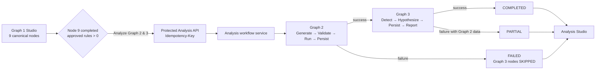

Graph 1 Studio chạy đủ 9 backend nodes. Node 9 giữ `proposed_rules`, `approved_rules` và các bộ đếm total/approved/edited/rejected/pending. Khi review, backend đồng bộ transactionally `RuleProposalModel`, snapshot `ProposedRuleModel` của chính Graph 1 run và `RuleVersionModel`. Graph 2 chỉ đọc approved-rule snapshot của run đó, không publish đè `active_rules` toàn cục.

### 0.4. Graph 2 — deterministic execution

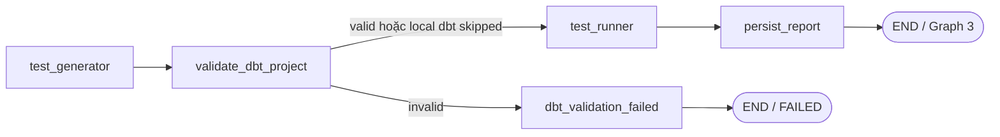

- `test_generator` sinh SQL check bằng template/contract và dbt YAML; không cho LLM tự do viết executable SQL.
- `validate_dbt_project` kiểm tra YAML và chạy `dbt parse`. Trạng thái `SKIPPED` phải được công khai nếu không có dbt executable; đây không phải dbt success.
- `test_runner` hỗ trợ `PASS`, `FAIL`, `ERROR`, `SKIPPED`, `RESULT_MISMATCH`; metrics chính lấy từ deterministic SQL checks.
- `persist_report` lưu `test_runs`, `test_results`, `dq_runs`, `dq_results` và JSON report.
- Analysis Studio hiển thị KPI, donut trạng thái, bar chart violation rate, metadata dbt và bảng chi tiết. Chi tiết lỗi chỉ trả source row IDs, evidence refs và error; không trả raw source values.

### 0.5. Graph 3 — anomaly và báo cáo

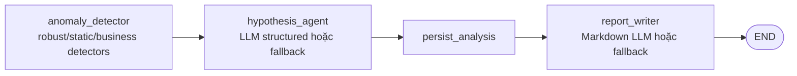

- Signal được persist với detector name/version thật, score, reliability, observed value, baseline/history và evidence.
- Projection sang bảng Graph 2 chỉ gắn anomaly cho signal `target_type=RULE` có cùng `rule_id` và score `>= 0.70`.
- `report_writer` trả cả `steward_report_markdown`, `report_source=LLM|FALLBACK` và internal file path. API chỉ trả Markdown và tên file, không lộ absolute server path.
- Báo cáo có 8 phần: Executive Summary, Run Metadata, Rule Results, Anomaly Decision, Signals, Hypotheses, Priority Actions, Technical Notes.

### 0.6. Analysis API và persistence

| Endpoint                                            | Mục đích                                                             |
| --------------------------------------------------- | ----------------------------------------------------------------------- |
| `POST /api/v1/graph1-runs/{run_id}/analysis-runs` | Tạo/reuse run idempotent; chỉ STEWARD/ADMIN có quyền manage dataset |
| `GET /api/v1/analysis-runs/{id}`                  | Trạng thái tổng, phase, current node và IDs                         |
| `GET /api/v1/analysis-runs/{id}/nodes`            | Timeline 10 bước có status, duration và safe output summary         |
| `GET /api/v1/analysis-runs/{id}/result`           | Combined/partial Graph 2, Graph 3 và report                            |
| `GET /api/v1/analysis-runs/{id}/stream`           | SSE snapshots để UI theo dõi và resume                              |

`analysis_runs.graph1_run_id` là unique. `analysis_node_executions` lưu từng bước với `PENDING/RUNNING/SUCCEEDED/FAILED/SKIPPED`, timestamps, sequence, error và output summary đã loại SQL/YAML/raw path nhạy cảm.

### 0.7. Sequence Graph 1 → Analysis Studio

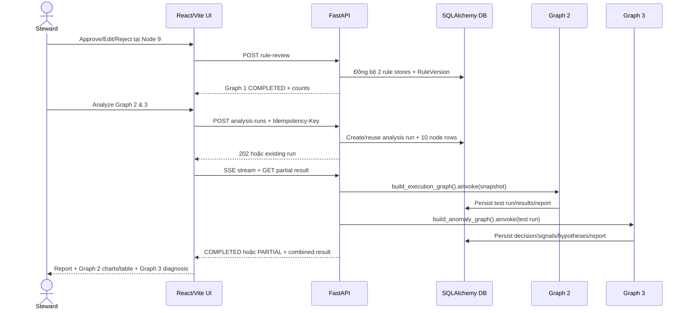

---

## Phụ lục A — Sơ đồ v1 lịch sử (không phản ánh source hiện tại)

## 1. System Overview Diagram (v1)

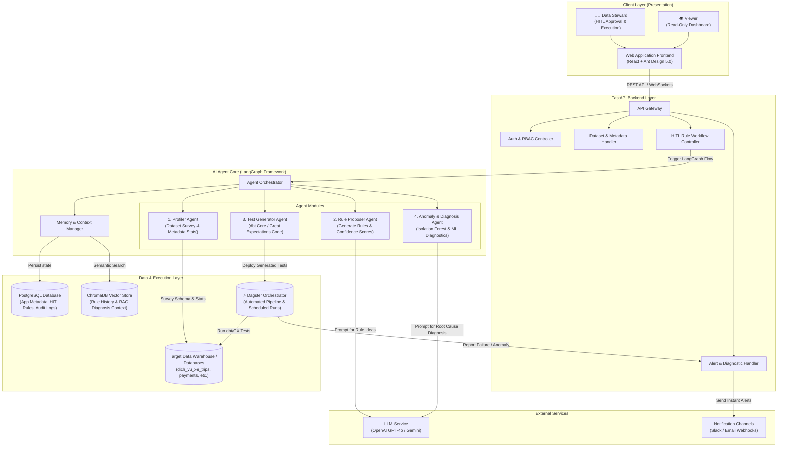

## 2. Agent Flow Diagram (v1) - LangGraph StateGraph

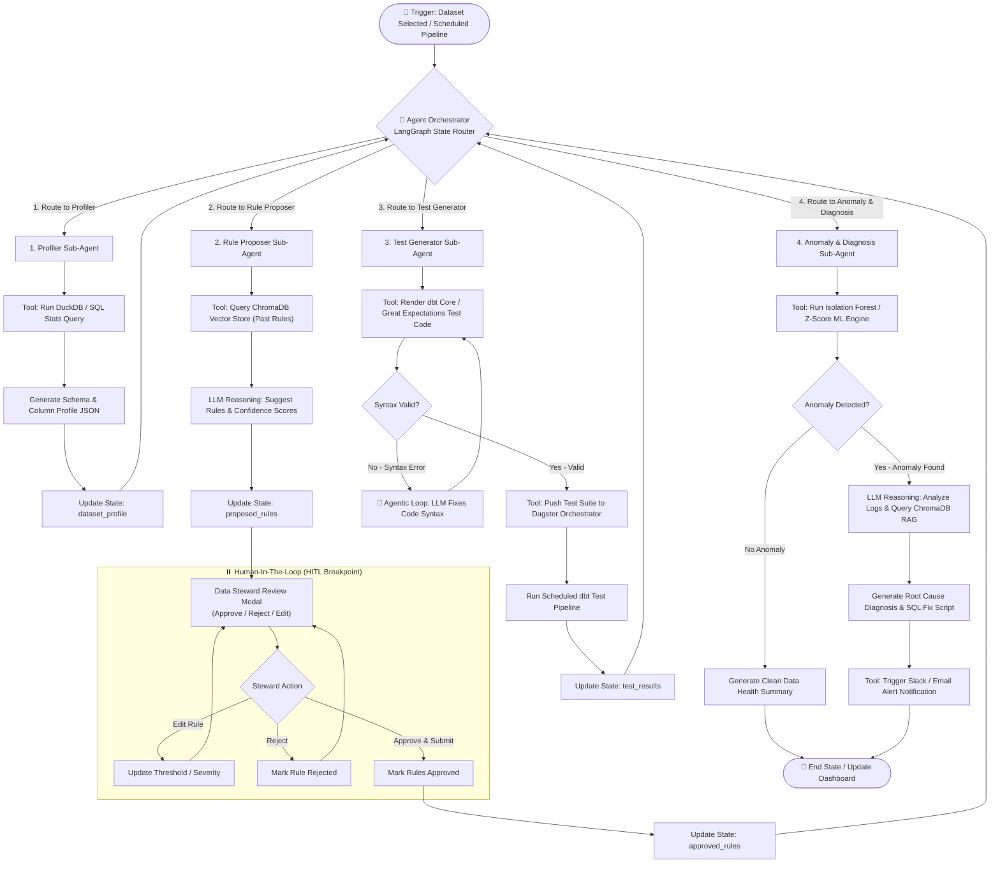

## 2.2. Simplified Agent Flow Diagram (v2) - Sequential Flow

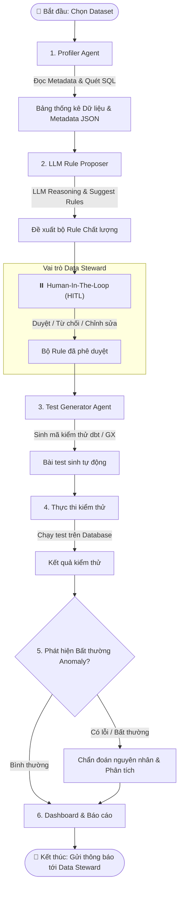

## 2.3. Agent Flow Diagram (v3) - Three-Run LangGraph Architectures (New)

### 2.3.1. Run 1: Proposal Graph (Luồng đề xuất Rules)

Graph này chịu trách nhiệm khảo sát cấu trúc bảng, xây dựng Data Dictionary, lấy ý kiến xác nhận Semantic Contract của Data Steward, sau đó cho LLM đề xuất các rules chất lượng phù hợp với bảng dữ liệu.

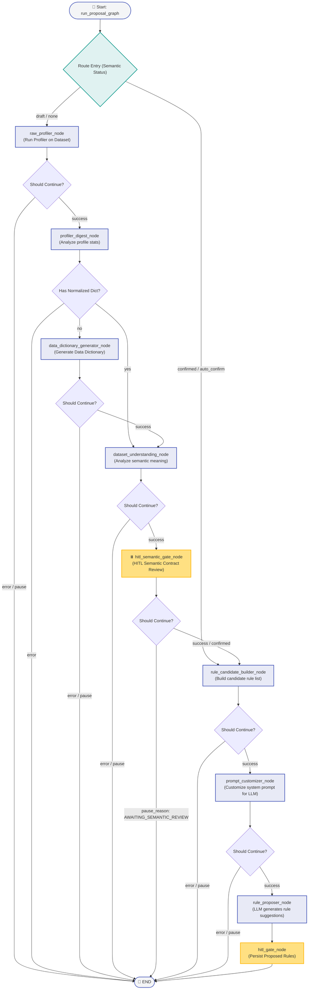

### 2.3.2. Run 2: Execution Graph (Luồng thực thi kiểm thử)

Graph này thực hiện sinh mã kiểm thử dbt, biên dịch/validate cú pháp, chạy bộ kiểm thử trên cơ sở dữ liệu đích, và lưu trữ kết quả chạy test.

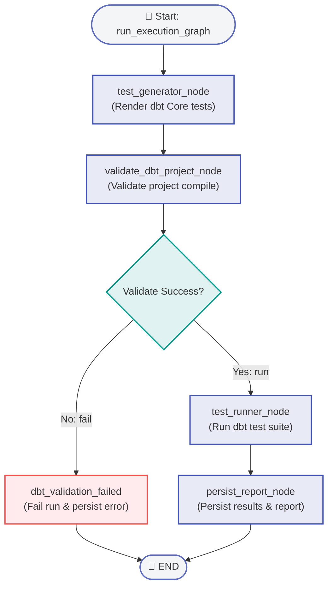

### 2.3.3. Run 3: Anomaly Graph (Luồng phát hiện & Chẩn đoán bất thường)

Graph này chạy sau khi hoàn tất kiểm thử, phát hiện các tín hiệu bất thường bằng mô hình học máy (Isolation Forest, Z-Score), suy luận tìm nguyên nhân lỗi nhờ RAG, đề xuất giả thuyết và viết báo cáo chi tiết cho Steward.

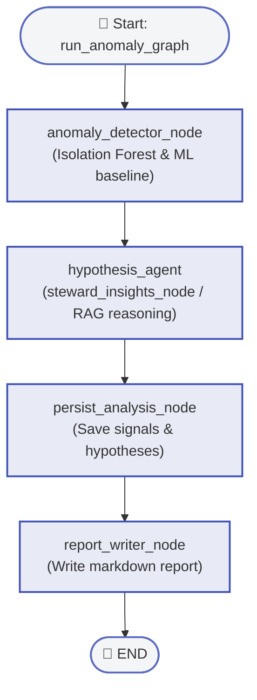

### 2.3.4. Quy trình tuần tự tương tác (Sequential Workflow)

Sơ đồ mô tả sự phối hợp tuần tự giữa Data Steward, Giao diện Web, ba Agent StateGraph (Run 1, 2, 3) và Cơ sở dữ liệu ứng dụng.

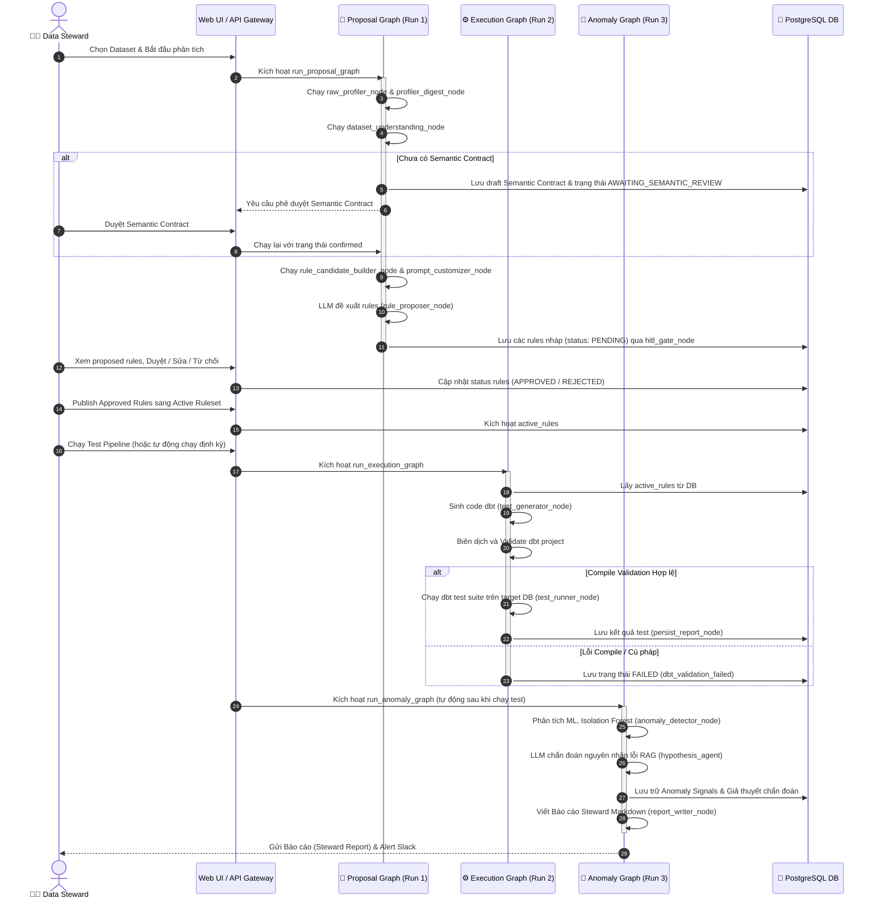

## 3. Component Details

| Component          | Technology                       | Purpose                                                                  |
| ------------------ | -------------------------------- | ------------------------------------------------------------------------ |
| Frontend           | React / Next.js + Ant Design 5.0 | User interface for Data Steward (HITL) and Viewer                        |
| Backend            | FastAPI                          | REST API Server, RBAC, Gateway & Agent integration                       |
| Agent Engine       | LangGraph                        | AI Agent Orchestration (Profiler, Proposer, Generator, Anomaly Detector) |
| Scheduler / Runner | Dagster                          | Automated pipeline execution, scheduled test execution                   |
| Application DB     | PostgreSQL                       | Primary storage for metadata, rules status, test logs, user roles        |
| Vector Store       | ChromaDB                         | Embeddings, rule history & diagnosis RAG context                         |
| Target Data        | Snowflake / BigQuery / Postgres  | Operational databases (`dich_vu_xe_trips`, etc.)                       |
| LLM Service        | OpenAI / Gemini                  | Reasoning engine for rule generation & root cause diagnosis              |
