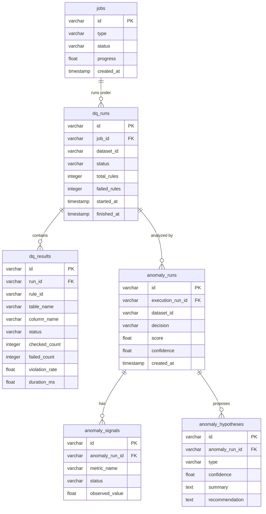

# Báo Cáo Kỹ Thuật Chi Tiết: Phát Triển Hệ Thống Data Quality & Anomaly Detection Agent

Tài liệu này cung cấp tài liệu kỹ thuật chi tiết về kiến trúc, cấu trúc CSDL, thiết kế các đồ thị tác nhân (Agent Graphs), cũng như các giải pháp sửa lỗi mới nhất của hệ thống **Data Quality & Anomaly Detection Agent** cho bộ dữ liệu hành trình Yellow Taxi. Báo cáo này giúp đội ngũ phát triển nắm bắt toàn diện kiến trúc dự án và làm tài liệu chuyển giao.

---

## 🚀 HƯỚNG DẪN VẬN HÀNH & CHẠY AGENT

Hệ thống cung cấp giao diện dòng lệnh (CLI) tiện lợi để chạy các đồ thị tác nhân riêng lẻ hoặc liên chuỗi.

### Chuẩn bị môi trường trước khi chạy
Đảm bảo bạn đã kích hoạt môi trường ảo Python và thiết lập biến môi trường `PYTHONPATH`:
```powershell
# Kích hoạt venv trên Windows (Powershell)
.venv\Scripts\Activate.ps1

# Cài đặt biến đường dẫn dự án
$env:PYTHONPATH="."
```
Đồng thời, đảm bảo các dịch vụ PostgreSQL và MinIO trong Docker đang hoạt động.

---

### Kịch bản 1: Chạy liên chuỗi toàn bộ quy trình (Khuyên Dùng)
Kịch bản này tự động thực hiện: **Chạy đề xuất Rule (Graph 1) ➔ Tự động duyệt và Publish Rule ➔ Thực thi kiểm thử (Graph 2) ➔ Phân tích bất thường & Viết báo cáo (Graph 3)**.
```powershell
python -m src.agents.graph all
```
*Hoặc chỉ cần chạy không tham số:*
```powershell
python -m src.agents.graph
```

---

### Kịch bản 2: Chạy đơn lẻ từng Graph

#### 1. Chỉ chạy Graph 1 (Rule Proposal Graph)
AI sẽ thực hiện phân tích hồ sơ dữ liệu (data profiling) và đưa ra các đề xuất quy tắc chất lượng dữ liệu (dưới dạng nháp - `PROPOSED`).
```powershell
python -m src.agents.graph 1
# hoặc
python -m src.agents.graph proposal
```

#### 2. Chỉ chạy Graph 2 + Graph 3 (Execution & Anomaly Graphs)
Thực thi kiểm thử dựa trên bộ quy tắc hiện đang hoạt động (`ACTIVE`) trong cơ sở dữ liệu, tự động phân tích bất thường và xuất báo cáo tiếng Việt cho Data Steward.
```powershell
python -m src.agents.graph 2
# hoặc
python -m src.agents.graph execution
```

---

### Mẹo hữu ích khi vận hành
- **Tắt log tracing** (khi không cần debug sâu hoặc muốn tăng tốc chạy):
  ```powershell
  $env:DISABLE_TRACING="true"
  python -m src.agents.graph 2
  ```
- **Kiểm tra báo cáo**: Báo cáo Markdown tiếng Việt được sinh tự động tại thư mục `output/reports/` dưới dạng file `steward_report_{timestamp}_{execution_run_id}.md`.

---

## 1. Phân Tích Chi Tiết Lịch Sử Phát Triển (6 Commits Gần Nhất)

### Commit `674a517` — Thiết Lập Nền Tảng (Dataset Profiling, Audit Logging, Migrations)
* **Mục tiêu**: Xây dựng cấu trúc lưu trữ và các node đầu tiên để phân tích tệp dữ liệu nguồn.
* **Thay đổi kỹ thuật**:
  - Tạo cấu trúc database PostgreSQL cho ứng dụng. Khởi chạy các file migration để định nghĩa bảng `jobs`, `test_runs`, `test_results`, `active_rules`, `audit_events`.
  - Triển khai node `raw_profiler_node` để tính toán các thống kê mô tả (Descriptive Statistics) của tập dữ liệu: tổng số dòng, phân phối giá trị NULL ở từng cột, giá trị duy nhất (distinct values), biên trên/biên dưới (min, max), phân vị (quantiles).
  - Tích hợp dịch vụ ghi log Audit để theo dõi các thao tác nghiệp vụ quan trọng.

### Commit `4b438fb` — Tích Hợp LangGraph Quy Trình Đề Xuất (Proposal) & Thực Thi (Execution)
* **Mục tiêu**: Động hóa luồng xử lý bằng đồ thị tác nhân (LangGraph Workflow).
* **Thay đổi kỹ thuật**:
  - Cấu hình `proposal_graph` để xâu chuỗi luồng từ Profiling ➔ AI Rule Proposal.
  - Cấu hình phiên bản sơ khởi của `execution_graph` nhằm chạy thử nghiệm các rule đã được phê duyệt.
  - Viết các tích hợp test (Integration Tests) để kiểm thử luồng chuyển trạng thái (State Transition) của LangGraph.

### Commit `218b2cf` — Chuẩn Hóa State Và Mô Hình Hóa Từ Điển Dữ Liệu
* **Mục tiêu**: Đồng bộ hóa cấu trúc dữ liệu truyền nhận giữa các tác nhân và cấu hình từ điển dữ liệu.
* **Thay đổi kỹ thuật**:
  - Chuẩn hóa `AgentState` (`src/agents/state.py`) - lớp chứa toàn bộ thông tin trạng thái hoạt động của đồ thị (Graph State). Định nghĩa rõ ràng các key truyền nhận: `generated_tests`, `test_results`, `anomalies`, `steward_summary`, v.v.
  - Xây dựng node cấu hình từ điển dữ liệu (`data_dictionary_generator_node`) để suy luận ngữ cảnh nghiệp vụ của từng cột trong bảng (ví dụ: xác định cột `fare_amount` là tiền cước, `passenger_count` là số hành khách).

### Commit `5daaba7` — Hoàn Thiện Đồ Thị Thực Thi (Run 2 Execution Graph)
* **Mục tiêu**: Xây dựng luồng thực thi kiểm thử dữ liệu toàn diện thông qua dbt và SQL truy vấn.
* **Thay đổi kỹ thuật**:
  - Triển khai `test_generator_node` dịch chuyển từ rule nghiệp vụ sang tệp cấu hình dbt test YAML.
  - Thiết kế `validate_dbt_project_node` để tự động hóa kiểm định dự án dbt thông qua lệnh `dbt parse` CLI.
  - Triển khai `test_runner_node` thực hiện chạy song song dbt test hoặc fallback sang chạy truy vấn SQL trực tiếp để tính toán chỉ số lỗi.

### Commit `80c1cec` — Phân Tách Kiến Trúc Độc Lập (Decoupled Architecture)
* **Mục tiêu**: Module hóa hệ thống, tách biệt hoàn toàn pha chạy kiểm định chất lượng (Graph 2) và pha phân tích bất thường (Graph 3).
* **Thay đổi kỹ thuật**:
  - Xây dựng thêm hai bảng trong database: `dq_runs` và `dq_results` hoạt động độc lập với hệ thống bảng cũ (`test_runs`, `test_results`).
  - Thiết lập "Hợp đồng thực thi" (Execution Contract): Graph 2 hoàn thành sẽ ghi nhận toàn bộ kết quả vào `dq_runs` và `dq_results`. Graph 3 sẽ chỉ đọc thông tin từ hai bảng này làm baseline mà không phụ thuộc vào trạng thái runtime của Graph 2. Điều này giúp nâng cao tính mở rộng của hệ thống.

### Commit `4c4172a` — Phối Hợp Đa Tác Nhân Phân Tích Bất Thường (Graph 3 Orchestration)
* **Mục tiêu**: Triển khai tác nhân suy luận nguyên nhân bất thường và sinh báo cáo cho Data Steward.
* **Thay đổi kỹ thuật**:
  - Xây dựng `anomaly_detector_node` để tự động phát hiện các bất thường về chất lượng dữ liệu dựa trên sự so sánh với baseline lịch sử.
  - Thiết lập `steward_insights_node` (Hypothesis Agent) sử dụng LLM để đưa ra các giả thuyết nguyên nhân gốc rễ (Root Cause Analysis).
  - Tích hợp node lưu trữ kết quả phân tích (`persist_analysis_node`) xuống database.

---

## 2. Chi Tiết Cấu Trúc Cơ Sở Dữ Liệu (Database Schema)

Hệ thống cơ sở dữ liệu được thiết kế trên PostgreSQL với cấu trúc phân tầng như sau:



### Các Model Kỹ Thuật (Định nghĩa trong `src/models/database.py`)
1. **`JobModel` (Bảng `jobs`)**:
   - Quản lý vòng đời của một phiên chạy tổng thể (ví dụ: `RUN_DQ`). Lưu vết tiến độ và trạng thái (`QUEUED`, `RUNNING`, `SUCCESS`, `FAILED`).
2. **`DqRunModel` (Bảng `dq_runs`)**:
   - Lưu vết chi tiết đợt chạy kiểm thử chất lượng dữ liệu của Graph 2. Khóa ngoại `job_id` liên kết đến bảng `jobs`.
3. **`DqResultModel` (Bảng `dq_results`)**:
   - Lưu trữ kết quả kiểm định chất lượng cho từng rule riêng lẻ trong đợt chạy (số dòng kiểm định, số dòng lỗi, tỷ lệ lỗi, thời gian chạy).
4. **`AnomalyRunModel` (Bảng `anomaly_runs`)**:
   - Ghi nhận phiên phân tích bất thường của Graph 3. Liên kết với `dq_runs` thông qua khóa ngoại `execution_run_id`. Quyết định bất thường được phân loại thành: `NORMAL`, `WATCH`, `ANOMALY`, `CRITICAL`.
5. **`AnomalySignalModel` (Bảng `anomaly_signals`)**:
   - Lưu vết các tín hiệu DQ bất thường được kích hoạt trong đợt chạy (ví dụ: vi phạm tỷ lệ NULL của cột `passenger_count`).
6. **`AnomalyHypothesisModel` (Bảng `anomaly_hypotheses`)**:
   - Lưu trữ các giả thuyết nguyên nhân gốc rễ và khuyến nghị sửa chữa do AI đề xuất.

---

## 3. Thiết Kế Luồng Đồ Thị Tác Nhân (Agent Graph Workflow)

### Graph 2: Luồng Thực Thi Kiểm Thử (Execution Graph)
1. **`test_generator`**: 
   - Đọc các quy tắc `ACTIVE` từ bảng `active_rules`.
   - Biên dịch chúng thành dbt YAML cấu hình kiểm thử. Đồng thời tạo ra cấu hình SQL queries dự phòng (Legacy SQL fallback) để đảm bảo khả năng chạy độc lập.
2. **`validate_dbt_project`**:
   - Tạo thư mục làm việc tạm thời. Render đầy đủ thư mục dự án dbt (gồm `dbt_project.yml`, `profiles.yml` trỏ về PostgreSQL, và tệp cấu hình YML vừa sinh).
   - Chạy lệnh `dbt parse` kiểm định tính đúng đắn cấu trúc dự án.
3. **`test_runner`**:
   - Chạy lệnh `dbt test` CLI. Nếu thành công, hệ thống sử dụng kết quả kiểm thử của dbt.
   - Nếu hệ thống chạy local không cấu hình dbt hoặc dbt gặp lỗi cục bộ, node tự động fallback sang chạy các truy vấn SQL tự sinh trực tiếp trên DB để đảm bảo tính liên tục của luồng chạy.
4. **`persist_report`**:
   - Ghi nhận thông tin tổng thể đợt chạy và chi tiết các chỉ số DQ vào bảng `dq_runs`, `dq_results`.
   - Xuất tệp báo cáo chi tiết kết quả chạy kiểm định định dạng JSON ra thư mục `output/reports/`.

### Graph 3: Luồng Phân Tích Bất Thường & Báo Cáo (Anomaly Graph)
1. **`anomaly_detector`**:
   - Đọc kết quả chạy từ `dq_results` vừa thực thi ở Graph 2.
   - Lọc ra các vi phạm nghiêm trọng và so sánh với baseline. Nếu phát hiện chỉ số vi phạm vượt quá ngưỡng (ví dụ: tỷ lệ lỗi > 5%), node sẽ đánh dấu kích hoạt tín hiệu bất thường.
2. **`steward_insights`**:
   - Nhận danh sách tín hiệu bất thường từ node trước.
   - Gọi LLM để sinh ra các giả thuyết phân tích nguyên nhân gốc rễ, phân loại nguyên nhân (`SYSTEM_BUG`, `SCHEMA_CHANGE`, `UPSTREAM_DATA_DRIFT`, `DATA_QUALITY_VIOLATION`, `OUTLIER`) kèm mức độ tin cậy và danh sách hành động khắc phục tương ứng.
3. **`persist_analysis`**:
   - Lưu vết toàn bộ kết quả phân tích, tín hiệu phát hiện và các giả thuyết của AI xuống PostgreSQL (`anomaly_runs`, `anomaly_signals`, `anomaly_hypotheses`).
4. **`report_writer`**:
   - **Tác vụ**: Đọc toàn bộ dữ liệu kiểm định DQ và các giả thuyết bất thường từ DB. Gọi LLM viết báo cáo hoàn chỉnh bằng tiếng Việt lưu ra tệp Markdown.

---

## 4. Phân Tích Kỹ Thuật Các Bản Vá Và Tối Ưu Hóa Gần Đây

### A. Sửa Lỗi Trùng Lặp Định Nghĩa Test Trên dbt YML
* **Hiện tượng lỗi**: Trình biên dịch dbt báo lỗi `Compilation Error` do phát hiện hai test trùng tên cùng trỏ về một cột trong cùng một model (ví dụ `not_null_source_rows_source_row_id`). Điều này khiến lệnh `dbt parse` trả về code `2` và ngắt luồng chạy của Graph 2.
* **Nguyên nhân**:
  - Cột `source_row_id` vừa có rule `NOT_NULL` vừa có rule `UNIQUE`. Bộ biên dịch YAML cũ duyệt qua từng rule và append thẳng `"not_null"` và `"unique"` vào mảng tests của cột đó.
  - Các rule cấp bảng (như `ROW_COUNT` có `column=None` hoặc `column="_table"`) khi đi qua vòng lặp biên dịch YAML bị gán giá trị mặc định là `"source_row_id"`.
  - Các quy tắc không được dbt hỗ trợ nguyên bản (như `NULL_RATE`, `REGEX_FORMAT`) khi đi qua vòng lặp bị rơi vào nhánh `else` và tự động append thêm `"not_null"`.
* **Giải pháp khắc phục** (Trong file [`test_generator_node.py`](file:///d:/ai_thuc_chien/P-028/src/agents/nodes/test_generator_node.py)):
  - Lọc bỏ các quy tắc cấp bảng hoặc quy tắc không thuộc về cột cụ thể (`not c_name or c_name == "_table"`) ra khỏi phần định nghĩa cột trong dbt YAML.
  - Chỉ mapping các quy tắc được dbt hỗ trợ nguyên bản (`NOT_NULL`, `UNIQUE`, `ACCEPTED_VALUES`, `RANGE`, `CROSS_FIELD_COMPARISON`). Loại bỏ hoàn toàn nhánh `else` tự động gán `"not_null"`.
  - Áp dụng kiểm tra trùng lặp trước khi append vào mảng test:
    ```python
    if r_type == "NOT_NULL":
        if "not_null" not in tests_list:
            tests_list.append("not_null")
    elif r_type == "UNIQUE":
        if "unique" not in tests_list:
            tests_list.append("unique")
    ```

### B. Cấu Hình Endpoint MinIO Chạy Cục Bộ (Docker)
* **Hiện tượng lỗi**: Khi chạy CLI trên máy host, hệ thống văng ra cảnh báo `Object storage upload failed` và buộc phải lưu trữ file dbt YML cục bộ.
* **Nguyên nhân**: File `.env` trên máy host thiếu các cấu hình endpoint dẫn tới thư viện `boto3` mặc định kết nối lên hệ thống AWS S3 thật của Amazon, gây ra lỗi xác thực hoặc không tìm thấy bucket.
* **Giải pháp**: 
  - Đồng bộ hóa các biến môi trường cấu hình kết nối MinIO cục bộ trong docker vào `.env` của máy host:
    ```bash
    OBJECT_STORAGE_ENDPOINT_URL=http://localhost:9000
    OBJECT_STORAGE_ACCESS_KEY_ID=minioadmin
    OBJECT_STORAGE_SECRET_ACCESS_KEY=miniopassword
    ```
  - Cập nhật file [`.env.example`](file:///d:/ai_thuc_chien/P-028/.env.example) tương tự để đồng bộ hóa cấu hình cho toàn đội ngũ phát triển.

### C. Xây Dựng Tác Nhân Viết Báo Cáo Data Steward Bằng Tiếng Việt
* **Nguyên nhân cải tiến**: Cải thiện trải nghiệm người dùng, thay thế báo cáo tĩnh viết bằng tiếng Anh cứng nhắc bằng báo cáo động sử dụng AI viết trực tiếp bằng tiếng Việt chuyên nghiệp.
* **Giải pháp kỹ thuật** (Trong file [`report_writer_node.py`](file:///d:/ai_thuc_chien/P-028/src/agents/nodes/report_writer_node.py)):
  - **Prompt Engineering**: Thiết kế system prompt chi tiết yêu cầu LLM đóng vai trò là một Chuyên gia Quản trị Chất lượng Dữ liệu (Data Quality Steward). Prompt yêu cầu LLM phân tích ngữ cảnh chạy từ DB, liệt kê các cột lỗi, giải thích các giả thuyết bất thường một cách mạch lạc bằng tiếng Việt.
  - **Cấu trúc Báo cáo (8 phần)**:
    1. *Tóm tắt điều hành*: Tổng quan nhanh về trạng thái đợt chạy dữ liệu.
    2. *Thông tin phiên chạy*: Mã phiên, thời gian nạp, dataset đích.
    3. *Kết quả kiểm tra quy tắc*: Bảng chi tiết số quy tắc đạt, số quy tắc lỗi, tỷ lệ lỗi ở từng cột.
    4. *Kết luận phát hiện bất thường*: Đánh giá mức độ bất thường (`NORMAL`, `WATCH`, `ANOMALY`, `CRITICAL`).
    5. *Phân tích tín hiệu bất thường*: Chi tiết các đột biến chỉ số lỗi so với lịch sử.
    6. *Giả thuyết nguyên nhân gốc rễ*: Trích xuất các giả thuyết do AI suy luận kèm độ tin cậy.
    7. *Hành động khắc phục khuyến nghị*: Các bước hành động ưu tiên dành cho vận hành.
    8. *Ghi chú kỹ thuật*: Thông tin phục vụ debug, truy vết.
  - **Cơ chế dự phòng (Fallback)**: Nếu kết nối LLM thất bại, node tự động gọi hàm `render_steward_report_vi()` được định nghĩa sẵn trong [`report_renderer.py`](file:///d:/ai_thuc_chien/P-028/src/services/report_renderer.py) để sinh báo cáo tiếng Việt cấu trúc chuẩn bằng phương pháp deterministic.
  - **Đặt tên file theo thời gian (Timestamp)**: Định dạng tên file báo cáo Markdown được cập nhật thành: `steward_report_{timestamp}_{execution_run_id}.md` để lưu vết rõ ràng theo lịch sử thời gian chạy.

---
