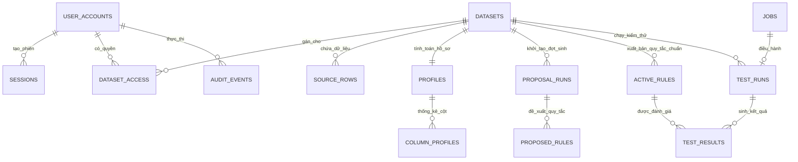

# Kiến Trúc CSDL PostgreSQL & Sơ Đồ Mối Quan Hệ ERD (Database Architecture & ERD)

Tài liệu thiết kế chi tiết toàn bộ cơ sở dữ liệu PostgreSQL (hoặc SQLite local) của hệ thống **RidePulse DQ**, bao gồm sơ đồ ERD trực quan, từ điển dữ liệu (Data Dictionary) của từng bảng và bản đồ luồng dữ liệu tương tác giữa AI Agent, dbt Core và FastAPI REST Server.

---

## 🗺️ 1. SƠ ĐỒ MỐI QUAN HỆ ERD TỔNG THỂ (MERMAID ERD)



---

## 🗂️ 2. PHÂN VÙNG 6 NHÓM BẢNG CHỨC NĂNG (DATABASE DOMAINS)

Cơ sở dữ liệu được thiết kế theo nguyên lý mô-đun hóa cao, chia thành 6 phân vùng:

```text
┌─────────────────────────────────────────────────────────────────────────────┐
│ 1. USER & ACCESS CONTROL  │ Quản lý tài khoản, phiên đăng nhập & phân quyền │
│ 2. ASYNC JOB & AUDIT     │ Quản lý job bất đồng bộ & Nhật ký kiểm vết      │
│ 3. DATA PLANE & DATASETS │ Danh mục dataset & Bảng dữ liệu taxi 50k       │
│ 4. PROFILING & METRICS   │ Thống kê chỉ số chất lượng tổng thể & chi tiết  │
│ 5. AI RULE PROPOSALS     │ Đợt sinh quy tắc AI & Đánh giá của Steward (HITL)│
│ 6. ACTIVE RULESET & RUNS │ Single Source of Truth ruleset & Kết quả dbt    │
└─────────────────────────────────────────────────────────────────────────────┘
```

---

## 📋 3. TỪ ĐIỂN BẢNG DỮ LIỆU CHI TIẾT (TABLE DICTIONARY)

### 🔑 Nhóm 1: Quản Lý Người Dùng & Phân Quyền (Security & Access Control)

#### 1.1. Bảng `user_accounts` (Tài khoản người dùng)

Quản lý danh tính người dùng đăng nhập hệ thống, vai trò phân quyền và trạng thái tài khoản.

* **Khóa chính (PK):** `id` (VARCHAR(64))
* **Các cột quan trọng:**
  * `username`: Tên đăng nhập duy nhất (VARCHAR(100), UNIQUE INDEX).
  * `password_hash`: Chuỗi mã hóa mật khẩu bảo mật (VARCHAR(512)).
  * `role`: Vai trò người dùng (`DATA_STEWARD`, `ENGINEER`, `READ_ONLY`).
  * `status`: Trạng thái (`ACTIVE`, `SUSPENDED`).
  * `last_login_at`, `created_at`, `updated_at`: Thời gian khởi tạo và đăng nhập gần nhất.

#### 1.2. Bảng `sessions` (Phiên đăng nhập Active)

Lưu trữ thông tin phiên làm việc active của trình duyệt web, mã token chống tấn công CSRF.

* **Khóa chính (PK):** `id` (VARCHAR(64))
* **Các cột quan trọng:**
  * `username`: Tên người dùng của phiên (VARCHAR(256)).
  * `role`: Vai trò người dùng tại thời điểm đăng nhập.
  * `csrf_token`: Mã token sinh ngẫu nhiên cho mỗi phiên chống giả mạo request.
  * `expires_at`: Thời gian hết hạn phiên làm việc.

#### 1.3. Bảng `dataset_access` (Phân quyền truy cập Dataset)

Bảng trung gian liên kết phân quyền Many-to-Many giữa `user_accounts` và `datasets`.

* **Khóa chính (PK):** `id` (VARCHAR(64))
* **Khóa ngoại (FK):** `dataset_id` $\rightarrow$ `datasets.id`, `username` $\rightarrow$ `user_accounts.username`.
* **Các cột quan trọng:**
  * `access_level`: Mức độ truy cập (`READ`, `WRITE`, `ADMIN`).
  * `granted_by`, `granted_at`: Người cấp quyền và thời gian cấp.

---

### ⚡ Nhóm 2: Quản Lý Tác Vụ Bất Đồng Bộ & Kiểm Vết (Job & Audit Trail)

#### 2.1. Bảng `jobs` (Quản lý Job Async)

Trái tim điều hành các công việc chạy ngầm (Background Jobs) của hệ thống (Ingestion, AI Proposal, dbt Test Run).

* **Khóa chính (PK):** `id` (VARCHAR(64))
* **Các cột quan trọng:**
  * `type`: Loại tác vụ (`INGEST_PROFILE`, `PROPOSE_RULES`, `RUN_DQ`).
  * `status`: Trạng thái (`PENDING`, `RUNNING`, `SUCCEEDED`, `FAILED`).
  * `progress`: Tiến độ công việc tính theo tỷ lệ phần trăm ($0.0 \rightarrow 1.0$).
  * `idempotency_key`: Khóa chống trùng lặp request (VARCHAR(256), UNIQUE INDEX).
  * `lease_expires_at`: Thời hạn khóa tạm thời tránh 2 worker tranh chấp job.

#### 2.2. Bảng `audit_events` (Nhật ký kiểm vết tuân thủ)

Lưu trữ dòng sự kiện lịch sử (Compliance Audit Log) ghi nhận mọi hành vi thay đổi cấu hình, duyệt quy tắc hoặc chạy test.

* **Khóa chính (PK):** `id` (VARCHAR(64))
* **Các cột quan trọng:**
  * `session_id`: ID phiên đăng nhập thực hiện.
  * `actor_role`: Vai trò của tác nhân (`DATA_STEWARD`, `AI_AGENT`, `SYSTEM`).
  * `action_code`: Mã hành động (ví dụ: `APPROVE_RULE`, `PUBLISH_RULESET`, `RUN_DQ_TEST`).
  * `entity_type`, `entity_id`: Đối tượng tác động (ví dụ `dataset`, `rule_proposal`).
  * `detail_json`: Chi tiết payload dạng JSON.

---

### 🚖 Nhóm 3: Danh Mục Bộ Dữ Liệu & Dữ Liệu Thô (Data Plane)

#### 3.1. Bảng `datasets` (Danh mục bộ dữ liệu)

Đăng ký và quản lý vòng đời của bộ dữ liệu trong hệ thống.

* **Khóa chính (PK):** `id` (VARCHAR(256)) — ví dụ: `nyc-yellow-50k-v1`.
* **Các cột quan trọng:**
  * `name`, `description`: Tên hiển thị và mô tả nghiệp vụ.
  * `status`: Trạng thái vòng đời (`REGISTERED`, `INGESTED`, `PROFILE_READY`).
  * `row_count`: Tổng số dòng.
  * `checksum`: Mã băm SHA256 xác minh tính toàn vẹn tệp Parquet/CSV.

#### 3.2. Bảng `source_rows` / `yellow_tripdata` (Dữ liệu Taxi 50k)

Bảng lưu trữ dữ liệu thực tế 21 cột tiêu chuẩn taxi NYC (Data Plane).

* **Khóa chính (PK):** `source_row_id` (VARCHAR(256)) — ví dụ: `row-00001`.
* **Khóa ngoại (FK):** `dataset_id` $\rightarrow$ `datasets.id`.
* **21 Cột tiêu chuẩn:** `vendor_id`, `pickup_at`, `dropoff_at`, `passenger_count`, `trip_distance`, `rate_code_id`, `store_and_fwd_flag`, `pickup_location_id`, `dropoff_location_id`, `payment_type`, `fare_amount`, `extra`, `mta_tax`, `tip_amount`, `tolls_amount`, `improvement_surcharge`, `total_amount`, `congestion_surcharge`, `airport_fee`, `cbd_congestion_fee`.

---

### 📊 Nhóm 4: Thống Kê & Hồ Sơ Dữ Liệu (Profiling)

#### 4.1. Bảng `profiles` (Hồ sơ chất lượng chung)

Lưu trữ các điểm số chất lượng tổng thể cấp bộ dữ liệu sau khi chạy Ingestion Profiler.

* **Khóa chính (PK):** `dataset_id` (VARCHAR(256), FK $\rightarrow$ `datasets.id`).
* **Các cột quan trọng:**
  * `row_count`: Tổng số dòng.
  * `completeness_score`: Điểm số độ đầy đủ ($0.0 \rightarrow 100.0\%$).
  * `validity_score`: Điểm số độ hợp lệ ($0.0 \rightarrow 100.0\%$).
  * `duplicate_rate`: Tỷ lệ trùng lặp dữ liệu.
  * `evidence_keys`: Danh sách các bằng chứng dạng mảng JSON.

#### 4.2. Bảng `column_profiles` (Chỉ số thống kê chi tiết từng cột)

Lưu thống kê chi tiết cho từng cột thuộc về một `profile`.

* **Khóa chính (PK):** `id` (INTEGER, Autoincrement).
* **Khóa ngoại (FK):** `profile_dataset_id` $\rightarrow$ `profiles.dataset_id`.
* **Các cột quan trọng:**
  * `name`, `data_type`: Tên cột và kiểu dữ liệu.
  * `null_rate`: Tỷ lệ ô trống NULL.
  * `distinct_count`, `uniqueness_rate`: Số lượng giá trị khác biệt và độ duy nhất.
  * `min_value`, `max_value`, `quantiles_json`: Giá trị nhỏ nhất, lớn nhất và các phân vị.
  * `sample_value`: Mẫu giá trị tiêu biểu.

---

### 🤖 Nhóm 5: AI Đề Xuất Quy Tắc & Duyệt HITL (Run 1 Graph)

#### 5.1. Bảng `proposal_runs` (Phiên chạy AI Proposer)

Lưu vết từng đợt gọi AI Agent sinh quy tắc.

* **Khóa chính (PK):** `run_id` (VARCHAR(64)) — ví dụ: `run_propose_20260817_01`.
* **Các cột quan trọng:** `dataset_id`, `status` (`QUEUED`, `RUNNING`, `DONE`, `FAILED`), `error`.

#### 5.2. Bảng `proposed_rules` (Danh sách quy tắc AI đề xuất)

Lưu trữ toàn bộ các quy tắc do AI Agent gợi ý và lịch sử duyệt của Data Steward.

* **Khóa chính (PK):** Composite PK `(run_id, rule_id)`.
* **Các cột quan trọng:**
  * `table_name`, `column_name`, `rule_type`: Vị trí và loại quy tắc (`NOT_NULL`, `RANGE`, `ACCEPTED_VALUES`, ...).
  * `parameters`: Tham số gốc do AI đề xuất (IMMUTABLE để phục vụ Audit Trail).
  * `edited_parameters`: Tham số do Data Steward ghi đè điều chỉnh trên UI (Nullable).
  * `status`: Trạng thái duyệt (`PENDING`, `APPROVED`, `EDITED`, `REJECTED`).
  * `reviewer`, `review_note`, `reviewed_at`: Người duyệt, ghi chú giải trình và thời gian duyệt.

---

### 🛡️ Nhóm 6: Bộ Quy Tắc Chính Thức & Engine Thực Thi dbt (Run 2 Graph)

#### 6.1. Bảng `active_rules` (Single Source of Truth Ruleset)

**Bảng quan trọng nhất của hệ thống!** Lưu trữ danh sách các quy tắc đã được Approve & Publish chính thức.

* **Khóa chính (PK):** `rule_id` (VARCHAR(512)).
* **Các cột quan trọng:**
  * `parameters`: Tham số hiệu lực chính thức (lấy từ `edited_parameters` nếu Steward có sửa, ngược lại lấy `parameters` của AI).
  * `status`: Trạng thái (`ACTIVE`, `INACTIVE`).
  * `last_run_id`: ID của lần chạy test dbt gần nhất.
* **Tác động:** Đây là đầu vào duy nhất để `test_generator_node` tự động biên dịch thành tệp `dbt_project/models/generated_dq_tests.yml`.

#### 6.2. Bảng `test_runs` / `dq_runs` (Nhật ký phiên chạy test)

Lưu thông tin lịch sử các đợt thực thi dbt test / Python SQL Runner.

* **Khóa chính (PK):** `test_run_id` (VARCHAR(64)).
* **Các cột quan trọng:** `dataset_id`, `status`, `total_failed`, `total_checked`, `created_at`, `completed_at`.

#### 6.3. Bảng `test_results` / `dq_results` (Kết quả kiểm thử chi tiết)

Lưu trữ kết quả đánh giá của từng quy tắc kiểm thử trong đợt chạy test.

* **Khóa chính (PK):** Composite PK `(test_run_id, rule_id)`.
* **Các cột quan trọng:**
  * `status`: Kết quả kiểm thử (`PASSED`, `FAILED`, `ERROR`, `SKIPPED`).
  * `violation_count`: Tổng số dòng bản ghi dữ liệu vi phạm.
  * `failed_row_ids`: Mảng JSON chứa danh sách giới hạn **tối đa 20 mã ID dòng lỗi mẫu** (Bounded Sample IDs) hiển thị lên UI cho Data Steward mà không làm rò rỉ toàn bộ CSDL.

---

## 🔄 4. BẢN ĐỒ LUỒNG DỮ LIỆU GIỮA CÁC BẢNG (END-TO-END DATA FLOW)

```text
[Step 1: INGESTION]
  Parquet File ──► datasets & source_rows
                        │
                        ▼
                profiles & column_profiles

[Step 2: AI PROPOSAL]
  profiles ──► AI Agent ──► proposal_runs & proposed_rules

[Step 3: HITL REVIEW]
  Data Steward (UI) ──► EDIT/APPROVE proposed_rules ──► PUBLISH ──► active_rules

[Step 4: DBT EXECUTION]
  active_rules ──► test_generator_node ──► generated_dq_tests.yml
                                                  │
                                                  ▼
  dbt test / SQL Engine ──► test_runs & test_results (Bounded 20 Failed IDs)
```
