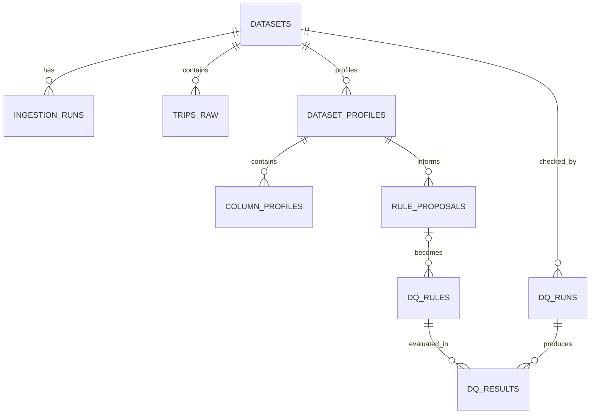

# RidePulse DQ — Data Model

## 1. Current status

**Database status: Not implemented.**

Code hiện chỉ có:

| Model | Fields | Source of truth |
|---|---|---|
| `ChatRequest` | `message: str`, required, length 1–5000 | `src/models/schemas.py` |
| `ChatResponse` | `response: str`, `analysis: str = ""` | `src/models/schemas.py` |
| `AgentState` | optional `query`, `context`, `analysis`, `response`, `error`, `metadata` | `src/agents/state.py` |
| `Settings` | app/LLM/database/vector settings | `src/config.py` |

`database_url` mặc định trỏ SQLite nhưng repository chưa có ORM model, migration hay
code persistence. PostgreSQL ở các phần dưới là **Proposed**.

## 2. Proposed conventions

- Primary keys: UUID.
- Timestamps: timezone-aware UTC.
- Source data: immutable sau ingestion.
- JSON fields chỉ dùng cho versioned profile/rule payload; field cần filter/index phải
  có column riêng.
- Trạng thái dùng enum/constraint allow-list.
- Mọi bảng workflow có `created_at`; mutable entity có `updated_at`.
- `source_row_id` deterministic từ source checksum + row position, không lấy từ LLM.

## 3. Proposed entities

### `datasets`

| Field | Type | Required | Validation/meaning |
|---|---|---:|---|
| `dataset_id` | UUID | Yes | Primary key |
| `name` | varchar | Yes | Unique logical dataset name |
| `source_type` | varchar | Yes | MVP chỉ `nyc_tlc_yellow_parquet` |
| `source_manifest` | jsonb | Yes | URL metadata, local path key, checksum, seed |
| `status` | varchar | Yes | `PENDING`, `INGESTING`, `READY`, `FAILED` |
| `row_count` | bigint | No | Non-negative sau ingestion |
| `created_at` | timestamptz | Yes | UTC |

Source of truth: server-side manifest + ingestion result.

### `ingestion_runs`

| Field | Type | Required | Validation/meaning |
|---|---|---:|---|
| `ingestion_run_id` | UUID | Yes | Primary key |
| `dataset_id` | UUID FK | Yes | → `datasets.dataset_id` |
| `source_checksum` | char(64) | Yes | Lowercase SHA-256 |
| `status` | varchar | Yes | `PENDING/RUNNING/SUCCEEDED/FAILED` |
| `rows_read` | bigint | Yes | Non-negative |
| `rows_written` | bigint | Yes | Non-negative |
| `error_code` | varchar | No | Stable internal/public mapping |
| `started_at` | timestamptz | No | UTC |
| `finished_at` | timestamptz | No | UTC; >= started_at |

Unique idempotency key Proposed: `(dataset_id, source_checksum, sample_profile)`.

### `trips_raw`

| Field | Type | Required | Source/validation |
|---|---|---:|---|
| `source_row_id` | varchar | Yes | Deterministic primary key within source |
| `dataset_id` | UUID FK | Yes | → `datasets` |
| `batch_id` | UUID FK | Yes | → successful ingestion run |
| `vendor_id` | smallint | No | Source `VendorID` |
| `pickup_at` | timestamp | Yes | Source `tpep_pickup_datetime` |
| `dropoff_at` | timestamp | Yes | Source `tpep_dropoff_datetime` |
| `passenger_count` | numeric | No | Source value; không auto-correct |
| `trip_distance` | double precision | No | Source value; invalid vẫn giữ raw |
| `rate_code_id` | smallint | No | Source `RatecodeID` |
| `store_and_fwd_flag` | varchar | No | Source value |
| `pickup_location_id` | integer | No | Source `PULocationID` |
| `dropoff_location_id` | integer | No | Source `DOLocationID` |
| `payment_type` | smallint | No | Source value |
| `fare_amount` | numeric | No | Source value |
| `extra` | numeric | No | Source value |
| `mta_tax` | numeric | No | Source value |
| `tip_amount` | numeric | No | Source value |
| `tolls_amount` | numeric | No | Source value |
| `improvement_surcharge` | numeric | No | Source value |
| `total_amount` | numeric | No | Source value |
| `congestion_surcharge` | numeric | No | Source value |
| `airport_fee` | numeric | No | Source `Airport_fee` nếu có |
| `ingested_at` | timestamptz | Yes | UTC system time |

Actual Parquet schema phải được validate trong `MVP-005`; table mapping có thể đổi qua
migration/ADR nếu file đã pin khác danh sách trên.

### `dataset_profiles`

| Field | Type | Required | Validation/meaning |
|---|---|---:|---|
| `profile_id` | UUID | Yes | Primary key |
| `dataset_id` | UUID FK | Yes | → `datasets` |
| `version` | integer | Yes | > 0; unique trong dataset |
| `status` | varchar | Yes | `PENDING/RUNNING/SUCCEEDED/FAILED` |
| `row_count` | bigint | No | Snapshot row count |
| `profile_payload` | jsonb | No | Versioned table-level aggregate only |
| `generated_at` | timestamptz | No | UTC |

### `column_profiles`

| Field | Type | Required | Validation/meaning |
|---|---|---:|---|
| `column_profile_id` | UUID | Yes | Primary key |
| `profile_id` | UUID FK | Yes | → `dataset_profiles` |
| `column_name` | varchar | Yes | Phải tồn tại trong reflected schema |
| `data_type` | varchar | Yes | Reflected database type |
| `null_count` | bigint | Yes | >= 0 |
| `distinct_count` | bigint | Yes | >= 0 |
| `statistics` | jsonb | Yes | Type-aware min/max/median/p95/p99 hoặc category summary |

Unique Proposed: `(profile_id, column_name)`.

### `rule_proposals`

| Field | Type | Required | Validation/meaning |
|---|---|---:|---|
| `proposal_id` | UUID | Yes | Primary key |
| `dataset_id` | UUID FK | Yes | → `datasets` |
| `profile_id` | UUID FK | Yes | Evidence profile |
| `status` | varchar | Yes | `PROPOSED/APPROVED/EDITED/REJECTED` |
| `rule_spec` | jsonb | Yes | Pydantic-validated structured rule |
| `reason` | text | Yes | Không chứa chain-of-thought/raw rows |
| `evidence_refs` | jsonb | Yes | List stable keys tồn tại trong evidence |
| `model_name` | varchar | No | Provider/model audit metadata |
| `prompt_version` | varchar | Yes | Versioned prompt contract |
| `created_at` | timestamptz | Yes | UTC |

### `dq_rules`

| Field | Type | Required | Validation/meaning |
|---|---|---:|---|
| `rule_id` | UUID | Yes | Primary key |
| `proposal_id` | UUID FK | No | Origin proposal; null nếu future manual rule |
| `dataset_id` | UUID FK | Yes | → `datasets` |
| `version` | integer | Yes | Immutable rule version |
| `status` | varchar | Yes | `APPROVED/COMPILED/ACTIVE/RETIRED` |
| `rule_spec` | jsonb | Yes | Validated allow-listed schema |
| `compiled_sql` | text | No | Generated server-side, SELECT only |
| `compiler_version` | varchar | No | Required khi compiled |
| `created_at` | timestamptz | Yes | UTC |

### `dq_runs`

| Field | Type | Required | Validation/meaning |
|---|---|---:|---|
| `run_id` | UUID | Yes | Primary key |
| `dataset_id` | UUID FK | Yes | → `datasets` |
| `status` | varchar | Yes | `PENDING/RUNNING/SUCCEEDED/FAILED` |
| `trigger_type` | varchar | Yes | `MANUAL` hoặc `SCHEDULED` |
| `correlation_id` | UUID | Yes | Log/job correlation |
| `started_at` | timestamptz | No | UTC |
| `finished_at` | timestamptz | No | UTC |

### `dq_results`

| Field | Type | Required | Validation/meaning |
|---|---|---:|---|
| `result_id` | UUID | Yes | Primary key |
| `run_id` | UUID FK | Yes | → `dq_runs` |
| `rule_id` | UUID FK | Yes | → `dq_rules` |
| `status` | varchar | Yes | `PASSED/FAILED/ERROR` |
| `failed_rows` | bigint | Yes | >= 0 |
| `eligible_rows` | bigint | Yes | >= 0; failed <= eligible |
| `failed_source_row_ids` | jsonb | Yes | Bounded IDs, không có raw values |
| `failed_ids_truncated` | boolean | Yes | Cho biết còn IDs bị cắt |
| `duration_ms` | bigint | Yes | >= 0 |

Unique Proposed: `(run_id, rule_id)`.

### `audit_logs`

| Field | Type | Required | Validation/meaning |
|---|---|---:|---|
| `audit_id` | UUID | Yes | Primary key |
| `actor` | varchar | Yes | Demo identity; auth thật deferred |
| `event_type` | varchar | Yes | Allow-listed event type |
| `entity_type` | varchar | Yes | Dataset/profile/proposal/rule/run |
| `entity_id` | UUID | Yes | ID target |
| `before_state` | jsonb | No | Sanitized snapshot |
| `after_state` | jsonb | No | Sanitized snapshot |
| `comment` | text | No | User comment, length-limited |
| `created_at` | timestamptz | Yes | Append-only UTC |

## 4. Relationships



## 5. Sample structured rule

```json
{
  "rule_type": "numeric_range",
  "table": "trips_raw",
  "column": "trip_distance",
  "parameters": {"min": 0},
  "severity": "high",
  "reason": "Observed minimum is below zero.",
  "evidence_refs": ["trip_distance.min"]
}
```

## 6. Privacy and security

- TLC trip data không có direct user name nhưng timestamp + location có thể là
  quasi-identifier; giữ raw access ở data plane.
- Không gửi raw rows, failed row values hoặc full location/time tuples cho LLM.
- Không log `DATABASE_URL`, API key, compiled query parameters chứa sensitive data.
- `source_manifest.local_path` không được client tùy ý cung cấp để tránh path traversal.
- `audit_logs` append-only ở application layer; actor auth thật là post-MVP limitation.
- DQ execution dùng riêng read-only role và statement timeout.

## 7. Open Questions

- Chọn sync `psycopg` hay async driver? **[NEEDS CONFIRMATION]**
- Bounded failed ID limit là 20, 50 hay 100? **[NEEDS CONFIRMATION]**
- Dùng PostgreSQL schema riêng cho raw/application/evaluation không?
- Data Health Score severity weights (`low/medium/high`) cần Product/QA owner chốt.
