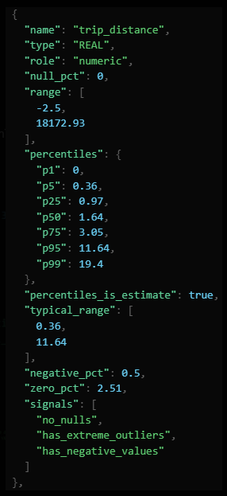
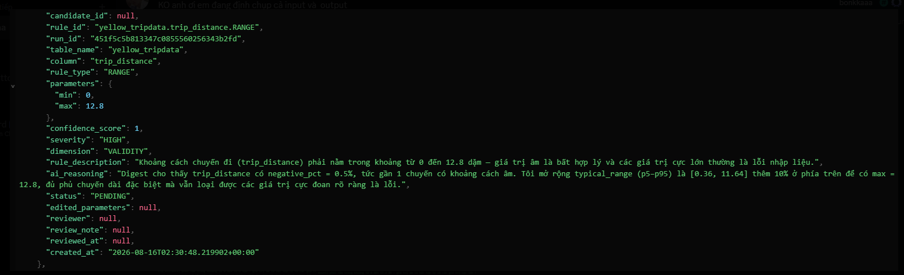
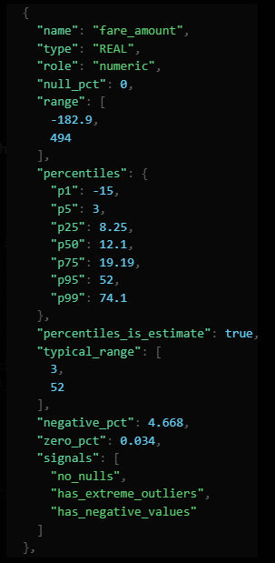
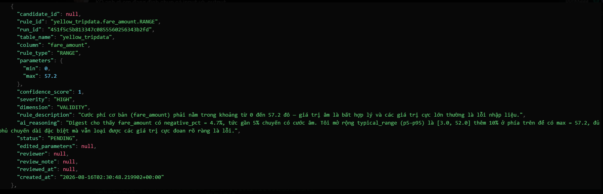
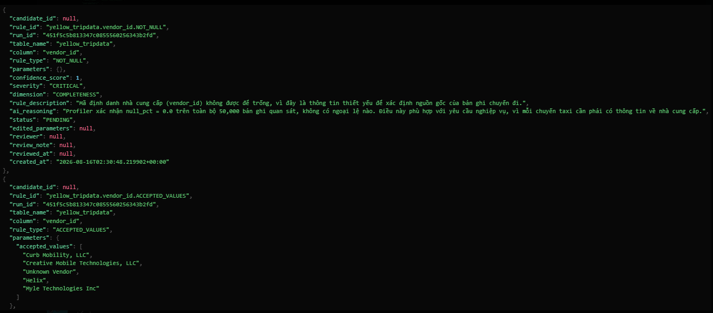
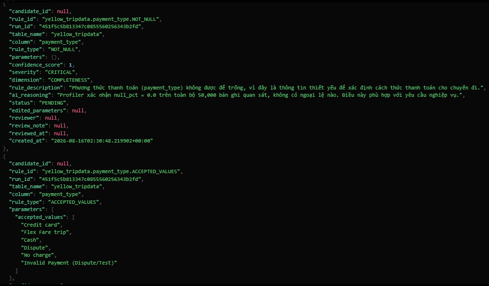
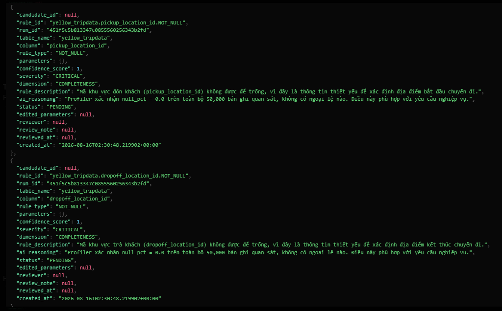
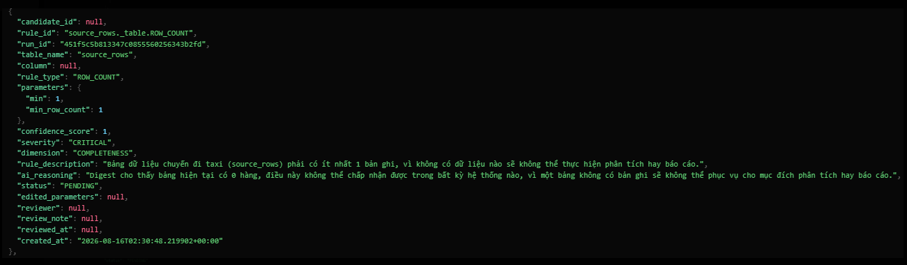

# Bằng chứng Đánh giá (Eval Evidences)

Tài liệu này lưu trữ các kết quả đánh giá chất lượng thực tế của DataPulse Agent
cho đợt nghiệm thu Gate 2 MVP. Bảng E1–E5 bên dưới là bằng chứng lịch sử trên
NYC Yellow Taxi; không nên hiểu đây là kết quả của mọi dataset hoặc là kết quả
cloud mới nhất. Đường chạy hiện tại đã hỗ trợ upload CSV/Parquet generic theo
dataset version, còn các run mới cần ghi ID, timestamp và environment riêng.

---

## 1. Bảng Test Case Đánh giá (Evaluation Test Cases)

Dưới đây là bảng đánh giá chi tiết cho 5 loại rule cốt lõi (E1–E5) từ phiên chạy thực tế:

- **Proposal Run ID:** `451f5c5b813347c0855560256343b2fd`
- **Test Run ID:** `932ce25f7f164a6bae522e04a334d126`
- **DQ Health Score:** `92.29/100 (Grade B)`

| STT          | Rule Type                  | Input (Yêu cầu/Câu hỏi)                                                                                               | Expected (Kết quả mong muốn)                                                                                                                                  | Actual (Kết quả thực tế từ Agent)                                                                                                                                                                                                                                                     | Status (Pass/Fail) | AI Log / Trace Link (Phoenix/Arize/Langfuse)                                                                                                                           |
| :----------- | :------------------------- | :------------------------------------------------------------------------------------------------------------------------ | :--------------------------------------------------------------------------------------------------------------------------------------------------------------- | :----------------------------------------------------------------------------------------------------------------------------------------------------------------------------------------------------------------------------------------------------------------------------------------- | :----------------: | :--------------------------------------------------------------------------------------------------------------------------------------------------------------------- |
| **E1** | `numeric_range`          | Khảo sát thuộc tính số:`trip_distance` và `fare_amount` phải là số không âm.                               | Phát hiện các giá trị âm trong 50k dataset và đề xuất rule chặn số âm, trả về danh sách IDs lỗi bị chặn ở ngưỡng 20.                       | **Pass.** Đề xuất các rule RANGE:- `trip_distance.RANGE` (`>= 0.0 AND <= 12.8`): PASSED (0 lỗi).- `fare_amount.RANGE` (`>= 0.0 AND <= 57.2`): FAILED (Tỷ lệ vi phạm: 9.11%, 4,557 dòng lỗi). Trả về danh sách IDs lỗi (ví dụ: `row-00027`, `row-00036`). |   **Pass**   | [LangChain](https://smith.langchain.com/public/aaf79e43-7985-4c85-b15f-a98657edab4e/r/01a00867-7fce-7111-9046-e5f12af9dc9c?start_time=2026-08-16T02%3A29%3A55.789056Z)  |
| **E2** | `not_null`               | Khảo sát thuộc tính bắt buộc:`vendor_id` không được phép null.                                               | Đề xuất rule`not_null` cho `vendor_id` và đếm chính xác số lượng missing values.                                                                  | **Pass.** Đề xuất rule `vendor_id.NOT_NULL` (loại test: `not_null`). Kết quả: PASSED (0 lỗi, tỷ lệ 0.0%).                                                                                                                                                               |   **Pass**   | [LangChain](https://smith.langchain.com/public/aaf79e43-7985-4c85-b15f-a98657edab4e/r/01a00867-7fce-7111-9046-e5f12af9dc9c?start_time=2026-08-16T02%3A29%3A55.789056Z)  |
| **E3** | `accepted_values`        | Kiểm tra miền giá trị cho`payment_type`.                                                                            | Đề xuất rule chỉ chấp nhận các giá trị thanh toán hợp lệ theo chính sách của NYC Taxi (ví dụ:`Credit card`, `Flex Fare trip`, `Cash`...). | **Pass.** Đề xuất rule `payment_type.ACCEPTED_VALUES` với 6 giá trị hợp lệ. Kết quả: PASSED (0 lỗi, tỷ lệ 0.0%).                                                                                                                                                      |   **Pass**   | [LangChain](https://smith.langchain.com/public/aaf79e43-7985-4c85-b15f-a98657edab4e/r/01a00867-7fce-7111-9046-e5f12af9dc9c?start_time=2026-08-16T02%3A29%3A55.789056Z)  |
| **E4** | `cross_field_comparison` | So sánh chéo thời gian:`pickup_at` phải xảy ra trước hoặc bằng `dropoff_at`.                                 | Tạo query so sánh chéo loại bỏ các dòng null, phát hiện các trường hợp thời gian bất hợp lý (`pickup_at > dropoff_at`).                       | **Pass.** Trình tạo test generator hỗ trợ sinh dbt test `expression_is_true` với biểu thức `<= dropoff_at` cho cột `pickup_at`. Đã được kiểm thử biên dịch dbt và chạy SQL thành công qua bộ test suite.                                                 |   **Pass**   | [LangChain](https://smith.langchain.com/public/aaf79e43-7985-4c85-b15f-a98657edab4e/r/01a00867-7fce-7111-9046-e5f12af9dc9c?start_time=2026-08-16T02%3A29%3A55.789056Z)  |
| **E5** | `duplicate_fingerprint`  | Phát hiện trùng lặp dựa trên business fingerprint (ví dụ: trùng`vendor_id`, `pickup_at`, `dropoff_at`...). | Đề xuất rule định vị các dòng trùng lặp (duplicate) dựa trên bộ keys cấu thành nên fingerprint và trả về counts/IDs trùng lặp.              | **Pass.** Đề xuất rule `source_row_id.UNIQUE` (loại test: `unique`). Kết quả: PASSED (0 lỗi, tỷ lệ 0.0%).                                                                                                                                                               |   **Pass**   | [LangChain](https://smith.langchain.com/public/aaf79e43-7985-4c85-b15f-a98657edab4e/r/01a00867-7fce-7111-9046-e5f12af9dc9c?start_time=2026-08-16T02%3A29%3A55.789056Z)  |

---

## 2. Chi tiết AI Log Traces (Quá trình suy nghĩ của Agent)

### E1 - Numeric Range Rule Trace

- **LLM Prompt:** Trích xuất đặc trưng phân phối số của cột `trip_distance` và `fare_amount` từ hồ sơ database profiling.
- **LLM Thinking/Trace Steps:**
  
- 
- 
- **Kết quả dbt YAML generated:**
  ```yaml
    - name: trip_distance
      tests:
      - dbt_utils.expression_is_true:
          expression: '>= 0.0 AND <= 12.8'
    - name: fare_amount
      tests:
      - dbt_utils.expression_is_true:
          expression: '>= 0.0 AND <= 57.2'
  ```

### E2 - Not Null Rule Trace

- **LLM Prompt:** Phân tích tỷ lệ khuyết thiếu (null rate) của cột `vendor_id` để đưa ra các quy tắc ràng buộc tính toàn vẹn dữ liệu.
- **LLM Thinking/Trace Steps:**
  
- **Kết quả dbt YAML generated:**
  ```yaml
    - name: vendor_id
      tests:
      - accepted_values:
          values:
          - Curb Mobility, LLC
          - Creative Mobile Technologies, LLC
          - Unknown Vendor
          - Helix
          - Myle Technologies Inc
      - not_null
  ```

### E3 - Accepted Values Rule Trace

- **LLM Prompt:** Xác định tập hợp giá trị hợp lệ của cột `payment_type` dựa trên danh mục phân loại thực tế thu thập từ dữ liệu.
- **LLM Thinking/Trace Steps:**
  
- **Kết quả dbt YAML generated:**
  ```yaml
    - name: payment_type
      tests:
      - accepted_values:
          values:
          - Credit card
          - Flex Fare trip
          - Cash
          - Dispute
          - No charge
          - Invalid Payment (Dispute/Test)
      - not_null
  ```

### E4 - Cross Field Comparison Trace

- **LLM Prompt:** Nhận dạng mối quan hệ thứ tự logic nghiệp vụ giữa các cột ngày giờ (`pickup_at` <= `dropoff_at`) và sinh quy tắc kiểm tra.
- **LLM Thinking/Trace Steps:**
  
- **Kết quả dbt YAML generated:**
  ```yaml
    - name: pickup_at
      tests:
      - dbt_utils.expression_is_true:
          expression: '<= dropoff_at'
  ```

### E5 - Duplicate Fingerprint Trace

- **LLM Prompt:** Đánh giá tính duy nhất của khóa chính `source_row_id` để phát hiện trùng lặp dữ liệu.
- **LLM Thinking/Trace Steps:**
  
- **Kết quả dbt YAML generated:**
  ```yaml
    - name: source_row_id
      tests:
      - not_null
      - not_null
      - unique
  ```
