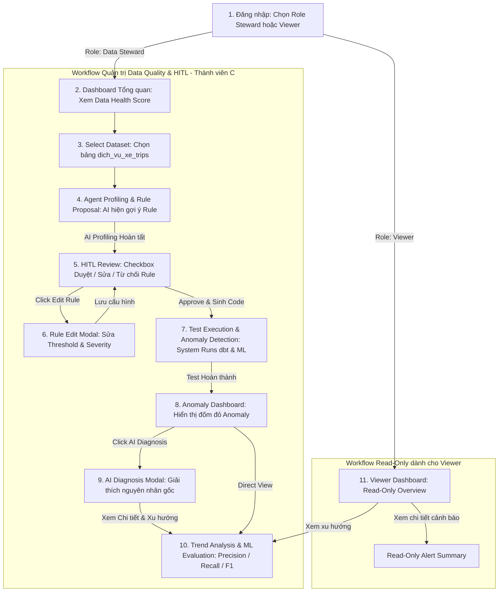

# BÁO CÁO THIẾT KẾ SẢN PHẨM & TRẢI NGHIỆM NGƯỜI DÙNG (PRODUCT DESIGN & UX/UI REPORT)

**Tên dự án:** RidePulse DQ – Autonomous Data Quality & Anomaly Intelligence Platform  
**Môn học:** Product Development (P-028)  
**Phân công công việc:** Thành viên C – Product Designer & UI/UX Lead  
**Ngày hoàn thành:** 31/07/2026  

---

## 1. TỔNG QUAN DỰ ÁN & ĐẶT BÀI TOÁN

### 1.1 Bối cảnh Ngành Ride-Hailing & Bài toán Dữ liệu
Hệ thống vận hành dịch vụ gọi xe (Ride-hailing) xử lý hàng triệu giao dịch mỗi ngày trên các tập dữ liệu chính:
- `dich_vu_xe_trips` (Thông tin chuyến đi, tọa độ, cước phí, thời gian)
- `dich_vu_xe_drivers` (Thông tin tài xế, trạng thái hoạt động, điểm đánh giá)
- `dich_vu_xe_customers` (Thông tin hành khách, lịch sử đặt xe)
- `dich_vu_xe_payments` (Lịch sử thanh toán, giao dịch ngân hàng, ví điện tử)

### 1.2 Thách thức & Giải pháp AI Agent + Human-In-The-Loop (HITL)
Các Data Engineer hiện phải tự tay viết hàng trăm `dbt test` thủ công tốn thời gian và dễ bỏ sót lỗi. **RidePulse DQ** giải quyết bài toán này bằng AI Agent tự động:
1. **Metadata Profiling:** Tự động đọc cấu trúc schema, phân tích thống kê phân phối dữ liệu.
2. **AI Rule Proposals:** Đề xuất các quy tắc Not-null, Range check, Format đi kèm độ tin cậy (Confidence score).
3. **Human In The Loop (HITL):** Data Steward duyệt (Approve), từ chối (Reject) hoặc tùy chỉnh threshold (Edit).
4. **Automated Code Gen & Test Run:** Tự động sinh mã dbt Core / Great Expectations test và thực thi pipeline.
5. **ML Anomaly Intelligence & Diagnosis:** Phát hiện bất thường bằng thuật toán Machine Learning (Isolation Forest), hiển thị cảnh báo và chẩn đoán nguyên nhân gốc (Root Cause Diagnosis).

---

## 2. PHÂN TÍCH VAI TRỜI NGƯỜI DÙNG (USER ROLES & PERMISSIONS)

| Quyền hạn / Thao tác | 👨‍💻 Data Steward (Primary User) | 👁️ Viewer (Secondary User) |
| :--- | :---: | :---: |
| **Mục tiêu sử dụng** | Quản trị độ tin cậy dữ liệu, duyệt rules, chạy test | Theo dõi điểm Data Health Score, xem cảnh báo & báo cáo |
| **Kết nối Dataset & Profiling** | ✅ Có quyền | ❌ Không có quyền |
| **Duyệt AI Rules (Approve / Reject / Edit)** | ✅ Có quyền (HITL Engine) | ❌ Không có quyền (Read-Only) |
| **Sinh mã dbt & Thực thi Test Suite** | ✅ Có quyền | ❌ Không có quyền |
| **Xem Anomaly & AI Root Cause Diagnosis** | ✅ Có quyền | ✅ Có quyền (Read-Only View) |
| **Xem Báo cáo Trend Analysis & ML Metrics** | ✅ Có quyền | ✅ Có quyền |

---

## MỤC 3: WIREFRAME & UI FLOW (THÀNH VIÊN C ĐẢM NHẬN)

### A. UI Flow (Sơ đồ luồng đi người dùng)
Luồng thao tác được thiết kế mạch lạch, rõ ràng qua 7 giai đoạn chính:

```
[1. Đăng nhập] ➔ [2. Dashboard Tổng quan] ➔ [3. Select Dataset] ➔ [4. Agent Profiling & Rule Proposal]
      │
      └─➔ [5. HITL Review (Chỉ Steward)] ➔ [6. Test Execution & Anomaly Detection] ➔ [7. Detail Report & Trend]
```

#### Sơ đồ Luồng Chi tiết (Mermaid Diagram):



#### Diễn giải Chi tiết 7 Bước Thao tác:
1. **Đăng nhập (Login):** Người dùng chọn vai trò `Data Steward` (Toàn quyền HITL) hoặc `Viewer` (Chỉ xem).
2. **Dashboard Tổng quan:** Hiển thị điểm số tổng quan `Data Health Score: 87.4%` cùng 4 thẻ KPI chỉ số.
3. **Connect Data / Select Dataset:** Chọn bảng dữ liệu vận hành (ví dụ: `dich_vu_xe_trips` chứa 4.25M dòng).
4. **Agent Profiling & Rule Proposal:** AI quét metadata và tự động gợi ý các quy tắc (Not-null, Range check, Format).
5. **HITL Review (Chỉ Steward):** Bảng xem xét trực quan cho phép Steward Duyệt (Approve), Từ chối (Reject), hoặc Sửa (Edit) thông số Rule.
6. **Test Execution & Anomaly Detection:** Hệ thống sinh mã dbt test, thực thi pipeline với live console log và mô hình ML Isolation Forest.
7. **Detail Report / Alerting & Trend Analysis:** Xem danh sách sự cố bất thường, nhấn `🤖 AI Diagnosis` để xem giải thích nguyên nhân gốc rễ và theo dõi biểu đồ xu hướng Data Quality cùng chỉ số Precision/Recall/F1.

---

### B. Khung Màn Hình Chính (Wireframe Layout - Ant Design Style 1440px)

Thành viên C phác thảo chi tiết đầy đủ bộ giao diện (bao gồm các màn hình trọng tâm theo yêu cầu):

#### Màn 1: Rule Review Screen (HITL Review) - [Screen 5 & Screen 6]
- **Bảng chứa danh sách Rule do AI tạo:** Cột `Column Name`, `Rule Type`, `AI Reason`, `Confidence %`, `Suggested Threshold`, `Status` (Pending/Approved/Rejected) và các nút `Action` (Approve, Reject, Edit).
- **Thao tác HITL:** Cho phép tích chọn duyệt hàng loạt (`Approve All`) và mở **Rule Edit Modal** để chỉnh sửa ngưỡng `fare_amount >= 0`.

#### Màn 2: Anomaly Dashboard & Alerting - [Screen 8 & Screen 9]
- **Biểu đồ Time-Series:** Trực quan hóa đường điểm số Data Quality với các **điểm bất thường màu đỏ (Anomaly dots đỏ)** đánh dấu sự cố dữ liệu.
- **Bảng danh sách Alert:** Đi kèm nút **`🤖 AI Diagnosis`**. Khi nhấn vào sẽ bật **AI Diagnosis Modal** giải thích nguyên nhân gốc do lỗi microservice `promo_v2_service`, tác động kinh doanh và câu lệnh SQL/dbt khắc phục.

#### Màn 3: Trend & Evaluation Screen - [Screen 10]
- **Biểu đồ đường & cột:** Thể hiện chỉ số Data Quality Score và tỷ lệ Passed/Failed rules theo tuần/tháng.
- **Thẻ chỉ số mô hình ML:** Hiển thị chi tiết các thông số đánh giá mô hình ML Anomaly Engine: **Precision (94.2%)**, **Recall (91.8%)**, **F1-Score (93.0%)**.

---

## 4. DANH SÁCH COMPONENT ANT DESIGN 5.0 MAPPING

| Màn hình | Ant Design 5.0 Components |
| :--- | :--- |
| **Màn 1: Rule Review (HITL)** | `Table`, `Tag` (Green/Gold/Red), `Popconfirm`, `Button`, `Modal`, `Form`, `InputNumber`, `Select` |
| **Màn 2: Anomaly Dashboard** | `Row`, `Col`, `Card`, `Table`, `Badge` (Status error), `Modal`, `Alert`, `Typography.Paragraph` |
| **Màn 3: Trend & Evaluation** | `DatePicker.RangePicker`, `Select`, `Card`, `Statistic`, `Tabs`, `Row`, `Col` |

---

## 5. BẢN PROTOTYPE TƯƠNG TÁC & BÀN GIAO SẢN PHẨM

Toàn bộ sản phẩm thiết kế của Thành viên C đã được lưu trữ sẵn sàng:
1. **Báo cáo Word (.docx 10 trang):** [docs/BAO_CAO_THANH_VIEN_C_UI_UX.docx](file:///c:/Users/ADMIN/WorkPlace/Vinuni/AssignmentProject/P-028/docs/BAO_CAO_THANH_VIEN_C_UI_UX.docx)
2. **Thư mục 11 Ảnh chụp UI:** [docs/images/](file:///c:/Users/ADMIN/WorkPlace/Vinuni/AssignmentProject/P-028/docs/images/)
3. **Web Application Prototype:** [ui_test/index.html](file:///c:/Users/ADMIN/WorkPlace/Vinuni/AssignmentProject/P-028/ui_test/index.html)

---
*Báo cáo được chuẩn hóa theo tiêu chí môn học Product Development & Senior UX Design.*
