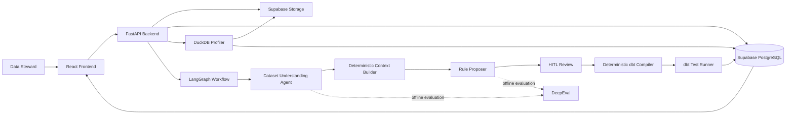

# RIDEPULSE DQ — KẾ HOẠCH HOÀN THIỆN MVP VÀ SẢN PHẨM CUỐI KỲ

> **Phiên bản:** Revised MVP Plan  
> **Ngày cập nhật:** 19/08/2026  
> **Mốc nộp hồ sơ MVP:** 24/08/2026  
> **Mốc hoàn thiện sản phẩm:** 23:59 ngày 01/09/2026  
> **Thành viên:** Kiên · Chiến · Phong · Đạt

---

## 1. Mục tiêu của kế hoạch

Kế hoạch này tập trung hoàn thiện một sản phẩm có thể demo công khai, chứng minh được giá trị cốt lõi của RidePulse DQ:

1. Người dùng tải dataset CSV hoặc Parquet lên hệ thống.
2. Hệ thống tự động đọc schema, metadata và thống kê dữ liệu.
3. Dataset Understanding Agent tạo bản mô tả dữ liệu có cấu trúc.
4. Context Builder chuyển kết quả hiểu dữ liệu thành context ổn định cho Rule Proposer.
5. Rule Proposer lựa chọn rule từ catalog định nghĩa sẵn và đề xuất tham số phù hợp.
6. Data Steward duyệt, sửa hoặc từ chối rule trước khi thực thi.
7. Hệ thống biên dịch rule đã duyệt thành dbt test theo cách deterministic.
8. Kết quả kiểm thử và bất thường được hiển thị bằng dashboard trực quan.
9. DeepEval được sử dụng để đánh giá chất lượng Agent và theo dõi regression.

Plan ưu tiên một luồng end-to-end chạy ổn định hơn việc tích hợp nhiều công nghệ chưa tạo giá trị trực tiếp cho demo.

---

## 2. Phạm vi sản phẩm

### 2.1 Phạm vi bắt buộc

- Upload file CSV và Parquet.
- Lưu file gốc trên Supabase Storage.
- Lưu dataset metadata, schema, profile, semantic contract, rule và kết quả chạy trong Supabase PostgreSQL.
- Cho phép quản lý và chuyển đổi giữa nhiều dataset độc lập.
- Tự động profiling dataset bằng code deterministic.
- Dataset Understanding Agent sinh structured output từ schema, metadata và profile.
- Context Builder tạo input cho Rule Proposer bằng prompt template cố định.
- Rule Proposer chỉ được chọn rule từ catalog đã định nghĩa.
- HITL cho phép approve, reject và edit rule.
- Compiler deterministic chuyển rule thành dbt tests.
- Chạy kiểm thử và lưu kết quả theo dataset/run.
- Hiển thị DQ score, pass/fail, violation và lịch sử chạy.
- DeepEval benchmark cho Agent.
- Có Live URL phục vụ trải nghiệm và video demo.

### 2.2 Phạm vi nên hoàn thành nếu luồng chính đã ổn định

- So sánh semantic contract giữa các phiên bản.
- Ghi nhận phản hồi approve/reject để cải thiện Rule Proposer.
- Export rule hoặc semantic contract dưới dạng JSON/YAML/Markdown.
- Phát hiện anomaly trên lịch sử violation rate bằng Z-score hoặc ngưỡng động đơn giản.
- Cảnh báo schema drift giữa hai lần upload.
- Responsive UI cho tablet và màn hình laptop nhỏ.

### 2.3 Future work

Các hạng mục sau không thuộc critical path:

- Dagster scheduler cho job định kỳ.
- ChromaDB hoặc vector database cho historical-rule RAG.
- Isolation Forest và anomaly ensemble.
- Kết nối trực tiếp Snowflake/BigQuery.
- Hỗ trợ nhiều LLM provider.
- Distributed worker, dead-letter queue và circuit breaker.
- Full OpenTelemetry/Prometheus production observability.
- Auto-scaling và hạ tầng production quy mô lớn.

---

## 3. Quyết định kiến trúc

### 3.1 Tech stack chính

| Thành phần | Công nghệ | Vai trò |
|---|---|---|
| Frontend | React + TypeScript + Ant Design | Upload, catalog, semantic contract, HITL, dashboard |
| Backend | FastAPI + Pydantic v2 | API, validation, orchestration và persistence |
| Agent framework | LangGraph | Điều phối workflow và HITL |
| Database | Supabase PostgreSQL | Metadata, profile, rule, run result và audit log |
| File storage | Supabase Storage | Lưu CSV/Parquet gốc |
| Profiling | DuckDB + Python | Đọc file và tính thống kê mà không import toàn bộ vào JSONB |
| DQ engine | dbt tests | Thực thi rule đã được compile |
| Agent evaluation | DeepEval | Benchmark output của Dataset Understanding và Rule Proposer |
| Deployment | Frontend hosting + public FastAPI service | Cung cấp Live URL cho demo |

### 3.2 Cách lưu dataset

Không lưu toàn bộ row dữ liệu vào một cột JSONB chung. Luồng lưu trữ đề xuất:

```text
CSV/Parquet upload
        │
        ▼
Supabase Storage ─────► lưu file gốc theo dataset_id/version
        │
        ▼
DuckDB đọc file ──────► schema + metadata + profile
        │
        ▼
Supabase PostgreSQL ──► dataset record, profile, semantic contract,
                        rules, execution runs và audit logs
```

Mỗi lần upload tạo một `dataset_version`. Rule và kết quả chạy phải tham chiếu đúng `dataset_id` và `dataset_version_id`.

### 3.3 Vai trò của hardcoded rule

Rule được hardcode dưới dạng **catalog kỹ thuật**, không hardcode theo từng dataset và không hardcode thành 11 prompt rời rạc.

Catalog định nghĩa:

- Tên rule.
- DQ dimension.
- Parameter schema.
- Kiểu dữ liệu áp dụng.
- Validator.
- dbt compiler/template.

Agent chỉ làm nhiệm vụ:

- Chọn rule phù hợp từ catalog.
- Chọn target column/table.
- Đề xuất parameters.
- Dẫn evidence từ profile/semantic contract.
- Giải thích lý do đề xuất.

Agent không được tự sáng tạo rule type, SQL hoặc dbt YAML.

---

## 4. Kiến trúc tổng thể



---

## 5. Agent workflow

### 5.1 Luồng xử lý

```text
Schema + metadata + profile
        ↓
Dataset Understanding Agent
        ↓
Structured Semantic Contract
        ↓
Deterministic Context Builder
        ↓
Fixed Rule Proposer Prompt
        ↓
Rule Proposer structured output
        ↓
Rule Validator
        ↓
HITL Review
        ↓
Deterministic dbt Compiler
        ↓
Test Execution + Visualization
```

### 5.2 Dataset Understanding Agent

#### Input

- Dataset name và mô tả do người dùng cung cấp.
- File type, row count và column count.
- Column name và physical data type.
- Null rate, distinct count và uniqueness ratio.
- Min, max, mean, quantiles đối với numeric columns.
- Top values/frequency đối với categorical columns.
- Min/max timestamp đối với temporal columns.
- Pattern summary đối với string columns.
- Người dùng có thể bổ sung domain description hoặc ghi chú nghiệp vụ.

#### Output

Agent phải trả về Pydantic structured output, ví dụ:

```json
{
  "dataset_summary": "Dữ liệu giao dịch vận chuyển theo chuyến",
  "domain": "ride_hailing",
  "columns": [
    {
      "column_name": "fare_amount",
      "business_name": "Giá cước",
      "description": "Số tiền cước trước phụ phí",
      "semantic_type": "CURRENCY",
      "nullable_expectation": "NON_NULL",
      "candidate_constraints": ["NON_NEGATIVE"],
      "confidence": 0.91,
      "evidence_keys": ["profile.fare_amount.min", "schema.fare_amount.type"]
    }
  ],
  "relationships": [],
  "warnings": []
}
```

#### Nguyên tắc

- Không gửi raw rows hoặc credentials cho LLM.
- Không cho Agent tự viết prompt kế tiếp.
- Output phải có schema cố định và parse được.
- Semantic contract phải được lưu theo version.
- Người dùng được phép sửa mô tả hoặc semantic type trước khi propose rule.

### 5.3 Context Builder

Context Builder là code deterministic, không phải một Agent tối ưu prompt riêng.

Nó nhận:

- Dataset profile.
- Semantic contract.
- Rule catalog.
- Dataset/domain description.
- Rule đã được approve/reject trước đó nếu có.

Nó tạo `ContextPayload` có cấu trúc:

```json
{
  "dataset": {},
  "columns": [],
  "allowed_rule_types": [],
  "historical_feedback": [],
  "evidence_index": {}
}
```

Context Builder chịu trách nhiệm:

- Chỉ giữ dữ liệu cần thiết.
- Giới hạn token.
- Loại bỏ raw values nhạy cảm.
- Gắn `evidence_key` để truy vết reasoning.
- Sắp xếp context ổn định để benchmark prompt có thể lặp lại.

### 5.4 Rule Proposer

Rule Proposer nhận prompt template cố định và `ContextPayload`.

Output tối thiểu của mỗi proposal:

```json
{
  "rule_type": "RANGE",
  "target_column": "fare_amount",
  "parameters": {"min": 0},
  "dimension": "VALIDITY",
  "severity": "HIGH",
  "confidence": 0.92,
  "reasoning": "Giá cước không nên âm.",
  "evidence_keys": ["profile.fare_amount.min", "semantic.fare_amount.type"]
}
```

Rule Validator phải loại bỏ proposal nếu:

- Rule type không có trong catalog.
- Column không tồn tại.
- Rule không phù hợp data type.
- Parameters sai schema hoặc ngoài giới hạn.
- Evidence key không tồn tại.
- Rule trùng với một proposal khác.

### 5.5 HITL

Mỗi rule có trạng thái:

```text
PENDING → APPROVED
        → REJECTED
        → EDITED → APPROVED
```

UI phải cho phép:

- Xem reasoning, confidence và evidence.
- Sửa parameters trước khi approve.
- Reject kèm lý do.
- Approve/reject nhiều rule.
- Ghi lại actor, timestamp, before/after và review note.

Chỉ rule `APPROVED` được chuyển tới compiler.

---

## 6. Rule catalog cho MVP

Giữ 9 rule types đã gần với nền tảng hiện tại để giảm rủi ro. Không đưa Isolation Forest hoặc statistical model vào rule catalog.

| Rule | Dimension | Parameters | Điều kiện áp dụng |
|---|---|---|---|
| `NOT_NULL` | Completeness | Không có | Column được kỳ vọng bắt buộc |
| `NULL_RATE` | Completeness | `max_null_pct` | Cho phép null trong một tỷ lệ xác định |
| `UNIQUE` | Uniqueness | Không có | Identifier hoặc key candidate |
| `ACCEPTED_VALUES` | Validity | `accepted_values` | Categorical/enum có tập giá trị nhỏ |
| `RANGE` | Validity | `min?`, `max?` | Numeric/date; cần ít nhất một bound |
| `REGEX_FORMAT` | Validity | `regex` | String có pattern rõ ràng |
| `FRESHNESS` | Freshness | `max_age_hours` | Timestamp/date cấp bảng hoặc cột |
| `ROW_COUNT` | Completeness | `min_row_count`, `max_row_count?` | Rule cấp bảng |
| `CROSS_FIELD_COMPARISON` | Consistency | `target_column`, `operator` | Hai cột có kiểu so sánh được |

### Không đưa vào MVP

- `ANOMALY_OUTLIER`: thuộc anomaly engine, không phải business rule deterministic.
- `DISTRIBUTION_QUANTILES`: chưa có baseline lịch sử đủ ổn định.
- `TEMPORAL_CONSISTENCY`: có thể biểu diễn bằng `CROSS_FIELD_COMPARISON` trong MVP.
- `SCHEMA_CONFORMANCE`: thực hiện như schema-drift check ở bước ingest, không cần LLM đề xuất.
- `STRING_LENGTH`: có thể bổ sung sau khi 9 rule cốt lõi chạy ổn định.

### Parameter model

Không sử dụng một `RuleParameters` chứa toàn bộ field optional. Mỗi rule có model riêng:

```python
class RangeParameters(BaseModel):
    min: float | None = None
    max: float | None = None

class NullRateParameters(BaseModel):
    max_null_pct: float = Field(ge=0, le=100)

class CrossFieldParameters(BaseModel):
    target_column: str
    operator: Literal["<", "<=", "=", "!=", ">=", ">"]
```

`ProposedRule` sử dụng `rule_type` làm discriminator để chọn đúng parameter model.

---

## 7. Functional requirements

### FR-01 — Upload dataset

- Chấp nhận `.csv` và `.parquet`.
- Validate extension, MIME type và kích thước file.
- Tạo `dataset_id` và `dataset_version_id`.
- Upload file lên Supabase Storage.
- Không ghi Supabase URL/key trực tiếp trong source code.

### FR-02 — Dataset catalog

- Liệt kê dataset và version.
- Hiển thị trạng thái upload/profile/agent/test.
- Chuyển dataset đang thao tác mà không phụ thuộc `datasets[0]`.
- Tất cả API phía sau nhận `dataset_id` rõ ràng.

### FR-03 — Profiling

- Detect schema tự động.
- Tính profile theo từng column.
- Không giả định schema NYC taxi.
- Lưu profile theo dataset version.
- Có trạng thái lỗi rõ ràng nếu file không đọc được.

### FR-04 — Semantic contract

- Agent sinh structured semantic contract.
- Hiển thị và cho phép người dùng sửa.
- Lưu AI version và user-edited version riêng.
- Context Builder ưu tiên version đã được người dùng xác nhận.

### FR-05 — Rule proposal

- Rule Proposer chỉ sử dụng catalog cho phép.
- Mỗi proposal có parameters, reasoning, confidence và evidence.
- Không chạy mock một cách im lặng khi Agent thật lỗi.
- UI phải hiển thị rõ `REAL`, `MOCK` hoặc `FAILED` mode.

### FR-06 — HITL review

- Approve, reject và edit rule.
- Chỉ approved rules được chạy.
- Audit mọi thay đổi.

### FR-07 — Compile và execute

- Compiler không gọi LLM.
- Identifier được kiểm tra với schema registry.
- Rule được compile thành dbt test hoặc deterministic SQL test tương đương.
- Lưu status, violation count, total rows và bounded sample identifiers.

### FR-08 — Dashboard

- Tổng DQ score.
- Tổng pass/fail.
- Violation theo rule/dimension.
- Lịch sử run và trend.
- Drill-down từ anomaly/rule tới kết quả chi tiết.
- Không hardcode tên cột taxi trong Data Explorer.

### FR-09 — Evaluation

- Có benchmark dataset cố định.
- Lưu prompt version, model, latency và token usage.
- So sánh kết quả với baseline.
- Không gọi paid LLM evaluation trên mọi PR.

---

## 8. Non-functional requirements

| Nhóm | Yêu cầu |
|---|---|
| Security | Credentials chỉ lấy từ environment/secrets; không commit `.env` |
| Privacy | Không gửi raw rows, PII hoặc connection secrets tới LLM |
| Reliability | Lỗi Agent không được tự động giả thành mock success |
| Traceability | Rule proposal phải truy được evidence và prompt/model version |
| Performance | Profiling dataset demo hoàn thành trong thời gian phù hợp cho video/demo |
| Portability | Backend và frontend chạy được local bằng tài liệu hướng dẫn |
| Maintainability | Frontend tách component; backend tách profiler/agent/compiler/runner |
| Reproducibility | Benchmark và test dùng dataset/version cố định |
| Accessibility | UI có loading, empty, success và error states rõ ràng |

---

## 9. Data model tối thiểu

| Entity | Trường chính |
|---|---|
| `datasets` | `id`, `name`, `description`, `active_version_id`, `created_by`, `created_at` |
| `dataset_versions` | `id`, `dataset_id`, `storage_path`, `file_type`, `file_hash`, `row_count`, `status` |
| `dataset_schemas` | `dataset_version_id`, `schema_json`, `schema_hash` |
| `dataset_profiles` | `dataset_version_id`, `profile_json`, `created_at` |
| `semantic_contracts` | `id`, `dataset_version_id`, `ai_output`, `reviewed_output`, `status`, `version` |
| `rule_proposals` | `id`, `dataset_version_id`, `rule_type`, `target`, `parameters`, `evidence`, `status` |
| `rule_reviews` | `rule_id`, `actor`, `action`, `before`, `after`, `review_note`, `created_at` |
| `dq_runs` | `id`, `dataset_version_id`, `status`, `agent_mode`, `started_at`, `finished_at` |
| `dq_results` | `run_id`, `rule_id`, `status`, `violation_count`, `total_rows`, `details` |
| `agent_evaluations` | `prompt_version`, `model`, `dataset_version_id`, `metrics`, `latency_ms`, `token_usage` |

---

## 10. API specification tối thiểu

| Method | Endpoint | Mục đích |
|---|---|---|
| `POST` | `/api/v1/datasets/upload` | Upload CSV/Parquet và tạo dataset/version |
| `GET` | `/api/v1/datasets` | Danh sách dataset |
| `GET` | `/api/v1/datasets/{id}` | Dataset detail và active version |
| `GET` | `/api/v1/datasets/{id}/schema` | Schema và profile |
| `POST` | `/api/v1/datasets/{id}/profile` | Chạy profiling |
| `POST` | `/api/v1/datasets/{id}/understand` | Sinh semantic contract |
| `GET` | `/api/v1/datasets/{id}/semantic-contract` | Đọc semantic contract |
| `PATCH` | `/api/v1/datasets/{id}/semantic-contract` | Lưu bản người dùng chỉnh sửa |
| `POST` | `/api/v1/datasets/{id}/rules/propose` | Chạy Rule Proposer |
| `GET` | `/api/v1/datasets/{id}/rules` | Danh sách rule proposal |
| `PATCH` | `/api/v1/rules/{rule_id}/review` | Approve/reject/edit rule |
| `POST` | `/api/v1/datasets/{id}/runs` | Compile và execute approved rules |
| `GET` | `/api/v1/runs/{run_id}` | Trạng thái và kết quả run |
| `GET` | `/api/v1/datasets/{id}/dashboard` | Summary, trend và violations |

API response phải phân biệt rõ:

```text
QUEUED / RUNNING / WAITING_FOR_REVIEW / SUCCEEDED / FAILED
```

---

## 11. DeepEval plan

### 11.1 Mục tiêu

Đánh giá Dataset Understanding Agent và Rule Proposer theo version của prompt/model, không dùng DeepEval để thay thế unit test deterministic.

### 11.2 Benchmark dataset

Tối thiểu gồm:

- NYC Taxi hoặc ride-hailing dataset hiện tại.
- Một dataset khác domain, ví dụ payments/customers/e-commerce.
- Một dataset có lỗi được inject có ground truth.

Mỗi benchmark case cần:

- Dataset/version cố định.
- Expected semantic types quan trọng.
- Expected candidate rules.
- Forbidden rules.
- Ground-truth violations.

### 11.3 Metrics

| Metric | Cách đo |
|---|---|
| Schema grounding | Column/evidence được nhắc tới có tồn tại hay không |
| Rule validity | Rule type và parameters qua Pydantic/catalog validator |
| Executability | Proposal compile được thành test hợp lệ |
| Rule relevance | Rule phù hợp semantic contract và profile |
| Hallucination rate | Tỷ lệ column/rule/evidence không tồn tại |
| Detection precision/recall | Rule phát hiện đúng lỗi đã inject |
| Latency/cost | Thời gian, token và chi phí mỗi run |

DeepEval có thể dùng custom metric deterministic cho grounding/executability và G-Eval cho semantic relevance. Kết quả LLM-as-judge chỉ là một phần, không phải ground truth duy nhất.

### 11.4 Acceptance baseline

- 100% proposal sử dụng rule type hợp lệ.
- 100% target columns tồn tại.
- Executability tối thiểu 90%.
- Hallucination rate tối đa 5%.
- Semantic relevance có baseline được lưu và không regression đáng kể giữa hai prompt versions.
- Các threshold còn lại được chốt sau lần benchmark đầu, không đặt tùy ý trước khi có dữ liệu.

---

## 12. UI specification

### 12.1 Các màn hình chính

1. **Dataset Catalog**
   - Upload dataset.
   - Chọn dataset/version.
   - Xem trạng thái pipeline.

2. **Schema & Profile Explorer**
   - Danh sách cột, type và thống kê.
   - Không dùng field cố định của NYC Taxi.

3. **Semantic Contract Viewer**
   - Xem/sửa mô tả và semantic type.
   - Xác nhận contract trước khi propose rule.

4. **Rule Review Board**
   - Filter theo dimension/status/severity.
   - Xem evidence và reasoning.
   - Approve/reject/edit và bulk action.

5. **Execution Results**
   - Hiển thị tiến trình và kết quả từng rule.
   - Drill-down violations.

6. **DQ Dashboard**
   - DQ score, pass rate, failed rules và trend.
   - Visualization thay đổi theo dataset đang chọn.

### 12.2 Trạng thái bắt buộc

Mỗi màn hình phải có:

- Loading state.
- Empty state.
- Error state có thông báo xử lý.
- Success feedback.
- Disabled state khi dependency chưa hoàn thành.

---

## 13. Phân công công việc

### 13.1 Kiên — Backend, storage và compiler

#### Trách nhiệm chính

- Dataset/version data model.
- Supabase Storage upload service.
- Dataset APIs và schema registry.
- Typed rule catalog.
- Deterministic dbt compiler/runner.
- Loại bỏ backend hardcode theo `yellow_tripdata` trên critical path.

#### Deliverables

- Upload CSV/Parquet hoạt động.
- Schema/profile được persist đúng dataset version.
- 9 rule parameter schemas và validators.
- Compiler tests cho từng rule.
- Execution API và persisted results.

#### Definition of Done

- Có thể upload ít nhất hai dataset khác schema.
- Không cần sửa code khi chuyển dataset.
- Invalid rule không đi tới runner.
- Approved rules compile và chạy lặp lại cho cùng một input.

### 13.2 Chiến — Profiling, evaluation và anomaly baseline

#### Trách nhiệm chính

- DuckDB profiling engine.
- Benchmark datasets và ground truth.
- DeepEval pipeline.
- Anomaly baseline đơn giản trên lịch sử DQ run.
- Testing documents và báo cáo kết quả evaluation.

#### Deliverables

- Profile model có typed output.
- Dataset có injected errors.
- DeepEval/custom metrics report.
- Bảng latency, grounding, executability và hallucination.
- Z-score/dynamic threshold nếu còn thời gian.

#### Definition of Done

- Profiler chạy trên CSV và Parquet.
- Benchmark chạy lặp lại được bằng một command.
- Report so sánh ít nhất baseline mock/deterministic và Agent thật.
- Không dùng production dataset chưa xác minh làm ground truth.

### 13.3 Phong — Deployment, CI và submission readiness

#### Trách nhiệm chính

- Docker/local run workflow.
- CI pipeline: lint, backend test, frontend build.
- Public deployment và environment configuration.
- Health check và deployment runbook.
- Theo dõi checklist hồ sơ, repository và AI Logs.

#### Deliverables

- Live URL cho MVP.
- `.env.example` không chứa secret.
- CI green trên nhánh nộp bài.
- Health endpoint kiểm tra API và Supabase connectivity.
- README setup/deploy và submission checklist.

#### Definition of Done

- Thành viên khác clone repository và chạy được theo README.
- Live URL không phụ thuộc máy cá nhân.
- Secret không xuất hiện trong source, logs hoặc frontend bundle.
- Có rollback hoặc bản deploy ổn định dùng cho video.

### 13.4 Đạt — Agent và frontend

#### Trách nhiệm chính

- Dataset Understanding structured output.
- Context Builder deterministic.
- Rule Proposer prompt/parser/validator integration.
- LangGraph workflow và HITL resume.
- Refactor frontend thành component động theo dataset.
- Dashboard và visualization.

#### Deliverables

- Semantic contract schema và prompt.
- Context payload schema.
- Rule Proposer structured output.
- Agent mode được hiển thị rõ, không fake fallback.
- Dataset Catalog, Contract Viewer, Rule Review Board và Dashboard.

#### Definition of Done

- Agent chạy thật trên ít nhất hai dataset khác nhau.
- Proposal chỉ chứa catalog rule hợp lệ.
- UI không hardcode dataset hoặc taxi columns trên luồng demo.
- HITL approve/edit/reject hoạt động end-to-end.

---

## 14. Các phase triển khai

### Phase A — Core MVP và hồ sơ nộp ban tổ chức

Mục tiêu của phase này là có Live URL chạy được luồng cốt lõi và đủ tài liệu để nộp hồ sơ.

#### Sản phẩm

- Upload ít nhất CSV; Parquet hoàn thành nếu không ảnh hưởng luồng chính.
- Dataset catalog và schema/profile.
- Dataset Understanding structured output.
- Context Builder và Rule Proposer.
- HITL tối thiểu.
- Compile/chạy một nhóm rule cốt lõi.
- Dashboard kết quả cơ bản.
- Public MVP deployment.

#### Hồ sơ

- Tên và mô tả dự án.
- Link MVP public.
- Video demo tối đa 3 phút.
- Pitch deck.
- Thumbnail.
- Repository cập nhật source code và README.
- AI Logs của tất cả thành viên đạt điều kiện.

### Phase B — Sản phẩm cuối kỳ

Mục tiêu của phase này là mở rộng độ ổn định, chất lượng đánh giá và mức hoàn thiện sản phẩm.

- Hoàn thành CSV + Parquet.
- Chạy đủ catalog rule đã chốt.
- Hoàn thiện semantic contract editor/versioning.
- DeepEval benchmark và testing report.
- Multi-dataset UI hoàn chỉnh.
- Dashboard trend/drill-down.
- Fix lỗi E2E và cải thiện UX.
- Cập nhật architecture/spec/testing docs.
- Quay lại video hoặc cập nhật pitch deck nếu sản phẩm thay đổi đáng kể.

---

## 15. Testing strategy

### 15.1 Backend tests

- Unit test profiler trên CSV/Parquet nhỏ.
- Unit test semantic/context Pydantic schemas.
- Unit test từng rule validator/compiler.
- API test upload, select dataset, propose, review và run.
- Test không cho unknown column/unknown rule type đi qua.
- Test Supabase connection selection và environment loading.

### 15.2 Agent tests

- Structured output parse success/failure.
- Hallucinated column bị reject.
- Evidence key không tồn tại bị reject.
- Context token budget và privacy redaction.
- Real Agent smoke test tách khỏi mock test.
- DeepEval benchmark không chạy mặc định trên mọi unit-test PR.

### 15.3 Frontend tests

- Upload và dataset switching.
- Schema/profile render theo API.
- Semantic contract edit.
- Rule approve/reject/edit.
- Execution progress/result.
- Dashboard filter theo dataset.
- Loading/error/empty states.
- Responsive smoke test.

### 15.4 E2E acceptance scenario

```text
Upload dataset A
→ Profile
→ Generate/review semantic contract
→ Propose rules
→ Approve/edit/reject
→ Execute approved rules
→ View results/dashboard
→ Switch to dataset B
→ Verify schema, proposal và visualization thay đổi đúng dataset B
```

### 15.5 Release gate

Không nộp/deploy bản mới nếu:

- Backend tests hoặc frontend build fail.
- Live URL không load được.
- Agent mode bị hiển thị sai.
- Dataset B vẫn hiển thị field của dataset A.
- Rule chưa approve vẫn được execute.
- Có secret trong repository/frontend bundle.

---

## 16. Hồ sơ và tài liệu phải hoàn thành

### 16.1 Hồ sơ MVP

| Hạng mục | Yêu cầu |
|---|---|
| Tên & mô tả | Một câu value proposition và mô tả ngắn vấn đề/giải pháp |
| Link MVP | Public URL, có dataset demo và luồng cốt lõi |
| Video demo | Tối đa 3 phút, tập trung vào cách vận hành và giá trị |
| Pitch deck | Bài toán, người dùng, giải pháp, workflow, demo, tính khả thi, roadmap |
| Thumbnail | Một ảnh đại diện rõ tên và giá trị dự án |

### 16.2 Repository cuối kỳ

- `README.md`.
- Toàn bộ source code.
- Architecture diagram.
- Tài liệu đặc tả và thiết kế.
- Tài liệu kiểm thử và evaluation report.
- Weekly logs.
- Live URL.
- Video demo.
- Pitch deck.
- AI Logs cập nhật đầy đủ.
- `.env.example` và hướng dẫn setup.
- License/dependency notes nếu cần.

### 16.3 README tối thiểu

```text
Project overview
→ Problem and value proposition
→ Core features
→ Architecture
→ Agent workflow
→ Tech stack
→ Local setup
→ Environment variables
→ Running backend/frontend
→ Running tests and DeepEval
→ Demo credentials/sample dataset
→ Live URL/video/slides
→ Team responsibilities
→ Limitations and future work
```

### 16.4 Video demo tối đa 3 phút

Đề xuất nội dung:

1. Bài toán và giá trị sản phẩm.
2. Upload/chọn dataset.
3. Hệ thống đọc schema/profile và sinh semantic contract.
4. Agent đề xuất rule kèm evidence.
5. Steward review rule.
6. Chạy dbt test và xem dashboard.
7. Kết luận về khả năng mở rộng và DeepEval.

Video phải dùng deployment ổn định và dataset đã chuẩn bị trước; không thực hiện thao tác có thời gian chờ dài trong video.

---

## 17. Rủi ro và biện pháp giảm thiểu

| Rủi ro | Ảnh hưởng | Xử lý |
|---|---|---|
| Agent thật chạy chậm | Demo bị gián đoạn | Cache semantic contract/proposal; chuẩn bị run đã hoàn thành nhưng vẫn cho phép trigger thật |
| Upload Parquet gặp lỗi | Mất chức năng demo | CSV là đường demo chính; Parquet có integration test riêng |
| Supabase lỗi/kết nối chậm | Toàn hệ thống không dùng được | Health check, timeout rõ ràng và dataset demo ổn định |
| LLM output sai schema | Workflow fail | Structured output + retry giới hạn + validator; không giả thành mock success |
| dbt compiler chưa cover hết rule | Không đạt catalog | Ưu tiên rule cốt lõi; chỉ công bố rule đã chạy qua test |
| Frontend còn hardcode taxi | Multi-dataset sai | E2E bắt buộc với dataset thứ hai khác schema |
| Scope tăng ngoài kế hoạch | Trễ hồ sơ/sản phẩm | Dagster, ChromaDB, warehouse và ML nâng cao để future work |
| Live deployment lỗi gần deadline | Không có link MVP | Giữ một deployment stable; freeze trước khi quay video/nộp link |
| Thiếu AI Logs của thành viên | Không mở quyền nộp bài | Kiểm tra trạng thái AI Logs như một submission gate độc lập |

---

## 18. Tiêu chí hoàn thành sản phẩm

Sản phẩm được xem là hoàn thành khi:

- Có Live URL truy cập được.
- Upload được CSV và Parquet hoặc có ghi chú rõ nếu Parquet đang beta.
- Hai dataset khác schema chạy được mà không sửa source code.
- Profile và semantic contract được tạo theo từng dataset version.
- Rule Proposer sử dụng structured output và catalog rule cố định.
- Rule có evidence và không tham chiếu column không tồn tại.
- HITL approve/reject/edit hoạt động.
- Chỉ approved rule được compile và execute.
- dbt test results được persist và hiển thị trên dashboard.
- DeepEval benchmark report được lưu trong repository.
- Backend tests, frontend build và E2E demo flow đều pass.
- README, architecture, specification, testing docs, weekly logs, video, slides và AI Logs đầy đủ.

---

## 19. Nguyên tắc ưu tiên khi phải cắt scope

Nếu thời gian không đủ, cắt theo thứ tự từ dưới lên:

1. Dagster scheduling.
2. ChromaDB/RAG.
3. Isolation Forest.
4. Multi-model comparison.
5. Advanced animations và dashboard phụ.
6. Rule mở rộng ngoài catalog cốt lõi.

Không được cắt:

- Public MVP link.
- Upload/chọn dataset.
- Multi-dataset dynamic flow.
- Dataset profiling.
- Structured Dataset Understanding.
- Rule Proposer + validator.
- HITL.
- Test execution và kết quả.
- README, video, slides, thumbnail và AI Logs.

