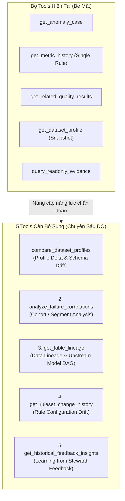
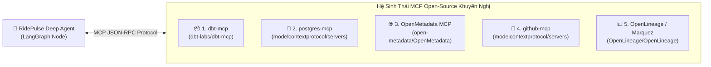

# BÁO CÁO KIỂM TOÁN VÀ ĐÁNH GIÁ KIẾN TRÚC DEEP AGENT (ANOMALY INVESTIGATION)

> **Dự án:** RidePulse DQ — Autonomous Data Quality & Anomaly Intelligence Platform  
> **Chuyên gia thực hiện:** Senior AI System Architect / Principal AI Engineer  
> **Tệp tài liệu:** `docs/analyze_deepagent.md`  
> **Phạm vi kiểm toán:** Deep Agent Node ([src/agents/nodes/anomaly_investigation_node.py](file:///c:/Users/PC%20ACER/OneDrive/Desktop/AI%20ML%20Engineer/P-028/src/agents/nodes/anomaly_investigation_node.py)), Tools ([src/agents/tools/anomaly_investigation_tools.py](file:///c:/Users/PC%20ACER/OneDrive/Desktop/AI%20ML%20Engineer/P-028/src/agents/tools/anomaly_investigation_tools.py)), Schemas ([src/models/rule_schemas.py](file:///c:/Users/PC%20ACER/OneDrive/Desktop/AI%20ML%20Engineer/P-028/src/models/rule_schemas.py)), Anomaly Service ([src/services/anomaly_service.py](file:///c:/Users/PC%20ACER/OneDrive/Desktop/AI%20ML%20Engineer/P-028/src/services/anomaly_service.py)), Database & Feedback Models ([src/models/database.py](file:///c:/Users/PC%20ACER/OneDrive/Desktop/AI%20ML%20Engineer/P-028/src/models/database.py)).

---

## I. XÁC NHẬN TRẠNG THÁI LUỒNG DEEP AGENT HIỆN TẠI

Hệ thống hiện tại đang hoạt động **100% ở luồng Deep Agent (`deepagent`)** dựa trên các bằng chứng trực tiếp từ codebase:

1. **Nhánh Git hiện tại:** `feature/anomaly-investigation-deepagent`.
2. **Cấu hình hệ thống ([src/config.py](file:///c:/Users/PC%20ACER/OneDrive/Desktop/AI%20ML%20Engineer/P-028/src/config.py#L50)):**
   ```python
   anomaly_investigation_mode: Literal["deepagent", "legacy"] = os.getenv("ANOMALY_INVESTIGATION_MODE") or "deepagent"
   ```
   Biến môi trường mặc định là `"deepagent"` khi không bị ghi đè trong `.env`.
3. **Định tuyến LangGraph ([src/agents/graph.py](file:///c:/Users/PC%20ACER/OneDrive/Desktop/AI%20ML%20Engineer/P-028/src/agents/graph.py#L221-L259)):**
   ```python
   def build_anomaly_graph(investigation_mode: Literal["deepagent", "legacy"] | None = None) -> StateGraph:
       mode = investigation_mode or get_settings().anomaly_investigation_mode
       if mode == "legacy":
           from src.agents.nodes.steward_insights_node import steward_insights_node
           hypothesis_agent = steward_insights_node
       else:
           # 👉 LUỒNG ĐANG HOẠT ĐỘNG:
           from src.agents.nodes.anomaly_investigation_node import anomaly_investigation_node
           hypothesis_agent = anomaly_investigation_node
   ```
4. **Cơ chế hoạt động:** Node `anomaly_investigation_node` sử dụng thư viện `deepagents` để tạo một ReAct loop (Reasoning + Acting), được trang bị 5 Bounded Read-Only Tools và tuân thủ bộ kỹ năng tại [src/agents/skills/SKILLS.md](file:///c:/Users/PC%20ACER/OneDrive/Desktop/AI%20ML%20Engineer/P-028/src/agents/skills/SKILLS.md).

---

## II. ĐÁNH GIÁ BỘ TOOLS HIỆN TẠI & ĐỀ XUẤT 5 TOOLS MỚI CHUYÊN SÂU DATA QUALITY

### 1. Hiện trạng bộ Tools hiện có ([src/agents/tools/anomaly_investigation_tools.py](file:///c:/Users/PC%20ACER/OneDrive/Desktop/AI%20ML%20Engineer/P-028/src/agents/tools/anomaly_investigation_tools.py))

| Tool Name | Input Parameters | Phạm vi & Hạn chế |
|:---|:---|:---|
| `get_anomaly_case` | `anomaly_run_id: str` | Lấy thông tin đợt anomaly, danh sách signals và các luật bị fail. Chứa fallback tự sinh dữ liệu giả định nếu không tìm thấy bản ghi. |
| `get_metric_history` | `dataset_id: str, rule_id: str, lookback_runs: int` | Lấy lịch sử tỷ lệ vi phạm của **1 rule duy nhất**. Bị tắc nghẽn N+1 tool calls khi có nhiều luật cùng fail. |
| `get_related_quality_results` | `execution_run_id: str, target_id: str` | Lọc các luật fail cùng đợt chạy bằng substring text matching. |
| `get_dataset_profile` | `dataset_id: str` | Đọc profile snapshot tại thời điểm hiện tại. Không so sánh được độ lệch (Delta) với quá khứ. |
| `query_readonly_evidence` | `execution_run_id: str, operation: str, limit: int` | Truy vấn có giới hạn danh sách kết quả kiểm thử. |

---

### 2. Phân tích: Vì sao bắt buộc phải bổ sung Tools mới?

5 công cụ hiện tại chỉ cung cấp **thông tin bề mặt (Surface-level Metadata)**. Khi xảy ra sự cố chất lượng dữ liệu phức tạp, Agent không thể trả lời được các câu hỏi bản chất:
- *Dữ liệu hôm nay bị trôi (Drift) so với hôm qua ở những chỉ số nào?*
- *Các dòng bị vi phạm cước phí âm tập trung vào Vendor hay Nhóm thanh toán nào?*
- *Lỗi này bắt nguồn từ model dbt nào ở thượng nguồn (Data Lineage)?*
- *Ai đã chỉnh sửa tham số kiểm tra của luật này gần đây?*
- *Data Steward đã từng kết luận gì về các cảnh báo tương tự trong quá khứ?*



---

### 3. Chi tiết 5 Tools chuyên sâu Data Quality cần bổ sung

#### 🛠️ Tool 1: `compare_dataset_profiles` (Profile & Schema Drift Comparator)
* **Mục đích:** Tính toán độ lệch (Delta) giữa Profile hiện tại ($Run_N$) và Profile chuẩn lịch sử ($Run_{N-1}$ hoặc Baseline).
* **Thông tin trả về:**
  * Biến thiên số lượng bản ghi: $\Delta \text{row\_count} = \text{count}_N - \text{count}_{N-1}$.
  * Phát hiện Schema Drift: Cột mới thêm, cột bị xóa, cột thay đổi data type.
  * Phân tích biến động phân phối: $\Delta \text{null\_rate}$, $\Delta \text{mean}$, $\Delta p50$, $\Delta p95$.
* **Ý nghĩa:** Cung cấp bằng chứng định lượng không thể chối cãi để phân loại giả thuyết `UPSTREAM_DATA_DRIFT` hoặc `SCHEMA_CHANGE`.

#### 🛠️ Tool 2: `analyze_failure_correlations` (Phân tích tương quan theo Segment / Cohort)
* **Mục đích:** Thực hiện aggregation an toàn (không vi phạm PII) trên tập bản ghi vi phạm để phát hiện mẫu hình lỗi (Error Pattern).
* **Cơ chế hoạt động:**
  ```sql
  SELECT vendor_id, payment_type, rate_code_id, COUNT(*) AS failure_count
  FROM source_rows
  WHERE <failing_predicate>
  GROUP BY vendor_id, payment_type, rate_code_id
  ORDER BY failure_count DESC LIMIT 5;
  ```
* **Ý nghĩa:** Giúp Agent đưa ra chẩn đoán chính xác: *"100% lỗi cước phí âm tập trung vào `payment_type = 'Dispute'` của `vendor_id = 2`, các vendor khác bình thường."*

#### 🛠️ Tool 3: `get_table_lineage` (Data Lineage & dbt Model DAG)
* **Mục đích:** Truy vết dòng chảy dữ liệu từ nguồn thô (`trips_raw`) qua các model dbt biến đổi (`stg_trips`, `profile_input`).
* **Ý nghĩa:** Phân biệt rõ ràng lỗi do **Code logic biến đổi (System Bug)** hay do **Dữ liệu đầu vào bên thứ 3 (Upstream Ingestion Drift)**.

#### 🛠️ Tool 4: `get_ruleset_change_history` (Rule Configuration Drift)
* **Mục đích:** Truy vấn bảng `ruleset_versions` và `rule_configurations` để kiểm tra lịch sử thay đổi tham số luật.
* **Ý nghĩa:** Xác định xem một luật đột ngột bị fail hàng loạt có phải do Data Steward vừa hạ thấp ngưỡng kiểm tra một cách quá chặt (`RULE_MISCONFIGURATION`) hay không.

#### 🛠️ Tool 5: `get_historical_feedback_insights` (Khai thác Feedback quá khứ)
* **Mục đích:** Đọc dữ liệu từ bảng `anomaly_feedback` nơi Data Steward đã gán nhãn `TRUE_ANOMALY`, `FALSE_POSITIVE`, `RULE_MISCONFIGURATION`.
* **Ý nghĩa:** Giúp Agent học hỏi từ kinh nghiệm thẩm định của chuyên gia, tránh lặp lại các cảnh báo giả (False Positives) đã từng bị bác bỏ.

---

## III. HỆ SINH THÁI MCP OPEN-SOURCE CẦN THIẾT & NGUỒN CỤ THỂ

**Model Context Protocol (MCP)** là chuẩn giao tiếp mở chuẩn hóa giữa AI Agent và hệ sinh thái công nghệ dữ liệu. Dưới đây là 5 bộ MCP server mã nguồn mở phù hợp nhất cho dự án:



### 1. `dbt-mcp` (Official dbt Labs MCP Server)
* **Nguồn GitHub:** [https://github.com/dbt-labs/dbt-mcp](https://github.com/dbt-labs/dbt-mcp) *(Bản mở rộng cộng đồng: [https://github.com/us-all/dbt-mcp-server](https://github.com/us-all/dbt-mcp-server))*
* **Vai trò trong hệ thống:** Tương tác trực tiếp với `dbt_project/`. Agent có thể đọc file `manifest.json`, kiểm tra tài liệu model, phân tích lineage graph và kiểm tra lịch sử chạy test dbt.

### 2. `postgres-mcp` (Official PostgreSQL MCP Server)
* **Nguồn GitHub:** [https://github.com/modelcontextprotocol/servers/tree/main/src/postgres](https://github.com/modelcontextprotocol/servers/tree/main/src/postgres)
* **Vai trò trong hệ thống:** Cho phép Deep Agent thực hiện schema reflection, kiểm tra catalog hệ thống, phân tích `EXPLAIN` query plan, và kiểm tra tình trạng lock/connection trên PostgreSQL.

### 3. `OpenMetadata MCP` (Enterprise Data Governance & Lineage)
* **Nguồn GitHub:** [https://github.com/open-metadata/OpenMetadata](https://github.com/open-metadata/OpenMetadata)
* **Vai trò trong hệ thống:** Cung cấp column-level lineage toàn diện, theo dõi nguồn gốc dữ liệu từ tầng Ingestion đến Analytics Views, và cảnh báo khi có schema drift.

### 4. `github-mcp` (Official GitHub MCP Server)
* **Nguồn GitHub:** [https://github.com/modelcontextprotocol/servers/tree/main/src/github](https://github.com/modelcontextprotocol/servers/tree/main/src/github)
* **Vai trò trong hệ thống:** Cho phép Agent tra cứu các Pull Request / Git Commit mới được merge trong vòng 24h để đối soát: *Có commit nào vừa sửa đổi file SQL/dbt làm phát sinh lỗi dữ liệu không?*

### 5. `OpenLineage / Marquez MCP`
* **Nguồn GitHub:** [https://github.com/OpenLineage/OpenLineage](https://github.com/OpenLineage/OpenLineage) / [https://github.com/MarquezProject/marquez](https://github.com/MarquezProject/marquez)
* **Vai trò trong hệ thống:** Thu thập metadata vận hành thời gian thực từ các pipeline orchestration (Airflow, Dagster, dbt Core).

---

## IV. ĐÁNH GIÁ NGHIÊM KHẮC: ĐIỂM MẠNH & ĐIỂM YẾU CỦA AGENT HIỆN TẠI

### 1. Điểm Mạnh (Strengths) 🟢

1. **Nguyên tắc "Statistical Authority" vững chắc:**
   * Trong system prompt ([ANOMALY_INVESTIGATION_SYSTEM_PROMPT](file:///c:/Users/PC%20ACER/OneDrive/Desktop/AI%20ML%20Engineer/P-028/src/agents/nodes/templates.py#L4-L10)), Agent bị ràng buộc tuyệt đối không được ghi đè quyết định của bộ phát hiện thống kê toán học (`anomaly_service.py`). Điều này ngăn chặn triệt để hiện tượng AI tự ý "hạ cấp" cảnh báo nguy hiểm.
2. **Kiến trúc Bounded Read-Only Tools an toàn:**
   * 100% các công cụ được giới hạn ở quyền đọc, không có nguy cơ làm thay đổi trạng thái database hay chạy lệnh hệ thống nguy hiểm.
3. **Structured Response tuân thủ Schema Pydantic:**
   * Đầu ra của Agent được validate nghiêm ngặt qua [AnomalyInvestigationResponse](file:///c:/Users/PC%20ACER/OneDrive/Desktop/AI%20ML%20Engineer/P-028/src/models/rule_schemas.py#L92-L100), phân loại chính xác theo 7 loại giả thuyết chuẩn và bắt buộc có danh sách `recommended_checks`.
4. **Bảo mật dữ liệu nhạy cảm (PII Guardrail):**
   * Chỉ xử lý metadata thống kê và danh sách sample IDs vi phạm (tối đa 20 IDs), không nạp raw data rows vào ngữ cảnh LLM.

---

### 2. Điểm Yếu & Lỗ Hổng Kiến Trúc (Weaknesses & Vulnerabilities) 🔴

#### ❌ Điểm yếu 1: Fallback Mock Data nguy hiểm trong Tool `get_anomaly_case`
* **Vị trí trong code:** [src/agents/tools/anomaly_investigation_tools.py:48-76](file:///c:/Users/PC%20ACER/OneDrive/Desktop/AI%20ML%20Engineer/P-028/src/agents/tools/anomaly_investigation_tools.py#L48-L76)
* **Phân tích:** Khi không tìm thấy bản ghi `AnomalyRunModel`, hàm tự động tạo ra một object giả định (`decision: "CRITICAL" if failed else "NORMAL"`). Đây là hành vi chống lại nguyên tắc bảo đảm toàn vẹn dữ liệu (Silent Failure), khiến Agent điều tra trên một trường hợp giả lập thay vì báo lỗi hệ thống.

#### ❌ Điểm yếu 2: Lấy mẫu lịch sử đơn lẻ gây tắc nghẽn N+1 Tool Calls
* **Vị trí trong code:** [src/agents/tools/anomaly_investigation_tools.py:113-140](file:///c:/Users/PC%20ACER/OneDrive/Desktop/AI%20ML%20Engineer/P-028/src/agents/tools/anomaly_investigation_tools.py#L113-L140)
* **Phân tích:** `get_metric_history` chỉ nhận 1 `rule_id`. Nếu đợt chạy có 10 luật fail, Agent phải lặp lại 10 bước ReAct gọi tool 10 lần liên tiếp, làm tăng thời gian phản hồi (latency) từ vài giây lên 20–30 giây và làm tốn token context window.

#### ❌ Điểm yếu 3: Hoàn toàn không có năng lực phát hiện "Profile Delta"
* `get_dataset_profile` chỉ trả về ảnh chụp tĩnh tại thời điểm hiện tại. Agent không thể tính toán được độ trôi dạt dữ liệu (Gradual Drift) theo thời gian.

#### ❌ Điểm yếu 4: Bỏ phí toàn bộ dữ liệu phản hồi của Data Steward
* Bảng `anomaly_feedback` đã được tạo trong CSDL nhưng Agent không có công cụ đọc lại các phản hồi này để cải thiện độ chính xác cho các lần chẩn đoán tiếp theo.

---

## V. BẢNG SO SÁNH NĂNG LỰC HIỆN TẠI VS MỤC TIÊU SẢN XUẤT

| Tiêu Chí Kỹ Thuật | Trạng Thái Hiện Tại | Trạng Thái Production-Grade Mục Tiêu |
|:---|:---|:---|
| **Khả năng chẩn đoán Root Cause** | Mức độ 1: Suy luận dựa trên metadata luật đơn lẻ. | Mức độ 3: Tương quan đa biến (Correlation), Cohort breakdown và Profile Delta. |
| **Phân biệt System Bug vs Data Drift** | Suy đoán dựa trên văn bản prompt. | Tra cứu Data Lineage (dbt DAG) và Git Commit Log. |
| **Hiệu năng Tool Calling** | Tuần tự N+1 calls cho từng rule metric history. | Batch Retrieval Tool (1 call lấy toàn bộ lịch sử của n signals). |
| **Tính trung thực của Tool (Integrity)** | Có chứa code fallback tự sinh mock decision. | Strict Error Handling (Không bịa đặt số liệu khi thiếu context). |
| **Học hỏi từ phản hồi (Feedback Loop)** | Không tận dụng Feedback của Steward. | RAG / In-context Few-shot trên lịch sử `AnomalyFeedbackModel`. |

---

## VI. LỘ TRÌNH CẢI THIỆN TOÀN DIỆN (ACTIONABLE ROADMAP)

```text
GIAI ĐOẠN 1: Dọn Dẹp Kỹ Thuật & Củng Cố Tools Cốt Lõi (Refactor Core Tools)
  ├── 1. Xóa bỏ hoàn toàn code fallback tự sinh mock decision trong get_anomaly_case.
  ├── 2. Bổ sung tool `compare_dataset_profiles` (So sánh profile delta giữa 2 đợt chạy).
  └── 3. Viết lại `get_metric_history` hỗ trợ nhận `list[rule_id]` (Batch Metric Retrieval).

GIAI ĐOẠN 2: Nâng Cấp Năng Lực Điều Tra Sâu (Advanced RCA Tools)
  ├── 4. Xây dựng tool `analyze_failure_correlations` (Phân tích lỗi theo nhóm/cohort).
  ├── 5. Xây dựng tool `get_historical_feedback_insights` (Khai thác bảng anomaly_feedback).
  └── 6. Cập nhật SKILLS.md hướng dẫn Agent ưu tiên phân tích Profile Delta trước khi đưa giả thuyết.

GIAI ĐOẠN 3: Tích Hợp Hệ Sinh Thái MCP (Enterprise Integration)
  ├── 7. Tích hợp `dbt-mcp` để Agent tự động đọc Lineage DAG từ dbt Core project.
  └── 8. Tích hợp `github-mcp` để liên kết thời điểm lỗi với Git commits.
```

---

## VII. THIẾT KẾ KỸ THUẬT MẪU CHO CÁC TOOLS MỚI (SPECIFICATIONS)

### 1. Specification cho `compare_dataset_profiles`
```python
@tool
def compare_dataset_profiles(dataset_id: str, baseline_run_id: str | None = None) -> dict[str, Any]:
    """So sánh Profile hiện tại với Profile của đợt chạy trước hoặc baseline được chỉ định.
    
    Trả về:
      - delta_row_count: Biến thiên số lượng bản ghi.
      - schema_drift: Danh sách cột mới, cột bị xóa, cột đổi kiểu dữ liệu.
      - metric_shifts: Danh sách các cột có null_rate, mean, min, max thay đổi vượt ngưỡng.
    """
    # Logic: Truy vấn 2 bản ghi ProfileModel gần nhất và tính toán sai số delta.
```

### 2. Specification cho `analyze_failure_correlations`
```python
@tool
def analyze_failure_correlations(
    execution_run_id: str,
    rule_id: str,
    group_by_columns: list[str],
) -> dict[str, Any]:
    """Phân tích các nhóm/cohort chiếm tỷ trọng cao nhất trong tập bản ghi bị vi phạm luật.
    
    Chỉ thực hiện aggregation đếm số lượng (COUNT), tuyệt đối không trả về raw rows hoặc PII.
    """
    # Logic: Thực thi GROUP BY trên các cột phân loại (vendor_id, payment_type) đối với tập vi phạm.
```

### 3. Specification cho `batch_get_metric_history`
```python
@tool
def batch_get_metric_history(
    dataset_id: str,
    rule_ids: list[str],
    lookback_runs: int = 30,
) -> dict[str, Any]:
    """Lấy chuỗi lịch sử tỷ lệ vi phạm của nhiều rules đồng thời trong 1 truy vấn duy nhất.
    
    Giúp Deep Agent nắm bắt toàn bộ xu hướng trôi dạt mà không cần gọi tool nhiều lần.
    """
    # Logic: Sử dụng WHERE DqResultModel.rule_id.in_(rule_ids) và gom nhóm theo rule_id.
```

---
*Tài liệu kiểm toán được biên soạn và lưu trữ chính thức tại `docs/analyze_deepagent.md`.*
