# BÁO CÁO PHÂN TÍCH TOÀN DIỆN HỆ THỐNG AGENT WORKFLOW END-TO-END (ANALYZE_E2E.MD)
## RidePulse DQ / DataPulse Platform — Autonomous Data Quality & Anomaly Intelligence

---

> **Tài liệu kiểm toán:** Senior AI Engineer End-to-End Architecture Audit  
> **Dự án:** Data Quality & Anomaly Intelligence Platform  
> **Phiên bản:** v2.0 (Production-Grade State & Provenance-Bound Architecture)  
> **Phạm vi phân tích:** Toàn bộ chu trình từ Ingestion ➔ Graph 1 (1A & 1B) ➔ HITL Gates ➔ Graph 2 (Execution) ➔ Graph 3 (Anomaly DeepAgent)  

---

## 📑 MỤC LỤC

1. [TỔNG QUAN KIẾN TRÚC HỆ THỐNG](#1-tổng-quan-kiến-trúc-hệ-thống)
2. [PHÂN TÍCH CHUYÊN SÂU GRAPH 1: PROPOSAL ENGINE (1A & 1B)](#2-phân-tích-chuyên-sâu-graph-1-proposal-engine-1a--1b)
3. [PHÂN TÍCH GRAPH 2: DETERMINISTIC EXECUTION (dbt)](#3-phân-tích-graph-2-deterministic-execution-dbt)
4. [PHÂN TÍCH GRAPH 3: ANOMALY & ROOT CAUSE DEEPAGENT](#4-phân-tích-graph-3-anomaly--root-cause-deepagent)
5. [SƠ ĐỒ LUỒNG TOÀN DIỆN END-TO-END (MERMAID WORKFLOW)](#5-sơ-đồ-luồng-toàn-diện-end-to-end-mermaid-workflow)
6. [BẢN ĐỒ CHI TIẾT CÁC NODE, ARTIFACTS & DATABASE SCHEMA](#6-bản-đồ-chi-tiết-các-node-artifacts--database-schema)
7. [TÍNH TOÀN VẸN, AN TOÀN DỮ LIỆU & AUDIT PROVENANCE](#7-tính-toàn-vẹn-an-toàn-dữ-liệu--audit-provenance)
8. [KẾT LUẬN & KHUYẾN NGHỊ VẬN HÀNH](#8-kết-luận--khuyến-nghị-vận-hành)

---

## 1. TỔNG QUAN KIẾN TRÚC HỆ THỐNG

Hệ thống được xây dựng theo mô hình **Agentic Data Quality Platform** với nguyên tắc cốt lõi: **AI đề xuất thông minh, Con người kiểm soát (Human-in-the-Loop), và Công cụ tất định thực thi (Deterministic Execution)**.

Hệ thống phân tách trách nhiệm rõ ràng thành 3 Run độc lập:
* **Run 1 (Graph 1): AI Proposal Engine** — Tiếp nhận hồ sơ dữ liệu (profile evidence), suy luận bản chất ngữ nghĩa, đề xuất các quy tắc chất lượng dữ liệu (DQ Rules) có cấu trúc.
* **Run 2 (Graph 2): Deterministic Execution Engine** — Biên dịch các quy tắc đã được phê duyệt thành mã kiểm thử `dbt test`, thẩm định cú pháp và thực thi trực tiếp trên cơ sở dữ liệu (PostgreSQL / SQLite).
* **Run 3 (Graph 3): Anomaly & Root Cause Analysis DeepAgent** — Phát hiện các bất thường về mặt thống kê và phân phối dữ liệu, kích hoạt DeepAgent sử dụng Tools & Skills để điều tra nguyên nhân gốc rễ và xuất báo cáo markdown toàn diện.

---

## 2. PHÂN TÍCH CHUYÊN SÂU GRAPH 1: PROPOSAL ENGINE (1A & 1B)

### 2.1. Hiện trạng phân rã thành 2 Subgraph
Trong mã nguồn thực tế tại [`src/agents/graph.py`](../src/agents/graph.py) và tầng điều phối [`src/services/rule_proposer_workflow.py`](../src/services/rule_proposer_workflow.py), Graph 1 được chia thành 2 đồ thị con độc lập:

1. **Graph 1A: Dataset Understanding Graph (`build_understanding_graph`)**
   * **Node 1 (`profiler_digest`):** Chuyển đổi dữ liệu thống kê thô sang JSON digest tinh gọn.
   * **Node 2 (`data_dictionary_generator`):** Chuẩn hóa schema các trường dữ liệu theo Data Dictionary.
   * **Node 3 (`dataset_understanding`):** Sử dụng LLM để trích xuất `TableSemanticContract` (vai trò nghiệp vụ, phân loại ngữ nghĩa `measure`, `category`, `event_time`, `identifier`).
   * **Đầu ra:** Xuất Artifact `SEMANTIC_CONTRACT` (trạng thái `DRAFT`) vào Database.
   * **Điểm dừng (HITL Gate 1):** Tạm dừng để Data Steward xem xét, chỉnh sửa và gọi API `POST /artifacts/{id}/review` với action `approve` (chuyển sang `CONFIRMED`).

2. **Graph 1B: Rule Proposal Graph (`build_rule_proposal_graph`)**
   * **Điều kiện tiên quyết:** Chỉ được kích hoạt khi `SEMANTIC_CONTRACT` đã ở trạng thái `CONFIRMED`.
   * **Node 1 (`rule_candidate_builder`):** Sinh ra các ứng viên kiểm tra kỹ thuật thô (`NOT_NULL`, `RANGE`, `UNIQUE`, `ACCEPTED_VALUES`).
   * **Node 2 (`prompt_customizer`):** LLM viết lại System Prompt riêng biệt theo domain nghiệp vụ cụ thể của từng bảng.
   * **Node 3 (`rule_proposer`):** LLM sinh danh sách luật Pydantic đóng (Structured Output) với lý do nghiệp vụ và độ tin cậy.
   * **Đầu ra:** Xuất Artifact `RULE_SET` (chứa danh sách `RuleProposalModel` trong DB).
   * **Điểm dừng (HITL Gate 2):** Data Steward duyệt từng luật trên giao diện (Approve/Edit/Reject) trước khi Publish thành `RulesetVersionModel`.

### 2.2. Đánh giá Kiến trúc: Tại sao phân rã là quyết định chính xác?
* **Khử phụ thuộc Checkpoint (No Memory Leaks):** Không sử dụng `langgraph-checkpoint-sqlite` để duy trì state trong RAM. PostgreSQL/SQLite trở thành Source of Truth bất biến duy nhất.
* **Tiết kiệm Chi phí Token (Zero Token Waste):** Khi LLM sinh luật ở Graph 1B bị timeout hoặc cần retry, hệ thống không phải chạy lại Graph 1A.
* **Audit Provenance:** Mỗi bước đều tạo Artifact có hash `SHA-256`, cho phép truy vết nguồn gốc từ Profile ➔ Semantic Contract ➔ Rule Proposal ➔ Published Ruleset.

---

## 3. PHÂN TÍCH GRAPH 2: DETERMINISTIC EXECUTION (dbt)

Graph 2 (`build_execution_graph`) là đường ống thực thi hoàn toàn tất định (**Deterministic Pipeline**), đảm bảo tính an toàn tuyệt đối:

```
[test_generator] ──> [validate_dbt_project] ──┬──> [test_runner] ──> [persist_report] ──> END
                                              │
                                              └──> [dbt_validation_failed] ──> END
```

1. **`test_generator_node`:** Biên dịch các luật đã được Steward phê duyệt (`RuleVersionModel`) thành file cấu hình `schema.yml` và macro SQL tương ứng của dbt.
2. **`validate_dbt_project_node`:** Quét bảo mật cú pháp dbt, phát hiện SQL Injection và kiểm tra tính hợp lệ của file manifest.
3. **`test_runner_node`:** Gọi runner thực thi bộ kiểm thử `dbt test` có kiểm soát thời gian (timeout) và cách ly môi trường qua connection pool riêng biệt.
4. **`persist_report_node`:** Thu thập kết quả thực thi (Pass/Fail/Warn/Error), trích xuất sample dòng lỗi và lưu vào bảng `dq_results` và `dq_runs`.

---

## 4. PHÂN TÍCH GRAPH 3: ANOMALY & ROOT CAUSE DEEPAGENT

Graph 3 (`build_anomaly_graph`) được thiết kế cho việc phân tích bất thường nâng cao:

1. **`anomaly_detector_node`:** Chạy các thuật toán phát hiện bất thường dựa trên quy luật thống kê (Z-Score, IQR, Volume Drift, Out-of-Domain rate).
2. **`hypothesis_agent` (`anomaly_investigation_node`):** DeepAgent chuyên biệt hoạt động theo mẫu ReAct (Reasoning + Acting), được trang bị các Tools (SQL query, lineage inspection) và Skills để suy luận nguyên nhân gốc rễ (Root Cause Analysis).
3. **`persist_analysis_node`:** Lưu trữ tín hiệu bất thường (`anomaly_signals`) và giả thuyết điều tra (`anomaly_hypotheses`).
4. **`report_writer_node`:** LLM tổng hợp dữ liệu và sinh báo cáo Markdown toàn diện phục vụ cấp quản lý và Data Steward.

---

## 5. SƠ ĐỒ LUỒNG TOÀN DIỆN END-TO-END (MERMAID WORKFLOW)

```mermaid
flowchart TD
    %% Styling
    classDef storage fill:#f8fafc,stroke:#64748b,stroke-width:1px,stroke-dasharray: 5 5;
    classDef agent fill:#eff6ff,stroke:#2563eb,stroke-width:2px;
    classDef hitl fill:#fef3c7,stroke:#d97706,stroke-width:2px;
    classDef deterministic fill:#f0fdf4,stroke:#16a34a,stroke-width:2px;
    classDef terminal fill:#f1f5f9,stroke:#475569,stroke-width:2px;

    subgraph STAGE_0["BƯỚC 0: TIẾP NHẬN DỮ LIỆU & PROFILING"]
        RawFile[("File Dữ liệu Thô<br><i>CSV / Parquet</i>")] --> Ingestion["dataset_loader & raw_profiler<br><i>(DuckDB Thống kê phân vị, Null, Distinct)</i>"]
        Ingestion --> DB_Profile[("Bảng DB: profiles & column_profiles")]
    end

    DB_Profile --> G1A_Start

    subgraph STAGE_1A["BƯỚC 1A: GRAPH 1A (HIỂU NGỮ NGHĨA DỮ LIỆU)"]
        G1A_Start(["Khởi động Graph 1A"]) --> N_Digest["profiler_digest_node<br><i>(Nén profile thành JSON digest)</i>"]
        N_Digest --> N_Dict["data_dictionary_generator_node<br><i>(Sinh Data Dictionary)</i>"]
        N_Dict --> N_Understand["dataset_understanding_node<br><b>[LLM Agent]</b><br><i>(Trích xuất kiểu ngữ nghĩa & vai trò cột)</i>"]
        N_Understand --> Art_DraftContract[("Artifact: SEMANTIC_CONTRACT<br><i>status: DRAFT</i>")]
        Art_DraftContract --> G1A_End(["Kết thúc Graph 1A"])
    end

    G1A_End --> HITL_Gate1

    subgraph STAGE_HITL1["CHỐT CHẶN HITL 1: DUYỆT HỢP ĐỒNG NGỮ NGHĨA"]
        HITL_Gate1{"Data Steward UI<br><i>(Xem & Hiệu chỉnh kiểu ngữ nghĩa)</i>"}
        HITL_Gate1 -->|Phê duyệt| ConfirmContract["POST /artifacts/{id}/review<br><i>status: CONFIRMED</i>"]
    end

    ConfirmContract --> G1B_Start

    subgraph STAGE_1B["BƯỚC 1B: GRAPH 1B (SINH ĐỀ XUẤT QUY TẮC)"]
        G1B_Start(["Khởi động Graph 1B"]) --> N_Cand["rule_candidate_builder_node<br><i>(Sinh candidate NOT_NULL, RANGE...)</i>"]
        N_Cand --> N_Prompt["prompt_customizer_node<br><b>[LLM Agent]</b><br><i>(Viết lại System Prompt theo bảng)</i>"]
        N_Prompt --> N_Proposer["rule_proposer_node<br><b>[LLM Agent]</b><br><i>(Đề xuất Pydantic DQ Rules có lý do)</i>"]
        N_Proposer --> Art_RuleSet[("Artifact: RULE_SET<br><i>(Danh sách Proposed Rules trong DB)</i>")]
        Art_RuleSet --> G1B_End(["Kết thúc Graph 1B"])
    end

    G1B_End --> HITL_Gate2

    subgraph STAGE_HITL2["CHỐT CHẶN HITL 2: DUYỆT & XUẤT BẢN BỘ QUY TẮC"]
        HITL_Gate2{"Steward Rules Studio<br><i>(Approve / Edit / Reject từng luật)</i>"}
        HITL_Gate2 -->|Xuất bản bộ luật| PublishRuleset["POST /steps/PUBLISH_RULESET<br><i>(Tạo RulesetVersionModel bất biến)</i>"]
    end

    PublishRuleset --> G2_Start

    subgraph STAGE_2["BƯỚC 2: GRAPH 2 (THỰC THI KIỂM THỬ dbt)"]
        G2_Start(["Khởi động Graph 2"]) --> N_TestGen["test_generator_node<br><i>(Biên dịch Rules sang dbt schema.yml)</i>"]
        N_TestGen --> N_ValDbt["validate_dbt_project_node<br><i>(Quét bảo mật cú pháp dbt)</i>"]
        N_ValDbt -->|Hợp lệ| N_TestRun["test_runner_node<br><i>(Chạy dbt test trên PostgreSQL)</i>"]
        N_ValDbt -->|Lỗi cú pháp| G2_Fail["dbt_validation_failed"]
        N_TestRun --> N_PersistRep["persist_report_node<br><i>(Lưu kết quả kiểm tra vào dq_results)</i>"]
        N_PersistRep --> G2_End(["Kết thúc Graph 2"])
    end

    G2_End --> G3_Start

    subgraph STAGE_3["BƯỚC 3: GRAPH 3 (ĐIỀU TRA BẤT THƯỜNG DEEPAGENT)"]
        G3_Start(["Khởi động Graph 3"]) --> N_AnomDet["anomaly_detector_node<br><i>(Quét Z-Score, IQR, Volume Drift)</i>"]
        N_AnomDet --> N_Investigate["anomaly_investigation_node<br><b>[Deep Agent + Tools & Skills]</b><br><i>(Điều tra Root Cause & Giả thuyết)</i>"]
        N_Investigate --> N_PersistAnom["persist_analysis_node<br><i>(Lưu tín hiệu & giả thuyết vào DB)</i>"]
        N_PersistAnom --> N_ReportWriter["report_writer_node<br><b>[LLM Markdown Reporter]</b><br><i>(Xuất báo cáo điều tra chuyên sâu)</i>"]
        N_ReportWriter --> G3_End(["Hoàn tất chu trình"])
    end

    class N_Understand,N_Prompt,N_Proposer,N_Investigate,N_ReportWriter agent;
    class HITL_Gate1,HITL_Gate2 hitl;
    class Ingestion,N_Digest,N_Dict,N_Cand,N_TestGen,N_ValDbt,N_TestRun,N_PersistRep,N_AnomDet,N_PersistAnom deterministic;
    class RawFile,DB_Profile,Art_DraftContract,Art_RuleSet storage;
    class G1A_Start,G1A_End,G1B_Start,G1B_End,G2_Start,G2_End,G3_Start,G3_End,G2_Fail terminal;
```



---

## 6. BẢN ĐỒ CHI TIẾT CÁC NODE, ARTIFACTS & DATABASE SCHEMA

| Giai đoạn | Node / Module | Loại hình | Input chính | Output & Bảng DB lưu trữ |
| :--- | :--- | :--- | :--- | :--- |
| **0. Profiling** | `profiler_node.py` | Deterministic | Raw Data (DuckDB) | `profiles`, `column_profiles` |
| **1A. Understanding** | `dataset_understanding_node.py` | LLM Agent | `dataset_profile_digest` | Artifact `SEMANTIC_CONTRACT` (`DRAFT`) |
| **HITL 1** | `rule_proposer_workflow.py` | Human Action | Draft Contract | `WorkflowArtifactModel` (`CONFIRMED`) |
| **1B. Candidate** | `rule_candidate_builder_node.py` | Deterministic | Confirmed Contract | `rule_candidates` |
| **1B. Proposer** | `rule_proposer_node.py` | LLM Agent | Prompt + Candidates | `rule_proposals` (Artifact `RULE_SET`) |
| **HITL 2** | `rule_store.py` | Human Action | Proposed Rules | `ruleset_versions`, `rule_versions` |
| **2. Test Gen** | `test_generator_node.py` | Deterministic | `RulesetVersionModel` | `dbt_project/models/generated_dq_tests.yml` |
| **2. Runner** | `test_runner_node.py` | Deterministic | dbt project | `dq_runs`, `dq_results` |
| **3. Anomaly** | `anomaly_detector_node.py` | Math / Statistics | `dq_results` + Profiles | `anomaly_signals`, `anomaly_runs` |
| **3. Investigation** | `anomaly_investigation_node.py` | DeepAgent (ReAct) | Signals + DB Tools | `anomaly_hypotheses` |
| **3. Reporting** | `report_writer_node.py` | LLM Reporter | Hypotheses + Evidence | Báo cáo Markdown & Audit Events |

---

## 7. TÍNH TOÀN VẸN, AN TOÀN DỮ LIỆU & AUDIT PROVENANCE

1. **Ràng buộc Tính bất biến (Provenance-bound):**
   * Mọi Artifact được sinh ra đều có trường `input_fingerprint` (mã băm `SHA-256` của payload đầu vào), `version` tăng dần và cờ `stale` để theo dõi vòng đời.
2. **Không rò rỉ dữ liệu thô (Data Privacy):**
   * Tầng LLM chỉ tiếp nhận số liệu thống kê (phân vị, null rate, distinct count, sample tóm tắt), **tuyệt đối không truyền toàn bộ dữ liệu dòng thô (raw data rows)** lên mô hình AI.
3. **Cơ chế Fail-Closed:**
   * Nếu mã dbt sinh ra không vượt qua bước `validate_dbt_project_node`, hệ thống lập tức khóa cổng và báo lỗi `dbt_validation_failed`, không bao giờ thực thi code bẩn vào Database.
4. **Cô lập Môi trường Kiểm thử:**
   * Test fixture được cấu hình cô lập qua SQLite `StaticPool` in-memory và gán `supabase_database_url = None`, ngăn chặn triệt để nguy cơ unit test vô tình tác động vào dữ liệu đám mây thực tế.

---

## 8. KẾT LUẬN & KHUYẾN NGHỊ VẬN HÀNH

1. **Về kiến trúc đồ thị:**
   * Cấu trúc **Graph 1A và Graph 1B** hiện tại là kiến trúc chuẩn mực, giải quyết triệt để ranh giới tương tác con người (HITL) và tối ưu tài nguyên tính toán.
2. **Về khả năng mở rộng:**
   * Graph 2 (dbt runner) và Graph 3 (DeepAgent) đã được module hóa hoàn chỉnh, cho phép tích hợp thêm các công cụ kiểm định dữ liệu mới (Great Expectations, SodaCore) hoặc các detector bất thường mới mà không làm xáo trộn luồng nghiệp vụ.
3. **Hành động đề xuất (Action Items):**
   * Tiếp tục duy trì việc cập nhật tài liệu kỹ thuật đồng bộ với mã nguồn.
   * Giữ vững các chốt chặn kiểm thử tự động (214+ pytest cases và linter check) trước mỗi đợt phát hành lên nhánh chính (`main`).

---
*Báo cáo được khởi tạo và kiểm toán bởi Senior AI Engineer — RidePulse DQ Platform.*
