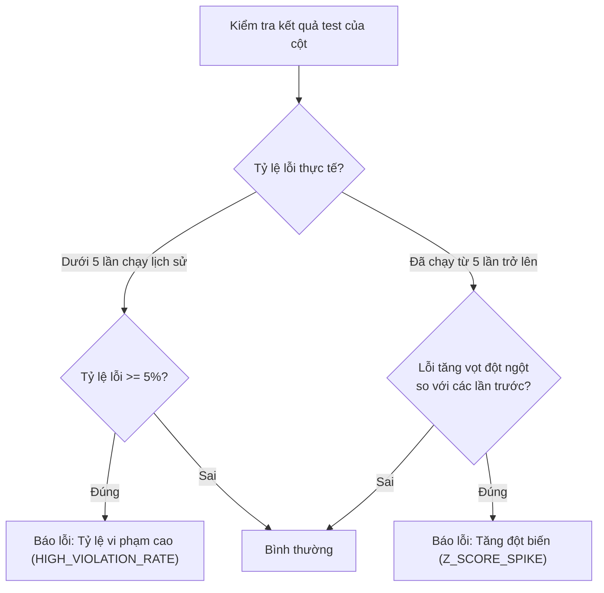

# Cơ Chế Phát Hiện Lỗi Bất Thường (Anomaly Detection) - Đơn Giản Dễ Hiểu

Tài liệu này giải thích cách hệ thống phát hiện các điểm lỗi bất thường (dị thường) từ kết quả kiểm thử dữ liệu thực tế.

---

## 1. Giải thích theo ngôn ngữ đời thường
Khi chạy kiểm thử, hệ thống sẽ tính toán **Tỷ lệ lỗi** (ví dụ: có bao nhiêu % dòng dữ liệu bị trống hoặc bị sai).
Để biết tỷ lệ lỗi đó có **bất thường** hay không, hệ thống chia làm 2 trường hợp:

### Trường hợp 1: Khi chưa có lịch sử chạy (Dưới 5 lần chạy trước đó) - Gọi là "Cold Start"
* **Cách hoạt động**: Vì chưa có dữ liệu quá khứ để so sánh, hệ thống dùng một con số cố định để làm mốc.
* **Nguyên tắc**: **Cứ tỷ lệ lỗi >= 5% là báo lỗi bất thường.**
* **Ví dụ thực tế**: 
  * Cột `passenger_count` (số hành khách) bị trống **15.34%** dữ liệu. 
  * Do $15.34\% \ge 5\%$, hệ thống báo ngay đây là lỗi bất thường dạng: **Tỷ lệ vi phạm ở mức cao (HIGH_VIOLATION_RATE)**.

---

### Trường hợp 2: Khi đã chạy nhiều lần (Từ 5 lần chạy trở lên) - Gọi là "Warm Start"
* **Cách hoạt động**: Hệ thống so sánh tỷ lệ lỗi của hôm nay với trung bình tỷ lệ lỗi của các ngày hôm trước để xem có bị **tăng vọt đột biến** hay không.
* **Nguyên tắc**: Hệ thống sử dụng chỉ số **Z-score** (đo lường mức độ lệch khỏi quỹ đạo bình thường):
  * Nếu tỷ lệ lỗi hôm nay đột ngột tăng vọt lên **cao hơn hẳn** (lệch quá 2.5 lần độ lệch tiêu chuẩn) so với trung bình quá khứ, và tỷ lệ lỗi này phải $> 1\%$.
  * Hệ thống sẽ cảnh báo lỗi bất thường dạng: **Tỷ lệ vi phạm tăng đột biến (Z_SCORE_SPIKE)**.
* **Ví dụ thực tế**:
  * Bình thường, cột cước phí (`fare_amount`) chỉ bị lỗi âm tiền khoảng **0.1%** số dòng.
  * Hôm nay, đột ngột tỷ lệ lỗi âm tiền nhảy vọt lên **5%**. 
  * Hệ thống đối chiếu thấy 5% là quá cao so với mức 0.1% ngày thường ➔ Cảnh báo tăng đột biến ngay lập tức để bạn kiểm tra lỗi hệ thống.

---

## 2. Sơ đồ quyết định

---

## 3. Các tệp tin liên quan trong code
* Logic xử lý chính: [`anomaly_detector_node.py`](file:///d:/ai_thuc_chien/P-028/src/agents/nodes/anomaly_detector_node.py#L41)
* Nơi lưu trữ và truy vấn lịch sử: [`rule_store.py`](file:///d:/ai_thuc_chien/P-028/src/services/rule_store.py)
