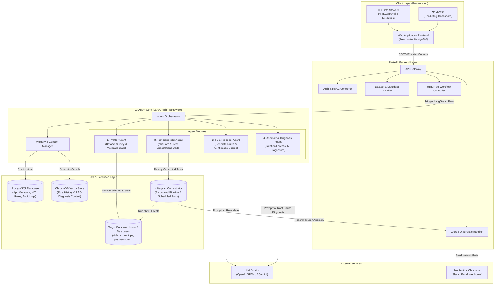
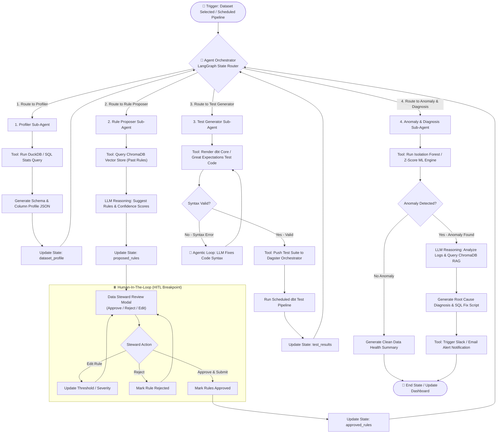
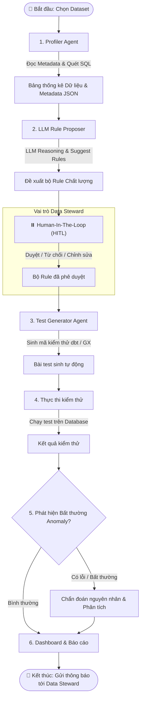

# Architecture Diagram - RidePulse DQ

## 1. System Overview Diagram (v1)

## 2. Agent Flow Diagram (v1) - LangGraph StateGraph

## 2.2. Simplified Agent Flow Diagram (v2) - Sequential Flow

## 3. Component Details

| Component | Technology | Purpose |
|-----------|-----------|---------|
| Frontend | React / Next.js + Ant Design 5.0 | User interface for Data Steward (HITL) and Viewer |
| Backend | FastAPI | REST API Server, RBAC, Gateway & Agent integration |
| Agent Engine | LangGraph | AI Agent Orchestration (Profiler, Proposer, Generator, Anomaly Detector) |
| Scheduler / Runner | Dagster | Automated pipeline execution, scheduled test execution |
| Application DB | PostgreSQL | Primary storage for metadata, rules status, test logs, user roles |
| Vector Store | ChromaDB | Embeddings, rule history & diagnosis RAG context |
| Target Data | Snowflake / BigQuery / Postgres | Operational databases (`dich_vu_xe_trips`, etc.) |
| LLM Service | OpenAI / Gemini | Reasoning engine for rule generation & root cause diagnosis |

