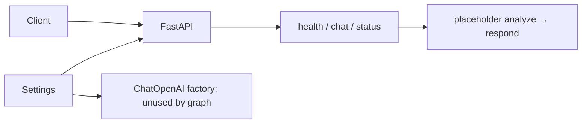
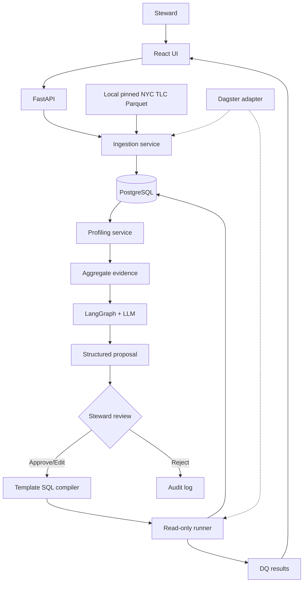

# RidePulse DQ — Architecture Diagrams

## Current scaffold

```mermaid
flowchart LR
    Client --> FastAPI
    FastAPI --> Routes["health / chat / status"]
    Routes --> LangGraph["placeholder analyze → respond"]
    Settings --> FastAPI
    Settings --> LLMFactory["ChatOpenAI factory; unused by graph"]
```

## Proposed MVP

```mermaid
flowchart TD
    Steward --> UI["React UI"]
    UI --> API["FastAPI"]
    Parquet["Local pinned NYC TLC Parquet"] --> Ingest["Ingestion service"]
    API --> Ingest
    Ingest --> DB[("PostgreSQL")]
    DB --> Profile["Profiling service"]
    Profile --> Evidence["Aggregate evidence"]
    Evidence --> Agent["LangGraph + LLM"]
    Agent --> Proposal["Structured proposal"]
    Proposal --> HITL{"Steward review"}
    HITL -->|Approve/Edit| Compiler["Template SQL compiler"]
    HITL -->|Reject| Audit["Audit log"]
    Compiler --> Runner["Read-only runner"]
    Runner --> DB
    Runner --> Results["DQ results"]
    Results --> UI
    Dagster["Dagster adapter"] -.-> Ingest
    Dagster -.-> Runner
```

Chi tiết boundary, trạng thái implementation và security xem [ARCHITECTURE.md](../ARCHITECTURE.md).
