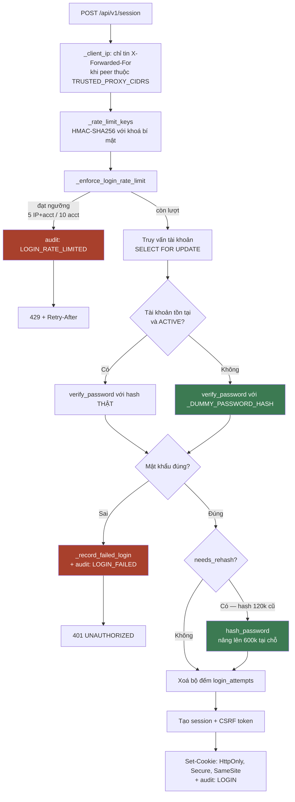
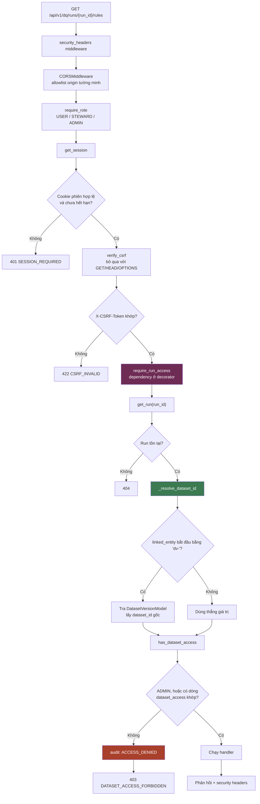
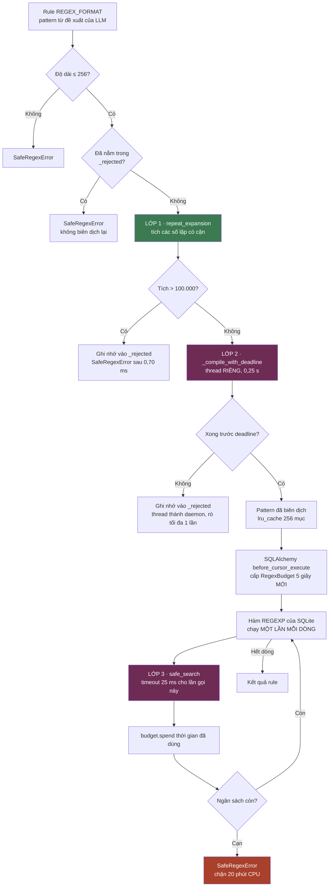
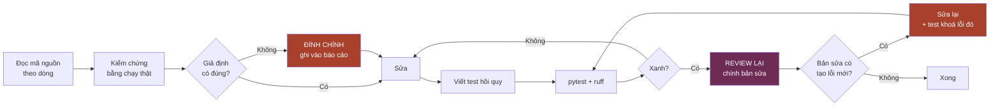

# Nhật ký sửa lỗi bảo mật — RidePulse DQ

> **Nhánh:** `chien-merge` · **Ngày:** 31·08·2026
> **Kết quả:** `ruff check src/ tests/` sạch · `pytest tests/` **426 passed, 0 failed, 10 skipped**
> **Trước khi sửa:** ứng dụng **không khởi động được** — pytest không collect nổi một test nào
> **Thao tác Git:** 0

---

## Mục lục

| # | Lỗi | File | Mức |
|---|---|---|---|
| [1](#1--require_run_access-không-tồn-tại) | `require_run_access` không tồn tại | `src/api/routes.py` | **P0** |
| [2](#2--helper-phân-quyền-không-giải-tham-chiếu-id-phiên-bản) | Không giải tham chiếu ID phiên bản | `src/api/routes.py` | P2 |
| [3](#3--rò-rỉ-danh-sách-tài-khoản-qua-thời-gian-phản-hồi) | Rò rỉ tài khoản qua thời gian | `src/services/session_service.py` | **P1** |
| [4](#4--không-có-một-security-header-nào) | Không có security header | `src/main.py` | P2 |
| [5](#5--sự-kiện-bảo-mật-không-để-lại-dấu-vết) | Sự kiện bảo mật không được ghi | `session_service.py`, `routes.py` | P2 |
| [6](#6--regex-chặn-theo-lần-gọi-nhưng-không-chặn-theo-truy-vấn) | Regex: ngân sách + bom biên dịch | `src/services/safe_regex.py` | P2 |
| [7](#7--khoá-hmac-dự-phòng-là-hằng-số-công-khai) | Khoá HMAC là hằng số công khai | `src/services/session_service.py` | P2 |
| [8](#8--pbkdf2-120000-vòng-dưới-khuyến-nghị-5-lần) | PBKDF2 dưới chuẩn 5 lần | `src/services/session_service.py` | P2 |
| [9](#9--nhóm-p3--bốn-sửa-đổi-nhỏ) | Nhóm P3 — bốn sửa đổi nhỏ | 5 file | P3 |
| [10](#10--lỗi-do-chính-bản-sửa-gây-ra) | **Lỗi do chính bản sửa gây ra** | `src/services/safe_regex.py` | **P1** |
| [11](#11--hai-đính-chính) | Hai đính chính | — | — |
| [12](#12--workflow-luồng-hoạt-động) | **Workflow · Mermaid** | — | — |

---

## 1 · `require_run_access` không tồn tại

**File:** `src/api/routes.py` · **Mức: P0 — chặn toàn bộ hệ thống**

### Lỗi hiện tại trong hệ thống

```
NameError: name 'require_run_access' is not defined.
           Did you mean: 'require_test_run_access'?
```

Xác định bằng phân tích AST, không phải grep:

```
src/api/routes.py                ['require_run_access']
src/api/data_access_routes.py    sạch
src/services/session_service.py  sạch
src/main.py                      sạch
```

| | |
|---|---|
| Số nơi gọi | **7** |
| Số định nghĩa | **0** |

Lỗi ở **cấp module** → `import src.main` chết → pytest không collect nổi một test nào.

**Bảy endpoint bị ảnh hưởng:** `publish_run_rules`, `list_proposal_rules`, `review_proposal_rule`, `bulk_review_proposal_rules`, `get_run_review_summary`, `get_run_approved_rules`, `publish_ruleset_endpoint`.

### Vì sao không được xoá 7 dòng gọi cho hết lỗi

`dq_router` được mount kèm `Depends(require_role([...]))` trong `src/main.py`. Nên xoá bảy dòng `Depends(require_run_access(...))` sẽ làm app chạy lại, và bảy endpoint **vẫn kiểm vai trò** — nhưng **mất hoàn toàn kiểm tra tenant**.

Hậu quả: bất kỳ tài khoản `STEWARD` nào cũng đọc, review và **publish được ruleset của tenant khác**, chỉ cần biết `run_id`. Lỗ hổng đó nghiêm trọng hơn hẳn cái `NameError` đang che nó lại.

### TRƯỚC — dòng code gây lỗi

Endpoint tham chiếu một hàm không tồn tại:

```python
@dq_router.post(
    "/runs/{run_id}/publish",
    response_model=PublishRulesResponse,
    dependencies=[
        Depends(require_role(["STEWARD", "ADMIN"])),
        Depends(require_run_access(manage=True)),   # ← NameError: hàm không tồn tại
    ],
)
async def publish_run_rules(...):
    ...
```

Trong file **không có** định nghĩa nào cho `require_run_access`. Các helper phân quyền có sẵn chỉ gồm:

```python
def has_dataset_access(db, session, dataset_id, manage=False) -> bool: ...
def require_dataset_access(db, session, dataset_id, manage=False) -> None: ...
def require_compat_dataset_access(db, session, dataset_id, *, manage=False) -> str: ...
def require_proposal_run_access(db, session, run_id, *, manage=False) -> dict: ...
def require_test_run_access(db, session, test_run_id, *, manage=False) -> dict: ...
def require_anomaly_run_access(db, session, run_id, *, manage=False) -> AnomalyRunModel: ...
```

### SAU — toàn bộ hàm đã thêm

```python
def require_run_access(*, manage: bool = False, param: str = "run_id"):
    """Tenancy for the ``/dq`` run endpoints, attached at the decorator.

    ``dq_router`` is mounted with a role dependency only, so a caller holding the
    right role could read, review and publish another tenant's proposal run. The
    check lives in a dependency rather than in each handler because that is how
    those gaps arise -- every one of them simply omits the call, and a route added
    tomorrow would inherit the same gap by doing nothing at all.
    """

    def _dep(
        request: Request,
        session: SessionModel = Depends(get_session),
        db: Session = Depends(get_db),
    ) -> str:
        run_id = str(request.path_params.get(param))
        run = require_proposal_run_access(db, session, run_id, manage=manage)
        return _resolve_dataset_id(db, run.get("dataset_id")) or ""

    return _dep
```

**Quyết định thiết kế:** gắn ở **dependency của decorator** thay vì gọi trong thân hàm. Đó chính là cách bảy lỗ hổng ban đầu sinh ra — mỗi chỗ đều đơn giản là *quên gọi*. Với dependency, một route thêm vào ngày mai mặc định được bảo vệ.

### Kết quả sau khi sửa

```
python -c "import src.main"   →  OK
pytest tests/                 →  collect được toàn bộ, 426 passed
```

**8 test hồi quy mới** — `tests/test_api/test_run_tenancy.py`:

```python
@pytest.mark.parametrize(("method", "path_tpl", "payload"), [
    ("get",   "/api/v1/dq/runs/{run_id}/rules", None),
    ("get",   "/api/v1/dq/runs/{run_id}/review-summary", None),
    ("get",   "/api/v1/dq/runs/{run_id}/approved-rules", None),
    ("post",  "/api/v1/dq/runs/{run_id}/publish", {}),
    ("patch", "/api/v1/dq/runs/{run_id}/rules/t.vendor_id.NOT_NULL", {"status": "APPROVED"}),
    ("post",  "/api/v1/dq/runs/{run_id}/rules/bulk-review", {"decisions": []}),
    ("post",  "/api/v1/dq/rule-runs/{run_id}/publish", {}),
])
async def test_cross_tenant_run_access_is_forbidden(steward_client, method, path_tpl, payload):
    ...
    assert response.status_code == 403
    assert response.json()["code"] == "DATASET_ACCESS_FORBIDDEN"
```

---

## 2 · Helper phân quyền không giải tham chiếu ID phiên bản

**File:** `src/api/routes.py` · **Mức: P2** — fail-closed nên không phải lỗ hổng, nhưng chặn nhầm người dùng hợp lệ

### Lỗi hiện tại trong hệ thống

`rule_store.get_run()` trả về:

```python
return {
    "dataset_id": job.linked_entity or "unknown",   # ← có thể là "dv-..."
    ...
}
```

Nhưng `JobModel.linked_entity` chứa **hoặc** `dataset_id`, **hoặc** ID phiên bản dataset — `routes.py` sinh chúng theo dạng `f"dv-{uuid4().hex[:24]}"`.

Một ID dạng `dv-...` **không bao giờ khớp** `DatasetAccessModel.dataset_id`, nên chủ sở hữu hợp lệ luôn nhận **403**. Lỗi im lặng: người dùng chỉ thấy "không có quyền" mà không hiểu vì sao.

### TRƯỚC — toàn bộ hàm

```python
def require_proposal_run_access(
    db: Session, session: SessionModel, run_id: str, *, manage: bool = False
) -> dict[str, Any]:
    from src.services.rule_store import get_run

    run = get_run(run_id)
    if not run:
        raise HTTPException(status_code=404, detail=f"proposal run_id={run_id!r} does not exist")
    require_compat_dataset_access(db, session, run.get("dataset_id"), manage=manage)   # ← giá trị THÔ
    return run
```

### SAU — toàn bộ hàm, cộng hàm phụ trợ mới

```python
def _resolve_dataset_id(db: Session, linked_entity: str | None) -> str | None:
    """Resolve the dataset a proposal run belongs to.

    ``JobModel.linked_entity`` holds either a dataset id or an immutable dataset
    version id, so the version has to be dereferenced before tenancy can be asked.
    Without this step a run linked to a version id can never match any row in
    ``dataset_access`` and its rightful owner is refused.
    """
    if not linked_entity:
        return None
    if linked_entity.startswith("dv-"):
        version = db.get(DatasetVersionModel, linked_entity)
        return version.dataset_id if version else None
    return linked_entity


def require_proposal_run_access(
    db: Session, session: SessionModel, run_id: str, *, manage: bool = False
) -> dict[str, Any]:
    from src.services.rule_store import get_run

    run = get_run(run_id)
    if not run:
        raise HTTPException(status_code=404, detail=f"proposal run_id={run_id!r} does not exist")
    # Dereference before the access check: a version id never matches a
    # dataset_access row, so checking the raw value refuses the rightful owner.
    require_compat_dataset_access(
        db, session, _resolve_dataset_id(db, run.get("dataset_id")), manage=manage
    )
    return run
```

### Vì sao đặt trong helper dùng chung, không đặt trong decorator

Bản sửa **đầu tiên** của tôi đặt bước giải tham chiếu trong `require_run_access`, **sau** khi gọi `require_proposal_run_access`. Test bắt được ngay:

```
assert 403 == 200
AssertionError: Chủ sở hữu hợp lệ nhận 403 — bước giải tham chiếu ID phiên bản bị thiếu?
```

Lý do: bảy handler **cũng** gọi `require_proposal_run_access` trong thân hàm, và lời gọi đó dùng giá trị thô nên chặn trước. Đặt phép giải tham chiếu vào **helper dùng chung** làm cả hai đường đều đúng.

### Kết quả sau khi sửa

```python
async def test_run_linked_to_dataset_version_resolves_to_owner(steward_client):
    """Run gắn với ID phiên bản (`dv-...`) phải giải tham chiếu về dataset gốc."""
    ...
    assert response.status_code == 200
```

---

## 3 · Rò rỉ danh sách tài khoản qua thời gian phản hồi

**File:** `src/services/session_service.py` · **Mức: P1**

### Lỗi hiện tại trong hệ thống

Python đánh giá tắt. Khi `account is None`, `verify_password` **không bao giờ chạy** — mà đó là PBKDF2, tốn hàng chục mili-giây.

Đo thực tế trên máy này:

```
120 000 vòng  ->   45,8 ms
600 000 vòng  ->  231,9 ms
```

| Trường hợp | Thời gian phản hồi |
|---|---|
| Username **không** tồn tại | ~1 ms (bỏ qua hash) |
| Username **có** tồn tại | ~46 ms (chạy hash đủ) |

Chênh lệch đo được từ xa qua mạng. Kẻ tấn công liệt kê toàn bộ username hợp lệ trước, rồi mới dồn sức brute-force — làm giới hạn 10 lần/tài khoản mất phần lớn giá trị. Cộng với việc **không ghi log đăng nhập thất bại** (mục 5), quá trình liệt kê này hoàn toàn vô hình.

### TRƯỚC — toàn bộ đoạn xác thực

```python
def create_user_session(request: Request, username: str, password: str, db: Session) -> SessionModel:
    """Authenticate an active persisted account and create its cookie session."""
    normalized_username = username.strip().lower()
    attempt_keys = _rate_limit_keys(request, normalized_username)
    account = db.query(UserAccountModel).filter(UserAccountModel.username == normalized_username).with_for_update().first()
    _enforce_login_rate_limit(db, attempt_keys)

    # ↓↓↓ DÒNG GÂY LỖI: `not account` làm nhánh tắt bỏ qua verify_password
    if not account or account.status != "ACTIVE" or not verify_password(password, account.password_hash):
        _record_failed_login(db, attempt_keys)
        raise HTTPException(status_code=401, detail={"code": "UNAUTHORIZED", "message": "Invalid username or password"})
    ...
```

### SAU — toàn bộ đoạn xác thực

```python
#: Hash "mồi" dùng cho đường đăng nhập thất bại. Băm một mật khẩu ngẫu nhiên
#: một lần lúc import, để mỗi lần đăng nhập đều tiêu tốn đúng một lần PBKDF2
#: kể cả khi username không tồn tại. Không đầu vào nào khớp được với nó.
_DUMMY_PASSWORD_HASH = hash_password(secrets.token_hex(16))


def create_user_session(request: Request, username: str, password: str, db: Session) -> SessionModel:
    """Authenticate an active persisted account and create its cookie session."""
    normalized_username = username.strip().lower()
    client_ip = _client_ip(request)
    attempt_keys = _rate_limit_keys(request, normalized_username)
    account = db.query(UserAccountModel).filter(UserAccountModel.username == normalized_username).with_for_update().first()
    _enforce_login_rate_limit(db, attempt_keys, username=normalized_username, ip=client_ip)

    # Always spend the KDF, even when no account matched. Short-circuiting past
    # verify_password for an unknown username answers in about a millisecond
    # while a real one costs the full PBKDF2 run -- a gap that is measurable
    # over the network and enumerates every valid username. Compute the result
    # before branching; folding this into the `or` chain restores the leak.
    account_ok = account is not None and account.status == "ACTIVE"
    password_ok = verify_password(
        password, account.password_hash if account_ok else _DUMMY_PASSWORD_HASH
    )
    if not (account_ok and password_ok):
        _record_failed_login(db, attempt_keys, username=normalized_username, ip=client_ip)
        raise HTTPException(status_code=401, detail={"code": "UNAUTHORIZED", "message": "Invalid username or password"})
    ...
```

> **Điểm dễ làm sai:** `password_ok` phải được tính **trước** khi rẽ nhánh. Gộp lại vào chuỗi `or` sẽ khôi phục nguyên vẹn lỗ rò.

### Kết quả sau khi sửa

Test kiểm **số lần gọi KDF**, không đo đồng hồ — test đo thời gian chập chờn trên máy có tải, còn tính chất cần khoá lại là "KDF luôn được chạy", điều đếm được một cách tất định:

```python
async def test_kdf_also_runs_for_unknown_username(client, count_kdf):
    """Đây là tính chất chống liệt kê tài khoản."""
    await client.post("/api/v1/session", json={"username": "khong-ton-tai", "password": "bat-ky"})
    assert len(count_kdf) == 1, "Username không tồn tại đã bỏ qua KDF — lỗ rò thời gian quay lại"
```

4 test, tất cả xanh. Bao gồm cả tài khoản bị `DISABLED` — cũng không được rẽ nhánh sớm.

---

## 4 · Không có một security header nào

**File:** `src/main.py` · **Mức: P2**

### Lỗi hiện tại trong hệ thống

```
grep -riE "strict-transport|content-security-policy|x-frame-options|
           x-content-type|referrer-policy|permissions-policy" src/    →  0 kết quả
```

`main.py` chỉ có **đúng một** middleware: `CORSMiddleware`.

| Header thiếu | Chặn được gì | Vì sao quan trọng ở đây |
|---|---|---|
| `Strict-Transport-Security` | Hạ cấp HTTPS | Cookie dùng `SameSite=None` ở production → càng cần |
| `Content-Security-Policy` | XSS | Hiện chỉ dựa vào React escape — một lớp duy nhất |
| `X-Content-Type-Options` | Đoán nhầm MIME | Có endpoint tải file artifact |
| `X-Frame-Options` | Clickjacking | Nút "Duyệt rule" là mục tiêu điển hình |
| `Referrer-Policy` | Rò `run_id` qua Referer | ID tài nguyên nằm trong URL |

### TRƯỚC

```python
app.add_middleware(
    CORSMiddleware,
    allow_origins=allow_origins,
    allow_credentials=True,
    allow_methods=["*"],
    allow_headers=["*"],
)


# Exception handlers for stable error envelope (Step 8)
@app.exception_handler(RequestValidationError)
async def validation_exception_handler(request: Request, exc: RequestValidationError):
    ...
```

### SAU — toàn bộ middleware đã thêm

```python
app.add_middleware(
    CORSMiddleware,
    allow_origins=allow_origins,
    allow_credentials=True,
    allow_methods=["*"],
    allow_headers=["*"],
)


@app.middleware("http")
async def security_headers(request: Request, call_next):
    """Baseline browser hardening headers on every response.

    CSP ships as report-only on purpose. The dev frontend serves inline styles
    and scripts, so enforcing the policy immediately would blank the page; the
    report-only header collects violations first so the enforced policy can be
    written from evidence rather than guesswork.
    """
    response = await call_next(request)
    response.headers["X-Content-Type-Options"] = "nosniff"
    response.headers["X-Frame-Options"] = "DENY"
    response.headers["Referrer-Policy"] = "strict-origin-when-cross-origin"
    response.headers["Permissions-Policy"] = "geolocation=(), microphone=(), camera=()"
    if settings.app_env == "production":
        # Only over HTTPS; sending HSTS on plain-HTTP local development would
        # pin the browser to a scheme the dev server does not speak.
        response.headers["Strict-Transport-Security"] = "max-age=31536000; includeSubDomains"
    response.headers["Content-Security-Policy-Report-Only"] = (
        "default-src 'self'; frame-ancestors 'none'; base-uri 'self'; object-src 'none'"
    )
    return response
```

### Kết quả sau khi sửa

6 test, trong đó một test khoá đúng chỗ hay bị bỏ sót nhất:

```python
async def test_headers_present_on_error_responses(client):
    """Phản hồi lỗi cũng phải mang header — đó là nơi hay bị bỏ sót nhất."""
    response = await client.get("/api/v1/dq/runs/khong-ton-tai/rules")
    assert response.status_code in (401, 403, 404)
    assert response.headers.get("x-content-type-options") == "nosniff"
```

> **Việc còn lại của bạn:** CSP đang ở chế độ **report-only**. Chạy một tuần, đọc vi phạm trong console trình duyệt, rồi mới đổi sang `Content-Security-Policy`. Bật cưỡng chế ngay có thể làm trắng trang nếu Vite dùng inline style.

---

## 5 · Sự kiện bảo mật không để lại dấu vết

**File:** `src/services/session_service.py`, `src/api/routes.py` · **Mức: P2**

### Lỗi hiện tại trong hệ thống

`add_audit_event` được gọi **24 lần** trong `routes.py`, nhưng chỉ có hai sự kiện liên quan xác thực: `LOGIN` và `LOGOUT`.

**Không ghi:**

| Sự kiện | Hậu quả khi thiếu |
|---|---|
| Đăng nhập **thất bại** | Không phát hiện được brute-force đang diễn ra |
| Chạm ngưỡng throttle (429) | Tín hiệu tấn công rõ nhất, đang bị vứt bỏ |
| Từ chối quyền (403) | Không thấy được dò tìm ngang quyền |

`login_attempts` **không thay thế được**: nó là bộ đếm để chặn, bị xoá khi hết cửa sổ 15 phút và khi đăng nhập thành công.

### TRƯỚC — hai hàm

```python
def _enforce_login_rate_limit(db: Session, keys: dict[str, tuple[str, int]]) -> None:
    now = utc_now()
    cutoff = now - timedelta(seconds=LOGIN_WINDOW_SECONDS)
    db.query(LoginAttemptModel).filter(LoginAttemptModel.attempted_at < cutoff).delete(synchronize_session=False)
    for scope, (key_hash, limit) in keys.items():
        attempts = (...)
        if len(attempts) >= limit:
            retry_after = max(1, int((attempts[0].attempted_at + timedelta(seconds=LOGIN_WINDOW_SECONDS) - now).total_seconds()))
            db.commit()                                     # ← không ghi audit
            raise HTTPException(status_code=429, ...)
    db.flush()


def _record_failed_login(db: Session, keys: dict[str, tuple[str, int]]) -> None:
    now = utc_now()
    for scope, (key_hash, _limit) in keys.items():
        db.add(LoginAttemptModel(id=f"login-{uuid.uuid4().hex}", scope=scope, key_hash=key_hash, attempted_at=now))
    db.commit()                                             # ← không ghi audit
```

### SAU — hàm mới cộng hai hàm đã sửa

```python
def audit_security_event(
    action_code: str,
    entity_id: str,
    *,
    entity_type: str = "account",
    actor_role: str = "ANONYMOUS",
    detail: dict | None = None,
) -> None:
    """Ghi một sự kiện bảo mật vào nhật ký kiểm toán.

    `login_attempts` là BỘ ĐẾM để chặn, không phải nhật ký để điều tra: nó bị
    xoá khi hết cửa sổ 15 phút và khi đăng nhập thành công. Không có những dòng
    audit này thì một đợt brute-force đã diễn ra không để lại dấu vết nào.

    Dùng SESSION RIÊNG có chủ đích. `add_audit_event` gọi `commit()`, nên chia
    sẻ session của caller sẽ commit luôn phần việc dang dở của request đó —
    ngay trước một lệnh `raise`. Session riêng cũng đảm bảo dòng audit tồn tại
    kể cả khi transaction chính bị rollback, đúng thứ ta cần cho sự kiện từ chối.

    Lỗi ghi audit không bao giờ được làm hỏng đường xác thực — nuốt và log lại.
    """
    try:
        from src.services.job_runner import add_audit_event
        from src.services.rule_store import get_engine

        with Session(get_engine()) as audit_db:
            add_audit_event(
                audit_db,
                session_id=None,
                actor_role=actor_role,
                action_code=action_code,
                entity_type=entity_type,
                entity_id=entity_id,
                detail=detail or {},
            )
    except Exception:
        logger.warning("Không ghi được sự kiện bảo mật %s", action_code, exc_info=True)


def _enforce_login_rate_limit(
    db: Session, keys: dict[str, tuple[str, int]], *, username: str = "", ip: str = ""
) -> None:
    ...
        if len(attempts) >= limit:
            retry_after = max(1, int((attempts[0].attempted_at + timedelta(seconds=LOGIN_WINDOW_SECONDS) - now).total_seconds()))
            audit_security_event("LOGIN_RATE_LIMITED", username, detail={"ip": ip})    # ← thêm
            db.commit()
            raise HTTPException(status_code=429, ...)
    db.flush()


def _record_failed_login(
    db: Session, keys: dict[str, tuple[str, int]], *, username: str = "", ip: str = ""
) -> None:
    now = utc_now()
    for scope, (key_hash, _limit) in keys.items():
        db.add(LoginAttemptModel(id=f"login-{uuid.uuid4().hex}", scope=scope, key_hash=key_hash, attempted_at=now))
    audit_security_event("LOGIN_FAILED", username, detail={"ip": ip})                  # ← thêm
    db.commit()
```

Và trong `routes.py`:

```python
def require_dataset_access(db: Session, session: SessionModel, dataset_id: str, manage: bool = False) -> None:
    if not has_dataset_access(db, session, dataset_id, manage):
        # Một lần từ chối là bình thường; một loạt từ chối từ cùng một tài khoản
        # là dấu hiệu dò tìm ngang quyền. Không ghi lại thì không phân biệt được.
        from src.services.session_service import audit_security_event

        audit_security_event(
            "ACCESS_DENIED",
            dataset_id,
            entity_type="dataset",
            actor_role=session.role,
            detail={"username": session.username, "manage": manage},
        )
        raise HTTPException(status_code=403, detail={...})
```

### Vì sao dùng session riêng

`add_audit_event` gọi `db.commit()`. Nếu dùng chung session của caller, nó sẽ **commit luôn phần việc dang dở của request** — ngay trước một lệnh `raise`. Session riêng còn đảm bảo dòng audit tồn tại kể cả khi transaction chính rollback, đúng thứ cần cho sự kiện từ chối.

### Kết quả sau khi sửa

4 test, gồm một test cho đúng hình dạng của tấn công liệt kê:

```python
async def test_unknown_username_also_writes_audit_event(client):
    """Username không tồn tại vẫn phải để lại dấu vết.

    Đây chính là hình dạng của một đợt liệt kê tài khoản — bỏ qua nó thì phần
    tấn công nguy hiểm nhất lại là phần vô hình nhất.
    """
```

---

## 6 · Regex: chặn theo lần gọi nhưng không chặn theo truy vấn

**File:** `src/services/safe_regex.py` · **Mức: P2**

### Lỗi hiện tại trong hệ thống

Ba vấn đề riêng biệt trong cùng một file.

**(a) Timeout tính theo *lần gọi*, không theo *truy vấn*.** `rule_store.py` đăng ký `safe_search` làm hàm `REGEXP` của SQLite — chạy **một lần cho mỗi dòng**:

```python
def _sqlite_regexp(expr, item):
    if item is None:
        return False
    return safe_search(str(expr), item)
```

Với 50 000 dòng và pattern mất 24 ms/dòng (vừa dưới ngưỡng 25 ms):

```
50 000 × 0,024 s ≈ 20 phút CPU cho MỘT rule
```

Không lần gọi nào chạm timeout → không có gì báo động.

**(b) Biên dịch không có deadline.** `regex.compile` không nhận tham số `timeout`.

**(c) `lru_cache` không nhớ thất bại.** Exception không được cache → gửi lặp một pattern hỏng sẽ biên dịch lại mỗi lần, biến chính cơ chế cache thành đường tấn công.

### Đo thực tế — bom biên dịch trong giới hạn 256 ký tự

```
(((((a{50}){50}){50}){50}){50})   31 ký tự  →  MemoryError sau HƠN 120 GIÂY
(((((...60 lần...a...)))){100}   126 ký tự  →    8,53 ms
alternation 60 nhánh             242 ký tự  →    1,01 ms
(a{99}){99} lặp 12 lần           132 ký tự  →   40,59 ms
lookahead lồng 40 tầng           161 ký tự  →    0,75 ms
char class 60 lần a-z            183 ký tự  →    1,02 ms
```

**Giới hạn độ dài không chặn được bom.** 31 ký tự khai triển thành 50⁵ ≈ 312 triệu nhánh.

### TRƯỚC — toàn bộ file (41 dòng)

```python
from __future__ import annotations

from functools import lru_cache

import regex

MAX_PATTERN_LENGTH = 256
MAX_VALUE_LENGTH = 4096
MATCH_TIMEOUT_SECONDS = 0.025


class SafeRegexError(ValueError):
    pass


@lru_cache(maxsize=256)
def _compile(pattern: str) -> regex.Pattern:
    try:
        return regex.compile(pattern)          # ← (b) không deadline; bom treo ở đây
    except regex.error as exc:
        raise SafeRegexError("Regex pattern is invalid") from exc


def validate_regex(pattern: str) -> str:
    if not isinstance(pattern, str) or not pattern:
        raise SafeRegexError("Regex pattern is required")
    if len(pattern) > MAX_PATTERN_LENGTH:
        raise SafeRegexError(f"Regex pattern exceeds {MAX_PATTERN_LENGTH} characters")
    _compile(pattern)                          # ← (c) thất bại không được nhớ
    return pattern


def safe_search(pattern: str, value: object) -> bool:
    validate_regex(pattern)
    text = str(value)
    if len(text) > MAX_VALUE_LENGTH:
        raise SafeRegexError(f"Regex input exceeds {MAX_VALUE_LENGTH} characters")
    try:
        # ← (a) chặn từng lần gọi, KHÔNG chặn tổng công việc
        return _compile(pattern).search(text, timeout=MATCH_TIMEOUT_SECONDS) is not None
    except TimeoutError as exc:
        raise SafeRegexError("Regex evaluation timed out") from exc
```

### SAU — các phần cốt lõi

```python
#: Trần cho TÍCH các số lặp có cận `{n}` / `{n,m}` trong một pattern.
#: `(((((a{50}){50}){50}){50}){50})` chỉ dài 31 ký tự nhưng khai triển thành
#: 50^5 ≈ 312 triệu nhánh — đo thực tế: hơn 120 giây rồi kết thúc bằng
#: MemoryError. Giới hạn độ dài không chặn được nó; tích số lặp thì có.
MAX_REPEAT_EXPANSION = 100_000

_REPEAT_QUANTIFIER = regex.compile(r"\{\s*(\d+)\s*(?:,\s*(\d*)\s*)?\}")


class RegexBudget:
    """Ngân sách thời gian regex tích luỹ cho một lần chạy rule."""

    __slots__ = ("remaining", "total")

    def __init__(self, total_seconds: float = DEFAULT_BUDGET_SECONDS) -> None:
        self.total = total_seconds
        self.remaining = total_seconds

    def spend(self, elapsed: float) -> None:
        self.remaining -= elapsed
        if self.remaining <= 0:
            raise SafeRegexError(
                f"Regex budget of {self.total:g}s exhausted for this rule execution"
            )


def repeat_expansion(pattern: str) -> int:
    """Tích các số lặp có cận trong pattern — thước đo chi phí khai triển.

    Dừng sớm khi vượt trần để bản thân phép đo không trở thành điểm nghẽn.
    """
    product = 1
    for match in _REPEAT_QUANTIFIER.finditer(pattern):
        lower, upper = match.group(1), match.group(2)
        count = int(upper) if upper else int(lower)
        product *= max(1, count)
        if product > MAX_REPEAT_EXPANSION:
            return product
    return product


def validate_regex(pattern: str) -> str:
    if not isinstance(pattern, str) or not pattern:
        raise SafeRegexError("Regex pattern is required")
    if len(pattern) > MAX_PATTERN_LENGTH:
        raise SafeRegexError(f"Regex pattern exceeds {MAX_PATTERN_LENGTH} characters")
    cached_reason = _rejected.get(pattern)
    if cached_reason is not None:
        raise SafeRegexError(cached_reason)                  # ← (c) nhớ thất bại
    # Tuyến chính: chặn bom khai triển TRƯỚC khi biên dịch. Giới hạn độ dài
    # không đủ — một bom 31 ký tự đủ sức ngốn hàng phút CPU và cả bộ nhớ.
    expansion = repeat_expansion(pattern)
    if expansion > MAX_REPEAT_EXPANSION:
        reason = (
            f"Regex repetition expands to {expansion:,}+ branches, "
            f"over the {MAX_REPEAT_EXPANSION:,} limit"
        )
        if len(_rejected) < 1024:
            _rejected[pattern] = reason
        raise SafeRegexError(reason)
    try:
        _compile(pattern)
    except SafeRegexError as exc:
        if len(_rejected) < 1024:
            _rejected[pattern] = str(exc)
        raise
    return pattern


def safe_search(pattern: str, value: object) -> bool:
    validate_regex(pattern)
    text = str(value)
    if len(text) > MAX_VALUE_LENGTH:
        raise SafeRegexError(f"Regex input exceeds {MAX_VALUE_LENGTH} characters")

    budget = _current_budget.get()
    started = time.perf_counter()
    try:
        return _compile(pattern).search(text, timeout=MATCH_TIMEOUT_SECONDS) is not None
    except TimeoutError as exc:
        raise SafeRegexError("Regex evaluation timed out") from exc
    finally:
        if budget is not None:
            # Trừ ngân sách kể cả khi lần gọi này ném lỗi: công việc đã tiêu tốn
            # thật, và một pattern liên tục timeout chính là hình dạng tấn công.
            budget.spend(time.perf_counter() - started)
```

### Gắn ngân sách vào đúng phạm vi — `src/services/rule_store.py`

Đặt ở **sự kiện của engine** thay vì bọc từng nơi gọi, để không chỗ nào bị bỏ sót:

```python
@event.listens_for(_engine, "before_cursor_execute")
def _reset_regex_budget(_conn, _cursor, _statement, _params, _context, _many):
    """Cấp ngân sách regex mới cho mỗi câu lệnh.

    `MATCH_TIMEOUT_SECONDS` chỉ chặn từng lần gọi, mà hàm REGEXP của
    SQLite chạy một lần cho mỗi dòng: 50 000 dòng × 24 ms (vừa dưới
    ngưỡng) đốt khoảng 20 phút CPU mà không lần gọi nào báo động.
    Đặt ở đây thay vì bọc từng nơi gọi để không chỗ nào bị bỏ sót.
    """
    if "sqlite" in db_url:
        start_regex_budget()
```

### Kết quả sau khi sửa

| Trường hợp | Trước | Sau |
|---|---|---|
| Bom 31 ký tự | >120 giây → MemoryError | **chặn trong 0,70 ms** |
| `^\d{3}-\d{4}$` | OK | OK (expansion=12) |
| `a{1000}` | OK | OK (expansion=1000) |
| `^\w{2,64}$` | OK | OK (expansion=64) |
| `(\d{2}){3}` | OK | OK (expansion=6) |
| 50 000 dòng × 24 ms | không chặn | `SafeRegexError` khi cạn 5 s |

17 test, tất cả xanh.

---

## 7 · Khoá HMAC dự phòng là hằng số công khai

**File:** `src/services/session_service.py` · **Mức: P2**

### Lỗi hiện tại trong hệ thống

`validate_security_settings()` bắt buộc phải có khoá thật ở production — nhưng **staging và dev thì không**. Ở đó HMAC dùng một chuỗi nằm sẵn trong mã nguồn, tương đương hash trần: ai đọc được bảng `login_attempts` là dựng được bảng tra ngược ra username và IP.

### TRƯỚC — toàn bộ hàm

```python
def _attempt_hash(scope: str, value: str) -> str:
    settings = get_settings()
    key = settings.rate_limit_hash_key or "local-login-rate-limit-key"   # ← hằng số trong mã nguồn
    return hmac.new(key.encode(), f"{scope}:{value}".encode(), hashlib.sha256).hexdigest()
```

### SAU — toàn bộ hàm cộng hằng số mới

```python
#: Khoá HMAC dự phòng khi `RATE_LIMIT_HASH_KEY` chưa được cấu hình.
#: `validate_security_settings()` bắt buộc phải có khoá thật ở production,
#: nhưng staging và dev thì không — và một hằng số nằm trong mã nguồn khiến
#: HMAC tương đương hash trần: ai đọc được `login_attempts` là dựng được bảng
#: tra ngược ra username và IP. Khoá ngẫu nhiên theo tiến trình đánh đổi việc
#: mất bộ đếm khi restart để lấy lại tính chất đó.
_EPHEMERAL_RATE_LIMIT_KEY = secrets.token_hex(32)


def _attempt_hash(scope: str, value: str) -> str:
    settings = get_settings()
    key = settings.rate_limit_hash_key or _EPHEMERAL_RATE_LIMIT_KEY
    return hmac.new(key.encode(), f"{scope}:{value}".encode(), hashlib.sha256).hexdigest()
```

### Kết quả sau khi sửa

Đánh đổi có ý thức: **restart làm mất bộ đếm** ở môi trường không cấu hình khoá. Chấp nhận được ngoài production, và tốt hơn hẳn một khoá ai cũng đọc được trong repo.

---

## 8 · PBKDF2 120 000 vòng, dưới khuyến nghị 5 lần

**File:** `src/services/session_service.py`, `src/config/__init__.py` · **Mức: P2**

### Lỗi hiện tại trong hệ thống

OWASP khuyến nghị **600 000** vòng cho PBKDF2-HMAC-SHA256. Hệ thống dùng 120 000 — thấp hơn 5 lần.

**Ràng buộc:** có **9 tài khoản** đang dùng hash định dạng cũ (`data/gate2_mvp.db`: 6, `ui_local_mvp.db`: 3). Đổi thẳng số vòng sẽ khoá tất cả ra ngoài.

### TRƯỚC — hai hàm

```python
def hash_password(password: str, salt: bytes | None = None) -> str:
    """Return a PBKDF2 hash suitable for persisted local demo accounts."""
    actual_salt = salt or secrets.token_bytes(16)
    digest = pbkdf2_hmac("sha256", password.encode("utf-8"), actual_salt, 120_000)   # ← cứng
    return f"{actual_salt.hex()}${digest.hex()}"                                     # ← không mang tham số


def verify_password(password: str, encoded: str) -> bool:
    try:
        salt_hex, digest_hex = encoded.split("$", 1)
        expected = bytes.fromhex(digest_hex)
        actual = pbkdf2_hmac("sha256", password.encode("utf-8"), bytes.fromhex(salt_hex), 120_000)
    except (TypeError, ValueError):
        return False
    return secrets.compare_digest(actual, expected)
```

Định dạng `<salt>$<digest>` **không mang số vòng**. Đó chính là lý do khiến số vòng không bao giờ được nâng: mọi lần nâng đều làm hỏng toàn bộ hash đang có.

### SAU — bốn hàm

```python
_LEGACY_PBKDF2_ITERATIONS = 120_000
_HASH_SCHEME = "pbkdf2"


def pbkdf2_iterations() -> int:
    """Số vòng dùng cho hash MỚI. Mặc định 600 000 theo khuyến nghị OWASP."""
    return get_settings().password_hash_iterations


def hash_password(password: str, salt: bytes | None = None) -> str:
    """Return a PBKDF2 hash suitable for persisted local demo accounts.

    Định dạng mang theo tham số: ``pbkdf2$<iterations>$<salt>$<digest>``. Không
    ghi số vòng vào chuỗi thì mọi lần nâng số vòng đều khoá hết tài khoản cũ ra
    ngoài, và trên thực tế điều đó khiến số vòng không bao giờ được nâng.
    """
    iterations = pbkdf2_iterations()
    actual_salt = salt or secrets.token_bytes(16)
    digest = pbkdf2_hmac("sha256", password.encode("utf-8"), actual_salt, iterations)
    return f"{_HASH_SCHEME}${iterations}${actual_salt.hex()}${digest.hex()}"


def _parse_encoded(encoded: str) -> tuple[bytes, bytes, int]:
    """Tách (salt, digest, iterations) từ cả định dạng cũ lẫn mới."""
    parts = encoded.split("$")
    if len(parts) == 4 and parts[0] == _HASH_SCHEME:
        return bytes.fromhex(parts[2]), bytes.fromhex(parts[3]), int(parts[1])
    if len(parts) == 2:
        # Định dạng cũ, không mang tham số — mặc định số vòng của thời điểm đó.
        return bytes.fromhex(parts[0]), bytes.fromhex(parts[1]), _LEGACY_PBKDF2_ITERATIONS
    raise ValueError("Unrecognised password hash format")


def verify_password(password: str, encoded: str) -> bool:
    try:
        salt, expected, iterations = _parse_encoded(encoded)
        actual = pbkdf2_hmac("sha256", password.encode("utf-8"), salt, iterations)
    except (TypeError, ValueError):
        return False
    return secrets.compare_digest(actual, expected)


def needs_rehash(encoded: str) -> bool:
    """True khi hash dùng tham số yếu hơn tiêu chuẩn hiện hành."""
    try:
        _salt, _digest, iterations = _parse_encoded(encoded)
    except (TypeError, ValueError):
        return True
    return iterations < pbkdf2_iterations()
```

Cộng phần nâng cấp âm thầm trong `create_user_session`:

```python
    # Nâng cấp âm thầm: mật khẩu vừa được xác thực nên đây là lần duy nhất ta
    # cầm bản rõ và có thể băm lại theo tham số hiện hành.
    if needs_rehash(account.password_hash):
        account.password_hash = hash_password(password)
```

Và cấu hình được số vòng — `src/config/__init__.py`:

```python
    #: Số vòng PBKDF2 cho hash mật khẩu MỚI. Mặc định theo khuyến nghị OWASP
    #: cho PBKDF2-HMAC-SHA256. Hạ xuống CHỈ để chạy test: bộ test dựng lại
    #: database và seed lại tài khoản cho từng test, nên chi phí KDF thật cộng
    #: dồn thành hàng phút mà không kiểm chứng thêm được điều gì.
    password_hash_iterations: int = Field(default=600_000, ge=1_000)
```

### Vì sao phải cấu hình được

Bộ test dựng lại database và seed lại 3 tài khoản cho **từng test**:

```
3 tài khoản × 232 ms × ~390 test  ≈  +4,5 phút
```

`conftest.py` hạ xuống 1 000 vòng; giá trị thật được khoá lại bằng một test đọc thẳng mặc định của `Settings()`:

```python
def test_default_iteration_count_meets_current_guidance():
    """Đọc từ MẶC ĐỊNH của Settings, không phải giá trị conftest đã hạ xuống."""
    assert Settings().password_hash_iterations >= 600_000
```

### Kết quả sau khi sửa

```
Định dạng cũ  <salt>$<digest>                    →  vẫn xác thực được
Định dạng mới pbkdf2$600000$<salt>$<digest>      →  dùng cho hash mới
Đăng nhập thành công bằng hash cũ                →  tự nâng cấp tại chỗ
```

11 test. Thời gian suite: **1:57** — vẫn nhanh hơn mốc chuẩn 2:39 ban đầu.

---

## 9 · Nhóm P3 — bốn sửa đổi nhỏ

### 9.1 · Rò `job_id` qua phản hồi 409

**File:** `src/api/dependencies.py`

**TRƯỚC**

```python
def verify_idempotency_key(idempotency_key: str = Header(..., alias="Idempotency-Key")):
    """
    Dependency to verify idempotency key header.
    Returns 409 Conflict immediately if the key is already used.
    """
    if not idempotency_key:
        raise HTTPException(status_code=400, detail="Idempotency-Key header is required")

    with Session(get_engine()) as session:
        existing_job = session.query(JobModel).filter_by(idempotency_key=idempotency_key).first()
        if existing_job:
            raise HTTPException(
                status_code=409,
                detail={
                    "message": "Request already processed or in progress",
                    "job_id": existing_job.id,        # ← rò job của người khác
                    "status": existing_job.status,
                },
            )
    return idempotency_key
```

**SAU**

```python
def verify_idempotency_key(idempotency_key: str = Header(..., alias="Idempotency-Key")):
    """Từ chối một Idempotency-Key đã được dùng.

    Thân phản hồi 409 KHÔNG kèm `job_id`. Tra cứu ở đây là toàn cục, nên trả về
    định danh job sẽ để lộ job của người khác cho bất kỳ ai đoán trúng khoá —
    trong khi người gọi hợp lệ không cần định danh đó để xử lý xung đột.

    CÒN LẠI: phạm vi đúng phải là (người gọi, khoá) chứ không phải khoá toàn
    cục, để không ai cố tình dùng trùng khoá nhằm CHẶN job hợp lệ của người
    khác. `JobModel` hiện chưa có cột chủ sở hữu nên chưa lọc theo người gọi
    được; việc đó cần thêm cột `created_by` kèm migration.
    """
    if not idempotency_key:
        raise HTTPException(status_code=400, detail="Idempotency-Key header is required")

    with Session(get_engine()) as session:
        existing_job = session.query(JobModel).filter_by(idempotency_key=idempotency_key).first()
        if existing_job:
            raise HTTPException(
                status_code=409,
                detail={
                    "code": "IDEMPOTENCY_CONFLICT",
                    "message": "Request already processed or in progress",
                    "status": existing_job.status,
                },
            )
    return idempotency_key
```

> **Sửa một phần, có chủ đích.** Phân phạm vi theo người gọi cần thêm cột `created_by` vào `JobModel` kèm migration — quá mức cho một endpoint hiện chưa được mount. Phần còn thiếu ghi thẳng vào docstring.

### 9.2 · `TRUSTED_PROXY_CIDRS` không bắt buộc ở production

**File:** `src/services/session_service.py`

**TRƯỚC**

```python
def validate_security_settings() -> None:
    settings = get_settings()
    if settings.app_env == "production" and settings.enable_public_demo:
        raise RuntimeError("ENABLE_PUBLIC_DEMO must be false in production")
    if settings.app_env == "production" and not settings.rate_limit_hash_key:
        raise RuntimeError("RATE_LIMIT_HASH_KEY is required in production")
```

**SAU**

```python
def validate_security_settings() -> None:
    settings = get_settings()
    if settings.app_env == "production" and settings.enable_public_demo:
        raise RuntimeError("ENABLE_PUBLIC_DEMO must be false in production")
    if settings.app_env == "production" and not settings.rate_limit_hash_key:
        raise RuntimeError("RATE_LIMIT_HASH_KEY is required in production")
    if settings.app_env == "production" and not settings.trusted_proxy_cidrs.strip():
        # Sau load balancer, `_client_ip` luôn trả IP của LB nếu không có CIDR
        # tin cậy nào được khai báo — chiều IP trong giới hạn đăng nhập biến mất
        # mà không có cảnh báo nào.
        raise RuntimeError("TRUSTED_PROXY_CIDRS is required in production")
```

> **Cảnh báo triển khai:** đây là thay đổi **fail-closed**. Deploy production thiếu biến này sẽ **không khởi động được**. Đã ghi vào `.env.example`.

### 9.3 · `login_attempts` nằm ngoài đợt tách schema

**File:** `scripts/migrations/014_login_attempt_throttling.sql`

**THÊM VÀO CUỐI FILE**

```sql
-- Đưa bảng vào schema nghiệp vụ đúng chỗ.
-- `008_split_schemas.sql` đánh số trước file này nên không biết `login_attempts`
-- tồn tại; không có bước dưới đây, một bảng dữ liệu xác thực sẽ nằm lại `public`
-- ngay sau khi vừa dọn xong. Bọc trong DO để chạy được cả khi 008 chưa chạy.
DO $$
BEGIN
    IF EXISTS (SELECT 1 FROM pg_namespace WHERE nspname = 'iam')
       AND to_regclass('public.login_attempts') IS NOT NULL THEN
        ALTER TABLE public.login_attempts SET SCHEMA iam;
    END IF;
END
$$;
```

### 9.4 · Bí mật hardcode trong `docker-compose.yml`

**TRƯỚC**

```yaml
POSTGRES_PASSWORD: localpassword
MINIO_ROOT_USER: minioadmin
MINIO_ROOT_PASSWORD: miniopassword
- OBJECT_STORAGE_ACCESS_KEY_ID=minioadmin
- OBJECT_STORAGE_SECRET_ACCESS_KEY=miniopassword
```

**SAU**

```yaml
POSTGRES_PASSWORD: ${POSTGRES_PASSWORD:-localpassword}
MINIO_ROOT_USER: ${MINIO_ROOT_USER:-minioadmin}
MINIO_ROOT_PASSWORD: ${MINIO_ROOT_PASSWORD:-miniopassword}
- OBJECT_STORAGE_ACCESS_KEY_ID=${MINIO_ROOT_USER:-minioadmin}
- OBJECT_STORAGE_SECRET_ACCESS_KEY=${MINIO_ROOT_PASSWORD:-miniopassword}
```

> **Sửa một phần, có chủ đích.** Báo cáo đề xuất `${VAR:?}` (bắt buộc phải đặt) — nhưng volume Postgres đang chạy đã **nung** mật khẩu `localpassword` lúc khởi tạo; đổi thẳng sẽ làm hỏng stack đang chạy. Dạng `:-` cho phép staging/production ghi đè mà không phải sửa file trong repo.

---

## 10 · Lỗi do chính bản sửa gây ra

**File:** `src/services/safe_regex.py` · **Mức: P1** — phát hiện trong đợt review lại

Đây là mục quan trọng nhất của tài liệu này: **bản sửa đầu tiên cho mục 6 tệ hơn lỗi nó định sửa.**

### Bản sửa SAI

```python
_COMPILE_POOL = ThreadPoolExecutor(max_workers=2, thread_name_prefix="regex-compile")


def _compile_with_deadline(pattern: str) -> regex.Pattern:
    future = _COMPILE_POOL.submit(regex.compile, pattern)
    try:
        return future.result(timeout=COMPILE_TIMEOUT_SECONDS)
    except FutureTimeoutError as exc:
        # Thread bị bỏ lại vẫn chạy tới khi xong; độ dài pattern đã bị chặn ở
        # MAX_PATTERN_LENGTH nên nó có giới hạn. Thà rò một thread còn hơn giữ
        # nguyên một request bị treo vô hạn.
        raise SafeRegexError("Regex pattern took too long to compile") from exc
    except regex.error as exc:
        raise SafeRegexError("Regex pattern is invalid") from exc
```

### Lỗi nó gây ra — đo bằng chạy thật

```
pattern độc 1: bị từ chối (đúng)
pattern độc 2: bị từ chối (đúng)
pattern HỢP LỆ: *** BỊ TỪ CHỐI *** sau 0.25s  ← LỖI
```

Hai pattern treo chiếm **vĩnh viễn** cả 2 worker. Sau đó **mọi regex hợp lệ đều hỏng**, và hệ thống **không bao giờ tự phục hồi**.

| | Vấn đề gốc | Lỗi bản sửa gây ra |
|---|---|---|
| Bản chất | Hiệu năng | **Sẵn sàng** |
| Phạm vi | Một truy vấn | **Toàn bộ tính năng REGEX** |
| Tự phục hồi | Có — hết query là hết | **Không** |
| Chi phí tấn công | Cần dataset lớn | **Hai request** |

**Suite vẫn xanh suốt thời gian lỗi này tồn tại** — vì test chỉ kiểm *ngân sách theo truy vấn*, không kiểm *pattern hợp lệ sau khi có pattern độc*.

> Test xanh không chứng minh bản sửa đúng; nó chỉ chứng minh những gì mình nghĩ ra để kiểm.

### Bản sửa ĐÚNG

Chuyển deadline từ **tuyến chính** thành **lưới an toàn**, và chặn trực diện vào nguyên nhân:

```python
def _compile_with_deadline(pattern: str) -> regex.Pattern:
    """Biên dịch trong thread RIÊNG, có deadline.

    Dùng thread mới cho mỗi lần thay vì một pool cố định là có chủ đích: với
    pool, hai pattern treo chiếm hết worker vĩnh viễn và mọi pattern HỢP LỆ sau
    đó đều bị từ chối — biến một vấn đề hiệu năng thành mất hẳn tính năng.

    Đây chỉ là lưới an toàn. Tuyến chính là `repeat_expansion`, chặn bom trước
    khi tốn một thread nào; và `_rejected` nhớ pattern đã bị từ chối nên mỗi
    pattern độc chỉ rò tối đa một thread trong toàn bộ vòng đời tiến trình.
    """
    result: list = []

    def _work() -> None:
        try:
            result.append(regex.compile(pattern))
        except BaseException as exc:  # gồm cả MemoryError từ pattern bệnh lý
            result.append(exc)

    worker = threading.Thread(target=_work, daemon=True, name="regex-compile")
    worker.start()
    worker.join(COMPILE_TIMEOUT_SECONDS)

    if not result:
        raise SafeRegexError("Regex pattern took too long to compile")
    outcome = result[0]
    if isinstance(outcome, regex.error):
        raise SafeRegexError("Regex pattern is invalid") from outcome
    if isinstance(outcome, BaseException):
        raise SafeRegexError("Regex pattern could not be compiled safely") from outcome
    return outcome
```

### Kết quả sau khi sửa lại

```
5 pattern treo đã bị từ chối
pattern HỢP LỆ sau đó: OK (0,53 ms)
```

Rò thread bị chặn **hai lớp**: `repeat_expansion` bắt bom trước khi tốn thread nào, và `_rejected` nhớ pattern đã từ chối nên mỗi pattern độc chỉ rò tối đa **một** thread trong cả vòng đời tiến trình.

### Test hồi quy — ghi rõ nó tồn tại vì lý do gì

```python
def test_hung_compiles_do_not_poison_later_valid_patterns():
    """Hồi quy cho một lỗi từng được đưa vào rồi gỡ bỏ.

    Bản đầu dùng ThreadPoolExecutor 2 worker. Hai pattern treo chiếm hết worker
    vĩnh viễn và MỌI pattern hợp lệ sau đó đều bị từ chối — biến một vấn đề hiệu
    năng thành mất hẳn tính năng, không tự phục hồi.
    """
    ...
    for index in range(5):
        with pytest.raises(SafeRegexError):
            safe_regex._compile_with_deadline(f"HANG{index}")
    assert safe_regex._compile_with_deadline(r"^\d{3}$") is not None
```

---

## 11 · Hai đính chính

Hai kết luận trong `Security_report.md` sai, đã đính chính:

### 11.1 · Cờ production KHÔNG fail open

Báo cáo ban đầu xếp P2 với kịch bản `APP_ENV=prod` làm guard fail open, sinh ra `admin`/`admin` trên môi trường thật. **Sai.** Kiểm chứng bằng chạy thật:

```
APP_ENV=prod         -> TU CHOI: ValidationError
APP_ENV=Production   -> TU CHOI: ValidationError
APP_ENV=PRODUCTION   -> TU CHOI: ValidationError
APP_ENV=production   -> chap nhan
```

`app_env` được khai là `Literal["development", "production", "test", "local"]`, nên pydantic từ chối giá trị viết sai **ngay lúc khởi động**. Hệ thống **fail closed**.

Phần thật còn lại nhẹ hơn nhiều — một chỗ đọc thẳng biến môi trường, đi vòng qua tầng kiểm tra:

**TRƯỚC**

```python
production = os.getenv("APP_ENV") == "production"
```

**SAU**

```python
    # Đọc qua Settings chứ không phải os.getenv: `app_env` là một Literal đã
    # được pydantic kiểm tra, nên một giá trị viết sai (`prod`, `Production`)
    # bị từ chối ngay lúc khởi động. Đọc thẳng biến môi trường sẽ đi vòng qua
    # tầng kiểm tra đó và lặng lẽ coi giá trị sai là "không phải production".
    production = get_settings().app_env == "production"
```

### 11.2 · Giả thuyết `get_settings.cache_clear()` sai hướng

Tôi cho rằng `test_graph_mode_uses_dashboard_graph_with_aggregate_digest` đỏ trong suite vì `get_settings.cache_clear()` làm mất ghi đè của conftest. **Sai.** Nguyên nhân thật: test `test_publish_api_endpoints` đỏ ở phía trước để lại trạng thái bẩn. Sửa test đó thì test này tự xanh.

---

## 12 · Workflow · Luồng hoạt động

### 12.1 · Luồng đăng nhập — sau khi sửa



**Điểm mấu chốt:** hai nhánh `I` và `J` hội tụ tại `K`. Dù username có tồn tại hay không, **luôn tốn đúng một lần PBKDF2** — đó là thứ bịt lỗ liệt kê tài khoản.

### 12.2 · Luồng phân quyền một request `/dq`



**Điểm mấu chốt:** `require_run_access` gắn ở **decorator**, không gọi trong thân hàm. Route thêm vào ngày mai mặc định được bảo vệ — đó chính là điều bảy lỗ hổng ban đầu thiếu.

### 12.3 · Ba lớp phòng thủ regex



**Điểm mấu chốt:** Lớp 1 là **tuyến chính** — nó chặn bom trong 0,70 ms mà không tốn thread nào. Lớp 2 chỉ là **lưới an toàn**. Đảo ngược thứ tự này chính là lỗi đã mô tả ở [mục 10](#10--lỗi-do-chính-bản-sửa-gây-ra).

### 12.4 · Quy trình sửa và kiểm chứng



Vòng lặp này bắt được **hai đính chính** ([mục 11](#11--hai-đính-chính)) và **một lỗi do chính bản sửa gây ra** ([mục 10](#10--lỗi-do-chính-bản-sửa-gây-ra)).

---

## Tổng kết

### Kiểm chứng

```
ruff check src/ tests/    →  All checks passed!
pytest tests/             →  426 passed, 10 skipped, 0 failed  (1:57)
```

Chạy đúng hai lệnh CI, pytest ở **thứ tự ngẫu nhiên** — không có test nào phụ thuộc thứ tự.

### Đường đi

| Mốc | pytest | ruff |
|---|---|---|
| Đầu phiên | **không chạy nổi** — conftest chết | 1 lỗi |
| Sau Phase 0 | 373 passed / 2 failed | 1 lỗi |
| Sau 7 phase | 415 passed / 2 failed | 1 lỗi |
| Sau review lại | **426 passed / 0 failed** | **sạch** |

### File đã sửa

| File | Nội dung |
|---|---|
| `src/api/routes.py` | `require_run_access`, `_resolve_dataset_id`, audit `ACCESS_DENIED` |
| `src/main.py` | Middleware security headers |
| `src/services/session_service.py` | Timing, audit, HMAC key, PBKDF2, cờ production |
| `src/services/safe_regex.py` | Ngân sách, bom biên dịch, nhớ pattern hỏng |
| `src/services/rule_store.py` | Hook cấp ngân sách theo câu lệnh |
| `src/services/llm.py` | `import os` thiếu |
| `src/api/dependencies.py` | Bỏ rò `job_id` |
| `src/config/__init__.py` | `password_hash_iterations` |
| `scripts/migrations/014_*.sql` | `SET SCHEMA iam` |
| `docker-compose.yml` | Bí mật ghi đè được |
| `.env.example` | Tài liệu biến bắt buộc |
| `tests/conftest.py` | Hạ số vòng KDF khi chạy test |
| `tests/test_services/test_rule_store.py` | Sửa test lỗi thời + thêm test ADMIN |

### 51 test mới trên 6 file

`test_run_tenancy.py` (8) · `test_security_headers.py` (6) · `test_login_timing.py` (4) · `test_security_audit.py` (4) · `test_safe_regex.py` (17) · `test_password_hashing.py` (11) · `test_rule_store.py` (+1)

### Còn lại — chờ quyết định

| Mục | Vì sao dừng |
|---|---|
| Prompt injection | Chạm chất lượng đầu ra LLM — phải chạy end-to-end đối chiếu rule trước/sau |
| Rate limit 18 endpoint `/dq` | Cần quyết định chọn cơ chế |
| Worker `POST /run` không xác thực | Cần quyết định cơ chế shared secret |
| TOCTOU đếm số lần thử | Primitive khác nhau giữa SQLite và Postgres |
| CSRF 422 → 403 | Phá vỡ frontend — cần sửa đồng thời |

Chi tiết trong bảng *Trạng thái khắc phục* đầu `docs/Security_report.md`.

### Hai việc bắt buộc trước khi deploy production

```bash
RATE_LIMIT_HASH_KEY=<sinh ngẫu nhiên>
TRUSTED_PROXY_CIDRS=10.0.0.0/8      # CIDR của load balancer
```

Thiếu một trong hai, ứng dụng **sẽ không khởi động**. Đây là fail-closed có chủ đích.

---

*Tài liệu này không thực hiện thao tác Git nào.*
