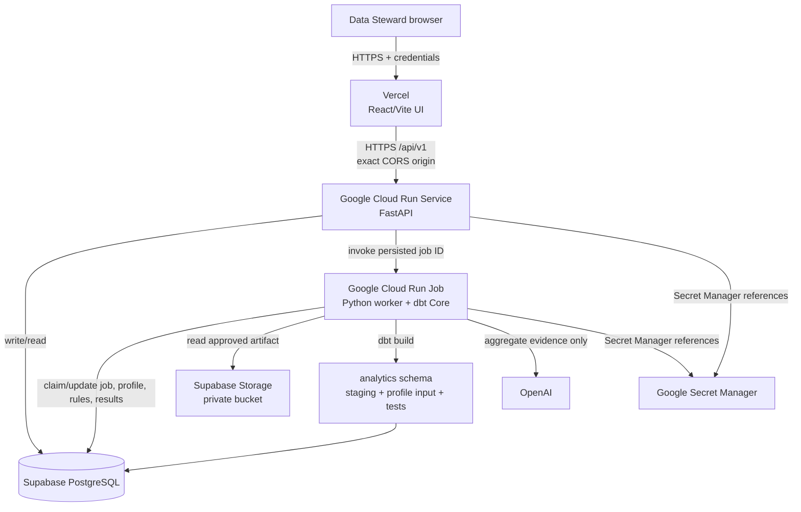

# Gate 2 architecture diagram

This diagram is a course-project architecture: it demonstrates security and operational
boundaries without claiming production availability or enterprise governance.

## Data flow

1. Team generates and checks the private 50k Parquet artifact once.
2. Steward starts a persisted `INGEST_PROFILE` job via the UI.
3. Cloud Run Job validates and ingests data, runs dbt, and stores profile evidence.
4. A separate proposal job sends only aggregate evidence to OpenAI.
5. Human approval creates a typed rule; a run job evaluates it through the read-only
   runner and stores bounded results.

## Trust boundaries

- Browser: only Vercel UI and Cloud Run API; no direct provider credentials.
- API: validates session/CSRF/quota and dispatches only known job types.
- Worker: accesses private artifact, dbt and OpenAI; it never trusts browser SQL/path.
- Database: distinct migration, application, dbt and read-only runner roles.
- Secrets: only Secret Manager and local ignored `.env`; Vercel gets public API URL only.
