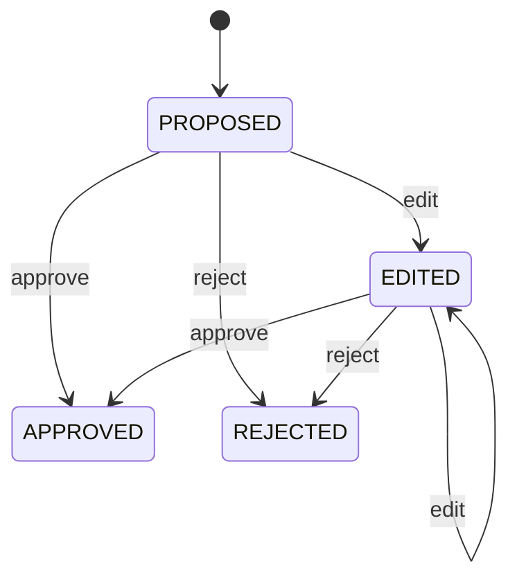

# Gate 2 MVP — Hướng dẫn implement

## Nguyên tắc

- Mỗi PR chỉ hoàn thành một lát cắt nhỏ có test.
- CSV là data plane. LLM chỉ thấy aggregate profile, không thấy row, ID, pickup/dropoff
  value hoặc file path.
- LLM không được tạo/excute SQL. Rule runner là code deterministic có allow-list.
- Route chỉ validate và gọi service; xử lý profile/rule nằm ở service layer.
- Không gọi LLM thật trong automated test; dùng fake client có output schema-valid.

## Thứ tự xây dựng

### A. Fixture và persistence tối thiểu

1. Thêm CSV ở `src/resources/nyc_yellow_demo.csv`; file fixture nhỏ này được version
   cùng code. Không dùng `data/` vì thư mục đó được gitignore để chặn data lớn.
2. Thêm manifest name cố định `nyc-yellow-demo-v1`; API không nhận arbitrary path.
3. Viết loader CSV bằng `csv.DictReader`.
4. Dùng `sqlite3` để lưu dataset metadata, profile, proposals, audit và run results.
5. Test re-run cùng manifest không nhân đôi state.

### B. Aggregate profiler

Input là list row đọc từ CSV. Output profile chỉ chứa:

```json
{
  "row_count": 54,
  "columns": [{
    "name": "fare_amount",
    "null_rate": 0.0,
    "distinct_count": 53,
    "statistics": {"min": -9.5, "p95": 28.0, "max": 125.0}
  }]
}
```

Xử lý rõ empty column, all-null column và numeric/text/datetime-like field. Không log
raw row trong lỗi hoặc telemetry.

### C. Rule schema và evidence boundary

Pydantic schema chỉ nhận:

| Rule type | Parameters |
|---|---|
| `not_null` | Không có |
| `numeric_range` | `min` và/hoặc `max` số |
| `accepted_values` | `values` list không rỗng |
| `duplicate_fingerprint` | `columns` list cột allow-list |

Evidence payload gồm profile aggregate và danh sách evidence references hợp lệ, ví dụ
`fare_amount.min`. Validator phải reject cột không có trong profile, evidence ref lạ,
rule type lạ và parameter không hợp lệ.

### D. Real LLM proposer

1. Dùng `ChatOpenAI` từ service hiện có, model lấy từ settings.
2. System prompt yêu cầu JSON array 2–4 rule schema-valid; không free text ngoài JSON.
3. Parse JSON (có thể strip code fence), validate từng item bằng Pydantic và evidence
   allow-list trước khi persist trạng thái `PROPOSED`.
4. Provider timeout/401/malformed JSON trả stable error cho UI. Không persist proposal
   hỏng; không fallback sang rule giả.
5. Manual test bằng key thật sau khi unit/API tests pass.

### E. HITL và safe runner

State machine:



Mỗi transition ghi `actor`, timestamp, action, comment. Runner nhận typed rule đã
`APPROVED`, iterate rows local và trả `failed_rows`, `eligible_rows`, tối đa 20
`failed_source_row_ids`, và `failed_ids_truncated`. Không nhận SQL string.

Data Health Score:

```text
sum(severity_weight * (1 - failed_rows / eligible_rows))
--------------------------------------------------------
sum(severity_weight)
```

Sử dụng weights low=1, medium=2, high=3; không chạy nếu không có rule approved.

### F. UI

Tận dụng `ui_test/` như static UI được FastAPI serve tại `/ui/`; không cần React/Vite
ở vòng này. UI phải gọi API thật cho bốn khu vực:

1. Load dataset.
2. Build profile và render table aggregate.
3. Generate/show/review proposals.
4. Run approved checks, render score/results/audit.

Nút cần disabled khi prerequisite chưa xong. Mỗi request phải có loading state, empty
state và error state. Không hard-code score, number of rules hoặc result trong UI.

## API tối thiểu

| Method | Path | Trách nhiệm |
|---|---|---|
| POST | `/api/v1/datasets/ingest` | Load manifest allow-list |
| GET | `/api/v1/datasets` | List demo dataset |
| POST/GET | `/api/v1/datasets/{id}/profile` | Create/read aggregate profile |
| POST | `/api/v1/datasets/{id}/rule-proposals` | Live LLM proposal generation |
| GET/PATCH | `/api/v1/rule-proposals` | List + HITL action |
| POST | `/api/v1/dq-runs` | Run selected approved rules |
| GET | `/api/v1/audit-logs` | Show review/execution history |

Khi implement, cập nhật `docs/API_CONTRACT.md` với status **Implemented (Gate 2
demo)** và response thực tế.

## Test bắt buộc cho mỗi layer

- Fixture/profile: deterministic row count, null/min/max và empty/all-null boundary.
- Evidence: không có raw ID/value và refs luôn hợp lệ.
- LLM boundary: valid/malformed/unknown column/unknown ref/provider error.
- HITL: approve/edit/reject hợp lệ; invalid/rejected rule không chạy.
- Runner: từng rule type, counts, bounded IDs và score.
- API/UI: happy path và ít nhất một error state.
