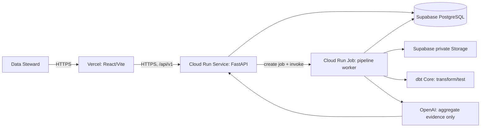

# RidePulse DQ — Gate 2 MVP plan

> **Status:** Canonical implementation plan. The repository is still a starter
> template; an item is not implemented until its PR is merged and verified.
>
> **Purpose:** a course-project simulation of production practices. It must work
> end-to-end on a public URL, but it is not an internet production service with an
> SLA, enterprise identity, or 24/7 operations.

## 1. Fixed decisions

| Concern | Gate 2 decision |
|---|---|
| Public frontend | React/Vite deployed as a Vercel Static Site |
| Public backend | FastAPI container deployed as one Google Cloud Run Service |
| Long-running work | One Google Cloud Run Job, invoked with a persisted job ID |
| DE tool | dbt Core with `dbt-postgres`, run inside the Cloud Run Job |
| Data | Supabase Free PostgreSQL and private Storage bucket `ridepulse-gate2` |
| LLM | OpenAI, invoked only by the backend with an approved model and spend cap |
| Local development | Docker Compose with React/Vite, FastAPI and PostgreSQL |

Render, Firebase, Dagster, a VPS, custom domain, arbitrary file upload and Chicago
data are outside this Gate 2 plan. The team does not mix providers or introduce a
second orchestration tool during implementation.

## 2. What the user can do

The only primary user is a **Data Steward**. They open the Vercel HTTPS URL, enter a
shared demo password, choose the registered NYC Yellow Taxi dataset, start analysis,
view the completed profile, request real LLM rule proposals, approve/edit/reject
proposals, run approved checks, and view persisted results plus audit history.

This is the one Gate 2 flow: **input → cloud pipeline → meaningful DQ output**.

## 3. Architecture

See the submission-ready diagram in [ARCHITECTURE.md](./ARCHITECTURE.md).

The browser never connects to PostgreSQL, Supabase Storage, Cloud Run Job, or OpenAI
directly. PostgreSQL port `5432` is never exposed by the team.

## 4. Dataset and dbt plan

The input artifact is one private Parquet file generated reproducibly from an approved
NYC Yellow Taxi source. It contains exactly **50,000** rows:

| Segment | Rows | Rule |
|---|---:|---|
| Unchanged deterministic sample | 48,750 | Direct source-shaped records |
| Deterministically mutated sample | 1,250 | Known synthetic quality failures |
| Total | 50,000 | One artifact, one manifest, one checksum |

Each row receives a deterministic `source_row_id`. The 1,250 synthetic records are
mutations of selected sampled rows, not extra rows; IDs stay unique. Duplicate-rule
evaluation duplicates a business fingerprint, never the primary ID. The manifest
records source URL, source checksum, schema version, sample seed, mutation seed and
expected aggregate failure counts. Generated artifacts and affected-row manifests stay
out of Git.

After ingestion, the Cloud Run Job executes a small dbt project:

1. `stg_trips` normalizes the fixed source schema into the `analytics` schema.
2. `profile_input` exposes the fixed columns needed by the profiler.
3. dbt tests validate the expected schema and basic data contract.

dbt is a real transformation/testing stage. It does not replace the Agent, HITL review,
or DQ rule runner.

## 5. Scope and safety boundary

| Included | Intentionally excluded for this course release |
|---|---|
| Registered 50k artifact, profile, dbt, LLM proposal, HITL and DQ run | User-uploaded files, arbitrary URL/path input, streaming and schedules |
| Five typed rule templates | Arbitrary SQL, DDL/DML, automatic source-data repair |
| Shared password/session, quota and audit log | Real accounts, SSO, RBAC and multi-tenancy |
| Cloud Run service/job, health checks and manual backup export | HA, SLA, permanent monitoring/on-call and disaster-recovery program |
| Public Vercel demo | Paid production deployment after the course |

## 6. Release evidence

Gate 2 is complete only when all of these are true:

- Public Vercel URL works from an incognito browser and a non-developer network.
- The flow above runs against the hosted database and a real OpenAI call; no demo proof
  uses localhost or mock LLM output.
- The pipeline stores job status, profile, proposals, reviewer decisions, results and
  audit events in PostgreSQL.
- At least ten reviewed PRs are merged into `main`.
- Root `README.md` has final setup, environment-variable names and sample API/UI
  requests matching the implemented contract.
- Five manual cases contain real model output, the reviewer decision and persisted DQ
  result. Provider-failure handling is an additional automated negative test, not one
  of the five cases.
- Architecture diagram and a video of no more than three minutes are ready.

Implementation details are split into [SETUP.md](./SETUP.md),
[IMPLEMENTATION_GUIDE.md](./IMPLEMENTATION_GUIDE.md) and
[TEAM_PLAN.md](./TEAM_PLAN.md).
