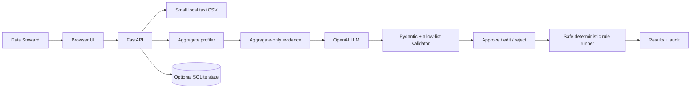

# RidePulse DQ — Gate 2 MVP

> **Status:** Implementation guide
>
> **Deadline:** 23:59, 16/08/2026

## 1. Mục tiêu Gate 2

Gate 2 cần một Agent nhận input, xử lý bằng **LLM thực tế** và trả output có ý
nghĩa cho ít nhất một user flow chính. Ngoài code, nhóm cần video demo tối đa ba
phút, architecture diagram, tối thiểu 10 PR đã merge, README setup, và năm manual
test cases có output thực tế.

MVP này cố ý nhỏ: tập trung một Data Steward flow chạy end-to-end, thay vì triển
khai đồng thời dbt, ML anomaly detection, vector database, nhiều role, hoặc
orchestration.

## 2. Quyết định scope

| Thành phần | Gate 2 MVP | Không làm ở vòng đầu |
|---|---|---|
| Data source | Một CSV taxi-shaped nhỏ, có version trong repo | Download/runtime ingest file lớn |
| Data volume | 48 dòng nền + 6 lỗi synthetic = 54 dòng | Benchmark 100k–1M dòng |
| Storage | Đọc trực tiếp CSV; SQLite file chỉ lưu workflow/audit nếu cần persistence | PostgreSQL, migration, Docker DB |
| LLM | OpenAI model cấu hình qua `.env`, chỉ nhận aggregate profile | Raw rows, arbitrary SQL, fallback giả mạo LLM thật |
| Rules | `not_null`, `numeric_range`, `accepted_values`, `duplicate_fingerprint` | dbt, custom SQL, tự sửa data |
| UI | Một Data Steward workspace cho flow chính | 11 màn hình và RBAC production |

SQLite là thư viện có sẵn trong Python. Không cần cài PostgreSQL hay chạy Docker để
demo Gate 2 này. Nếu không cần giữ lịch sử sau khi tắt app, state workflow có thể
giữ in-memory trong vòng demo; khuyến nghị SQLite để audit/restart đơn giản.

## 3. User flow được demo

1. Data Steward mở UI tại `/ui/`.
2. Chọn **Load demo dataset**. Backend chỉ nhận manifest name allow-list, không nhận
   đường dẫn/URL từ browser.
3. Bấm **Build profile**. Backend đọc CSV và tạo aggregate: row count, null rate,
   distinct count, min/max/p95.
4. Bấm **Generate proposals**. Backend gửi aggregate evidence, schema rule và danh
   sách evidence keys tới OpenAI; raw row không rời máy local.
5. UI hiện 2–4 rule có cấu trúc. Steward approve, edit hoặc reject từng rule.
6. Steward bấm **Run approved checks**. Chỉ rule `APPROVED` chạy trên CSV.
7. UI trả Data Health Score, failed/eligible counts, bounded failed row IDs và audit
   events.

## 4. Data fixture

File target: `src/resources/nyc_yellow_demo.csv`. Đây là bundled demo fixture nhỏ;
không dùng thư mục `data/` vì thư mục đó được gitignore để tránh commit dữ liệu lớn.

Các cột tối thiểu: `source_row_id`, `vendor_id`, `pickup_at`, `dropoff_at`,
`passenger_count`, `trip_distance`, `payment_type`, `fare_amount`, `tip_amount`,
`total_amount`.

54 dòng gồm:

- 48 dòng nền hợp lệ, được tạo xác định với fixed seed.
- 1 duplicate fingerprint.
- 1 `vendor_id` null.
- 1 chuyến có `trip_distance` và `fare_amount` âm.
- 1 chuyến distance bằng 0 nhưng fare bất thường cao.
- 1 `payment_type` ngoài allow-list.
- 1 `fare_amount` âm bổ sung.

Đây là demo fixture có chủ đích, không được trình bày là benchmark hoặc dữ liệu NYC
TLC hoàn chỉnh.

## 5. Definition of done

- [ ] Flow ở mục 3 chạy qua UI mà không cần sửa dữ liệu bằng tay.
- [ ] Một live OpenAI call thành công với API key hợp lệ; log/evidence không có raw row.
- [ ] LLM output sai schema, cột lạ hoặc evidence ref lạ bị từ chối.
- [ ] Rule chưa approve không thể chạy.
- [ ] UI có loading, empty và recoverable error state.
- [ ] Có năm manual cases có timestamp, input aggregate, output model/rule và kết quả.
- [ ] README root, architecture diagram và video script phản ánh đúng implementation.
- [ ] Ít nhất 10 PR được review và merge vào `main`.

Xem [SETUP.md](./SETUP.md), [IMPLEMENTATION_GUIDE.md](./IMPLEMENTATION_GUIDE.md)
và [TEAM_PLAN.md](./TEAM_PLAN.md) để bắt đầu.
