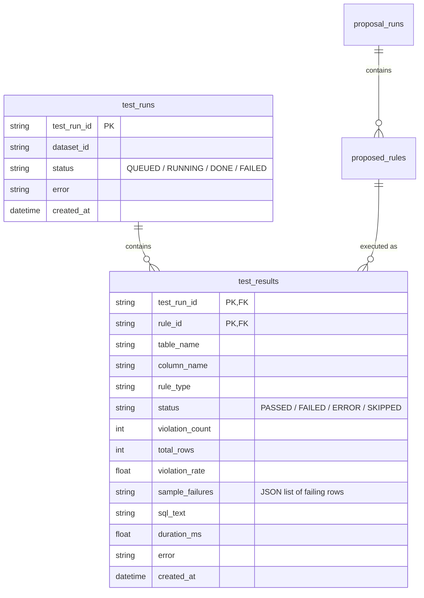

# Test Generator Agent — Implementation Plan (Run 2)

## 1. Context & Objectives

The system currently supports:
1. **Run 1 (Proposal Flow):** `raw_profiler` ➔ `profiler_digest` ➔ `rule_proposer` ➔ `hitl_gate` (persisting proposed rules as `PENDING` into the DB).
2. **HITL REST APIs:** Allowing Data Stewards to review, edit, approve, or reject rules (updating state to `APPROVED` / `REJECTED`).


The next milestone is **Run 2 (Execution Flow)**:
```
load_approved_rules (DB) ➔ test_generator (Template Render) ➔ validate_sql (EXPLAIN)
                                                     │              ▲
                                                     ▼ (Invalid)    │ (Retry < 3)
                                                 llm_repair ────────┘
                                                     │ (Attempt >= 3)
                                                     ▼
                                            [Mark ERROR & Skip]
                                                     │
                                                     ▼ (Valid)
                                                test_runner (SQLAlchemy + Concurrency)
                                                     │
                                                     ▼
                                                anomaly_detector (Rule-based / ML)
                                                     │
                                                     ▼
                                                persist_report ➔ END
```

This plan designs the **Test Generator** agentic execution graph using **LangGraph** and **SQLAlchemy** to implement a performant, secure, and self-repairing quality gate.

---

## 2. Key Decisions & Architecture

1. **Deterministic Test Generator (No LLM for generation):** 
   Since the input is a closed set of 8 structured rule types defined in `rule_schemas.py` and validated by Pydantic and HITL, we will use a template-based renderer (Jinja2 or python string rendering) rather than an LLM to produce SQL test queries. This ensures 100% correct, fast, and free query generation.
   
2. **LLM SQL Repair Loop (Agentic Loop):**
   LLM is only used if the rendered SQL fails a dry-run syntax check (`EXPLAIN SELECT ...` on Postgres or SQLite). The repair loop catches the database exception, passes it to the LLM along with the original rule and schema, and attempts to fix syntax, quoting, or type issues. This is bounded at 3 attempts.

3. **Performance Optimization (Query Batching):**
   Scanning large datasets like a taxi trip database multiple times is highly inefficient.
   - Row-level rules (`NOT_NULL`, `RANGE`, `ACCEPTED_VALUES`, `REGEX_FORMAT`) targeting the same table will be compiled into **one batch query** using SQL aggregate projections.
   - For example, instead of running 3 queries for 3 rules, we run one query:
     ```sql
     SELECT 
       COUNT(*) AS total_rows,
       SUM(CASE WHEN fare_amount IS NULL THEN 1 ELSE 0 END) AS v_rule_1,
       SUM(CASE WHEN fare_amount < :min OR fare_amount > :max THEN 1 ELSE 0 END) AS v_rule_2
     FROM yellow_tripdata;
     ```
   - Group-level (`UNIQUE`) and table-level aggregates (`ROW_COUNT`, `FRESHNESS`) will execute as separate queries.

4. **Security & SQL Injection Mitigation:**
   - Database tables and columns are validated against active schema metadata (`inspect(engine).get_columns(table)`) before construction.
   - All rule thresholds (e.g. `min`, `max`, `accepted_values`) are mapped to SQL bind parameters (`:min`, `:max`). No string formatting interpolation of rule parameters is permitted.
   - Repaired SQL from the LLM is executed inside a `SET TRANSACTION READ ONLY` (or local equivalent) transaction block and verified to only perform `SELECT` operations.

---

## 3. Database Schema Changes

We will extend `src/services/rule_store.py` with two new tables: `test_runs` and `test_results`.



### 3.1 ORM Models to Add to `src/services/rule_store.py`

```python
class TestRunModel(Base):
    __tablename__ = "test_runs"

    test_run_id: Mapped[str] = mapped_column(String(64), primary_key=True)
    dataset_id: Mapped[str] = mapped_column(String(256), nullable=False)
    status: Mapped[str] = mapped_column(String(32), default="QUEUED")  # QUEUED/RUNNING/DONE/FAILED
    error: Mapped[str | None] = mapped_column(Text, nullable=True)
    created_at: Mapped[datetime] = mapped_column(DateTime, default=lambda: datetime.now(UTC))

    def to_dict(self) -> dict:
        return {
            "test_run_id": self.test_run_id,
            "dataset_id": self.dataset_id,
            "status": self.status,
            "error": self.error,
            "created_at": self.created_at.isoformat() if self.created_at else None,
        }


class TestResultModel(Base):
    __tablename__ = "test_results"

    test_run_id: Mapped[str] = mapped_column(String(64), primary_key=True)
    rule_id: Mapped[str] = mapped_column(String(512), primary_key=True)
    table_name: Mapped[str] = mapped_column(String(256), nullable=False)
    column_name: Mapped[str | None] = mapped_column(String(256), nullable=True)
    rule_type: Mapped[str] = mapped_column(String(64), nullable=False)
    status: Mapped[str] = mapped_column(String(32), nullable=False)  # PASSED/FAILED/ERROR/SKIPPED
    violation_count: Mapped[int] = mapped_column(Integer, default=0)
    total_rows: Mapped[int] = mapped_column(Integer, default=0)
    violation_rate: Mapped[float] = mapped_column(Float, default=0.0)
    sample_failures: Mapped[str | None] = mapped_column(Text, nullable=True)  # JSON list of sample dicts
    sql_text: Mapped[str] = mapped_column(Text, nullable=False)
    duration_ms: Mapped[float] = mapped_column(Float, default=0.0)
    error: Mapped[str | None] = mapped_column(Text, nullable=True)
    created_at: Mapped[datetime] = mapped_column(DateTime, default=lambda: datetime.now(UTC))

    def to_dict(self) -> dict:
        return {
            "test_run_id": self.test_run_id,
            "rule_id": self.rule_id,
            "table_name": self.table_name,
            "column": self.column_name,
            "rule_type": self.rule_type,
            "status": self.status,
            "violation_count": self.violation_count,
            "total_rows": self.total_rows,
            "violation_rate": self.violation_rate,
            "sample_failures": json.loads(self.sample_failures) if self.sample_failures else None,
            "sql_text": self.sql_text,
            "duration_ms": self.duration_ms,
            "error": self.error,
            "created_at": self.created_at.isoformat() if self.created_at else None,
        }
```

---

## 4. SQL Templates & Compilation Design

Each of the 8 rule types translates to a specific SQL logic.

### 4.1 SQL Predicates for Row-Level Rules
Row-level rules can be expressed as a predicate `P(col)` that is **true when the rule is violated**.

| Rule Type | Predicate `P(col)` | Bind Parameters Required |
|---|---|---|
| **NOT_NULL** | `{col} IS NULL` | None |
| **RANGE** | `{col} < :min OR {col} > :max` | `:min` (optional), `:max` (optional) |
| **ACCEPTED_VALUES** | `{col} NOT IN :accepted_values` | `:accepted_values` (tuple/list) |
| **REGEX_FORMAT** | Postgres: `{col} !~ :regex`<br>SQLite: `{col} NOT REGEXP :regex` | `:regex` |

*SQLite Regex note:* SQLite doesn't natively have a `REGEXP` operator configured unless we register a custom function on connection. In `get_engine()`, we will add a connection listener for SQLite to register the Python `re` module for `REGEXP`:
```python
@event.listens_for(engine, "begin")
def register_regexp(conn):
    conn.connection.create_function(
        "REGEXP", 2, lambda expr, item: re.search(expr, str(item)) is not None if item is not None else False
    )
```

### 4.2 Query Aggregation & Optimization (Batching)
For a given table, we aggregate all approved row-level rules:
```sql
SELECT 
  COUNT(*) AS total_rows,
  SUM(CASE WHEN col1 IS NULL THEN 1 ELSE 0 END) AS v_rule1,
  SUM(CASE WHEN col2 < :min OR col2 > :max THEN 1 ELSE 0 END) AS v_rule2
FROM {table_name}
```
If a batch query executes successfully:
1. `total_rows` is extracted from the result.
2. For each rule in the batch, the violation count is fetched (e.g. `v_rule1`).
3. If `violation_count > 0` and we need to fetch samples, we execute a fast secondary query:
   ```sql
   SELECT {columns} FROM {table_name} WHERE {predicate} LIMIT 5
   ```

### 4.3 Group & Table-Level Rules

- **UNIQUE:**
  ```sql
  SELECT {col} AS val, COUNT(*) AS cnt 
  FROM {table_name} 
  GROUP BY {col} 
  HAVING COUNT(*) > 1 
  LIMIT 5
  ```
  - `total_rows`: Query `SELECT COUNT(DISTINCT {col}) FROM {table_name}`.
  - `violation_count`: Sum of `cnt` from the query above or `SELECT COUNT(*) - COUNT(DISTINCT {col})` (approximate/exact).
  - *Better Approach:*
    ```sql
    SELECT 
      (SELECT COUNT(*) FROM {table_name}) - (SELECT COUNT(DISTINCT {col}) FROM {table_name} WHERE {col} IS NOT NULL) AS violation_count,
      (SELECT COUNT(*) FROM {table_name}) AS total_rows
    ```

- **ROW_COUNT:**
  ```sql
  SELECT COUNT(*) AS total_rows FROM {table_name}
  ```
  - Violated if `total_rows < :min_row_count`.
  - `violation_count` is 1 if violated, 0 if passed.

- **NULL_RATE:**
  Aggregated row-level, but evaluates percentage:
  - If `null_count / total_rows > :max_null_pct`, the rule fails.

- **FRESHNESS:**
  ```sql
  SELECT MAX({col}) AS max_ts FROM {table_name}
  ```
  - Violated if `max_ts` is older than `now() - :max_age_hours`.

---

## 5. State & Node Implementation Design

### 5.1 Updates to `src/agents/state.py`

```python
class AgentState(TypedDict, total=False):
    # Existing fields...

    # Run 2 Exec specific fields
    test_run_id: str
    approved_rules: list
    generated_tests: list  # list of dict with sql, bind_params, metadata
    test_results: list  # results of running the SQL
    test_generation_errors: list  # errors during code rendering/repair
```

### 5.2 Node 1: `load_approved_rules_node`
- Queries `get_approved_rules(run_id)` or filters `proposed_rules` table where `status = APPROVED` and `dataset_id = dataset_id`.
- Populates `state["approved_rules"]`.
- If no rules are approved, sets `state["error"]` or exits early with `SKIPPED`.

### 5.3 Node 2: `test_generator_node`
- Groups rules by `table_name`.
- Identifies row-level rules vs group/table-level rules.
- Computes aggregated SELECT SQL for row-level rules, generating bind parameters dict.
- Generates standalone queries for `UNIQUE`, `ROW_COUNT`, `FRESHNESS`.
- Outputs list of structures to `state["generated_tests"]`:
  ```python
  {
      "rules": [rule_1, rule_2],  # List of rules packaged in this query
      "sql_text": "SELECT COUNT(*)...",
      "bind_params": {"min": 0, "max": 100},
      "query_type": "batch" | "unique" | "row_count" | "freshness",
      "table_name": "yellow_tripdata",
      "attempts": 0,
  }
  ```

### 5.4 Node 3: `validate_sql_node`
- For each generated test query in `state["generated_tests"]`:
  - Run `EXPLAIN <sql>` using SQLAlchemy `session.execute(text(sql), params)`.
  - If successful, mark as `valid = True`.
  - If it raises an exception (SyntaxError, undefined column/table, type mismatch):
    - Catch the exception.
    - If `attempts < 3`, mark `valid = False`, store the error string, and prepare it for `llm_repair`.
    - If `attempts >= 3`, mark as `status = ERROR`, record the execution error, and route directly to results (skipping execution).

### 5.5 Node 4: `llm_repair_node` (Agentic Repair Loop)
- Takes invalid queries where `attempts < 3`.
- Calls LLM with `sql_repair_prompt`.
- Inputs: Original SQL, Rule Definition, Table Schema metadata, Database Error Stacktrace.
- LLM outputs a corrected SQL statement.
- Node updates `sql_text` in the test structure, increments `attempts += 1`, and routes back to `validate_sql`.

#### Prompt Template for SQL Repair (`src/agents/nodes/templates.py`):
```python
sql_repair_prompt = ChatPromptTemplate.from_messages([
    ("system", """Bạn là một chuyên gia cơ sở dữ liệu SQL. \
Nhiệm vụ của bạn là sửa một câu lệnh SQL bị lỗi cú pháp hoặc lỗi ngữ nghĩa được báo cáo bởi công cụ cơ sở dữ liệu. \
Hãy đọc kỹ thông tin về bảng, định nghĩa quy tắc kiểm thử, câu lệnh SQL bị lỗi, và thông báo lỗi. \
Trả về câu lệnh SQL đã được sửa đổi và hoàn toàn chạy được.

LƯU Ý QUAN TRỌNG:
1. Chỉ trả về câu lệnh SELECT. Tuyệt đối không chứa DDL/DML (UPDATE, DELETE, INSERT, DROP, ALTER...).
2. Đảm bảo giữ nguyên các bind parameters có dạng `:param_name` thay vì điền cứng giá trị.
3. Trả về dưới dạng khối mã SQL (fenced block).
"""),
    ("user", """
Bảng: {table_name}
Schema (cột và kiểu dữ liệu):
{schema_info}

Quy tắc kiểm thử gốc:
{rules_json}

Câu lệnh SQL lỗi:
```sql
{error_sql}
```

Thông báo lỗi từ DB:
{db_error}

Hãy sửa câu lệnh SQL trên:
""")
])
```

### 5.6 Node 5: `test_runner_node`
- Executes all valid queries using SQLAlchemy in parallel (with `asyncio.Semaphore` or `asyncio.to_thread`).
- Uses read-only transaction configuration.
- Calculates `violation_rate`.
- Executes failure sampling if `violation_count > 0`:
  `SELECT * FROM {table_name} WHERE {violation_predicate} LIMIT 5`
- Logs metrics like execution `duration_ms`.
- Outputs list of execution results to `state["test_results"]`.

### 5.7 Node 6: `anomaly_detector_node`
- Looks up history of `violation_rate` from `test_results` table for these rules.
- If history is empty (first run):
  - Use simple rule-based heuristics: if `violation_rate > threshold` (derived from severity, e.g. CRITICAL = 0%, HIGH = 1%, MEDIUM = 5%), mark as `anomaly = True`.
- If history contains >= 10 points:
  - Apply simple statistical method (Z-score > 3 on `violation_rate`) to flag outliers. (Future milestone will replace this with Isolation Forest).
- Flags anomalies and adds diagnostic notes to `state["anomalies"]`.

### 5.8 Node 7: `persist_report_node`
- Saves `test_runs` record (updating status to `DONE` or `FAILED`).
- Saves all items in `state["test_results"]` to the `test_results` table.
- Dumps execution artifacts (such as JSON reports) to `data/results/`.

---

## 6. API Changes & Endpoints (`src/api/routes.py`)

Add the following REST endpoints to interface with the Run 2 execution graph:

| Method | Path | Request Body | Response | Description |
|---|---|---|---|---|
| `POST` | `/api/v1/dq/execute-tests` | `{"dataset_id": "yellow_tripdata", "run_id": "proposal_run_id"}` | `{"test_run_id": "...", "status": "QUEUED"}` | Kicks off Run 2 in the background using `BackgroundTasks` |
| `GET` | `/api/v1/dq/test-runs/{test_run_id}` | None | `{"test_run_id": "...", "status": "RUNNING/DONE", "error": null}` | Polls status of a test run |
| `GET` | `/api/v1/dq/test-runs/{test_run_id}/results` | None | `{"test_run_id": "...", "results": [...]}` | Fetches test results of a run |
| `GET` | `/api/v1/dq/test-runs/{test_run_id}/anomalies` | None | `{"test_run_id": "...", "anomalies": [...]}` | Fetches detected anomalies |

---

## 7. Verification Plan

### 7.1 Automated Tests
Create `tests/test_execution_flow.py` verifying:
1. **Compilation Logic:** Testing that rules compile to the correct aggregated batch SQL statement.
2. **SQLite Registry:** Verifying that `REGEXP` works on the SQLite connection.
3. **Agentic Repair Loop:** Programmatically mock a syntax error to assert that `llm_repair` runs, parses the schema, rewrites the SQL, and the repair loop either resolves it or terminates at 3 retries.
4. **Execution Run:** Invoking the execution graph end-to-end against a mock table populated with invalid data (e.g. range outliers and nulls) and checking that `test_results` correctly reports exact counts and rates.

### 7.2 Manual Validation
1. Approve a set of rules through the UI/database for `yellow_tripdata`.
2. Trigger the `/api/v1/dq/execute-tests` endpoint.
3. Inspect `test_runs` and `test_results` tables using a DB browser to ensure data persistence matches constraints.
4. Verify output logs and execution time metrics.
