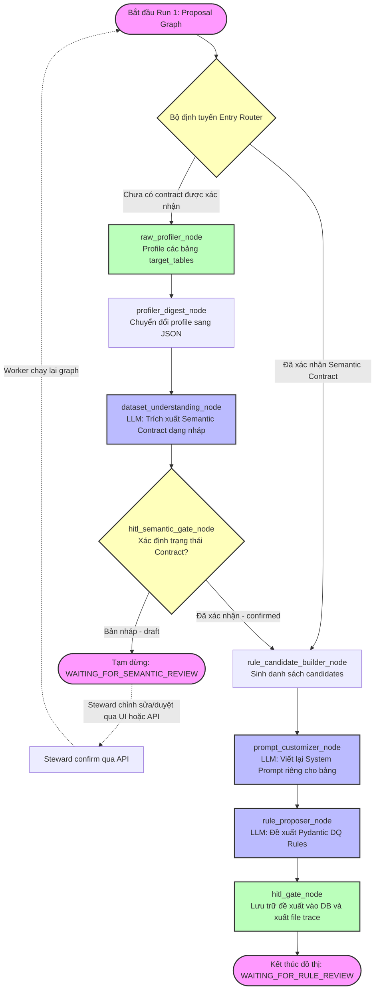

# Hướng dẫn chi tiết về Agent Workflow - Run 1 (Proposal Graph)

Tài liệu này giải thích chi tiết về luồng hoạt động của **Run 1: Proposal Graph** trong hệ thống Đề xuất Quy tắc Chất lượng Dữ liệu (Data Quality Rules Proposer) tổng quát cho dataset bất kỳ. 

Mục tiêu của đồ thị Run 1 là phân tích cấu trúc, trích xuất Hợp đồng ngữ nghĩa, viết lại prompt tối ưu và đề xuất danh sách luật kiểm tra chất lượng (DQ Rules) được phê duyệt bởi Steward.

---

## 1. Sơ đồ Đồ thị LangGraph (Run 1)

---

## 2. Chi tiết Chức năng và Mục đích của Từng Node

### 2.1. Bộ định tuyến Entry Router (`_route_entry`)
*   **Loại Node**: Conditional Router (Định tuyến có điều kiện).
*   **Chức năng**: Kiểm tra trạng thái hiện tại của `semantic_contract` trong State.
*   **Mục đích**: 
    *   Nếu `semantic_contract` đã tồn tại và có trạng thái `"confirmed"` (Steward đã duyệt), đồ thị sẽ **nhảy thẳng đến `rule_candidate_builder`**, bỏ qua toàn bộ bước quét profile và phân tích bằng LLM tốn token và thời gian.
    *   Nếu chưa có contract hoặc contract vẫn ở trạng thái nháp (`draft`), luồng chạy sẽ đi từ đầu (`raw_profiler`).

---

### 2.2. Node Profiler Thô (`raw_profiler_node`)
*   **Loại Node**: Action Node (Thực thi phân tích kỹ thuật).
*   **Chức năng**: Quét và thống kê các thông tin thô của các bảng dữ liệu được khai báo trong `target_tables` thông qua công cụ DuckDB hoặc công cụ phân tích SQL.
*   **Mục đích**: Trích xuất các số liệu thống kê gốc như tổng số dòng, các cột hiện có, tỷ lệ khuyết thiếu (null rate), kiểu dữ liệu kỹ thuật và các phân vị dải giá trị (quantiles).

---

### 2.3. Node Chuẩn hóa Profile (`profiler_digest_node`)
*   **Loại Node**: Data Transformation Node (Biến đổi dữ liệu).
*   **Chức năng**: Nhận dữ liệu thô từ `raw_profiler_node` và chuẩn hóa, làm sạch thành một cấu trúc JSON thu gọn (`dataset_profile_digest`).
*   **Mục đích**: Giảm thiểu kích thước của dữ liệu thống kê để tối ưu hóa context truyền vào cho LLM ở các node sau, tránh quá tải token (context overflow) mà vẫn giữ nguyên các thuộc tính quan trọng nhất của bảng.

---

### 2.4. Node Hiểu Dataset (`dataset_understanding_node`)
*   **Loại Node**: AI Agent Node (LLM structured output).
*   **Chức năng**: Gọi LLM với cấu trúc đầu ra ràng buộc chặt chẽ (Pydantic model `TableSemanticContract`). LLM phân tích profile digest kết hợp với Từ điển dữ liệu (Data Dictionary) và Gợi ý nghiệp vụ của người dùng (`domain_hint`).
*   **Mục đích**: Suy luận ra **vai trò nghiệp vụ (business role)**, kiểu dữ liệu ngữ nghĩa (`semantic_type`), mối quan hệ liên cột (`relationships`) và các giả định nghiệp vụ của từng bảng. Trả về bản nháp Hợp đồng ngữ nghĩa (`semantic_contract` với `"status": "draft"`).

---

### 2.5. Cổng HITL duyệt Ngữ nghĩa (`hitl_semantic_gate_node`)
*   **Loại Node**: Human-in-the-Loop Release Gate (Chốt chặn duyệt thủ công).
*   **Chức năng**: 
    *   Ghi bản nháp Hợp đồng ngữ nghĩa ra file JSON để API có thể truy xuất.
    *   Đặt trạng thái tiến trình thành `WAITING_FOR_SEMANTIC_REVIEW`.
    *   Nếu `auto_confirm_semantic` là `False` (mặc định), node sẽ dừng tiến trình sạch sẽ (exit 0) bằng cách trả về một tín hiệu lỗi đặc biệt `AWAITING_SEMANTIC_REVIEW` để tạm dừng LangGraph.
*   **Mục đích**: Cho phép Data Steward có cơ hội xem, sửa đổi các kiểu ngữ nghĩa hoặc giả định nghiệp vụ của Agent trước khi sinh các rules kiểm định. Đảm bảo Agent không bị "ảo tưởng" (hallucination) về mặt nghiệp vụ dữ liệu.

---

### 2.6. Node Tạo Candidates (`rule_candidate_builder_node`)
*   **Loại Node**: Deterministic Builder Node (Xử lý code thuần túy).
*   **Chức năng**: Phân tích Hợp đồng ngữ nghĩa đã xác nhận và sinh ra danh sách các yêu cầu kiểm tra kỹ thuật (Rule Candidates) dạng thô như cột nào cần check `NOT_NULL`, `UNIQUE`, hoặc dải giá trị `RANGE` thích hợp.
*   **Mục đích**: Chuyển dịch các yêu cầu nghiệp vụ trừu tượng từ contract thành các bài kiểm thử kỹ thuật khả thi, giúp giảm tải công việc suy luận cho LLM ở các bước sau.

---

### 2.7. Node Tinh chỉnh Prompt Nghiệp vụ (`prompt_customizer_node`)
*   **Loại Node**: AI Prompt Engineer Agent.
*   **Chức năng**: Gọi LLM để viết lại và tạo ra một bản **System Prompt chuyên biệt** (`specialized_system_prompt`) riêng cho từng bảng dựa trên đặc thù nghiệp vụ từ contract đã được phê duyệt.
*   **Mục đích**: Thay vì sử dụng chung một prompt hệ thống tổng quát nghèo nàn ngữ cảnh, node này giúp cá nhân hóa hướng dẫn nghiệp vụ và tiêu chuẩn DQ thích hợp riêng cho từng miền nghiệp vụ cụ thể của bảng đó, tối ưu hóa chất lượng rule đề xuất.

---

### 2.8. Node Đề xuất DQ Rules (`rule_proposer_node`)
*   **Loại Node**: AI Agent Node (LLM structured output).
*   **Chức năng**: Sử dụng System Prompt chuyên biệt được tạo từ `prompt_customizer_node`, nạp các ứng viên luật từ candidate builder và số liệu thực tế từ profile digest để sinh ra danh sách đề xuất luật chi tiết (gồm tham số kỹ thuật, mô tả tiếng Việt và lập luận nghiệp vụ).
*   **Mục đích**: Đảm bảo tất cả các rules đầu ra từ LLM được kiểm tra tham số nghiêm ngặt thông qua các mô hình Pydantic DQ Rules cứng, loại bỏ các rule sai định dạng trước khi lưu trữ.

---

### 2.9. Cổng HITL duyệt Rules (`hitl_gate_node`)
*   **Loại Node**: Storage & Final Pause Node.
*   **Chức năng**: Lưu danh sách đề xuất luật hoàn chỉnh vào database với trạng thái `"pending"`, ghi nhận trace debug ra disk, và kết thúc tiến trình Run 1.
*   **Mục đích**: Đóng băng đồ thị và trả quyền kiểm soát về cho giao diện của Data Steward để tiến hành phê duyệt, loại bỏ hoặc hiệu chỉnh các rules cụ thể trước khi chuyển sang Run 2 (Sinh và thực thi code dbt/GX).
