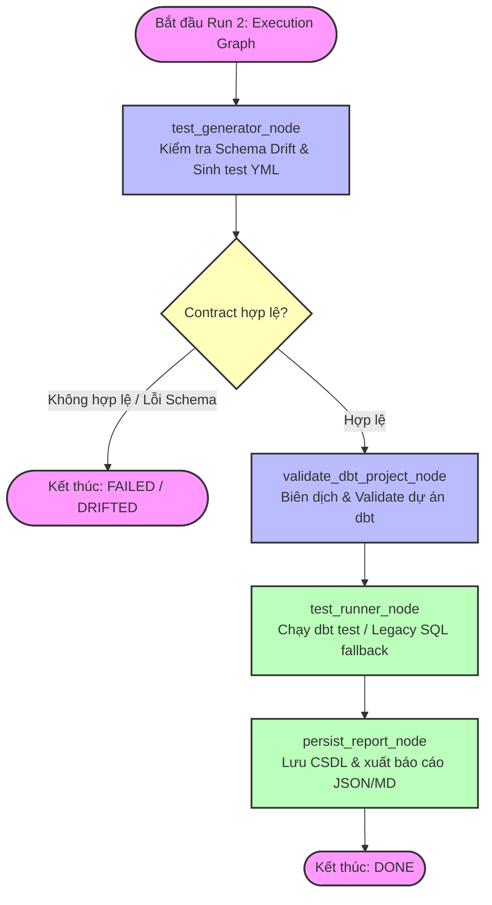
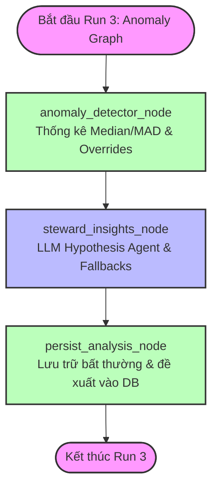

# Hướng dẫn chi tiết về Agent Workflow - Run 2 (Execution) & Run 3 (Anomaly)

Tài liệu này mô tả chi tiết luồng hoạt động, cấu trúc trạng thái và chức năng của từng node trong **Run 2 (Execution Graph - Thực thi kiểm thử)** và **Run 3 (Anomaly Graph - Phân tích bất thường)** sau khi đã được tách lập độc lập ở tầng orchestration/job.

---

## 1. Sơ đồ Đồ thị LangGraph (Run 2: Execution Graph)

Đồ thị Run 2 chịu trách nhiệm biên dịch các rules thành các bài test kỹ thuật (dbt YAML hoặc SQL fallback), kiểm tra bất tương thích schema (Schema Drift), thực thi kiểm định và lưu trữ kết quả một cách chuẩn hóa.



### 1.1. Chi tiết Chức năng của Từng Node trong Run 2

#### A. Node Sinh Test (`test_generator_node`)
*   **Loại Node**: Validation & Code Generation.
*   **Chức năng**:
    1.  Tải danh sách các rules đang kích hoạt (`ACTIVE`) của dataset.
    2.  Thực hiện **Contract Validation**: kiểm tra bảng target có tồn tại không, cột target có tồn tại không, tham số quy tắc có đúng định dạng không.
    3.  Thực hiện **Schema Drift Check**: đối chiếu mã băm (MD5 signature) của cấu trúc bảng hiện tại với mã băm trong `RulesetVersionModel` để phát hiện biến động cấu trúc dữ liệu.
    4.  Nếu phát hiện lỗi contract hoặc Schema Drift, đồ thị rẽ nhánh và dừng ngay lập tức tại `END_FAIL` để tránh thực thi sai truy vấn.
    5.  Nếu hợp lệ, tự động sinh mã cấu hình dbt YAML (`generated_dq_tests.yml`).

#### B. Node Biên dịch dbt (`validate_dbt_project_node`)
*   **Loại Node**: Validation Node.
*   **Chức năng**: 
    1.  Khởi tạo một thư mục tạm biệt lập, kết hợp cấu hình `dbt_project` mẫu với file dbt YML vừa sinh ở node trước.
    2.  Chạy thử lệnh `dbt parse` (hoặc compile) trong một subprocess cô lập để đảm bảo cú pháp dbt hoàn toàn hợp lệ trước khi phân phối chạy.

#### C. Node Thực thi Test (`test_runner_node`)
*   **Loại Node**: Execution Engine.
*   **Chức năng**:
    1.  Thực thi lệnh `dbt test` để chạy song song toàn bộ các bài kiểm tra chất lượng dữ liệu.
    2.  Nếu môi trường không cài đặt dbt (local/development fallback), node tự động kích hoạt **Legacy SQL fallback**: biên dịch dbt tests thành các truy vấn SQL thuần và chạy bất đồng bộ qua Connection Pool của SQLAlchemy.
    3.  **Chuẩn hóa đầu ra**: Nhận kết quả và chuyển đổi định dạng raw status thành chuẩn chung: `PASS`, `FAIL`, `ERROR`, `SKIPPED`.

#### D. Node Lưu trữ Báo cáo (`persist_report_node`)
*   **Loại Node**: Persistence Node.
*   **Chức năng**:
    1.  Lưu thông tin lịch sử chạy test và kết quả chi tiết song song vào cả hai hệ bảng:
        *   **Hệ bảng Legacy**: `test_runs` và `test_results` (để tương thích ngược với giao diện Web Dashboard cũ).
        *   **Hệ bảng Decoupled**: `dq_runs` và `dq_results` (nền tảng độc lập, tối ưu lock cho Graph 3).
    2.  Đánh dấu trạng thái Run thành `DONE` hoặc `FAILED`.
    3.  Ghi file trace kết quả dạng JSON và báo cáo định dạng Markdown cho Steward.

---

## 2. Sơ đồ Đồ thị LangGraph (Run 3: Anomaly Graph)

Đồ thị Run 3 chạy hoàn toàn **asynchronous** sau khi Run 2 hoàn thành, chịu trách nhiệm áp dụng các mô hình thống kê phát hiện bất thường và gọi LLM phân tích nguyên nhân để đưa ra giả thuyết hành động.



### 2.1. Chi tiết Chức năng của Từng Node trong Run 3

#### A. Node Phát hiện Bất thường (`anomaly_detector_node`)
*   **Loại Node**: Statistical Analysis Node.
*   **Chức năng**:
    1.  Tải dữ liệu của lần chạy hiện tại từ `dq_results` và dữ liệu lịch sử của dataset.
    2.  **Bộ lọc exclusions**: Chỉ lấy dữ liệu lịch sử từ các lần chạy thành công (`status` = `SUCCEEDED` / `DONE`), loại bỏ các lần chạy thất bại và các lần chạy được Steward gắn nhãn phản hồi là Bất thường Thật (`TRUE_ANOMALY`) để tránh làm nhiễu baseline baseline thống kê.
    3.  **Thuật toán Robust Z-Score**:
        $$\text{Robust Z-Score} = 0.6745 \times \frac{\text{Current Violation Rate} - \text{Median}}{\text{MAD}}$$
        Trong đó, MAD là Median Absolute Deviation (Độ sai lệch tuyệt đối trung vị).
    4.  **Cơ chế Ưu tiên (Overrides)**:
        *   Nếu một luật nghiệp vụ đặc biệt (`BUSINESS_RULE`) bị vi phạm, hoặc kết quả kiểm thử trả về trạng thái `ERROR` (lỗi biên dịch/thực thi), hệ thống sẽ **bỏ qua tính toán thống kê** và gán ngay trạng thái `CRITICAL` / `ANOMALY`.
    5.  **Gom nhóm (Family Aggregation)**: Tính toán điểm bất thường tổng hợp của toàn bộ dataset và từng nhóm rules (như tính toàn vẹn, tính hợp lệ) bằng phương pháp điểm số tối đa (Max Score) và có trọng số.

#### B. Node Đề xuất Giả thuyết (`steward_insights_node`)
*   **Loại Node**: AI Hypothesis Agent.
*   **Chức năng**:
    1.  Nếu kết quả phân tích ở node trước là `NORMAL` hoặc gặp lỗi `ERROR`, node sẽ **skip** việc gọi LLM để tiết kiệm chi phí và tăng tốc độ.
    2.  Nếu phát hiện bất thường (`ANOMALY` / `CRITICAL` / `WATCH`), node sẽ kích hoạt LLM thông qua structured output (ràng buộc Pydantic model `StewardHypothesisReport`).
    3.  LLM đóng vai trò là một kỹ sư dữ liệu phân tích nguyên nhân (Hypothesis Agent), đối chiếu chéo các tín hiệu vi phạm, thông tin nghiệp vụ và đưa ra các giả thuyết nguyên nhân gốc rễ cùng các bước kiểm tra khuyến nghị.
    4.  **Trích dẫn nguồn tin (Citation Check)**: Node kiểm tra chéo các mã rule ID do LLM trích dẫn đảm bảo hoàn toàn khớp với danh sách tín hiệu thực tế.
    5.  **Cơ chế Phòng vệ (Safe Fallback)**: Nếu LLM bị lỗi kết nối hoặc cạn kiệt API key, node tự động chuyển sang chế độ fallback chạy code tạo đề xuất nguyên nhân tĩnh, đảm bảo đồ thị không bao giờ bị nghẽn hay crash.

#### C. Node Lưu trữ Bất thường (`persist_analysis_node`)
*   **Loại Node**: Persistence Node.
*   **Chức năng**:
    1.  Lưu thông tin phân tích bất thường vào bảng `anomaly_runs`.
    2.  Lưu các tín hiệu thống kê chi tiết vào bảng `anomaly_signals`.
    3.  Lưu các giả thuyết nguyên nhân gốc rễ của AI vào bảng `anomaly_hypotheses`.
    4.  Tất cả hoạt động ghi dữ liệu được thiết kế **idempotent** (ghi đè sạch sẽ nếu chạy lại cùng một ID) để tránh dư thừa hay sai lệch dữ liệu phân tích.

---

## 3. Cơ chế Gọi Bất đồng bộ (Asynchronous Execution Chain)

Để đảm bảo hiệu năng và tính ổn định cao nhất cho hệ thống kiểm định dữ liệu, luồng orchestration tại `job_runner.py` phối hợp Run 2 và Run 3 như sau:

```text
Steward / API / Schedule Trigger
              │
              ▼
   ┌────────────────────────────────────────────────────────┐
   │ [Đồng bộ - Synchronous]                                │
   │ Khởi chạy Graph 2 (Biên dịch, Drift Check, Run Tests)  │
   └──────────────────────────┬─────────────────────────────┘
                              │
                              ├──────────────────────────────┐
                              ▼                              ▼
                 [Kết quả: PASSED/FAILED]        [Trigger background thread]
                              │                              │
                              ▼                              ▼
                    Trả kết quả tức thì            Khởi chạy Graph 3
                      về cho Client               (Thống kê MAD, LLM Agent)
                                                             │
                                                             ▼
                                                    Lưu kết quả phân tích
                                                    bất thường vào CSDL
```
