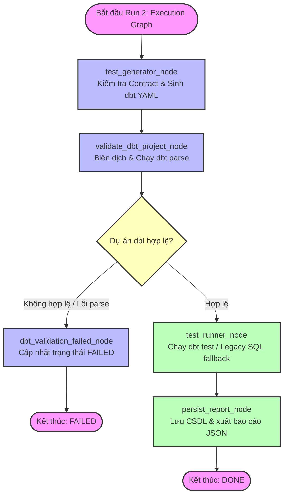
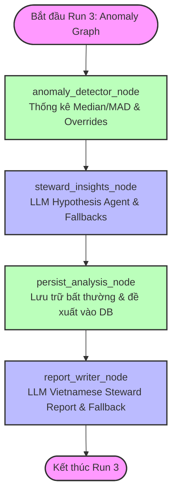

# Hướng dẫn chi tiết về Agent Workflow - Run 2 (Execution) & Run 3 (Anomaly)

Tài liệu này mô tả chi tiết luồng hoạt động, cấu trúc trạng thái và chức năng của từng node trong **Run 2 (Execution Graph - Thực thi kiểm thử)** và **Run 3 (Anomaly Graph - Phân tích bất thường)** sau khi đã được tách lập độc lập ở tầng orchestration/job và cập nhật cơ chế sinh báo cáo qua LLM.

---

## 1. Sơ đồ Đồ thị LangGraph (Run 2: Execution Graph)

Đồ thị Run 2 chịu trách nhiệm biên dịch các rules thành các bài test kỹ thuật (dbt YAML hoặc SQL fallback), kiểm tra bất tương thích schema (Schema Drift), thực thi kiểm định và lưu trữ kết quả một cách chuẩn hóa.



### 1.1. Chi tiết Chức năng của Từng Node trong Run 2

#### A. Node Sinh Test (`test_generator_node`)
*   **Loại Node**: Validation & Code Generation.
*   **Chức năng**:
    1.  Tải danh sách các rules đang kích hoạt (`ACTIVE`) của dataset.
    2.  Thực hiện **Contract Validation**: kiểm tra bảng target có tồn tại không, cột target có tồn tại không, tham số quy tắc có đúng định dạng không.
    3.  Lọc bỏ các quy tắc cấp bảng (như `ROW_COUNT` không thuộc về cột cụ thể) ra khỏi phần định nghĩa cột trong dbt YAML để tránh lỗi biên dịch.
    4.  Chỉ mapping các quy tắc được dbt hỗ trợ nguyên bản (`NOT_NULL`, `UNIQUE`, `ACCEPTED_VALUES`, `RANGE`, `CROSS_FIELD_COMPARISON`), loại bỏ trùng lặp test trên cùng một cột để đảm bảo file YML hoàn toàn hợp lệ.
    5.  Đẩy file YAML cấu hình lên kho lưu trữ MinIO (hoặc lưu fallback local nếu MinIO không khả dụng ở môi trường phát triển).

#### B. Node Biên dịch dbt (`validate_dbt_project_node`)
*   **Loại Node**: Validation Node.
*   **Chức năng**: 
    1.  Khởi tạo một thư mục tạm biệt lập, kết hợp cấu hình `dbt_project` mẫu với file dbt YML vừa sinh ở node trước.
    2.  Chạy lệnh `dbt parse` để kiểm định tính đúng đắn cấu trúc và cú pháp của dự án dbt.
    3.  Trả về kết quả xác thực (`valid=True/False`) kèm thông tin lỗi biên dịch cụ thể nếu có.

#### C. Node Thực thi Test (`test_runner_node`)
*   **Loại Node**: Execution Engine.
*   **Chức năng**:
    1.  Thực thi lệnh `dbt test` để chạy song song toàn bộ các bài kiểm tra chất lượng dữ liệu.
    2.  Nếu môi trường không cài đặt dbt hoặc dbt gặp lỗi, node tự động kích hoạt **Legacy SQL fallback**: chạy các truy vấn SQL thuần tương đương thông qua SQLAlchemy.
    3.  **Chuẩn hóa đầu ra**: Nhận kết quả và chuyển đổi định dạng raw status thành chuẩn chung: `PASS`, `FAIL`, `ERROR`, `SKIPPED`.

#### D. Node Lưu trữ Báo cáo (`persist_report_node`)
*   **Loại Node**: Persistence Node.
*   **Chức năng**:
    1.  Lưu thông tin lịch sử chạy test và kết quả chi tiết song song vào cả hai hệ bảng:
        *   **Hệ bảng Legacy**: `test_runs` và `test_results` (để tương thích ngược với giao diện Web Dashboard cũ).
        *   **Hệ bảng Decoupled**: `dq_runs` và `dq_results` (nền tảng độc lập làm đầu vào cho Graph 3).
    2.  Đánh dấu trạng thái Run thành `DONE` hoặc `FAILED`.
    3.  Ghi file trace kết quả dạng JSON ra thư mục `output/reports/`.

---

## 2. Sơ đồ Đồ thị LangGraph (Run 3: Anomaly Graph)

Đồ thị Run 3 chạy hoàn toàn **asynchronous** sau khi Run 2 hoàn thành, chịu trách nhiệm áp dụng các mô hình thống kê phát hiện bất thường, gọi LLM phân tích nguyên nhân và tự động soạn thảo báo cáo chi tiết bằng tiếng Việt.



### 2.1. Chi tiết Chức năng của Từng Node trong Run 3

#### A. Node Phát hiện Bất thường (`anomaly_detector_node`)
*   **Loại Node**: Statistical Analysis Node.
*   **Chức năng**:
    1.  Tải dữ liệu của lần chạy hiện tại từ `dq_results` và dữ liệu lịch sử của dataset.
    2.  **Bộ lọc exclusions**: Chỉ lấy dữ liệu lịch sử từ các lần chạy thành công (`status` = `SUCCEEDED` / `DONE`), loại bỏ các lần chạy thất bại và các lần chạy được Steward gắn nhãn bất thường giả để tránh nhiễu baseline.
    3.  **Thuật toán Robust Z-Score** dùng trung vị và MAD (Median Absolute Deviation) để phát hiện biến động đột biến.
    4.  **Cơ chế Ưu tiên (Overrides)**: Nếu quy tắc nghiệp vụ đặc biệt bị vi phạm hoặc kết quả kiểm thử trả về trạng thái `ERROR`, hệ thống sẽ bỏ qua tính toán thống kê và gán ngay trạng thái bất thường thích hợp.

#### B. Node Đề xuất Giả thuyết (`steward_insights_node`)
*   **Loại Node**: AI Hypothesis Agent.
*   **Chức năng**:
    1.  Nếu kết quả phân tích là `NORMAL` hoặc gặp lỗi `ERROR`, node sẽ **skip** việc gọi LLM để tiết kiệm chi phí và tăng tốc độ.
    2.  Nếu phát hiện bất thường (`ANOMALY` / `CRITICAL` / `WATCH`), node sẽ kích hoạt LLM thông qua structured output để suy luận 3-5 giả thuyết nguyên nhân gốc rễ và đề xuất hành động.
    3.  **Cơ chế Phòng vệ (Safe Fallback)**: Nếu LLM bị lỗi kết nối hoặc API limit, node tự động chạy mã tạo đề xuất nguyên nhân tĩnh.

#### C. Node Lưu trữ Bất thường (`persist_analysis_node`)
*   **Loại Node**: Persistence Node.
*   **Chức năng**:
    1.  Lưu thông tin phân tích bất thường vào bảng `anomaly_runs`.
    2.  Lưu các tín hiệu thống kê chi tiết vào bảng `anomaly_signals`.
    3.  Lưu các giả thuyết nguyên nhân gốc rễ của AI vào bảng `anomaly_hypotheses`.

#### D. Node Viết Báo Cáo Steward (`report_writer_node`)
*   **Loại Node**: AI Report Generation Node.
*   **Chức năng**:
    1.  Đọc toàn bộ dữ liệu kiểm định chất lượng (Graph 2) và các giả thuyết nguyên nhân gốc rễ (Graph 3) từ database.
    2.  Gọi LLM với Vietnamese Prompt để tự động viết báo cáo Markdown tiếng Việt đầy đủ cấu trúc 8 phần rõ ràng.
    3.  **Cơ chế dự phòng (Safe Fallback)**: Tự động chuyển sang sử dụng template tiếng Việt tĩnh deterministic nếu LLM lỗi hoặc API timeout để đảm bảo đồ thị luôn chạy thành công.
    4.  Ghi file Markdown báo cáo ra thư mục `output/reports/` với tên file chứa timestamp để dễ dàng tra cứu lịch sử chạy dữ liệu: `steward_report_{timestamp}_{execution_run_id}.md`.

---

## 3. Cơ chế Gọi Bất đồng bộ (Asynchronous Execution Chain)

Để đảm bảo hiệu năng cao, luồng orchestration phối hợp Run 2 và Run 3 như sau:

```text
Steward / API / Schedule Trigger
              │
              ▼
   ┌────────────────────────────────────────────────────────┐
   │ [Đồng bộ - Synchronous]                                │
   │ Khởi chạy Graph 2 (Biên dịch, Chạy Tests, Lưu CSDL)    │
   └──────────────────────────┬─────────────────────────────┘
                               │
                               ├──────────────────────────────┐
                               ▼                              ▼
                  [Kết quả: PASSED/FAILED]        [Trigger background thread]
                               │                              │
                               ▼                              ▼
                     Trả kết quả tức thì            Khởi chạy Graph 3
                       về cho Client               (Detector, Insights, Report)
                                                              │
                                                              ▼
                                                     Lưu phân tích & xuất
                                                     báo cáo Steward (.md)
```
