# ANALYZE_EVAL — PHÂN TÍCH TOÀN BỘ HỆ THỐNG EVALGATE

> ### ⚠️ Trạng thái tài liệu
>
> Bản này mô tả hệ thống **tại thời điểm run `product-a10049a5…` (02/09 sáng, điểm
> 79.58)**. Chiều cùng ngày, đợt sửa ở `EVALGATE_REPORT.md §22` đã đổi bảy chỗ trong
> chính bộ đo. Các mục dưới đây vẫn đúng về **kiến trúc và cơ chế**; các **con số** thì
> đọc kèm §22:
>
> | Đổi ở đâu | Bản này ghi | Sau §22 |
> | --------- | ----------- | ------- |
> | Điểm tổng | 79.58 | **75.80** (cùng bundle, bộ evaluator mới) |
> | `governance` | 77.78 | **94.44** — `policy_resolution` từng bị P25 nuốt |
> | `observability` | 100.00 | **21.05** → **52.63** trên bundle agent thật |
> | `ai_quality` | 58.33 | **62.93** |
> | Hard gate | 24 | **25** (thêm `HG-O1`) |
> | 4 probe §3 | không đọc bundle | **đã gắn `required_artifacts`, viết lại** |
> | `DatasetBreakdown` | chỉ P25 | thêm `kind: dataset\|case` |
>
> **Phát hiện lớn nhất của §22:** mọi con số `ai_quality` trong tài liệu này — và trong
> §5, §17, §20, §21 — chấm **heuristic fallback**, không phải agent. Bộ đôi LLM tất định
> chưa bao giờ trả về một luật nào, vì bộ lọc candidate của nó đòi key `evidence` trong
> khi prompt mang `evidence_items`.

> **Mốc dữ liệu:** run `product-a10049a59e094e6d979c596c6cc98423` @ `5a5a1a2`, ngày
> 02/09/2026, profile `ci`. Mọi con số trong tài liệu này lấy từ chính run đó, không lấy
> lại từ báo cáo cũ.
>
> **Quy mô mã nguồn:** 33 file Python ≈ 18.3k dòng · 32 evaluator khai báo · 24 hard gate ·
> 102 metric · 7 gate · 334 self-test.
>
> Tài liệu này mô tả hệ thống **như nó đang chạy**, kể cả những chỗ nó đo sai. Chỗ nào có
> khiếm khuyết đã biết, tôi đánh dấu 🔺 và dẫn tới `EVALGATE_REPORT.md §21.6`.

---

## MỤC LỤC

| # | Mục |
|--:|-----|
| 1 | [Luồng hoạt động](#1-luồng-hoạt-động) |
| 2 | [Cách chạy và cách test](#2-cách-chạy-và-cách-test) |
| 3 | [Chi tiết từng Gate: hàm, metric, điểm](#3-chi-tiết-từng-gate-hàm-metric-điểm) |
| 4 | [Golden Dataset](#4-golden-dataset) |
| 5 | [Evidence lấy từ đâu](#5-evidence-lấy-từ-đâu) |
| 6 | [Chuẩn hoá: vì sao gộp được nhiều metric](#6-chuẩn-hoá-vì-sao-gộp-được-nhiều-metric) |
| 7 | [Schemas](#7-schemas) |
| 8 | [Điểm tổng](#8-điểm-tổng) |

---

## 1. LUỒNG HOẠT ĐỘNG

### 1.1 Toàn cảnh — hai tiến trình tách rời

Điểm cốt lõi của kiến trúc: **cái tạo bằng chứng và cái chấm bằng chứng là hai tiến trình
khác nhau**, nối với nhau bằng một manifest có checksum. EvalGate không bao giờ gọi agent;
nó chỉ đọc lại thứ agent đã sinh ra.

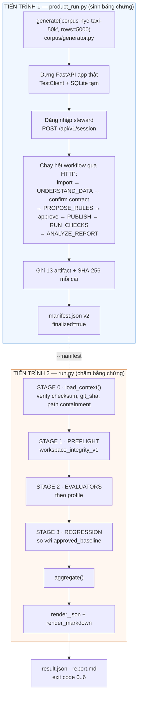

**Vì sao tách?** Nếu EvalGate tự gọi agent, nó vừa là người thi vừa là người chấm: một lỗi
trong cách nó gọi agent sẽ trở thành một kết luận về chất lượng agent. Tách ra thì bằng
chứng có **checksum, git_sha và dataset fingerprint** — chấm lại lúc nào cũng ra đúng số cũ,
và ai cũng mở được file ra kiểm tra.

### 1.2 `run.py` — bốn giai đoạn, từng bước

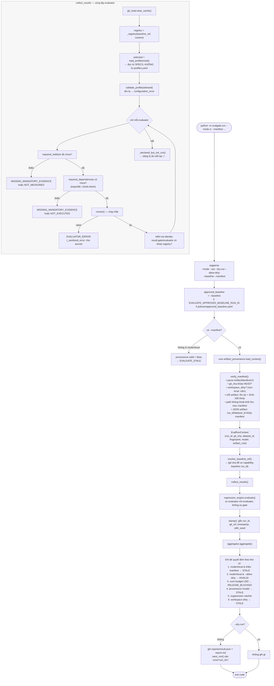

### 1.3 `aggregate()` — cây quyết định

Đây là chỗ quyết định thực sự được sinh ra. Thứ tự các nhánh **là** chính sách:

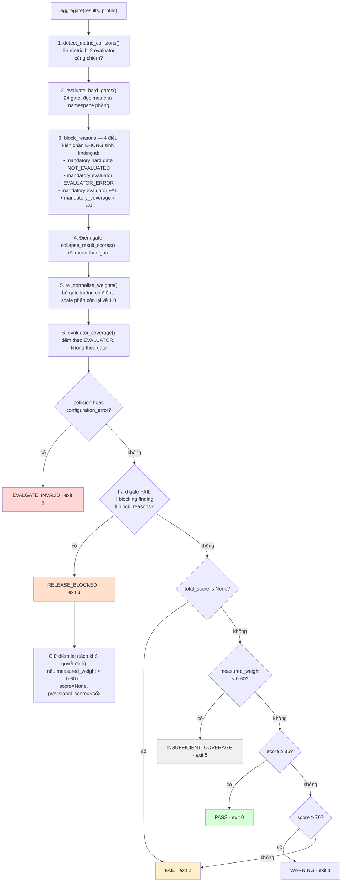

**Bốn nguyên tắc đọc được từ cây này:**

1. **Hard gate đứng trước điểm số.** Điểm 100 cũng không gỡ được một hard gate FAIL.
2. **Namespace integrity đứng trước tất cả.** Nếu hai evaluator cùng chiếm một tên metric,
   hard gate sẽ đọc phải cái nào chạy sau — nên toàn bộ verdict bị tuyên vô hiệu, không phải
   "chấm với dữ liệu đáng ngờ".
3. **Đo quá ít thì không được công bố số.** Sàn `minimum_measured_weight = 0.60`. Việc *giữ
   điểm lại* tách khỏi *quyết định*, vì một hard gate FAIL sẽ chiếm nhánh trước
   `INSUFFICIENT_COVERAGE` — nếu không tách, mọi run có vấn đề đều lách được sàn.
4. **`block_reasons` tồn tại vì suppression ratchet.** 4/6 nguyên nhân RELEASE_BLOCKED không
   sinh finding id, nên ratchet (vốn chỉ nhìn tập finding id) từng hạ thẳng một run bị chặn
   vì *thiếu bằng chứng* xuống band điểm.

### 1.4 Bảy exit code — hợp đồng với CI

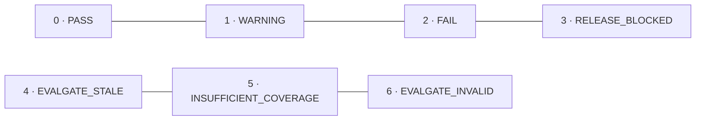

| Code | Nghĩa | Ai gây ra |
|--:|---|---|
| 0 | Điểm ≥ 85, không hard gate nào FAIL | — |
| 1 | Điểm ≥ 70 | — |
| 2 | Điểm < 70, hoặc không tính được điểm nào | Sản phẩm |
| 3 | Hard gate FAIL / blocking finding / `block_reasons` | Sản phẩm |
| 4 | Run không gắn được vào một revision (cây bẩn, provenance hỏng) | Người vận hành |
| 5 | Đo được < 60% trọng số | EvalGate/độ phủ |
| 6 | Cấu hình mâu thuẫn (metric collision, evaluator lạ, suppression sai) | EvalGate |

Ba code cuối nói về **chính công cụ**, không nói về sản phẩm — đó là chủ ý.

---

## 2. CÁCH CHẠY VÀ CÁCH TEST

### 2.1 Chạy trên terminal

#### A. Chẩn đoán nhanh (~5s, không cần bundle)

```bash
python -m evalgate.run --mode local --dry-run
```

Chỉ chạy 10 evaluator tĩnh (AST, secret, contract, capability, config). `--dry-run` = không
ghi evidence, không ghi report, không lưu vào `runs/`. Dùng để kiểm nhanh trước khi push.

Kết quả điển hình: `INSUFFICIENT_COVERAGE` — đúng thiết kế, vì profile `local` cố tình đo
ít nên không đủ 60% để công bố điểm.

#### B. Đo đầy đủ — 2 bước bắt buộc

```bash
# Bước 1: sinh bundle qua đúng đường sản phẩm
python -m evalgate.product_run --profile ci --suite frozen-v1 --out output/evalgate-runs
# → in ra đúng 1 dòng: đường dẫn manifest.json

# Bước 2: chấm bundle đó
python -m evalgate.run --mode ci --manifest output/evalgate-runs/product-<id>/manifest.json \
    --out evalgate/reports
```

> ⚠️ **`product_run --profile ci` từ chối chạy nếu cây git bẩn.** Đó là chủ ý: một bundle
> sinh từ cây không khớp commit nào thì không gắn được vào revision.

Muốn chấm mà **không ghi đè** `evidence/`, `reports/`, `runs/` — thêm `--dry-run`:

```bash
python -m evalgate.run --mode ci --dry-run --manifest <path>
```

#### C. Bốn profile

| Profile | Evaluator | Điều kiện | Dùng khi |
|---|--:|---|---|
| `local` | 10 | không cần manifest | dev chạy trước khi push |
| `ci` | 25 | **bắt buộc** manifest v2 | merge gate |
| `nightly` | 29 | manifest + `model.mode == "live"` | ci + adapter trả phí |
| `pre_release` | 30 | như trên + target được phê duyệt | nightly + k6 load |

```bash
python -m evalgate.run --mode nightly     --manifest <path>   # cần OPENAI_API_KEY
python -m evalgate.run --mode pre_release --manifest <path>   # cần EVALGATE_APPROVED_TARGET
```

#### D. Self-test và các lệnh phụ trợ

```bash
pytest evalgate/tests/ -q                        # 334 pass, 4 skip (~40s)
python -m ruff check evalgate/                   # lint
python -m evalgate.golden.freeze --verify        # golden tier 1 có drift không (không ghi)
python -m evalgate.golden.freeze                 # sinh lại tier 1 + manifest.yaml
```

#### E. Biến môi trường

| Biến | Tác dụng |
|---|---|
| `EVALGATE_APPROVED_BASELINE_RUN_ID` | Ghi đè baseline trong `approved_baseline.yaml` |
| `EVALGATE_BUDGET_USD` | Trần chi phí LLM; vượt → `RELEASE_BLOCKED` |
| `EVALGATE_TRACE_FILE` | Nguồn trace nếu không lấy từ manifest |
| `EVALGATE_STEWARD_EVENTS` | File aggregate cho Gate 7 |
| `EVALGATE_LIVE_AGENT_RESULT` / `EVALGATE_PROMPTFOO_RESULT` / `EVALGATE_K6_RESULT` | Kết quả adapter trả phí |
| `EVALGATE_DETERMINISTIC_LLM=1` | `product_run` đặt sẵn — LLM tất định, $0 |

#### F. Đọc kết quả từ terminal

```bash
python - <<'PY'
import json
d = json.load(open("evalgate/reports/result.json", encoding="utf-8"))
print(d["decision"], d["score"], f'coverage={d["measured_weight"]:.2%}')
for h in d["hard_gates"]:
    if h["status"] != "PASS":
        print(f'  {h["status"]:14} {h["id"]:7} {h["metric"]} = {h["observed"]}')
for b in d["block_reasons"]:
    print("  BLOCK:", b)
PY
```

### 2.2 Chạy trên Git / CI

Ba workflow trong `.github/workflows/`:

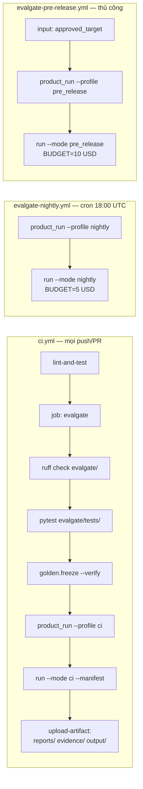

**Bốn điểm đáng chú ý trong `ci.yml`:**

1. `evalgate` là **job riêng**, `needs: lint-and-test`. Gate hỏng ≠ build hỏng; trộn hai
   loại lỗi làm cả hai khó đọc.
2. **Self-test chạy trước verdict.** Một evaluator hỏng mà báo "không có vi phạm" thì tệ hơn
   là không có evaluator.
3. Bước `product-run` dùng `pwsh` và **throw nếu không có manifest** — không cho phép chạy
   tiếp với bundle rỗng.
4. `continue-on-error` đã bị gỡ khỏi bước verdict: exit code của EvalGate làm đỏ CI thật.

**Chạy lại trên máy đúng như CI:**

```bash
python -m ruff check evalgate/ && \
pytest evalgate/tests/ -q && \
python -m evalgate.golden.freeze --verify && \
MANIFEST=$(python -m evalgate.product_run --profile ci --out output/evalgate-runs) && \
python -m evalgate.run --mode ci --manifest "$MANIFEST" --out evalgate/reports
```

---

## 3. CHI TIẾT TỪNG GATE: HÀM, METRIC, ĐIỂM

> Ký hiệu: **⬛ hard gate** · 🔴 FAIL · ✅ PASS · ⚪ không đo được · 🔺 khiếm khuyết đã biết
>
> Điểm gate = **trung bình cộng** điểm các evaluator đóng góp được. Evaluator có
> `per_dataset_breakdown` bị thu gọn bằng **P25** trước khi vào trung bình.

### GATE 1 — AI QUALITY · **58.33** · weight 0.35 → **20.42**

> Câu hỏi: agent đề xuất luật có bắt được lỗi thật không, và luật đó có dùng được không?

```
58.33 = mean(0.00, 0.00, 66.67, 100.00, 0.00, 100.00, 100.00, 100.00)
```

#### 1a · `replay_detection_v1` → **0.00** · `gate1_ai_quality/replay_evaluator.py`

| Hàm | Nhiệm vụ |
|---|---|
| `load_archived_runs()` | Đọc artifact `execution-results` từ context |
| `_parse_rule_id()` | `source_rows.fare_amount.RANGE` → `("fare_amount","RANGE")` |
| `_flagged_rows()` | Lấy tập row id đã gắn cờ; **phát hiện truncation** |
| `_outcomes()` | Dựng `RuleOutcome` cho từng rule |
| `score_run()` | Tính precision/recall/F1 **theo row id**, không theo số đếm |
| `_root_cause_hint()` | Gợi ý nguyên nhân theo defect class |

**Quy tắc chấm:** một prediction chỉ được tính đúng khi **row id giao với ground truth**.
Trùng số lượng vi phạm không bao giờ được coi là true positive.

| Metric | Đo gì | Kết quả |
|---|---|--:|
| `detection_precision` | % dòng gắn cờ thật sự lỗi | 🔴 **0.0** |
| `detection_recall_macro` | Trung bình recall theo lớp lỗi | 🔴 **0.0** |
| `detection_f1_macro` | Cân bằng hai chỉ số trên (ngưỡng đạt 0.60) | 🔴 **0.0** |
| ⬛ `min_recall_per_class` | Lớp lỗi tệ nhất → **HG-A1** | ⚪ **None** |
| `evidence_complete` | Mọi rule ghi đủ tập dòng đã gắn cờ | 🔴 **False** |
| `archived_runs_scored` | Số artefact được chấm | 1 |

> `min_recall_per_class = None` là **evaluator từ chối khẳng định**. 13 rule ghi ít dòng
> hơn số nó tìm thấy, nên recall là cận dưới chứ không phải phép đo. "Chúng tôi không ghi
> lại" và "agent bỏ sót" là hai mệnh đề khác nhau.

#### 1b · `governed_enum_conformance_v1` → **0.00** · `governed_enum_conformance.py`

| Hàm | Nhiệm vụ |
|---|---|
| `load_governed_domains()` | Đọc `src/resources/rule_policies.json`, **merge** với prose contract |
| `_domains_from_contract()` | Parse `docs/SUPABASE_DATASET_CONTRACT.md#Representation policy` |
| `score_proposals()` | So allow-list agent đề xuất với tập governed |
| `measure_planted_recall()` | Bao nhiêu dòng lỗi *cố ý cài* bị bắt |
| `count_unbacked_enums()` | ACCEPTED_VALUES trên cột không policy nào quản |

**Vì sao merge hai nguồn:** policy JSON là authority cho `allowed`, nhưng **chỉ prose mới
ghi giá trị nào bị loại ra có chủ ý** và số defect cài sẵn tương ứng.

| Metric | Đo gì | Kết quả |
|---|---|--:|
| ⬛ `governed_column_coverage` | Cột governed có nhận ACCEPTED_VALUES không → **HG-A8** | 🔴 **0.0** |

Chỉ một metric vì **không có gì để soi**: agent không đề xuất ACCEPTED_VALUES nào cho
`payment_type`. Không có luật → không tính được `tautological_enum_count` → **HG-A3
NOT_EVALUATED**. `HG-A8` sinh ra chính để bịt lỗ này: *không sinh gì thì im lặng, mà im lặng
lại chấm cao hơn sinh ra luật sai*.

#### 1c · `golden_conformance_v1` → **0.00** *(score gốc 60.0)* · `golden_conformance.py`

| Hàm | Nhiệm vụ |
|---|---|
| `load_proposals()` / `load_results()` / `load_anomaly()` / `load_tool_events()` | Nạp 4 nguồn từ bundle |
| `run_case()` | Chạy 1 golden case: resolve scope → gọi handler → quy trách nhiệm tầng sớm nhất |
| `evaluate()` | Gộp 16 case, tách applicable / measurable / passed |

| Metric | Đo gì | Kết quả |
|---|---|--:|
| `golden_case_pass_rate` | % case đạt trong số soi được | 🟡 **0.60** |
| ⬛ `golden_critical_failures` | Case CRITICAL trượt → **HG-A5** | ✅ **0** |
| `golden_rule_expectation_rate` | Tầng 2: đúng loại luật/cột/nguồn | 🟡 **0.667** |
| `golden_prompt_compliance_rate` | Tầng 3: văn bản tuân prompt của chính nó | 🔴 **0.0** |
| ⬛ `golden_applicability_rate` | Case là phát biểu về **chính dataset này** → **HG-A9** | ✅ **0.8125** |

> 🔺 `score` 60.0 nhưng **vào gate 0.00**: `per_dataset_breakdown` chứa 16 *case* (100 hoặc
> 0), P25 trên phân bố nhị phân có >25% trượt luôn ra 0. Xem §21.6 D-21.6.

#### 1d · `vacuity_probe_v1` → **66.67** · `vacuity_probe.py`

| Hàm | Nhiệm vụ |
|---|---|
| `judge_rule()` | Quyết định 1 luật: `VACUOUS` / `DEGENERATE` / `CAN_FIRE` / `NOT_JUDGED` / `NO_DATA` |
| `judge_all()` | Áp cho toàn bộ luật |

**Đây là evaluator duy nhất không cần ground truth** — nên là cái duy nhất còn hoạt động
khi người dùng upload dataset chưa ai gắn nhãn. Nó chỉ so *tham số của luật* với *dữ liệu
luật đó canh gác*.

Bảng phán xét theo loại luật:

| Loại | Quy tắc `VACUOUS` |
|---|---|
| `ACCEPTED_VALUES` | allow-list phủ hết giá trị quan sát được |
| `RANGE` | biên đã chứa trọn khoảng quan sát được |
| `NULL_RATE` | ngưỡng ≥ tỷ lệ null hiện tại |
| `ROW_COUNT` | `min_row_count` ≤ 0 (đếm không bao giờ âm) |
| `NOT_NULL`, `UNIQUE`, `REGEX_FORMAT`, `FRESHNESS`, `CROSS_FIELD` | **không phán xét** — có lý do ghi trong `NOT_JUDGED` |

> Phân biệt then chốt: `NOT_NULL` trên cột sạch là **guard hợp lệ** (tồn tại để bắt hồi quy
> tương lai), còn `ACCEPTED_VALUES` học từ chính cột nó kiểm là **vacuous** (allow-list lớn
> lên theo dữ liệu).

| Metric | Kết quả |
|---|--:|
| `vacuous_rule_rate` | 🟡 **0.3333** (4/12) |
| `worst_type_vacuity_rate` | 🟡 **0.3333** (`RANGE`) |
| ⬛ `systemic_vacuous_rule_types` → **HG-A6** | ✅ **0** |
| `degenerate_threshold_rules` | ✅ **0** |
| `rules_not_judgeable` | 19 |

#### 1e · `run_outcome_integrity_v1` → **100.00** · `run_outcome_integrity.py`

| Hàm | Nhiệm vụ |
|---|---|
| `collect_context_runs()` | Đọc artifact `run-outcome` |
| `collect_runs()` | *(seam chẩn đoán)* quét `output/<stage>/*_<run_id>.json` |
| `_attribute()` | Gán run vào workflow theo **signature stage**, không theo terminal stage |
| `schema_violation_rate()` | Tử/mẫu **cùng đếm item**, không trộn đơn vị |
| `RunOutcome.failure_kind` | TIMEOUT / SCHEMA_REJECTED / RATE_LIMITED / AUTH / NO_CANDIDATES / OTHER |

Evaluator này ra đời vì **bốn evaluator trên đều chấm nội dung, không cái nào lên tiếng khi
agent không tạo ra gì cả** — một lần chạy hỏng toàn phần từng đi qua cổng mà điểm không nhúc
nhích.

| Metric | Kết quả |
|---|--:|
| ⬛ `latest_run_produced_output` → **HG-A7** | ✅ **True** |
| `empty_run_rate` | ✅ **0.0** |
| ⬛ `schema_violation_rate` → **HG-A2** | ✅ **0.0** |
| `latest_run_failure_kind` | *(None — run thành công)* |

> Điểm lấy theo **lần chạy mới nhất**, không lấy trung bình: quyết định release nói về hệ
> thống *lúc này*.

#### 1f-1h · Ba probe **không đọc bundle** → mỗi cái **100.00** 🔺

| Evaluator | Hàm | Metric |
|---|---|---|
| `anomaly_logic_probe_v1` | `test_robust_zscore_math()`, `test_db_detection_flow()` | `zscore_zero_mad_fallback`, `zscore_outlier_detection`, `detector_db_flow_fidelity`, `anomaly_logic_score` |
| `sql_compilation_probe_v1` | `test_quote_ident()`, `test_row_predicate_compilation()` | `identifier_quoting_safety`, `predicate_compilation_coverage`, `sql_compilation_score` |
| `report_grounding_probe_v1` | `test_report_rendering_grounding()` | `report_structure_valid`, `figures_grounded_to_source`, `report_grounding_score` |

> 🔺 **D-21.2/D-21.3.** Ba cái này `import src.*` rồi tự dựng fixture — không nhận `context`,
> không khai `required_artifacts`. Chúng đóng `300/8 = 37.5` trong `58.33`, tức **+8.75 điểm
> tổng**. Bỏ cả ba → `ai_quality = 33.33`. `anomaly_logic_probe` còn dùng **7 `assert` trần**:
> sản phẩm sai → `EVALUATOR_ERROR` → **rơi khỏi aggregate thay vì kéo điểm xuống**.

---

### GATE 2 — AI SECURITY · **100.00** · weight 0.25 → **25.00**

> Câu hỏi: người ngoài có làm được điều không được phép không?

Gate đáng tin nhất của run: toàn bộ là probe tĩnh (AST) hoặc probe ASGI **gửi request thật**,
không phụ thuộc LLM.

#### 2a · `authz_probe_v1` → 100.00 · `authz_probe.py` *(tĩnh, AST)*

| Hàm | Nhiệm vụ |
|---|---|
| `_decorator_info()` | Trích `(router, method, path)` từ decorator FastAPI |
| `routers_guarded_at_mount()` | **Đọc `main.py`**: dependency gắn lúc `include_router` bảo vệ cả router |
| `collect_endpoints()` / `collect_all_endpoints()` | Quét **mọi** file `*routes*.py`, không chỉ `routes.py` |
| `Endpoint.is_violation` | mutating ∧ ¬has_auth ∧ ∉ `PUBLIC_ALLOW_LIST` |

Hai bài học được mã hoá: (1) chỉ đọc `routes.py` bỏ sót 7 endpoint trên `/api/v2` gồm cả
grant/revoke quyền; (2) không đọc mount-time dependency thì báo nhầm 8 endpoint mở trong khi
service thật trả 401.

| Metric | Kết quả |
|---|--:|
| ⬛ `unauthenticated_mutating_endpoints` → **HG-S1** | ✅ **0** |
| `unauthenticated_read_endpoints` | 1 |
| `total_endpoints_scanned` | 91 |

#### 2b · `asgi_behaviour_probe_v1` → 100.00 · `asgi_behaviour_probe.py` *(hành vi, 930 dòng)*

Bốn câu hỏi mà đọc code tĩnh **không** trả lời được:

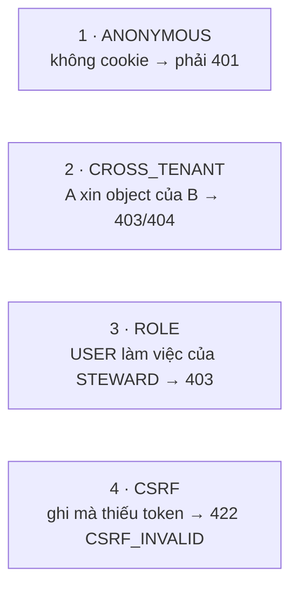

| Hàm | Nhiệm vụ |
|---|---|
| `_import_app()` | Dựng app thật (tắt tracing trước) |
| `_app_endpoints()` | Lấy surface từ **OpenAPI document**, không từ `app.routes` |
| `_route_matcher()` | Kiểm mọi case viết tay có route thật — chống 404 do gõ sai thành finding CRITICAL |
| `_seed_tenants()` | 2 tenant loại trừ nhau, mỗi bên 1 dataset + 1 dq_run + 1 proposal_run |
| `_probe_cross_tenant()` | Chạy **2 lần/case**: control vào object của chính mình + attack vào tenant kia |
| `_probe_listing()` | Endpoint danh sách rò rỉ qua **nội dung**, không qua status |
| `_probe_csrf()` | Chỉ tính là chặn khi mã lỗi đúng là `CSRF_INVALID` |
| `_static_blind_spots()` | Endpoint mà probe tĩnh **không nhìn thấy** |

**Hai kỷ luật giữ số liệu trung thực:**
- **Mọi case mơ hồ đều có control.** Nếu request của chính chủ không thành công → case
  `inconclusive` và **loại khỏi metric**, không tính là pass.
- **Không đo ≠ sạch.** App không dựng được → `NOT_EXECUTED`, **không phát ra metric nào**.

**An toàn:** chạy trên SQLite trong `TemporaryDirectory`, `assert` engine trỏ đúng thư mục
tạm trước khi query, tắt Supabase/PostgreSQL, khôi phục mọi override trong `finally`.

| Metric | Kết quả |
|---|--:|
| ⬛ `cross_tenant_violations` → **HG-S2** | ✅ **0** |
| `role_escalation_violations` | ✅ 0 |
| `unauthenticated_endpoints_reachable` | ✅ 0 |
| `csrf_enforced_rate` | ✅ **100.0** |
| `probe_cases_conclusive` | **162** |
| `probe_cases_inconclusive` | **0** |

> 162 kết luận được / 0 vô kết luận là con số đáng tin nhất trong toàn báo cáo.

#### 2c · `egress_probe_v1` → 100.00 · `egress_probe.py`

Hai tín hiệu độc lập: `_static_signals()` (đọc `src/` tìm `SELECT *` + `sample_failures`) và
`_empirical_rows()` (tìm **nguyên dòng dữ liệu** thật trong artifact, phân loại PII qua
`pii_classifier.classify_column`).

| Metric | Kết quả |
|---|--:|
| `raw_row_egress_violations` | ✅ 0 |
| `pii_column_egress_violations` | ✅ 0 |
| ⬛ `raw_or_pii_egress_violations` → **HG-S3** | ✅ **0** |

> 🔺 Trong nhánh context, hàm lặp qua `api-transcript` rồi đọc khoá `test_results` — transcript
> dùng khoá `requests`, nên file được đếm vào `files_scanned` mà không quét được gì (§21.6 M2).

#### 2d · `secret_scan_v1` → 100.00 · `secret_scan.py`

`tracked_files()` chỉ quét file **git theo dõi** (key trong `.env` bị ignore là vệ sinh cục
bộ, không phải rò rỉ), rồi lọc qua `scope.product_only()` — **EvalGate không quét chính nó**.
7 pattern; báo cáo chỉ ghi **prefix 6 ký tự + độ dài**, không bao giờ ghi giá trị.

| Metric | Kết quả |
|---|--:|
| ⬛ `secret_findings` → **HG-S6** | ✅ **0** |
| `tracked_files_scanned` | 486 |

#### 2e · `default_credential_probe_v1` → 100.00 · `default_credential_probe.py`

| Hàm | Nhiệm vụ |
|---|---|
| `find_seeded_credentials()` | Tìm hằng số seed account có mật khẩu đoán được |
| `find_seed_call_sites()` | Tìm chỗ **gọi** hàm seed |
| `_enclosing_guard()` | Lời gọi đó có nằm trong `if app_env == ...` không |

**Cả hai vế mới thành finding:** credential đoán được **và** call site không kiểm môi trường.
Tĩnh hoàn toàn — không thử đăng nhập, không truyền mật khẩu; mô tả theo **hình dạng**
("password equals username"), không theo giá trị.

| Metric | Kết quả |
|---|--:|
| ⬛ `default_credentials_active` → **HG-S7** | ✅ **False** |
| `seeded_credential_count` | ✅ 0 |

#### 2f · `upload_probe_v1` → 100.00 · `upload_behaviour_probe.py`

| Metric | Kết quả |
|---|--:|
| ⬛ `malicious_upload_accepted_count` → **HG-S4** | ⚠️ **0** |

> 🔺 **D-21.1 — PASS GIẢ.** `product_run.py:334` ghi khoá `accepted_malicious`;
> `upload_behaviour_probe.py:35` đọc khoá `malicious_upload_accepted_count`. Không khớp →
> **luôn = 0** bất kể sản phẩm có nhận file độc hay không. Một hard gate chết đang được tính
> là PASS.

---

### GATE 3 — OBSERVABILITY · **100.00** · weight 0.10 → **10.00**

> Câu hỏi: khi hệ thống sai, có biết sai ở đâu không?

`trace_coverage_v1` · `gate3_observability/trace_coverage.py` — đọc `traces/node-events.jsonl`
và kiểm mỗi event có đủ `REQUIRED_FIELDS = {trace_id, workflow_run_id, dataset_id, event,
timestamp}` (thêm `node` nếu `event == "node"`).

| Metric | Kết quả |
|---|--:|
| `trace_coverage` | ✅ **1.0** |
| `critical_node_errors` | ✅ **0** |
| `trace_p95_latency_ms` | **42.52 ms** → band 100 |
| `llm_cost_usd` | $0.00 |

> 🔺 **Đọc dè dặt.** 1.0 nghĩa là *"event được ghi thì ghi đủ trường"*, **không** phải *"mọi
> thứ đáng ghi đều đã ghi"*. Không metric nào đo mẫu số — hệ thống chỉ instrument 3 node và
> ghi đủ trường cho cả 3 cũng ra 1.0.

---

### GATE 4 — INPUT DATA · **83.33** · weight 0.15 → **12.50**

```
83.33 = mean(100.00, 50.00, 100.00)
```

#### 4a · `ingest_fidelity_v1` → 100.00 · `gate4_input_data/ingest_fidelity.py`

| Hàm | Nhiệm vụ |
|---|---|
| `run_malformed_matrix()` | Chạy 13 giá trị bẩn có thật qua `src.worker.to_float/to_int/to_str` |
| `run_round_trip()` | Serialize như CSV rồi ép kiểu ngược, trên 3 archetype |
| `_describe()` | Phân biệt `None` / `nan` / `inf` — cả ba đều là mất mát im lặng |

`MALFORMED_MATRIX` gồm `"12,50"` (dấu phẩy thập phân châu Âu), `"N/A"`, `"1e999"`, `"nan"`,
`"$12.50"`, `"0x1A"`… Mỗi ca gắn nhãn `accept` (phải giữ nguyên) hoặc `reject` (phải từ chối
**có tín hiệu**). Trả `None`/`NaN`/`inf` = **mất mát im lặng**, vì không phân biệt được với ô
rỗng hợp lệ.

| Metric | Kết quả |
|---|--:|
| ⬛ `row_fidelity` → **HG-D1** | ✅ **100.0** |
| `cell_fidelity` | ✅ 100.0 |
| `coercion_signal_rate` | ✅ 1.0 |
| ⬛ `coercion_loss_count` → **HG-D2** | ✅ **0** |
| `null_ambiguity_rate` | ✅ 0.0 |

> Vì sao quan trọng: đây là sản phẩm *data quality*. Nếu ingest tự chế ra null, profiler đo
> tỷ lệ null cao đó, rồi agent đề xuất `NULL_RATE` chấp nhận nó — **hệ thống chứng nhận thiệt
> hại do chính nó gây ra**.

#### 4b · `profile_accuracy_probe_v1` → 100.00 🔺

`test_profiler_statistics_accuracy()` dựng SQLite 100 dòng (10 null, min 30.0, max 208.0,
5 category) rồi gọi `db_profiler_tool.profile_database`. `test_freshness_parsing()` kiểm
`_parse_and_calculate_freshness`.

| Metric | Kết quả |
|---|--:|
| `null_rate_fidelity` · `min_max_fidelity` · `distinct_count_fidelity` | ✅ True ×3 |
| `profile_accuracy_score` | 100.0 |

> 🔺 Cũng **không đọc bundle** (D-21.2).

#### 4c · `multi_dataset_readiness_v1` → 50.00 · `gates/readiness/multi_dataset_readiness.py`

| Hàm | Chiều đo | Weight | Kết quả |
|---|---|--:|---|
| `_has_upload_surface()` | `upload_surface_exists` | 0.25 | ✅ True |
| `_has_generic_row_storage()` | `schema_agnostic_row_storage` | 0.20 | 🔴 False |
| `_dataset_owner_present()` | `dataset_has_owner_or_schema` | 0.15 | 🔴 False |
| `_domain_in_system_prompt()` | `domain_not_hardcoded_in_prompt` | 0.15 | ✅ True |
| `_delete_dataset_endpoint()` | `dataset_deletion_endpoint` | 0.10 | ✅ True |
| `_evidence_column_cap()` | `evidence_column_cap_sufficient` | 0.10 | 🔴 False (cap 64, cần ≥200) |
| `_scan_hardcoded()` | `low_single_domain_coupling` | 0.05 | 🔴 False (**35 file**) |

| Metric | Kết quả |
|---|--:|
| `multi_dataset_readiness_score` | **50.0** |
| `single_domain_coupled_files` | 35 |

> 🔺 **D-21.8** — `FAIL if score < 50 else WARN`, **không có nhánh PASS**. Nó đóng cứng 50.0
> vào trung bình, nên trần lý thuyết của `input_data` là `(100+50+100)/3 = 83.33` — đúng bằng
> điểm đang có.

---

### GATE 5 — RELIABILITY · **57.14** · weight **0.00** → **0 điểm** 🔺

`config_static_check_v1` · `gate5_reliability/config_static_check.py`

| Hàm | Nhiệm vụ |
|---|---|
| `_grep()` | Tìm pattern trong `src/`, trả `file:line` |
| `observed_timeout_failures()` | **Đọc lịch sử run** để biết timeout có tự gây lỗi không |
| `collect_controls()` | 7 control: giá trị + bằng chứng + ghi chú |

**Nguyên tắc trung tâm:** *một control không được cộng điểm chỉ vì nó tồn tại.*

| Control | Kết quả | Ghi chú |
|---|---|---|
| `db_statement_timeout_configured` | ✅ True | |
| `upload_size_limit_configured` | ✅ True | nhận cả `status_code=413` |
| `per_tenant_quota_configured` | ✅ True | |
| `retry_policy_configured` | ✅ True | |
| `llm_timeout_configured` | 🔴 **False** | *"configured, but 1 of the last 5 runs failed ON this timeout"* |
| `job_queue_out_of_process` | 🔴 False | `BackgroundTasks` in-process tại 12 chỗ |
| `circuit_breaker_configured` | 🔴 False | |

`k6_load_v1` → `NOT_EXECUTED` (profile `pre_release`).

> 🔺 **D-21.7** — `reliability` không có trong `score.weights`, nên vừa không vào điểm tổng
> vừa **không vào mẫu số coverage**. Chạy, sinh 7 metric, ảnh hưởng 0.

---

### GATE 6 — GOVERNANCE · **77.78** · weight 0.15 → **11.67**

```
77.78 = mean(100.00, 66.67, 100.00, 100.00, 0.00, 100.00)
```
**Coverage 6/6 — gate duy nhất đo hết evaluator đã khai báo.**

#### 6a · `hitl_integrity_v1` → 100.00 · `gate6_governance/hitl_integrity.py`

`_run_probe()` **chạy thật** `create_run` → `save_proposed_rules` → `review_rule` →
`publish_approved_rules` trên SQLite tạm, rồi đếm `AuditEventModel` trước/sau mỗi bước. Kiểm
tra tĩnh chỉ xác nhận `AuditEventModel` được import; chỉ thực thi mới cho biết bản ghi có
thật sự được viết.

| Metric | Kết quả |
|---|--:|
| ⬛ `hitl_integrity` → **HG-G2** | ✅ **100.0** |
| `unaudited_transitions` | ✅ 0 |
| `reviewer_persisted` | ✅ True |

#### 6b · `policy_resolution_v1` → **0.00** *(score gốc 100.0)* · `policy_resolution.py`

`_probe()` gọi `get_dataset_rule_policy(dataset_id)` cho 7 dataset và phân loại
`RESOLVED` / `NONE` / `RAISES` / `IMPORT_ERROR`.

**Thành công = "resolver trả lời được", không phải "dataset có entry viết tay"** — dataset
người dùng upload sẽ không bao giờ có entry viết tay, nên đếm entry sẽ phạt sản phẩm vì đúng
thứ nó phải hỗ trợ.

| Metric | Kết quả |
|---|--:|
| ⬛ `policy_resolution_success_rate` → **HG-G1** | ✅ **100.0** |
| `required_asset_presence` | ✅ 100.0 |
| `datasets_with_policy_entry` | 1/7 *(ngữ cảnh)* |

> 🔺 **D-21.6** — status PASS, mọi metric 100, nhưng vào gate **0.00**: breakdown có 1 dataset
> `RESOLVED` (100) và 6 `NONE` (0), P25 = 0. `NONE` được chính evaluator tuyên là *trạng thái
> hợp lệ* trong metric nhưng lại bị chấm 0 trong breakdown. **`governance` đáng lẽ 94.44.**

#### 6c · `contract_conformance_v1` → 66.67 · `contract_conformance.py`

Kiểm hệ thống có tuân **hợp đồng nó tự viết** trong `docs/`:

| Hàm | Check | Nguồn |
|---|---|---|
| `check_raw_rows_immutable()` | SAFETY-1 | PRODUCT_SPEC |
| `check_llm_receives_aggregate_only()` | SAFETY-2 | PRODUCT_SPEC |
| `check_only_approved_rule_runs()` | SAFETY-3 | PRODUCT_SPEC |
| `check_runner_credential_and_bounds()` | SAFETY-4 | PRODUCT_SPEC |
| `check_transitions_are_audited()` | SAFETY-5 | PRODUCT_SPEC |
| `check_no_internal_fields_public()` | SAFETY-6 | API_CONTRACT |
| `check_actor_not_client_supplied()` | AUDIT-ACTOR | PRODUCT_SPEC |
| `check_job_state_vocabulary()` | JOB-STATE | API_CONTRACT |
| `check_single_run_state_owner()` | RUN-STATE | DATA_MODEL |
| `check_scope_boundaries()` | SCOPE-* ×4 | PRODUCT_SPEC "Explicitly outside" |

`_public_model_closure()` đáng chú ý: nó **đi theo nesting** từ `response_model=` xuống các
model con — vì field lộ SQL nằm sâu một tầng, kiểm tra chỉ nhìn model khai báo sẽ báo sạch
đúng ca nó sinh ra để bắt.

| Metric | Kết quả |
|---|--:|
| `safety_rule_conformance` | 🟡 **0.833** (5/6) |
| ⬛ `internal_field_exposed_count` → **HG-S8** | ✅ **0** |
| ⬛ `forgeable_actor_fields` → **HG-G4** | ✅ **0** |
| `contract_drift_count` | 🟡 1 (`SCOPE-ML`) |
| `job_state_vocabulary_violations` | 🟡 1 |
| `duplicate_run_state_tables` | 🟡 9 |

**4 check trượt:** `SAFETY-4`, `JOB-STATE`, `RUN-STATE`, `SCOPE-ML`. Check `SCOPE-*` **bị loại
khỏi điểm** có chủ ý — 5 năng lực vắng mặt "pass" sẽ thổi điểm mà không có gì tốt lên; và
drift **không bao giờ chặn release** vì EvalGate không biết tài liệu nào mới là chuẩn.

#### 6d · `served_path_fidelity_v1` → 100.00 · `served_path_fidelity.py`

Câu hỏi: **đường người dùng chạm có phải đường đang được chấm không?** Nếu served path trả
output đóng hộp thì mọi số `ai_quality` mô tả code không ai chạm tới.

`_find_setting()` đọc `AGENT_MODE` trong 6 file cấu hình triển khai; `inspect()` giải ra
*effective mode* (setting tường minh thắng, không thì rơi về default trong `src/config.py`).

| Metric | Kết quả |
|---|--:|
| ⬛ `served_path_is_mocked` → **HG-G5** | ✅ **False** (mode `graph`) |
| `mock_branch_count` | 2 |
| `llm_credential_reaches_service` | ✅ True |

#### 6e · `capability_regression_v1` → 100.00 · `capability_regression.py`

So **3 ref**: baseline / HEAD / index. Đọc 12 capability trong `config/capabilities.yaml`.

```
baseline có, giờ mất  → REGRESSION   (CRITICAL chặn release)
baseline không, giờ không → KNOWN_GAP  (báo cáo, không chặn)
baseline không, giờ có → IMPROVEMENT
```

Gộp `KNOWN_GAP` vào `REGRESSION` sẽ chặn mọi release mãi mãi — nên phân biệt này **chịu tải**,
không phải trang trí. `_present()` hỗ trợ `invert: true` cho các sự thật "không được tồn tại".

| Metric | Kết quả |
|---|--:|
| ⬛ `critical_capability_regressions` → **HG-R1** | ✅ **0** |
| `capability_regressions` | ✅ 0 |
| `capability_known_gaps` | 8 |
| `capability_improvements` | 1 |

#### 6f · `regression_engine_v1` → 100.00 · `core/regression_engine.py`

| Hàm | Nhiệm vụ |
|---|---|
| `save_run()` / `load_index()` / `resolve_baseline()` | Quản lịch sử `runs/<run_id>/`, giữ 30 run |
| `current_evaluator_scores()` | Điểm **theo evaluator**, không theo gate |
| `baseline_evaluator_scores()` | Dựng lại `EvalResult` từ payload cũ rồi collapse **cùng một hàm** |
| `profile_membership()` | Giới hạn so sánh trong evaluator profile này thực sự chọn |

**Vì sao so theo evaluator:** điểm gate là trung bình theo thành viên, nên nó dịch chuyển khi
tập thành viên đổi — từng tạo ra một cú tụt ảo 14.36 điểm và chặn release.

| Metric | Kết quả |
|---|--:|
| `gate_score_drop_max` | ✅ 0.0 (ngưỡng `SCORE_DROP_LIMIT = 10.0`) |
| ⬛ `hard_gates_newly_failing` → **HG-R3** | ✅ **0** |

So được **19 evaluator**; composition: **6 thêm, 0 gỡ**.

---

### GATE 7 — BUSINESS · *không chạy ở `ci`* · weight **0.00**

`steward_behavior_v1` · `gate7_business/steward_outcome.py` — profile
`('nightly','pre_release')`, **không có `ci`**. Dòng trong report đến từ `run.py:274`
(`_declared_but_not_run`), **không phải từ runner loop**.

> 🔺 **D-21.10** — lý do ghi trong report là **câu hardcode sai sự thật**:
> ```
> report ghi:                    "fewer than 3 datasets and 20 proposals in the database"
> evaluator nói khi chạy thật:   "aggregate steward event export is not configured"
> ```
> `steward_outcome.py:14` **không đọc database nào** — nó đọc env `EVALGATE_STEWARD_EVENTS`.

**Cách đo thật** (đã làm ngày 02/09) — producer còn thiếu nay đã có:
`gate7_business/steward_export.py`

```bash
python -m evalgate.gates.gate7_business.steward_export --db data/gate2_mvp.db \
    --out output/steward-events.json
EVALGATE_STEWARD_EVENTS=output/steward-events.json python -m evalgate.run --mode nightly ...
```

| Hàm | Nhiệm vụ |
|---|---|
| `collect()` | Đọc **read-only** `proposed_rules`, chỉ xuất số đếm |
| `_json_equal()` | So `parameters` vs `edited_parameters` **sau khi parse**, không kiểm null |

**Kết quả đo thật:**

```
dataset_count = 1 · proposal_count = 176 · accepted = 176 · edited = 0
→ NOT_MEASURED: "requires at least 3 datasets and 20 proposals"
```

DB thật có 4 dataset · 507 proposal, nhưng **chỉ 1/4 dataset từng được review**. Ba phát hiện
kèm theo:

1. Nếu đếm cả 331 PENDING vào mẫu số → gate **PASS 34.71 điểm**, một con số sai vì coi
   "chưa xem" là "bị từ chối". Evaluator không có khái niệm "đã review" → **producer chọn
   sai mẫu số sẽ lật verdict mà không gì bắt được**.
2. `edited_parameters` được điền ở cả 176 dòng nhưng **176/176 giống hệt `parameters`** —
   kiểm null sẽ báo 100% edit cho hàng đợi có 0 edit.
3. `rejections_recorded = 0` — acceptance rate = 176/176 = **100%**, tỷ lệ không phương sai.

---

## 4. GOLDEN DATASET

### 4.1 Nó đánh giá cái gì

SDIH trả lời **"agent có tìm ra defect không"**. Golden trả lời những câu SDIH **không thể**:

- Có đề xuất **đúng loại luật**, trên **đúng cột** không?
- Ngưỡng lấy từ **policy** hay từ **chính dữ liệu nó phải phán xét**?
- Agent có **kiểm chứng trước khi khẳng định**, hay chỉ đoán?
- Văn bản sinh ra có tuân **chính system prompt của nó** không?

> Thất bại thật của dự án chưa bao giờ là thất bại *phát hiện*, mà là thất bại *phán đoán*:
> đặt `UNIQUE` lên surrogate key (unique theo cấu tạo), học allow-list từ cột bẩn, viết
> business rationale đầy tên biến kỹ thuật. Không cái nào hiện ra dưới dạng "bỏ sót defect".

### 4.2 Cấu trúc thư mục

```
golden/
├── manifest.yaml               seed · row cap · fingerprint + sha256 mỗi snapshot
├── freeze.py                   sinh tier 1 và tự kiểm chứng
├── schema.py                   định dạng case + 19 loại assertion + 5 tầng
├── applicability.py            case này nói về CỘT NÀO của dataset này
├── tier1_sdih/*.labels.json    ground truth SDIH đã đóng băng (7 archetype)
├── tier2_rules/*.cases.yaml    kỳ vọng mức luật
├── tier3_llm/*.cases.yaml      kỳ vọng tuân prompt
└── semantic/*.cases.yaml       bất biến neo theo NGỮ NGHĨA, không theo tên cột
```

### 4.3 Ba tầng

| Tier | Trả lời | Chi phí | Làm baseline được? |
|---|---|---|---|
| **1** `tier1_sdih/` | Ô nào defect, thuộc lớp nào? | $0 | có — có fingerprint |
| **2** `tier2_rules/` + `semantic/` | Có đề xuất **đúng luật, đúng nguồn** không? | $0 | có — tất định |
| **3** `tier3_llm/` | Văn bản có tuân system prompt không? | $0 | có — tất định |

> **Tier 3 cố ý không dùng LLM judge.** Hai chỉ thị của prompt đủ cụ thể để kiểm bằng thao
> tác chuỗi: *"cấm dùng tên biến kỹ thuật trong `business_rationale`"* và *"bắt buộc trích
> dẫn số liệu thật trong `ai_reasoning`"*. Dùng model để chấm sẽ **chậm hơn, tốn tiền, và
> tạo ra một baseline tự trôi** — mà baseline trôi thì không phát hiện được cái gì trôi.

### 4.4 `schema.py` — định dạng case

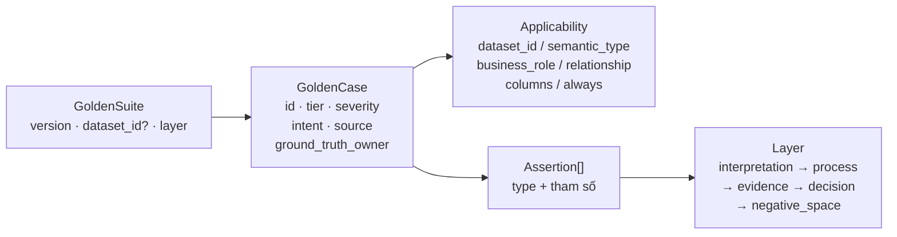

**19 loại assertion, chia 5 tầng:**

| Tầng | Assertion | Câu hỏi |
|---|---|---|
| `interpretation` | `semantic_type_is`, `nullable_expected_is`, `relationship_declared` | Agent **hiểu** cột này nghĩa gì không? |
| `process` | `tools_were_used`, `must_verify_before_asserting` | Nó **kiểm chứng** hay chỉ đoán? |
| `evidence` | `evidence_metric_exists`, `evidence_references_metric` | Trích dẫn có **giải được** không, có **đúng số liệu quyết định ngưỡng** không? |
| `decision` | `rule_proposed`, `rule_not_on_columns`, `enum_from_policy`, `parameter_bound`, `no_rules_on_tables`, `min_violations`, `severity_ranks_above`, `confidence_monotonic`, `forbidden_tokens`, `must_cite_numbers` | Luật đề xuất có đúng không? |
| `negative_space` | `max_false_positive_rate`, `must_abstain` | Nó có **không** làm điều không được làm? |

**`LAYER_ORDER` là quan hệ nhân quả, không phải trang trí.** `failure_attribution` đi theo
thứ tự này để quy trách nhiệm về **tầng sai sớm nhất** — không có nó, một `semantic_type` sai
hiện ra thành 4 defect và đẩy người đọc đi sửa `rule_proposer` cho lỗi thuộc
`dataset_understanding`.

**Hai lựa chọn có chủ đích:**
- `severity_ranks_above` — severity là **thứ tự, không tuyệt đối**. *"Luật này phải HIGH"* là
  ý kiến và ý kiến không được chặn release; *"thiếu khoá chính nghiêm trọng hơn lỗi định
  dạng"* là bất biến.
- `confidence_monotonic` — calibration đo **đơn điệu, không đo sai số**. Với vài chục
  proposal, con số calibration tuyệt đối là nhiễu; còn "nhóm confidence cao không kém chính
  xác hơn nhóm thấp" là thứ steward thật sự dựa vào khi triage.

`GoldenSuite.resolved_cases()` đẩy `dataset_id` của suite xuống case **chỉ khi** case chưa có
scope riêng — `GC-E5` nói về `source_row_id`, một khoá platform tạo trên mọi dataset, nên
không được giam vào một fixture taxi.

### 4.5 `applicability.py` — case này nói về cột nào

Đây là file khiến golden set dùng được cho **dataset bất kỳ**.

| Hàm | Nhiệm vụ |
|---|---|
| `build_dataset_context()` | Dựng `DatasetContext` từ `dataset-profile` + `semantic-contract` của bundle |
| `resolve(case, dataset)` | Trả `Scope`: case này áp cho **cột nào**, hay `NOT_APPLICABLE` |
| `resolve_evidence_ref()` | Trích dẫn `profile.column.X.Y` có giải được về số liệu thật không |
| `semantic_vocabulary()` | Phân bố `semantic_type` quan sát được |

**Thứ tự trong `resolve()` quan trọng:**

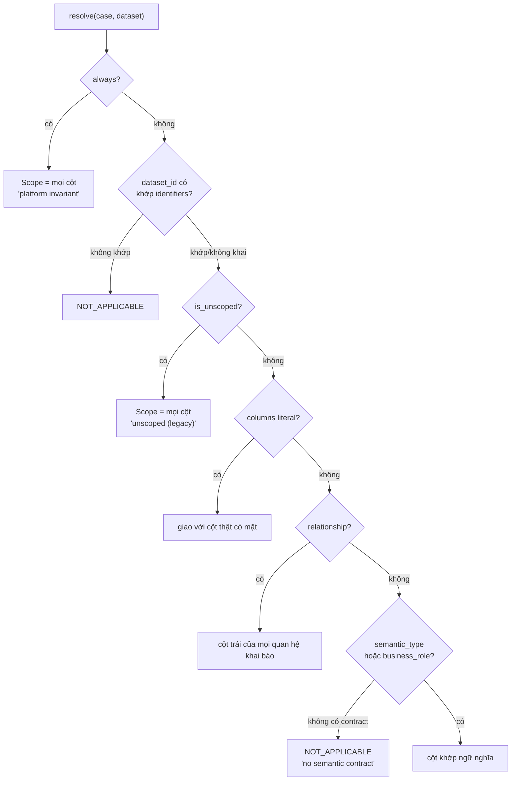

**`identifiers` = {`corpus_id`, `dataset_id`}** — và điều này từng suýt tắt cả golden set.
Sản phẩm cấp `dataset-import-<uuid>` mới **mỗi lần upload**, nên case neo vào `dataset_id`
runtime khớp **không gì cả, mãi mãi**. Ground truth phải neo vào `corpus_id`, thứ ổn định
giữa các run. Bật lọc lần đầu → **cả 9 case NOT_APPLICABLE**.

`Scope.applicable` được **lưu chứ không suy ra từ `reason`**: "dataset không có cột currency"
và "agent không sinh ra semantic contract nào để đối chiếu" là hai trạng thái khác nhau, cái
thứ hai là lỗi sản phẩm đáng gọi tên.

### 4.6 `freeze.py` — đóng băng tier 1

| Hàm | Nhiệm vụ |
|---|---|
| `build_labels(dataset_id)` | generate → recover preexisting → profile → build_plan → inject → **verify** |
| `freeze(write=)` | Lặp 7 archetype, ghi snapshot + `manifest.yaml` |

**`freeze` từ chối đóng băng nếu `verify` không đạt.** Một reference set chứa nhãn mà dữ liệu
không chống lưng sẽ phạt agent vì bỏ sót defect *không tồn tại*, và mọi điểm dẫn xuất từ nó
thừa kế sai lầm đó trong im lặng.

`--verify` tái sinh nhãn từ seed và so fingerprint → snapshot bị sửa tay hoặc để cũ **bị bắt
chứ không được tin**. Snapshot là để review và diff; **generator vẫn là nguồn sự thật**.

`manifest.yaml` hiện tại: 7/7 archetype `FROZEN`, `sdih_seed = 20260819`, `max_rows = 20000`,
tổng **5.764 nhãn**, `corpus-nyc-taxi-50k` có 3.498 nhãn / 8 lớp.

### 4.7 SDIH — sinh ground truth cho schema bất kỳ

| File | Nhiệm vụ |
|---|---|
| `sdih/defect_taxonomy.py` | 10 lớp defect + `applicable_columns()` — precondition từng lớp |
| `sdih/profiler.py` | Profiler tự chứa, **không** import profiler của sản phẩm |
| `sdih/injector.py` | `build_plan()` + `inject()` — chèn tại vị trí dòng rời nhau |
| `sdih/label_store.py` | `CellLabel` + `LabelStore` + `fingerprint()` |
| `sdih/verifier.py` | **Chứng minh nhãn đúng** trước khi ai chấm theo nó |

**Ba quyết định thiết kế:**

1. **Dataset không có cột đủ điều kiện cho một lớp thì báo `NOT_APPLICABLE`, không phải
   recall 0.** Lẫn "agent bỏ sót" với "không có gì để sót" là cách dễ nhất tạo ra một đánh
   giá sai.
2. **SDIH không import `db_profiler_tool` của sản phẩm** — nó phải profile được DataFrame
   *trước khi* dữ liệu chạm vào sản phẩm, và phải sống sót khi profiler sản phẩm đổi.
3. **`RELATIONAL_DEFECTS`** (`DUPLICATE_ROW`, `CROSS_FIELD_VIOLATION`) chiếm cột **độc quyền**:
   nhãn của chúng là mệnh đề về *quan hệ*, nên một lớp khác ghi vào cùng cột có thể âm thầm
   làm nhãn thành sai.

`nyc_preexisting.recover_labels()` phục hồi 1.250 defect đã có sẵn trong fixture NYC
(`MUTATION_SEED = 1337`) và gắn `origin="preexisting"` — nếu SDIH chèn đè lên mà không biết,
mọi defect có sẵn mà agent **bắt được** sẽ bị tính là false positive, và precision sẽ cao
một cách có hệ thống.

### 4.8 Kết quả golden run 02/09

```
16 case · áp dụng 13/16 (0.8125) · pass 0.60 · critical failures 0
attribution: {decision: 3, negative_space: 1}
semantic_vocabulary: {numeric: 12, text: 5, category: 4}
```

**Trượt (4):** `GC-E1-RANGE-NONNEGATIVE`, `GC-E4-CROSSFIELD-ORDERING`,
`GL-RATIONALE-NO-TECHNICAL-NAMES` (decision) · `GS-COLD-START-ABSTAINS` (negative_space).

**NOT_APPLICABLE (3):** `GS-CURRENCY-NON-NEGATIVE`, `GS-IDENTIFIER-NOT-NULL`,
`GS-EVENT-ORDER-IS-CROSS-FIELD` — `semantic_vocabulary` chỉ ra nguyên nhân: bộ tất định chỉ
sinh `numeric/text/category`, **không có `currency` hay `identifier`**, nên selector ngữ
nghĩa không có gì để khớp.

> 🔺 `_max_false_positive_rate` trong `golden_handlers/tier1_sdih.py:40` là **code chết**:
> `truth = set(a.columns)` với comment *"populated by the caller from the label store"* —
> caller không bao giờ populate, nên nó luôn trả `measurable=False`.

---

## 5. EVIDENCE LẤY TỪ ĐÂU

### 5.1 Hai loại "evidence" — đừng lẫn

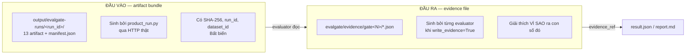

| | Artifact bundle (vào) | Evidence file (ra) |
|---|---|---|
| Ai tạo | `product_run.py` + sản phẩm | Từng evaluator |
| Ở đâu | `output/evalgate-runs/<run_id>/` | `evalgate/evidence/gate<N>/` |
| Có checksum? | **Có** — SHA-256 mỗi file | Không |
| Gắn run_id? | **Có** | 🔺 **Không** — D-21.9 |
| Vào git? | Không (`.gcloudignore`) | Không (`evalgate/.gitignore`) |

### 5.2 13 artifact đầu vào

| Type | Đường dẫn | Producer | Evaluator nào cần |
|---|---|---|---|
| `input-dataset` | `input/dataset.csv` | served upload fixture | `vacuity_probe_v1` |
| `api-transcript` | `api/transcript.json` | `product_run` | `egress_probe_v1` |
| `dataset-profile` | `profile/profile.json` | FastAPI ingestion | golden applicability |
| `semantic-contract` | `semantic/contract.json` | LangGraph understanding | golden applicability |
| `proposals` | `proposals/proposals.json` | LangGraph proposal | `golden_conformance`, `governed_enum`, `vacuity` |
| `review-decisions` | `review/decisions.json` | Steward API đã xác thực | *(chưa evaluator nào đọc)* |
| `ruleset` | `ruleset/ruleset.json` | publish step | *(chưa đọc)* |
| `execution-results` | `execution/results.json` | typed rule execution | `replay_detection`, `egress_probe` |
| `anomaly-report` | `anomaly/report.json` | LangGraph anomaly | `golden_conformance` |
| `llm-invocations` | `traces/llm-invocations.jsonl` | LLM tất định | `golden_conformance` (tool events) |
| `traces` | `traces/node-events.jsonl` | LangGraph node broker | `trace_coverage_v1` |
| `upload-probe` | `api/upload-probe.json` | `product_run` | `upload_probe_v1` |
| `run-outcome` | `execution/run-outcome.json` | `product_run` | `run_outcome_integrity_v1` |

Thêm 4 type chỉ có ở profile trả phí: `live-agent`, `promptfoo-result`, `geval-result`,
`k6-result`.

### 5.3 Chuỗi tin cậy của artifact

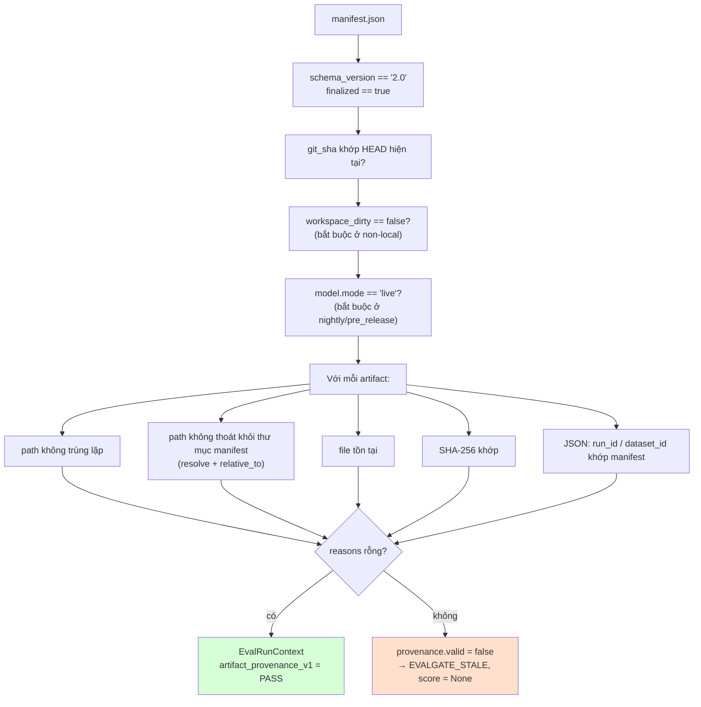

`ArtifactManifestV2.consistent_lineage()` (validator Pydantic) còn kiểm ở tầng model: không
trùng `name`, không trùng `relative_path`, mọi artifact có cùng `run_id` và `dataset_id` với
manifest.

`EvalRunContext.path_for()` kiểm containment **lần nữa** lúc chạy:
```python
candidate = (root / record.relative_path).resolve()
candidate.relative_to(root)      # ném ValueError nếu thoát ra ngoài
```

### 5.4 Evidence file đầu ra

| Thư mục | File | Evaluator |
|---|---|---|
| `evidence/preflight/` | `workspace_integrity.json` | `workspace_integrity_v1` |
| `evidence/gate1/` | `replay_detection_v1.json`, `vacuity_probe.json`, `governed_enum_conformance.json`, `golden_conformance.json`, `run_outcome_integrity.json`, `anomaly_logic_probe.json`, `sql_compilation_probe.json`, `report_grounding_probe.json` | Gate 1 |
| `evidence/gate2/` | `authz_probe_matrix.json`, `asgi_behaviour_probe.json`, `egress_probe.json`, `secret_scan.json`, `default_credential_probe.json` | Gate 2 |
| `evidence/gate4/` | `ingest_fidelity.json`, `profile_accuracy_probe.json` | Gate 4 |
| `evidence/gate5/` | `config_static_check.json` | Gate 5 |
| `evidence/gate6/` | `contract_conformance.json`, `hitl_integrity.json`, `policy_resolution_matrix.json`, `served_path_fidelity.json`, `capability_regression.json` | Gate 6 |
| `evidence/governance/` | `regression.json` | `regression_engine_v1` |
| `evidence/readiness/` | `multi_dataset_readiness.json` | `multi_dataset_readiness_v1` |

Mỗi `Finding` mang `evidence_ref` trỏ tới file tương ứng, nên mọi kết luận đều **mở ra kiểm
được**.

> 🔺 **D-21.9 — evidence không gắn run_id.** `evidence/gate1/` hiện chứa file từ 31/08 lẫn
> 01/09. Evaluator không chạy trong run mới để lại file cũ nguyên chỗ, và `evidence_ref` trỏ
> đường dẫn cố định → người đọc có thể mở evidence của **run khác**. Trái ngược với
> `runs/<run_id>/result.json` vốn có namespace đúng.

### 5.5 `--dry-run` và `write_evidence`

Cờ `--dry-run` đi qua biến `_WRITE[0]` trong `run.py` xuống `write_evidence=` của mọi
evaluator. Với `--dry-run`: **không** ghi evidence, **không** ghi report, **không** lưu vào
`runs/`. Mọi phép đo vẫn chạy đủ và số ra y hệt.

---

## 6. CHUẨN HOÁ: VÌ SAO GỘP ĐƯỢC NHIỀU METRIC

### 6.1 Vấn đề

102 metric với các đơn vị hoàn toàn khác nhau:

```
detection_f1_macro          = 0.0        (ratio, cao hơn = tốt hơn)
cross_tenant_violations     = 0          (count, thấp hơn = tốt hơn)
trace_p95_latency_ms        = 42.52      (mili giây)
served_path_is_mocked       = False      (boolean)
llm_cost_usd                = 0.00       (USD)
row_fidelity                = 100.0      (phần trăm)
```

Cộng thẳng những số này là vô nghĩa. Chuẩn hoá là cách làm cho phép cộng có nghĩa.

### 6.2 Bốn tầng gộp

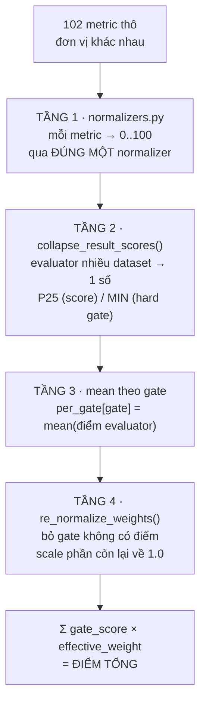

### 6.3 Tầng 1 — `normalizers/normalizers.py`

**Luật:** *mỗi metric thô đi qua đúng một normalizer.* Aggregator **không bao giờ nhìn thấy
đơn vị thô**, nên không metric nào có thể bị cộng nhầm thang.

| Normalizer | Công thức | Dùng cho |
|---|---|---|
| `ratio(v)` | `clamp(v × 100)` | recall, F1, fidelity, coverage — **cao hơn tốt hơn** |
| `inverse_ratio(v)` | `clamp((1−v) × 100)` | error rate, vacuity rate — **thấp hơn tốt hơn** |
| `zero_tolerance(n)` | `100 nếu n == 0, ngược lại 0` | đếm vi phạm |
| `boolean(b)` | `100 / 0` | cờ nhị phân |
| `latency_band(ms)` | `≤1000→100 · ≤3000→70 · ≤10000→30 · >→0` | độ trễ |
| `psi_band(psi)` | `<0.1→100 · <0.25→60 · →0` | drift |
| `time_band(s)` | `≤5p→100 · ≤15p→70 · ≤60p→40 · →0` | time-to-first-value |
| `variance(σ)` | `clamp(100 − σ×200)` | generalization |
| `budget(usd, budget)` | `clamp((1 − usd/budget) × 100)` | chi phí |
| `severity(s)` | `CRITICAL 0 · HIGH 25 · MEDIUM 60 · LOW 85 · NONE 100` | mức nghiêm trọng |

**`zero_tolerance` là quyết định chính sách, không phải toán học.** Không nội suy: **một** vi
phạm CRITICAL cũng tệ như nhiều cái. 8 endpoint mở trên 44 **không phải** "hỏng 18% cơ chế
duyệt" — nếu trong đó có `POST /dq/runs/{id}/publish` không cần đăng nhập thì cơ chế duyệt
**không tồn tại**. Một cái khoá hỏng trong 44 cái thì ngôi nhà không an toàn 82%.

**`_clamp` chặn `None` và `NaN` về 0.0** — không metric nào lọt qua với giá trị không xác định.

### 6.4 Tầng 2 — thu gọn nhiều dataset

```python
def collapse_per_dataset(values, *, is_hard_gate_metric):
    if is_hard_gate_metric:
        return min(usable)          # MIN
    return norm.percentile(usable, 0.25)   # P25
```

**Vì sao MIN cho hard gate và P25 cho điểm — không phải trung bình:**

> Trung bình cho phép **sáu dataset khoẻ che một dataset hỏng**. Đó chính xác là chế độ hỏng
> mà một sản phẩm quảng cáo *"chạy với dataset bất kỳ"* **không được phép có**.

MIN nghiêm nhất, dùng cho câu hỏi nhị phân "control này có giữ ở mọi nơi không". P25 mềm hơn
một chút cho điểm số, nhưng vẫn kéo về phía đuôi xấu.

Dataset có status thuộc `EXCLUDED_FROM_AGGREGATE` **không đóng góp số nào** nhưng **vẫn nằm
trong report** — nó là khoảng trống của sản phẩm, không phải thứ để biến mất.

> 🔺 **D-21.6** — hai evaluator dùng `per_dataset_breakdown` cho *case* thay vì *dataset*:
> `golden_conformance` (16 case) và `policy_resolution` (7 probe dataset). P25 trên phân bố
> nhị phân có >25% giá trị 0 luôn cho **0**, nên `score` 60.0 và 100.0 đều vào gate thành
> **0.00**. `DatasetBreakdown` đang bị dùng quá tải về ngữ nghĩa.

### 6.5 Tầng 3 — trung bình theo gate

```python
per_gate[result.gate].append(collapse_result_scores(result))
gate_scores[gate] = sum(scores) / len(scores)
```

Chỉ evaluator `counts_toward_aggregate()` (status **không** thuộc `EXCLUDED_FROM_AGGREGATE`)
và có điểm khác `None` mới được vào.

### 6.6 Tầng 4 — tái chuẩn hoá trọng số

```python
def re_normalize_weights(weights, excluded):
    kept = {g: w for g, w in weights.items() if g not in excluded}
    return {g: w / sum(kept.values()) for g, w in kept.items()}
```

**Vì sao phải tái chuẩn hoá:** gate không đo được mà bị tính 0 điểm thì *"chưa xây"* bị phạt
y hệt *"xây rồi và hỏng"*. Đó là hai mệnh đề khác nhau.

**Vì sao tái chuẩn hoá là chưa đủ:** nó **âm thầm dồn toàn bộ verdict** lên những gate còn
lại. Nên có `MIN_MEASURED_WEIGHT = 0.60`: dưới sàn đó, câu trả lời trung thực là *"không đủ
bằng chứng cho một con số"*, chứ không phải *"con số này thấp"*.

Run 02/09: **không gate nào bị loại** (lần đầu), nên `effective_weights == weights`.

### 6.7 Độ phủ đếm theo evaluator, không theo gate

```python
covered = Σ weight[gate] × (ran[gate] / declared[gate])
```

Phiên bản cũ cộng trọng số của **gate không bị loại hoàn toàn** — tức coi gate là đo đủ ngay
khi *một* evaluator của nó chạy. Ngày 22/08 nó báo 0.85 trong khi thực tế mới đo 0.54:
`ai_security` được ghi trọn 0.22 với 4/7 evaluator chạy, và **hai cái không chạy chính là
probe BOLA và probe upload độc hại**.

Run 02/09:

| Gate | ran/declared | weight | đóng góp coverage |
|---|---|--:|--:|
| `ai_quality` | 8/11 | 0.35 | 0.2545 |
| `ai_security` | 6/7 | 0.25 | 0.2143 |
| `input_data` | 3/5 | 0.15 | 0.0900 |
| `governance` | 6/6 | 0.15 | 0.1500 |
| `observability` | 1/1 | 0.10 | 0.1000 |
| | | | **0.8088** |

> 🔺 **D-21.4** — mẫu số bị thổi bởi 3 evaluator **không tồn tại trong REGISTRY**
> (`gx_corpus_integrity_v1`, `evidently_drift_v1`, `generalization_evaluator_v1`). Không có
> chúng: `ai_quality` 8/8, `input_data` 3/3.

### 6.8 Hard gate **không** đi qua chuẩn hoá

Đây là điểm dễ hiểu nhầm nhất. `evaluate_hard_gates()` đọc **`metric.raw`**, không đọc
`normalized`:

```python
observed[key] = float(metric.raw)
breached = _evaluate_rule(spec["rule"], value)   # ví dụ "value <= 0"
```

**Vì sao:** một quy tắc chặn release phải phát biểu bằng đơn vị của chính lĩnh vực đó
(*"recall = 0"*, *"có ≥1 secret"*), không phải bằng điểm đã chuẩn hoá. Chuẩn hoá phục vụ
**cộng gộp**; hard gate phục vụ **chặn**, và hai việc đó không được trộn.

`_evaluate_rule` là một DSL đóng: thay `value` bằng số rồi kiểm mọi ký tự thuộc
`_ALLOWED_RULE_CHARS` (`0-9 . < > = ! e E + - ( )`) trước khi `eval` với `__builtins__` rỗng.
Ký tự lạ → `ValueError`, không phải thực thi.

`detect_metric_collisions()` canh namespace phẳng: hai evaluator cùng chiếm một tên metric
→ hard gate đọc phải cái chạy sau → toàn bộ verdict thành `EVALGATE_INVALID`.

### 6.9 Tóm tắt: vì sao con số cuối có nghĩa

| Bảo đảm | Cơ chế |
|---|---|
| Không cộng nhầm thang | Mỗi metric qua đúng 1 normalizer; aggregator không thấy đơn vị thô |
| Dataset hỏng không bị che | MIN / P25, không dùng trung bình |
| Chưa đo ≠ đo rồi và tệ | `EXCLUDED_FROM_AGGREGATE` + tái chuẩn hoá |
| Đo quá ít thì không công bố | Sàn `minimum_measured_weight = 0.60` |
| Điểm cao không mua được release | Hard gate đọc `raw`, xét **trước** điểm |
| Cấu hình mập mờ thì không có verdict | `metric_collisions` → `EVALGATE_INVALID` |

---

## 7. SCHEMAS

### 7.1 Hai hợp đồng

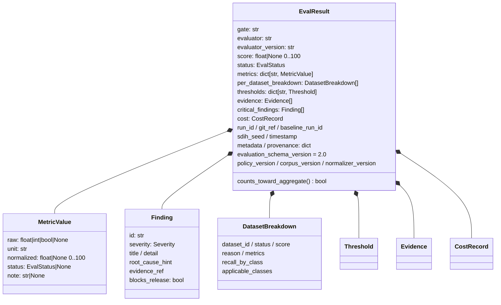

**Mọi evaluator, dù thuộc gate nào, đều trả `EvalResult`.** Hợp đồng cố ý **đóng**
(`extra="forbid"`) — adapter trôi khỏi hình dạng sẽ **hỏng to tiếng** thay vì âm thầm đóng
góp một con số sai vào điểm cuối.

**`MetricValue` tách `raw` và `normalized` có chủ ý:** metric khác thang **không bao giờ được
cộng trước khi chuẩn hoá**. `normalized` bị ràng `ge=0.0, le=100.0` ở tầng Pydantic.

### 7.2 `EvalStatus` — 12 trạng thái, 3 nhóm

```mermaid
flowchart TB
    subgraph OK["ĐƯỢC TÍNH ĐIỂM"]
        S1["PASS"] --- S2["WARN"] --- S3["FAIL"]
    end
    subgraph EX["EXCLUDED_FROM_AGGREGATE — bị loại, kéo theo tái chuẩn hoá"]
        direction TB
        E1["NOT_APPLICABLE — không áp dụng cho ca này"]
        E2["NOT_IMPLEMENTED — chưa xây"]
        E3["NOT_MEASURED — có chạy nhưng không có mẫu"]
        E4["NOT_EXECUTED — không chạy trong profile này"]
        E5["BLOCKED_MISSING_CREDENTIAL"]
        E6["BLOCKED_MISSING_GROUND_TRUTH"]
        E7["BLOCKED_BY_SYSTEM_CAPABILITY — evaluator OK, SẢN PHẨM chưa đo được"]
        E8["STALE_EVIDENCE"]
        E9["EVALUATOR_ERROR"]
        E10["MISSING_MANDATORY_EVIDENCE"]
    end
```

**`BLOCKED_BY_SYSTEM_CAPABILITY` khác về bản chất:** evaluator hoạt động tốt, **sản phẩm**
chưa đo được. Nó ở lại trong report như một khoảng trống của sản phẩm thay vì biến mất khỏi
đó.

> 🔺 `EVALUATOR_ERROR` nằm trong `EXCLUDED_FROM_AGGREGATE`, nên evaluator ném exception
> **rơi khỏi aggregate thay vì bị chấm 0** — kết hợp với `assert` trần ở D-21.3 thì sản phẩm
> sai lại không kéo điểm xuống.

### 7.3 `ArtifactManifestV2` — hợp đồng provenance

| Trường | Ràng buộc | Vì sao |
|---|---|---|
| `schema_version` | `Literal["2.0"]` | v1.0 chỉ dùng chẩn đoán |
| `finalized` | `Literal[True]` | Bundle dở dang không chấm được |
| `git_sha` | `^[0-9a-f]{7,40}$` | Gắn vào revision |
| `workspace_dirty` | bool | non-local: phải `false` |
| `dataset_id` | runtime id | `dataset-import-<uuid>`, mới mỗi lần upload |
| **`corpus_id`** | optional | **Ground truth neo vào đây**, không neo `dataset_id` |
| `dataset_fingerprint` | `^[0-9a-f]{64}$` | SHA-256 của file input |
| `schema_fingerprint` | 64 hex | Hash của (tên cột, dtype) |
| `model` | `ModelIdentity` frozen | `mode ∈ {deterministic-test, live}` |
| `prompt_hash` | 64 hex | Hash của `src/agents/nodes/*.py` |
| `policy_hash` | 64 hex | Hash của `evalgate/policies/*.yaml` |
| `config_hash` | 64 hex | Hash của `profiles.yaml` + `evaluator_registry.py` |
| `artifacts` | `tuple[ArtifactRecord, ...]` min 1 | frozen |

**`_safe_relative()`** chặn path traversal ngay ở tầng schema: từ chối chuỗi rỗng, bắt đầu
bằng `/` hoặc `../`, chứa `/../`, kết thúc `/..`, hoặc có `:` ở segment đầu (ổ đĩa Windows).

**`corpus_id` tách khỏi `dataset_id`** là sửa lỗi từng suýt tắt cả golden set — xem §4.5.

### 7.4 Các schema phụ

| Schema | File | Vai trò |
|---|---|---|
| `EvaluatorSpec` | `core/evaluator_registry.py` | Frozen dataclass: name, version, gate, module, profiles, cost_class, required_dependencies, required_artifacts, runner_kind, critical |
| `EvalRunContext` | `core/context.py` | Frozen dataclass; `records()`, `require_records()`, `path_for()`, `read_json()` |
| `Suppression` | `core/suppression_policy.py` | `id` khớp `^SUP-...`, bắt buộc owner/ticket/reason ≥8 ký tự, `created_at`, `expires_at`, `baseline_git_sha` |
| `GoldenCase` / `GoldenSuite` / `Assertion` / `Applicability` | `golden/schema.py` | Định dạng golden, `extra="forbid"` |
| `CellLabel` / `LabelStore` | `sdih/label_store.py` | Ground truth mức ô + `fingerprint()` |
| `AggregateOutcome` | `aggregator.py` | Dataclass kết quả gộp, gồm `block_reasons`, `provisional_score`, `score_withheld_reason` |

### 7.5 Bốn version bám theo mọi kết quả

```
evaluation_schema_version = "2.0"
policy_version            = "1.0"
corpus_version            = "1.0"
normalizer_version        = "1.0"
```

`regression_engine` **từ chối so sánh** khi bốn version này khác nhau và trả `NOT_MEASURED`
thay vì sinh ra một delta gây hiểu nhầm. Đổi cách chuẩn hoá hoặc đổi corpus thì baseline cũ
**không còn so được** — và điều đó được nói ra thay vì bị nuốt.

### 7.6 `Suppression` — ratchet có kiểm soát

`policies/suppressions.yaml` hiện **rỗng**. Khi có entry, nó bị kiểm:

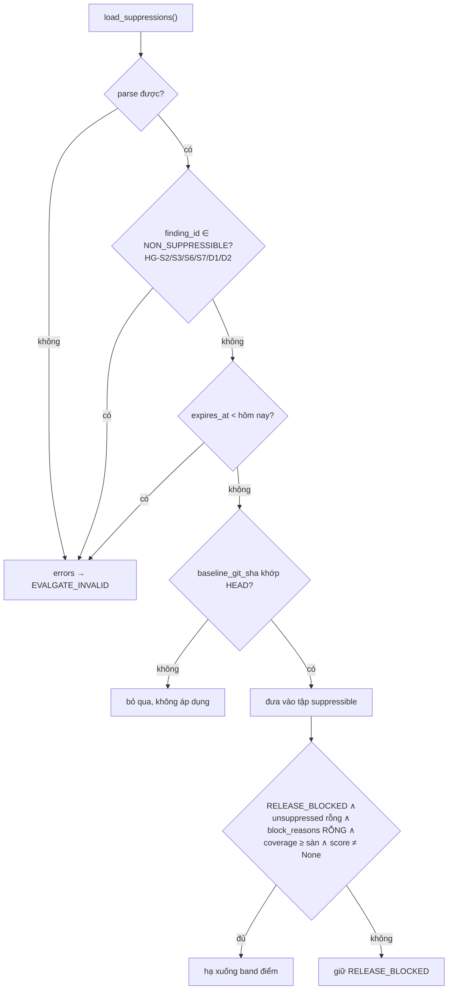

Điều kiện `block_reasons` rỗng là bản vá D-20.1: với `suppressions.yaml` **rỗng**, một run bị
chặn thuần vì *thiếu bằng chứng* từng được đẩy thẳng lên band điểm, vì 4/6 nguyên nhân chặn
không sinh finding id nào.

---

## 8. ĐIỂM TỔNG

### 8.1 Phán quyết 02/09/2026

```text
DECISION   RELEASE_BLOCKED          exit 3
SCORE      79.58
COVERAGE   80.88%                   (sàn 60%)
MANDATORY  100%
RUN        product-a10049a59e094e6d979c596c6cc98423
GIT        5a5a1a234b8de55e7423e4a7fd33255908b6530c
BASELINE   product-ffd77da3e3e14473940d70e1b99f89d1  (45887f7)
```

### 8.2 Cách 79.58 được tạo ra

```
ai_quality      58.33 × 0.35 = 20.42
ai_security    100.00 × 0.25 = 25.00
input_data      83.33 × 0.15 = 12.50
governance      77.78 × 0.15 = 11.67
observability  100.00 × 0.10 = 10.00
                       TỔNG    79.58
```

**Lần đầu không gate nào bị loại** → `effective_weights == weights`, không tái chuẩn hoá.

### 8.3 Vì sao vẫn RELEASE_BLOCKED dù 79.58 > 70

Hard gate và `block_reasons` xét **trước** band điểm:

```text
FAIL           HG-A8   governed_column_coverage = 0.0

BLOCK REASONS
  - mandatory hard gate(s) not evaluated: HG-A1, HG-A3
  - mandatory evaluator(s) failed: contract_conformance_v1, golden_conformance_v1,
                                   governed_enum_conformance_v1, replay_detection_v1
```

### 8.4 So với các mốc trước

| | Baseline `45887f7` | `64398cf` (31/08) | **`5a5a1a2` (02/09)** |
|---|---:|---:|---:|
| Score | 70.00 | 67.67 | **79.58** |
| Coverage | 65.36% | 72.36% | **80.88%** |
| Mandatory evidence | 95% | 100% | **100%** |
| Evaluator | 31 | 31 | **35** |
| Hard gate PASS | — | 20/24 | **20/24** |
| `ai_quality` | 41.67 (4/8) | 33.33 (5/8) | 58.33 (**8/11**) |
| `ai_security` | 100.00 (6/7) | 100.00 (6/7) | 100.00 (6/7) |
| `input_data` | 75.00 (2/4) | 75.00 (2/4) | 83.33 (**3/5**) |
| `governance` | 73.33 (5/6) | 77.78 (6/6) | 77.78 (6/6) |
| `observability` | — | — | **100.00 (1/1)** |

### 8.5 ⚠️ Đọc 79.58 cho đúng

**Ba con số này không so trực tiếp được với nhau** — mỗi lần tập evaluator đổi thì mẫu số đổi
theo. Chấm lại **chính bundle 02/09** với đúng tập evaluator của run 67.67:

| Kịch bản | Score | Coverage |
|---|---:|---:|
| A. Như đã chạy (35 evaluator) | **79.58** | 80.88% |
| B. Bỏ 5 evaluator thêm sau 31/08 → **so cùng rổ** | **66.20** | 65.80% |
| C. Chỉ bỏ 3 probe không đọc bundle trong `ai_quality` | 70.83 | 77.30% |

> **So cùng rổ: 67.67 → 66.20, tức −1.47 điểm. Sản phẩm gần như đứng yên.**
> `ai_quality` ở kịch bản B vẫn đúng **33.33**.

13.38 điểm chênh giữa A và B đến từ evaluator mới, trong đó **8.75 điểm tổng** đến từ ba probe
không đọc một byte nào của bundle.

### 8.6 Phần nào của 79.58 đáng tin

| Thành phần | Đóng góp | Đánh giá |
|---|---:|---|
| `ai_security` | 25.00 | ✅ **Đáng tin** — probe tĩnh/ASGI chạy thật, 162 case kết luận được / 0 vô kết luận. **Trừ `HG-S4`, đang PASS giả (D-21.1)** |
| `governance` | 11.67 | ✅ **Đáng tin**, và đang **bị chấm thấp hơn thực tế** — D-21.6 khiến `policy_resolution` đóng góp 0 thay vì 100; tính đúng thì gate là 94.44 |
| `input_data` | 12.50 | 🟡 Một nửa từ `profile_accuracy_probe` không đọc bundle |
| `observability` | 10.00 | 🟡 Đo "event ghi đủ trường", **không** đo "mọi thứ đáng ghi đã ghi" |
| `ai_quality` | 20.42 | 🔴 **Chưa đáng tin** — trừ ba probe không gắn bundle thì còn 33.33, và nó đang chấm **heuristic fallback chứ không phải agent** |

Log bundle: *"Tất cả các lượt gọi LLM đều thất bại (2/2 batches). Kích hoạt Heuristic Rule
Promotion"* — `DeterministicEvalLLM` vẫn làm hỏng cả hai deep agent.

### 8.7 Việc cần làm, theo thứ tự

```text
1. sửa key HG-S4               ← 1 dòng; đang là hard gate chết (D-21.1)
2. dọn _declared_but_not_run   ← 3 evaluator ma + 2 lý do sai sự thật (D-21.4, D-21.5, D-21.10)
3. bỏ assert trần              ← để evaluator FAIL đúng cách (D-21.3)
4. gắn 4 probe vào manifest    ← hoặc chuyển hẳn về evalgate/tests/ (D-21.2) — nặng nhất
5. sửa DeterministicEvalLLM    ← nền của mọi con số ai_quality
6. product_run → đường canonical
7. tách ngữ nghĩa DatasetBreakdown khỏi case breakdown (D-21.6)
8. đặt evidence/ dưới run_id   ← (D-21.9)
```

Mục 1-3 rẻ nhưng đang làm sai ba con số công bố. Mục 4-6 đổi **bản chất độ tin cậy**. Mục 7-8
là nợ cấu trúc.

---

## PHỤ LỤC — TRẠNG THÁI KIỂM CHỨNG

```text
Ngày:                    2026-09-02
Nhánh / commit:          chien @ 5a5a1a2
Run được phân tích:      product-a10049a59e094e6d979c596c6cc98423 (ci, dry-run)
Phán quyết:              RELEASE_BLOCKED (exit 3) · 79.58 · coverage 80.88%
Self-test EvalGate:      334 passed, 4 skipped
ruff check evalgate/:    SẠCH
golden freeze --verify:  OK, tier 1 không drift
Evaluator / metric:      35 / 102
Hard gate:               24 — 20 PASS / 1 FAIL (HG-A8) / 3 NOT_EVALUATED
Critical finding:        6 (1 chặn release)
Chi phí LLM:             $0.00
Ghi vào evalgate/:       chỉ file này + gates/gate7_business/steward_export.py
                         evidence/, reports/, runs/ giữ nguyên (chạy --dry-run)
Sửa src/:                KHÔNG
git add/commit/push:     KHÔNG THỰC HIỆN
Defect đã biết:          10 mục — EVALGATE_REPORT.md §21.6 (D-21.1 … D-21.10)
```

**Tài liệu liên quan:** `EVALGATE_REPORT.md` §20 (run 31/08) · §21 (run 02/09 sáng, gồm
§21.3b từng gate từng metric và §21.6 mười defect) · **§22 (đợt sửa 02/09 chiều — đọc
trước)** · `golden/README.md` · `EVALGATE_PRESENT.md`
