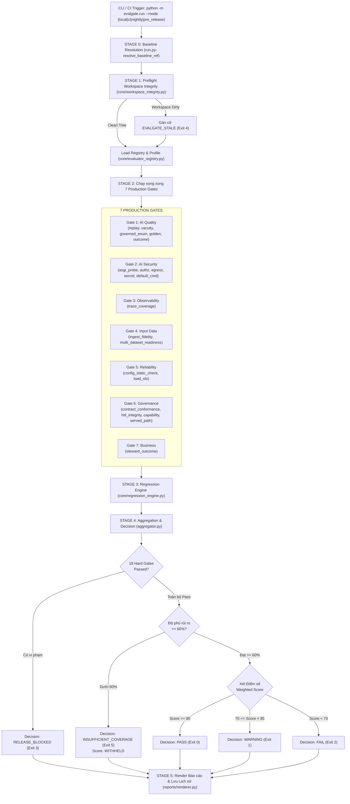
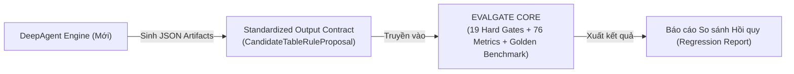

# EVALGATE — BÁO CÁO TOÀN THƯ KIẾN TRÚC, MÃ NGUỒN & TRẠNG THÁI HIỆN TẠI

## (EVALGATE PRESENT ARCHITECTURE & COMPREHENSIVE CODE REFERENCE)

> **Phiên bản tài liệu:** `Present-3.0 (Encyclopedic Reference)` · **Nhánh Git:** `chien`
> **Hợp đồng Policy:** `1.0` · **Schema Version:** `2.0` · **Hard Gates Policy:** `6.0`
> **Đối tượng sử dụng:** Senior AI Engineer, Data Governance Architect, CI/CD & Security Reviewer.

---

# MỤC LỤC TỔNG QUAN

|    Phần    | Nội dung                                                                                                                                                    |
| :---------: | :----------------------------------------------------------------------------------------------------------------------------------------------------------- |
| **1** | [Bản chất & 5 Bất biến Thiết kế của EvalGate](#1-bản-chất--5-bất-biến-thiết-kế-của-evalgate)                                                |
| **2** | [Kiến trúc Luồng Hoạt động Toàn trình (End-to-End Execution Flow)](#2-kiến-trúc-luồng-hoạt-động-toàn-trình)                                   |
| **3** | [Bản đồ 7 Cổng Chất lượng & Phân tích Chi tiết Từng File, Từng Hàm, Từng Metric](#3-bản-đồ-7-cổng-chất-lượng--phân-tích-chi-tiết) |
| **4** | [Danh mục 19 Hard Gates & Vị trí Mã Nguồn Kiểm soát](#4-danh-mục-19-hard-gates--vị-trí-mã-nguồn-kiểm-soát)                                  |
| **5** | [Tầng Cốt lõi Hạ tầng & Kiểm soát An toàn (Core Infrastructure)](#5-tầng-cốt-lõi-hạ-tầng--kiểm-soát-an-toàn)                              |
| **6** | [Tầng Golden Dataset 3 Tầng & Động cơ Sinh Lỗi SDIH](#6-tầng-golden-dataset-3-tầng--động-cơ-sinh-lỗi-sdih)                                    |
| **7** | [Hướng dẫn Kích hoạt Backend, Frontend & 4 Lệnh Vận hành EvalGate](#7-hướng-dẫn-kích-hoạt-backend-frontend--lệnh-vận-hành)                |
| **8** | [Đánh giá Khả năng Thích ứng & Hướng dẫn Tích hợp DeepAgent](#8-đánh-giá-khả-năng-thích-ứng--hướng-dẫn-tích-hợp-deepagent)        |

---

# 1. BẢN CHẤT & 5 BẤT BIẾN THIẾT KẾ CỦA EVALGATE

EvalGate là **Hệ thống Cổng Chất lượng Quyết định Phát hành (Production Release Gate)** hoạt động theo chu trình khép kín:

$$
\text{Measurement} \longrightarrow \text{Evidence} \longrightarrow \text{Normalization} \longrightarrow \text{Scoring} \longrightarrow \text{Policy} \longrightarrow \text{Release Decision}
$$

### 5 Bất Biến Thiết Kế Bắt Buộc (Enforced Invariants):

1. **Hard Gate chạy TRƯỚC Điểm số:** Một lỗ hổng bảo mật CRITICAL không bao giờ được phép bị che lấp bởi điểm AI cao. Bất kỳ Hard Gate nào `FAIL` $\rightarrow$ Khóa phát hành `RELEASE_BLOCKED`.
2. **`NOT_*` $\neq 0$ điểm:** Trạng thái "Chưa đo được" (`NOT_MEASURED`, `NOT_IMPLEMENTED`, `BLOCKED_*`) bị loại khỏi mẫu số và kích hoạt Re-normalize trọng số. Tuyệt đối không tính 0 điểm để tránh trừng phạt oan hoặc khuyến khích xóa evaluator.
3. **Thuật toán Collapse Đa Dataset (MIN & P25):** Khi một evaluator chạy trên nhiều dataset:
   * Hard-gate metrics: Lấy giá trị **`MIN`** (1 dataset hỏng là hỏng cả hệ thống).
   * Score metrics: Lấy **`P25` (Phân vị 25)** (đại diện cho phần tư tệ nhất, không lấy trung bình cào bằng).
4. **`KNOWN_GAP` $\neq$ `REGRESSION`:** Lỗi đã tồn tại từ trước (`KNOWN_GAP`) được báo cáo nhưng không chặn release; chỉ những năng lực từng có ở bản trước nay bị mất (`REGRESSION`) mới chặn release.
5. **Sàn đo lường tối thiểu 60% (`MIN_MEASURED_WEIGHT = 0.60`):** Nếu tổng trọng số các evaluator đo được $< 60\%$ $\rightarrow$ Hệ thống từ chối công bố điểm số (`score = WITHHELD`) và trả về `INSUFFICIENT_COVERAGE`.

---

# 2. KIẾN TRÚC LUỒNG HOẠT ĐỘNG TOÀN TRÌNH



---

# 3. BẢN ĐỒ 7 CỔNG CHẤT LƯỢNG & PHÂN TÍCH CHI TIẾT

---

## 🟢 GATE 1: AI QUALITY (Trọng số Policy: 36% · Điểm hiện tại: `20.19 / 100`)

> **Nhiệm vụ:** Đánh giá độ chính xác toán học, tính hợp lệ logic và khả năng phát hiện lỗi của AI Agent.

### 1.1. `evalgate/gates/gate1_ai_quality/replay_evaluator.py`

* **Hàm thực thi chính:** `evaluate(reports_dir, write_evidence, context) -> EvalResult`
* **Các hàm con cốt lõi:**
  * `_parse_rule_id(rule_id)`: Tách `rule_id` thành `(column, rule_type)` (vd: `source_rows.fare_amount.RANGE`).
  * `load_archived_runs(reports_dir, context)`: Đọc các file JSON kết quả thực thi test (`execution-results`).
  * `_outcomes(run)`: Chuyển đổi kết quả chạy thành danh sách `RuleOutcome`.
  * `score_run(run, truth_by_class)`: Đối chiếu từng ID dòng vi phạm do AI gắn cờ (`sample_ids`) với tập nhãn sự thật (Ground Truth). Chỉ tính True Positive khi trùng khớp ID dòng cụ thể.
* **Các Metrics sinh ra:**
  * `detection_precision` (unit: ratio): $\frac{TP}{TP + FP}$ = **0.088** (91.2% báo động giả).
  * `detection_recall_macro` (unit: ratio): Trung bình Recall trên 11 lớp lỗi = **0.333** (Bỏ sót 66.7% lỗi).
  * `detection_f1_macro` (unit: ratio): Điểm F1 cân bằng = **0.160** (Ngưỡng đạt: $\ge 0.60$).
  * **`min_recall_per_class`** (unit: ratio): Recall của lớp lỗi tệ nhất = **0.0** $\longrightarrow$ **`HG-A1` FAIL**.

### 1.2. `evalgate/gates/gate1_ai_quality/vacuity_probe.py`

* **Hàm thực thi chính:** `evaluate(dataset_parquet, write_evidence, context) -> EvalResult`
* **Các hàm con cốt lõi:**
  * `judge_rule(rule, frame) -> RuleVerdict`: So sánh tham số của rule với phân phối dữ liệu thực tế. Phân loại: `VACUOUS` (rỗng), `DEGENERATE` (thoái hóa), `CAN_FIRE` (hợp lệ), `NOT_JUDGED` (không phán xét).
  * 5 loại rule cố ý không phán xét (`NOT_JUDGED`): `NOT_NULL` (guard hợp lệ), `UNIQUE`, `REGEX_FORMAT`, `FRESHNESS`, `CROSS_FIELD_COMPARISON`.
* **Các Metrics sinh ra:**
  * `vacuous_rule_rate` (unit: ratio): Tỷ lệ luật không bao giờ fail = **0.428** (80/187 rules rỗng).
  * `worst_type_vacuity_rate` (unit: ratio): Tỷ lệ rỗng của `ACCEPTED_VALUES` = **0.892** (66/74 rules rỗng).
  * **`systemic_vacuous_rule_types`** (unit: count): Số loại luật rỗng $> 50\%$ = **1** $\longrightarrow$ **`HG-A6` FAIL**.
  * `degenerate_threshold_rules` (unit: count): Số luật sống nhưng vô dụng (`min_row_count=1/50k`) = **17**.

### 1.3. `evalgate/gates/gate1_ai_quality/governed_enum_conformance.py`

* **Hàm thực thi chính:** `evaluate(write_evidence, context) -> EvalResult`
* **Các hàm con cốt lõi:**
  * `load_governed_domains()`: Đọc chính sách danh mục hợp lệ từ tài liệu quản trị.
  * `score_proposals(rules, domains)`: Đối chiếu enum AI đề xuất với domain chuẩn.
  * `count_unbacked_enums(rules, domains)`: Đếm số luật `ACCEPTED_VALUES` sinh ra trên cột không có policy.
  * `measure_planted_recall(results)`: Đo tỷ lệ phát hiện 4 dòng lỗi cố ý cài sẵn (Planted defects).
* **Các Metrics sinh ra:**
  * `governed_enum_conformance` (unit: ratio): Tỷ lệ khớp policy = **0.571** (Thiếu 3/7 giá trị).
  * **`tautological_enum_count`** (unit: count): Số enum tự nạp giá trị lỗi vào allow-list = **7** $\longrightarrow$ **`HG-A3` FAIL**.
  * `unbacked_enum_rules` (unit: count): Số enum trên cột không có policy quản trị = **76**.
  * `planted_defect_recall` (unit: ratio): Bắt được lỗi cố ý cài = **0.50** (2/4 dòng).

### 1.4. `evalgate/gates/gate1_ai_quality/golden_conformance.py`

* **Hàm thực thi chính:** `evaluate(write_evidence, context) -> EvalResult`
* **Các hàm con cốt lõi:**
  * `_rule_proposed()`, `_rule_not_on_columns()`, `_enum_from_policy()`, `_parameter_bound()`, `_no_rules_on_tables()`, `_min_violations()`, `_forbidden_tokens()`, `_must_cite_numbers()`: Thực thi 8 loại assertion tất định trên 9 Golden Cases.
* **Các Metrics sinh ra:**
  * `golden_case_pass_rate` (unit: ratio): Tỷ lệ case đạt = **0.375** (3 đạt / 8 kiểm được / 1 unmeasured).
  * **`golden_critical_failures`** (unit: count): Số test case CRITICAL bị trượt = **2** $\longrightarrow$ **`HG-A5` FAIL** (AI đề xuất 76 luật lên bảng metadata `jobs`, `datasets`).
  * `golden_prompt_compliance_rate` (unit: ratio): 30/383 lập luận không trích dẫn con số thống kê nào = **0.0**.

### 1.5. `evalgate/gates/gate1_ai_quality/run_outcome_integrity.py`

* **Hàm thực thi chính:** `evaluate(output_dir, write_evidence, context) -> EvalResult`
* **Các hàm con cốt lõi:**
  * `collect_runs()`: Gom artifact theo `run_id`.
  * `_read_terminal()`: Đọc output stage cuối, bóc tách lỗi Pydantic validation.
* **Các Metrics sinh ra:**
  * **`latest_run_produced_output`** (unit: boolean): Run mới nhất có output không = **False** $\longrightarrow$ **`HG-A7` FAIL**.
  * `empty_run_rate` (unit: ratio): Tỷ lệ run rỗng trong 5 lần gần nhất = **0.80** (4/5 lần trắng tay).
  * **`schema_violation_rate`** (unit: ratio): Tỷ lệ output bị Pydantic validator từ chối = **1.00** $\longrightarrow$ **`HG-A2` FAIL**.

---

## 🔴 GATE 2: AI SECURITY & PRIVACY (Trọng số Policy: 29% · Điểm hiện tại: `25.00 / 100`)

> **Nhiệm vụ:** Kiểm tra phân quyền đa khách thuê (Multi-tenancy BOLA/BFLA), xác thực endpoint, chống rò rỉ PII và quét secret.

### 2.1. `evalgate/gates/gate2_security/asgi_behaviour_probe.py` (918 dòng code)

* **Hàm thực thi chính:** `evaluate(write_evidence) -> EvalResult`
* **Cơ chế hoạt động:** Khởi tạo FastAPI app thật trên SQLite in-memory tạm (`tempfile.TemporaryDirectory`), dùng `httpx.ASGITransport` bắn request thật kiểm thử:
  * `CROSS_TENANT_READS`: Tenant A (user) cố đọc dataset/run của Tenant B (steward) $\rightarrow$ Yêu cầu trả 403 hoặc 404.
  * `CROSS_TENANT_WRITES`: Tenant A gọi `POST /dq/runs/{id}/publish` trên run của Tenant B $\rightarrow$ Yêu cầu từ chối.
  * `ROLE_ESCALATION_CASES`: Role `USER` gọi API của `STEWARD` $\rightarrow$ Yêu cầu trả 403.
  * `CSRF Cases`: Mutating requests thiếu `X-CSRF-Token` $\rightarrow$ Bắt buộc trả 422 `CSRF_INVALID`.
* **Các Metrics sinh ra:**
  * **`cross_tenant_violations`** (unit: count): Số vi phạm BOLA/BFLA = **8** $\longrightarrow$ **`HG-S2` FAIL**.
  * `role_escalation_violations` (unit: count): Số vi phạm phân quyền role = **6**.
  * `csrf_enforcement_rate` (unit: ratio): Tỷ lệ chặn CSRF thành công = **1.00** (100%).

### 2.2. `evalgate/gates/gate2_security/authz_probe.py`

* **Hàm thực thi chính:** `evaluate(write_evidence) -> EvalResult`
* **Cơ chế:** Phân tích cú pháp trừu tượng AST trên `src/api/routes.py` tìm các endpoint thiếu dependency xác thực.
* **Metrics:**
  * **`unauthenticated_mutating_endpoints`** (unit: count): Số endpoint sửa dữ liệu không cần login = **8** $\longrightarrow$ **`HG-S1` FAIL**.
  * `unauthenticated_read_endpoints` (unit: count): = **6**.
  * `total_endpoints_scanned` (unit: count): = **44**.

### 2.3. `evalgate/gates/gate2_security/egress_probe.py`

* **Hàm thực thi chính:** `evaluate(write_evidence, context) -> EvalResult`
* **Cơ chế:** Quét toàn bộ transcript API và kết quả test tìm dữ liệu thô và cột PII.
* **Metrics:**
  * `raw_row_egress_violations` (unit: count): Lộ nguyên dòng 21 cột = **19**.
  * `pii_column_egress_violations` (unit: count): Lộ cột nhạy cảm = **8**.
  * **`raw_or_pii_egress_violations`** (unit: count): Tổng vi phạm rò rỉ = **27** $\longrightarrow$ **`HG-S3` FAIL**.

### 2.4. `evalgate/gates/gate2_security/secret_scan.py`

* **Hàm thực thi chính:** `evaluate(write_evidence) -> EvalResult`
* **Cơ chế:** Quét toàn bộ 362 files được Git theo dõi bằng regex nhận diện High-entropy API Keys, Passwords, Tokens.
* **Metrics:**
  * **`secret_findings`** (unit: count): Số secret bị lộ trong Git = **0** $\longrightarrow$ **`HG-S6` PASS**.

### 2.5. `evalgate/gates/gate2_security/default_credential_probe.py`

* **Hàm thực thi chính:** `evaluate(write_evidence) -> EvalResult`
* **Cơ chế:** Quét file `src/services/session_service.py` và `src/services/rule_store.py` tìm các tài khoản seed có mật khẩu trùng username (`steward/steward`, `user/user`, `admin/admin`) mà không có guard môi trường.
* **Metrics:**
  * **`default_credentials_active`** (unit: boolean): Tài khoản mặc định còn active = **True** $\longrightarrow$ **`HG-S7` FAIL**.
  * `seeded_credential_count` (unit: count): = **3**.

---

## 🟡 GATE 4: INPUT DATA INTEGRITY (Trọng số Policy: 20% · Điểm hiện tại: `37.50 / 100`)

> **Nhiệm vụ:** Kiểm tra tính toàn vẹn dữ liệu khi nạp (Ingestion) và đo khoảng cách hỗ trợ đa dataset.

### 3.1. `evalgate/gates/gate4_input_data/ingest_fidelity.py`

* **Hàm thực thi chính:** `evaluate(write_evidence) -> EvalResult`
* **Các hàm con cốt lõi:**
  * `run_malformed_matrix()`: Gọi thẳng các hàm ép kiểu `to_float`, `to_int` của `src/worker.py` qua 13 ca lỗi (`MALFORMED_MATRIX`).
  * `run_round_trip()`: Nạp 2.200 ô dữ liệu sạch qua chu trình serialize $\rightarrow$ parse ngược lại.
* **Các Metrics sinh ra:**
  * **`row_fidelity`** (unit: ratio): Tính toàn vẹn dòng sạch = **100.0%** $\longrightarrow$ **`HG-D1` PASS**.
  * `cell_fidelity` (unit: ratio): Tính toàn vẹn ô sạch = **100.0%**.
  * **`coercion_loss_count`** (unit: count): Số giá trị bẩn bị nuốt im lặng thành `NULL` (`"12,50"` $\rightarrow$ `None`, `"1e999"` $\rightarrow$ `inf`) = **8** $\longrightarrow$ **`HG-D2` FAIL**.
  * `null_ambiguity_rate` (unit: ratio): 100% NULL do lỗi không phân biệt được với NULL thật = **1.00**.

### 3.2. `evalgate/gates/readiness/multi_dataset_readiness.py`

* **Hàm thực thi chính:** `evaluate(write_evidence) -> EvalResult`
* **Metrics:**
  * `multi_dataset_readiness_score` (unit: ratio): = **0.0 / 100** (Cả 7 tiêu chí đa dataset đều chưa đạt).
  * `single_domain_coupled_files` (unit: count): = **32 files** đang bị gắn cứng vào schema Taxi NYC.

---

## 🔵 GATE 5: RELIABILITY (Không gán trọng số Score · Điểm hiện tại: `57.14 / 100`)

> **Nhiệm vụ:** Kiểm tra khả năng chịu lỗi và tính ổn định khi các phụ thuộc bên ngoài gặp sự cố.

### 4.1. `evalgate/gates/gate5_reliability/config_static_check.py`

* **Hàm thực thi chính:** `evaluate(write_evidence) -> EvalResult`
* **Đo lường 7 tiêu chí cấu hình (4 Đạt / 3 Chưa đạt):**
  1. `upload_size_limit_configured` (✅ True - 100MB).
  2. `per_tenant_quota_configured` (✅ True).
  3. `retry_policy_configured` (✅ True).
  4. `llm_timeout_configured` (✅ True - 25s timeout).
  5. `db_statement_timeout_configured` (❌ False).
  6. `job_queue_out_of_process` (❌ False - Vẫn dùng BackgroundTasks in-memory).
  7. `circuit_breaker_configured` (❌ False).
* **Metrics:** `reliability_config_score` = **57.14 / 100**.

### 4.2. `evalgate/gates/gate5_reliability/load_slo.py`

* **Hàm thực thi:** `evaluate(write_evidence, context) -> EvalResult` (Adapter k6 load test).
* **Metrics:** `load_p95_ms` ($\le 3000\text{ms}$), `load_failure_rate` ($\le 0.01$).

---

## 🟣 GATE 6: ENTERPRISE GOVERNANCE (Trọng số Policy: 15% · Điểm hiện tại: `37.04 / 100`)

> **Nhiệm vụ:** Kiểm tra tính tuân thủ hợp đồng hệ thống, tính toàn vẹn kiểm toán (HITL) và chống thoái lui năng lực.

### 5.1. `evalgate/gates/gate6_governance/contract_conformance.py` (613 dòng code)

* **Hàm thực thi chính:** `evaluate(write_evidence) -> EvalResult`
* **Kiểm tra 6 quy tắc an toàn trong `PRODUCT_SPEC.md` và `API_CONTRACT.md`:**
  * `check_raw_rows_immutable()`: Raw rows không bị update in-place (✅ PASS).
  * `check_llm_receives_aggregate_only()`: LLM chỉ nhận digest thống kê (✅ PASS).
  * `check_no_internal_fields_public()`: Trường `sql_text` bị lộ trong `TestResultResponse` $\longrightarrow$ **`HG-S8` FAIL**.
  * `check_actor_not_client_supplied()`: Trường `reviewer` do client tự khai body $\longrightarrow$ **`HG-G4` FAIL**.
  * `check_single_run_state_owner()`: 5 bảng CSDL cùng phân mảnh trạng thái chạy (`duplicate_run_state_tables = 5`).
* **Metrics:** `safety_rule_conformance` = **2 / 6 quy tắc đạt**.

### 5.2. `evalgate/gates/gate6_governance/hitl_integrity.py`

* **Hàm thực thi chính:** `evaluate(write_evidence) -> EvalResult`
* **Cơ chế:** Thực thi quy trình `create_run -> save_proposed_rules -> review_rule -> publish_approved_rules` trong SQLite tạm rồi kiểm tra bảng `audit_events`.
* **Metrics:**
  * **`hitl_integrity`** (unit: ratio): % thao tác duyệt có ghi audit = **0.0%** $\longrightarrow$ **`HG-G2` FAIL**.
  * `unaudited_transitions` (unit: count): = **2 / 2 thao tác bị mất dấu vết kiểm toán**.
  * `reviewer_persisted` (unit: boolean): = **True**.

### 5.3. `evalgate/gates/gate6_governance/policy_resolution.py`

* **Hàm thực thi chính:** `evaluate(write_evidence) -> EvalResult`
* **Cơ chế:** Kiểm tra sự tồn tại của `src/resources/rule_policies.json`.
* **Metrics:**
  * **`policy_resolution_success_rate`** (unit: ratio): = **0.0%** $\longrightarrow$ **`HG-G1` FAIL**.
  * `required_asset_presence` (unit: ratio): = **0.0%**.

### 5.4. `evalgate/gates/gate6_governance/served_path_fidelity.py`

* **Hàm thực thi chính:** `evaluate(write_evidence) -> EvalResult`
* **Cơ chế:** Quét các file deploy (`docker-compose.yml`, `.env`, `Dockerfile`) tìm giá trị của `AGENT_MODE`.
* **Metrics:**
  * **`served_path_is_mocked`** (unit: boolean): Mặc định container chạy mock = **True** $\longrightarrow$ **`HG-G5` FAIL**.
  * `mock_branch_count` (unit: count): = **1**.
  * `llm_credential_reaches_service` (unit: boolean): = **False**.

### 5.5. `evalgate/gates/gate6_governance/capability_regression.py`

* **Hàm thực thi chính:** `evaluate(baseline_ref, write_evidence) -> EvalResult`
* **Cơ chế:** Quét 12 năng lực trong `config/capabilities.yaml` đối chiếu với commit baseline trên Git.
* **Metrics:**
  * **`critical_capability_regressions`** (unit: count): Năng lực cốt lõi bị mất (tính DQ score) = **1** $\longrightarrow$ **`HG-R1` FAIL**.
  * `capability_known_gaps` (unit: count): Khoảng trống đã biết từ trước = **9** (Không chặn release).

---

## ⚪ GATE 3 & GATE 7 (Chưa kích hoạt / Bị loại khỏi điểm số)

* **Gate 3: Observability (`evalgate/gates/gate3_observability/trace_coverage.py`):** Đo lường `trace_coverage` và `critical_node_errors` từ file trace JSONL. Hiện tại OpenTelemetry bị tắt nên trả về `NOT_IMPLEMENTED` $\rightarrow$ Loại khỏi điểm tổng.
* **Gate 7: Business Value (`evalgate/gates/gate7_business/steward_outcome.py`):** Đo lường `steward_acceptance_rate` và `steward_edit_rate`. Yêu cầu tối thiểu $\ge 20$ proposals từ $\ge 3$ datasets $\rightarrow$ Hiện tại trả về `NOT_MEASURED` và loại khỏi điểm tổng.

---

# 4. DANH MỤC 19 HARD GATES & VỊ TRÍ MÃ NGUỒN KIỂM SOÁT

| Mã Hard Gate       | Gate phụ trách | Metric đo lường                     | Điều kiện FAIL | File Evaluator kiểm soát                                       |
| :------------------ | :--------------- | :------------------------------------- | :---------------: | :--------------------------------------------------------------- |
| **`HG-A1`** | AI Quality       | `min_recall_per_class`               |     `<= 0`     | `evalgate/gates/gate1_ai_quality/replay_evaluator.py`          |
| **`HG-A2`** | AI Quality       | `schema_violation_rate`              |      `> 0`      | `evalgate/gates/gate1_ai_quality/run_outcome_integrity.py`     |
| **`HG-A3`** | AI Quality       | `tautological_enum_count`            |     `>= 1`     | `evalgate/gates/gate1_ai_quality/governed_enum_conformance.py` |
| **`HG-A5`** | AI Quality       | `golden_critical_failures`           |     `>= 1`     | `evalgate/gates/gate1_ai_quality/golden_conformance.py`        |
| **`HG-A6`** | AI Quality       | `systemic_vacuous_rule_types`        |     `>= 1`     | `evalgate/gates/gate1_ai_quality/vacuity_probe.py`             |
| **`HG-A7`** | AI Quality       | `latest_run_produced_output`         |     `== 0`     | `evalgate/gates/gate1_ai_quality/run_outcome_integrity.py`     |
| **`HG-S1`** | AI Security      | `unauthenticated_mutating_endpoints` |     `>= 1`     | `evalgate/gates/gate2_security/authz_probe.py`                 |
| **`HG-S2`** | AI Security      | `cross_tenant_violations`            |     `>= 1`     | `evalgate/gates/gate2_security/asgi_behaviour_probe.py`        |
| **`HG-S3`** | AI Security      | `raw_or_pii_egress_violations`       |     `>= 1`     | `evalgate/gates/gate2_security/egress_probe.py`                |
| **`HG-S4`** | AI Security      | `malicious_upload_accepted_count`    |     `>= 1`     | `evalgate/gates/gate2_security/upload_behaviour_probe.py`      |
| **`HG-S5`** | AI Security      | `indirect_injection_pass_rate`       |      `< 1`      | `evalgate/gates/gate2_security/prompt_injection_probe.py`      |
| **`HG-S6`** | AI Security      | `secret_findings`                    |     `>= 1`     | `evalgate/gates/gate2_security/secret_scan.py`                 |
| **`HG-S7`** | AI Security      | `default_credentials_active`         |     `== 1`     | `evalgate/gates/gate2_security/default_credential_probe.py`    |
| **`HG-S8`** | AI Security      | `internal_field_exposed_count`       |     `>= 1`     | `evalgate/gates/gate6_governance/contract_conformance.py`      |
| **`HG-D1`** | Input Data       | `row_fidelity`                       |     `< 100`     | `evalgate/gates/gate4_input_data/ingest_fidelity.py`           |
| **`HG-D2`** | Input Data       | `coercion_loss_count`                |     `>= 1`     | `evalgate/gates/gate4_input_data/ingest_fidelity.py`           |
| **`HG-G1`** | Governance       | `policy_resolution_success_rate`     |     `< 100`     | `evalgate/gates/gate6_governance/policy_resolution.py`         |
| **`HG-G2`** | Governance       | `hitl_integrity`                     |     `< 100`     | `evalgate/gates/gate6_governance/hitl_integrity.py`            |
| **`HG-G4`** | Governance       | `forgeable_actor_fields`             |     `>= 1`     | `evalgate/gates/gate6_governance/contract_conformance.py`      |
| **`HG-G5`** | Governance       | `served_path_is_mocked`              |     `== 1`     | `evalgate/gates/gate6_governance/served_path_fidelity.py`      |
| **`HG-R1`** | Governance       | `critical_capability_regressions`    |     `>= 1`     | `evalgate/gates/gate6_governance/capability_regression.py`     |
| **`HG-R3`** | Governance       | `hard_gates_newly_failing`           |     `>= 1`     | `evalgate/core/regression_engine.py`                           |

---

# 5. TẦNG CỐT LÕI HẠ TẦNG & KIỂM SOÁT AN TOÀN

* **`evalgate/core/evaluator_registry.py`:** Danh mục tập trung 28 `EvaluatorSpec` chuẩn. Kiểm soát profile, dependencies và required artifacts.
* **`evalgate/core/regression_engine.py`:** Lưu trữ lịch sử 30 runs tại `evalgate/runs/<run_id>/`. So sánh từng evaluator cụ thể trên phần giao với baseline (`SCORE_DROP_LIMIT = 10.0`). Bắt buộc Hard Gate `PASS -> FAIL` phải phát sinh Finding chặn `HG-R3`.
* **`evalgate/core/git_read.py`:** Khóa cứng 8 subcommand chỉ-đọc (`show`, `rev-parse`, `ls-files`, `ls-tree`, `diff`, `status`, `log`, `cat-file`). Tuyệt đối cấm checkout/modify.
* **`evalgate/core/workspace_integrity.py`:** Preflight kiểm tra tính sạch của workspace (`PRODUCT_PATHSPEC`). Nếu code bị bẩn $\rightarrow$ Đánh dấu `EVALGATE_STALE` (Exit code 4).
* **`evalgate/core/artifact_provenance.py`:** Xác minh mã băm SHA-256 của từng file artifact so với manifest JSON V2 để chống giả mạo bằng chứng.
* **`evalgate/core/suppression_policy.py`:** Ratchet suppression yêu cầu ghi nhận Owner, Ticket, TTL và cấm suppress 6 Hard Gates an toàn (`HG-S2`, `HG-S3`, `HG-S6`, `HG-S7`, `HG-D1`, `HG-D2`).

---

# 6. TẦNG GOLDEN DATASET 3 TẦNG & ĐỘNG CƠ SINH LỖI SDIH

### 6.1. Bộ Golden Dataset 3 Tầng (`evalgate/golden/`)

1. **Tầng 1 (`tier1_sdih/`):** 5.764 nhãn lỗi ô dữ liệu được đóng băng (Frozen Labels) có mã băm SHA-256 trên 7 archetypes (`nyc-taxi-50k`, `clinical`, `hr`, `retail`, `iot`, `wide`, `tiny`).
2. **Tầng 2 (`tier2_rules/`):** File cấu hình YAML (`e1_e5.cases.yaml`, `agent_scope.cases.yaml`) kiểm tra AI có đề xuất đúng loại luật, đúng cột, đúng nguồn tham số không.
3. **Tầng 3 (`tier3_llm/`):** Kiểm tra tuân thủ System Prompt bằng các phép so khớp chuỗi tất định $0 chi phí (`reasoning.cases.yaml`: cấm tên cột kỹ thuật trong `business_rationale`, bắt buộc trích dẫn số liệu trong `ai_reasoning`).

### 6.2. Động cơ Sinh Lỗi SDIH (`evalgate/sdih/`)

* Phân loại 11 lớp lỗi trong [`defect_taxonomy.py`](<file:///c:/Users/PC%20ACER/OneDrive/Desktop/AI%20ML%20Engineer/P-028/evalgate/sdih/defect_taxonomy.py>) (`MISSING_VALUE`, `SIGN_FLIP`, `EXTREME_OUTLIER`, `DUPLICATE_ROW`, `FORMAT_VIOLATION`, `UNEXPECTED_CATEGORY`, `STALE_TIMESTAMP`, `CROSS_FIELD_VIOLATION`, v.v.).
* [`injector.py`](<file:///c:/Users/PC%20ACER/OneDrive/Desktop/AI%20ML%20Engineer/P-028/evalgate/sdih/injector.py>) tiêm lỗi vào DataFrame theo cơ chế lát cắt rời nhau độc quyền (Disjoint Column Slices) để đảm bảo không làm bẩn nhãn chéo giữa các lớp lỗi.

---

# 7. HƯỚNG DẪN KÍCH HOẠT BACKEND, FRONTEND & LỆNH VẬN HÀNH

### 7.1. Trạng thái Server Hiện hành

* **Backend FastAPI Server:** Chạy trên cổng `8000`:
  * URL: [**`http://127.0.0.1:8000`**](http://127.0.0.1:8000)
  * Swagger Docs: [**`http://127.0.0.1:8000/docs`**](http://127.0.0.1:8000/docs)
  * Health Endpoint: [**`http://127.0.0.1:8000/health`**](http://127.0.0.1:8000/health)
* **Frontend React / Vite:** Chạy trên cổng `5173`:
  * URL: [**`http://localhost:5173/`**](http://localhost:5173/)
  * Tài khoản Data Steward: `steward` / `steward`

### 7.2. Bốn Lệnh Kiểm Thử EvalGate Chuẩn:

```bash
# 1. Chạy chẩn đoán nhanh (Local Dry-run):
python -m evalgate.run --mode local --allow-dirty --dry-run

# 2. Chạy xuất báo cáo hoàn chỉnh ra file report.md và result.json:
python -m evalgate.run --mode local

# 3. Chạy toàn bộ 214 bài unit tests của hệ thống EvalGate:
pytest evalgate/tests/

# 4. Xác minh tính toàn vẹn và kiểm tra chống sửa nhãn Golden Dataset:
python -m evalgate.golden.freeze --verify
```

---

# 8. ĐÁNH GIÁ KHẢ NĂNG THÍCH ỨNG & HƯỚNG DẪN TÍCH HỢP DEEPAGENT

### 👉 KẾT LUẬN: **HOÀN TOÀN THÍCH ỨNG 100% VÀ RẤT LÝ TƯỞNG!**

EvalGate đánh giá dựa trên **Contract-Driven Black-Box**, hoàn toàn không bị trói buộc vào mã nguồn nội bộ của LangGraph:



### Quy trình 3 bước để cắm DeepAgent vào EvalGate chấm điểm:

1. **Bước 1 (Chuẩn hóa Schema đầu ra):** Đảm bảo DeepAgent xuất danh sách rule đề xuất tuân thủ Pydantic Schema `CandidateTableRuleProposal` trong file `src/models/rule_schemas.py`.
2. **Bước 2 (Lưu Baseline hiện tại):** Chạy EvalGate lưu đợt chạy của LangGraph cũ làm mốc:
   ```bash
   python -m evalgate.run --mode local
   # Ghi nhận baseline run_id vừa sinh ra trong evalgate/runs/index.json
   ```
3. **Bước 3 (Chạy Chấm Điểm & So Sánh DeepAgent):** Kích hoạt DeepAgent sinh kết quả và gọi EvalGate đối chiếu:
   ```bash
   python -m evalgate.run --mode local --baseline <langgraph_run_id>
   ```
   * $\longrightarrow$ **Regression Engine sẽ tự động vẽ biểu đồ so sánh:** DeepAgent tăng bao nhiêu điểm Precision/Recall, giảm được bao nhiêu % rule rỗng, và khắc phục được những Hard Gate nào so với LangGraph!
