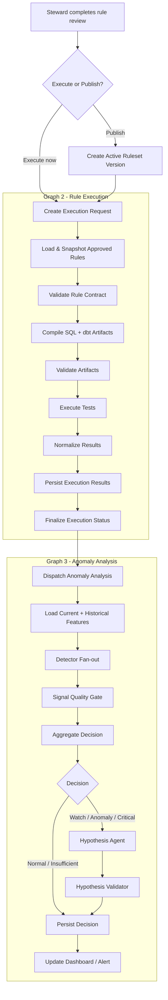

# RidePulse DQ - Graph 2 Post-Approval Implementation Plan

> **Status:** Kế hoạch và đánh giá, chưa implement  
> **Branch đánh giá:** `feature/general-agent`  
> **Remote base:** `origin/feature/general-agent` tại `218b2cf`  
> **Mục tiêu:** thiết kế luồng hậu Data Steward approve rule, gồm compile, execute, persist, anomaly detection và hypothesis explanation

---

## 1. Kết luận kiến trúc

Nên tách luồng hậu approval thành hai graph có ranh giới persistence rõ ràng:

```text
Graph 1 - Proposal & HITL
        ↓ approved rules
Graph 2 - Rule Execution
        ↓ persisted execution results
Graph 3 - Anomaly Analysis & Hypothesis
```

Graph 2 chịu trách nhiệm tạo một kết quả DQ đúng, deterministic và có thể audit. Graph 3 chịu trách nhiệm phân tích nhiều anomaly signals, đưa ra quyết định thống kê và sử dụng LLM để tạo hypothesis có evidence.

Tách Graph 3 là phù hợp vì:

- DQ execution thành công không được bị đổi thành thất bại chỉ vì anomaly model hoặc LLM lỗi.
- Có thể chạy lại anomaly analysis với detector/config mới mà không chạy lại dbt.
- Isolation Forest và distribution drift có dependency, latency và lifecycle khác test execution.
- Anomaly cần đọc lịch sử đã persist; execution cần đóng transaction trước khi detector chạy.
- Version detector, signal weights và hypothesis prompt có thể được đánh giá riêng.

Trong MVP, Graph 2 có thể gọi Graph 3 ngay sau khi persist results. Tuy nhiên hai graph vẫn dùng state và status riêng.

---

## 2. Data Steward approve rule có nên tự động chạy test không?

Không nên trigger một execution mới sau từng lần click approve.

Luồng đề xuất:

```text
PENDING
→ APPROVED / EDITED / REJECTED
→ Review batch complete
→ Publish hoặc Execute approved rules
→ Tạo immutable ruleset snapshot
→ Graph 2
```

Trigger Graph 2 khi một trong các điều kiện xảy ra:

- Steward bấm `Execute approved rules`.
- Steward publish ruleset và chọn `Run now`.
- Scheduled run sử dụng active ruleset đã publish.

Như vậy một batch review không tạo nhiều test run thừa và Graph 2 luôn nhận một ruleset nhất quán.

---

## 3. Đánh giá Agent hiện tại

### 3.1 Điểm tốt của Graph 1

- Có bước profiling và profile digest trước khi gọi LLM.
- Dataset Understanding dùng structured output `TableSemanticContract`.
- Có Data Dictionary fallback khi người dùng không cung cấp metadata.
- Có Semantic Contract HITL trước Rule Proposer.
- Rule Candidate Builder chạy deterministic.
- Rule Proposer dùng Pydantic structured output.
- Evidence được đưa vào proposal thay vì chỉ có reasoning tự do.
- Có failure isolation khi xử lý nhiều bảng.
- Proposal Graph và Execution Graph đã được tách ở cấp builder.

### 3.2 Vấn đề cần sửa trong Graph 1

#### P0-1. Prompt Customizer chưa thực sự được sử dụng

`prompt_customizer_node` ghi `specialized_system_prompts` vào state, nhưng `rule_proposer_node` hiện chọn `generic_rule_proposer_prompt` hoặc prompt taxi và không đọc `specialized_system_prompts`.

Khuyến nghị:

- Bỏ LLM Prompt Customizer khỏi critical path.
- Dùng Semantic Contract structured output.
- Dùng deterministic Context Builder.
- Dùng một fixed Rule Proposer prompt có version.

Luồng phù hợp:

```text
Profile + Dictionary
→ Dataset Understanding
→ Confirmed Semantic Contract
→ Deterministic Candidate Builder
→ Deterministic Context Builder
→ Fixed Rule Proposer Prompt
```

#### P0-2. Rule proposal contract đang không đồng nhất

Tests mới kỳ vọng `parameter_provenance` và `assumptions`, nhưng `ProposedRule` chưa khai báo hai field này. Kết quả kiểm thử hiện tại:

```text
tests/test_agents/test_semantic_contract.py
tests/test_agents/test_rule_proposal_core_evidence.py

13 passed
3 failed
```

Ba test fail đều liên quan `parameter_provenance` và `assumptions` bị Pydantic từ chối vì `extra="forbid"`.

Đây là blocker của Graph 2 vì execution không thể tin tưởng một approved rule nếu parameter provenance chưa có contract thống nhất.

#### P0-3. Validator đang tự điền parameter từ văn bản LLM

`ProposedRule._validate_parameters` hiện có thể tự suy đoán/default:

- `ROW_COUNT = 50000`
- `FRESHNESS = 24`
- `NULL_RATE = 10%`
- `RANGE min = 0`
- `ACCEPTED_VALUES = ["1", "2"]`
- Regex generic `^.+$`
- Cross-field target có tên cột taxi fallback

Đây là hành vi rủi ro. Invalid LLM output nên bị reject hoặc trả về repair request có cấu trúc, không tự trở thành một rule hợp lệ với parameter giả định.

Khuyến nghị:

- Parameter bắt buộc phải đến từ candidate/provenance.
- Không parse threshold từ `ai_reasoning`.
- Không default bằng giá trị domain-specific.
- Missing parameter dẫn tới `REJECTED_BY_VALIDATOR`.

#### P0-4. Evidence ID chưa thống nhất

Candidate Builder tạo các reference dùng dấu `:` như `profile:typical_range`, trong khi allow-list có logic nhận prefix dạng `profile.`. Điều này có thể tạo evidence ID lồng hoặc phân loại sai source.

Chốt một chuẩn duy nhất:

```text
profile.<table>.<column>.<metric>
schema.<table>.<column>.<attribute>
semantic.<table>.<column>.<attribute>
policy.<policy_id>
history.<rule_id>.<metric>
```

#### P0-5. Semantic HITL đang dùng error sentinel

`AWAITING_SEMANTIC_REVIEW` hiện được trả trong field `error` để graph đi tới `END`. Đây là trạng thái nghiệp vụ, không phải lỗi.

Nên thay bằng:

- `progress_state = WAITING_FOR_SEMANTIC_REVIEW`.
- Persist checkpoint/run state.
- Resume từ confirmed contract.
- Không ghi error log hoặc error metric cho một pause hợp lệ.

#### P0-6. Auto-confirm có thể bỏ qua HITL

CLI runner đang default `auto_confirm_semantic=True`, trong khi worker lại không bật flag. Hành vi giữa hai entrypoint không nhất quán.

Production/public demo phải default `False`; auto-confirm chỉ dùng trong test fixture có label rõ ràng.

#### P1-1. Semantic contract và trace phụ thuộc file local

Contract draft và debug traces được ghi ra filesystem. Deployment nhiều instance sẽ không đảm bảo instance resume đọc lại đúng file.

Semantic contract canonical phải nằm trong Supabase/PostgreSQL. File chỉ là debug artifact.

#### P1-2. Dashboard Proposal Graph bỏ qua các node mới

`build_dashboard_proposal_graph()` hiện chỉ chạy Rule Proposer. Điều này tạo hai luồng đề xuất rule khác nhau.

Nên hợp nhất qua một service/graph contract hoặc ghi rõ dashboard chỉ dùng confirmed profile/contract/candidates đã persist.

### 3.3 Điểm tốt của Execution Graph hiện tại

- Test generator phần lớn deterministic.
- Bind parameters được dùng cho values.
- Identifier được quote.
- Có dbt artifact và validation gate.
- Có execution metrics: violation count/rate, samples, duration.
- Có DQ score và steward report.
- Có persistence cho test results.
- Graph builders và conditional routing tests cơ bản pass.

### 3.4 Vấn đề của Execution/Anomaly hiện tại

#### P0-1. LLM repair không phù hợp với deterministic compiler

Nếu deterministic compiler sinh YAML sai, đây là compiler bug. LLM repair có thể làm thay đổi semantics rule đã được Steward approve.

Khuyến nghị:

- Bỏ `llm_dbt_repair` khỏi production path.
- Retry deterministic rendering nếu lỗi transient.
- Nếu dbt parse fail, dừng trước execution và ghi `COMPILER_VALIDATION_FAILED`.
- Lưu artifact và diagnostic để sửa compiler.

#### P0-2. Nguồn kết quả chưa rõ

Runner vừa gọi `dbt test`, vừa chạy deterministic SQL để tạo persisted metrics. Cần định nghĩa rõ:

- dbt artifact có vai trò gì.
- Kết quả nào là canonical PASS/FAIL.
- Nếu dbt và metrics SQL không đồng ý thì xử lý thế nào.

Đề xuất MVP:

- Deterministic SQL là canonical cho `checked_count`, `violation_count`, samples và rule status.
- dbt parse/test là compatibility/compliance gate.
- Lưu riêng `dbt_status` và `metrics_status`.
- Nếu hai kết quả không đồng nhất, run chuyển `RESULT_MISMATCH`, không tự chọn một bên.

Sau MVP có thể dùng dbt `run_results.json` làm canonical verdict.

#### P0-3. Có hai anomaly implementation

Hiện có:

- `src/agents/nodes/anomaly_detector_node.py`
- `src/services/dashboard_anomaly.py`

Hai implementation dùng model persistence và output schema khác nhau. Cần một anomaly service canonical được dùng bởi graph và API dashboard.

#### P0-4. Z-score với 5 history points chưa đáng tin cậy

Mean/std dễ bị ảnh hưởng bởi outlier và 5 điểm không đủ đại diện. Trường hợp standard deviation bằng 0 đang gán z-score 3.0 nếu current khác mean, làm severity bị phóng đại.

Khuyến nghị:

- Cold start: threshold + profile/schema/freshness signals.
- Từ 8-10 run: median/MAD robust Z-score và EWMA.
- Từ 30 run sạch trở lên: cân nhắc Isolation Forest.
- Có `reliability` cho từng signal dựa trên history size/sample size.

#### P0-5. Anomaly đang là một failure domain của execution

Nếu anomaly node hoặc Steward Insights LLM lỗi không được handle đúng, toàn Graph 2 có thể fail dù dbt execution đã thành công.

Execution status và anomaly status phải độc lập.

#### P1-1. Anomaly chưa được persist như entity có version

Hiện anomaly chủ yếu nằm trong state/report hoặc tính lại từ dashboard. Cần persist:

- Detector config/version.
- Input run/version.
- Từng signal và reliability.
- Aggregate decision.
- Hypotheses và evidence.
- Review outcome của Steward.

#### P1-2. DQ score penalty quá đơn giản

`count(anomalies) * 2` không phân biệt severity, confidence, dataset size hoặc duplicate signals. DQ score không nên giảm nhiều lần vì nhiều detector cùng báo một sự kiện.

### 3.5 Điểm đánh giá

| Hạng mục | Điểm | Nhận xét |
|---|---:|---|
| Ý tưởng Graph 1 | 7.5/10 | Đúng hướng semantic contract và evidence |
| Contract consistency | 5/10 | Model, tests và stamping chưa đồng nhất |
| HITL/resume | 5.5/10 | Có trạng thái nhưng chưa phải checkpoint/pause chuẩn |
| Rule guardrails | 6/10 | Có Pydantic nhưng validator tự điền parameter rủi ro |
| Execution safety | 7/10 | Deterministic SQL và bind params tốt |
| Anomaly detection | 4.5/10 | Mới có threshold/Z-score, chưa ensemble/persistence |
| Test readiness | 6/10 | Structural/anomaly pass, evidence contract còn fail |
| Tổng thể | **6/10** | Có nền tốt nhưng chưa sẵn sàng làm canonical post-approval pipeline |

---

## 4. Kiến trúc mục tiêu



---

## 5. Graph 2 - Rule Execution

### 5.1 Input contract

```python
class ExecutionRequest(BaseModel):
    execution_run_id: str
    dataset_id: str
    dataset_version_id: str
    proposal_run_id: str | None
    ruleset_version_id: str
    requested_by: str
    trigger_type: Literal["MANUAL", "PUBLISH_AND_RUN", "SCHEDULED"]
```

Graph 2 không nhận mutable proposal rows trực tiếp. Nó nhận `ruleset_version_id` và tạo snapshot bất biến.

### 5.2 Execution state

Không tiếp tục mở rộng một `AgentState(total=False)` cho mọi graph. Tạo state riêng:

```python
class ExecutionGraphState(TypedDict, total=False):
    request: dict
    ruleset_snapshot: dict
    validation_errors: list[dict]
    compiled_tests: list[dict]
    dbt_artifact_ref: dict
    dbt_validation: dict
    execution_results: list[dict]
    normalized_results: list[dict]
    execution_status: str
    error: dict | None
    metadata: dict
```

### 5.3 Nodes

#### Node 1 - `load_ruleset_snapshot`

- Load only approved/active rules selected for execution.
- Confirm review batch has no pending rules nếu run theo batch.
- Store rule parameter version, semantic contract version và schema hash.
- Calculate `ruleset_hash`.
- Reject empty ruleset.

Output:

```json
{
  "ruleset_version_id": "ruleset-v12",
  "ruleset_hash": "sha256:...",
  "rules": []
}
```

#### Node 2 - `validate_rule_contract`

Kiểm tra lại trước execution:

- Dataset/version đúng.
- Table và column tồn tại.
- Column type tương thích rule.
- Parameter schema hợp lệ.
- Parameter provenance đầy đủ.
- Target column của cross-field tồn tại.
- Rule chưa bị deactivate.
- Schema hash không drift so với lúc approve.

Không tự sửa parameter. Nếu lỗi, trả typed validation errors.

#### Node 3 - `compile_test_artifacts`

- Map rule catalog sang deterministic SQL template.
- Render bind parameters.
- Sinh dbt YAML deterministic.
- Tạo mapping `rule_id -> compiled_test_id`.
- Không gọi LLM.

#### Node 4 - `validate_artifacts`

- SQL SELECT-only.
- Single statement.
- Identifier allow-list theo schema registry.
- Operator/function allow-list.
- dbt YAML structural validation.
- `dbt parse` hoặc `dbt compile`.
- Artifact hash và trace.

Routing:

```text
valid → execute_tests
invalid → persist_execution_failure → END
```

Không có LLM repair loop.

#### Node 5 - `execute_tests`

- Execute dbt compatibility gate.
- Execute deterministic metrics queries.
- Bound query time, rows và failure samples.
- Capture duration và execution error theo rule.
- Không để một rule ERROR làm mất kết quả các rule khác.

#### Node 6 - `normalize_execution_results`

Chuẩn hóa mỗi rule thành:

```json
{
  "rule_id": "orders.amount.RANGE",
  "status": "PASS",
  "checked_count": 50000,
  "failed_count": 132,
  "violation_rate": 0.00264,
  "severity": "HIGH",
  "dimension": "VALIDITY",
  "duration_ms": 214.5,
  "dbt_status": "PASS",
  "metrics_status": "PASS",
  "sample_refs": [],
  "error": null
}
```

Statuses:

- `PASS`
- `FAIL`
- `ERROR`
- `SKIPPED`
- `RESULT_MISMATCH`

#### Node 7 - `persist_execution_results`

Persistence phải xảy ra trước anomaly analysis.

- Persist execution run.
- Persist all rule results atomically theo run.
- Persist artifact refs và hashes.
- Mark result set immutable.
- Emit `EXECUTION_RESULTS_PERSISTED` event.

#### Node 8 - `finalize_execution`

Execution status:

- `SUCCEEDED`: graph chạy xong, dù có rule FAIL.
- `PARTIAL`: một số rule ERROR/SKIPPED nhưng còn kết quả hợp lệ.
- `FAILED`: compiler/artifact/execution infrastructure fail, không có result đáng tin.

Rule `FAIL` là dữ liệu chất lượng kém, không phải infrastructure failure.

#### Node 9 - `dispatch_anomaly_analysis`

- Tạo `anomaly_run_id` tham chiếu `execution_run_id`.
- Dispatch Graph 3.
- Nếu dispatch fail, set `anomaly_status=FAILED_TO_START` nhưng giữ execution result.

---

## 6. Graph 3 - Anomaly Analysis

### 6.1 Anomaly state

```python
class AnomalyGraphState(TypedDict, total=False):
    anomaly_run_id: str
    execution_run_id: str
    dataset_id: str
    dataset_version_id: str
    detector_config_version: str
    current_features: dict
    historical_features: dict
    signal_observations: list[dict]
    signal_errors: list[dict]
    anomaly_decision: dict
    hypotheses: list[dict]
    hypothesis_validation: dict
    anomaly_status: str
    metadata: dict
```

### 6.2 Node 1 - `load_anomaly_context`

Load:

- Current persisted execution results.
- Historical successful runs cùng dataset/rule/schema family.
- Dataset profile snapshots.
- Schema changes.
- Freshness/row-count metrics.
- Ruleset and detector versions.

Không trộn lịch sử:

- Khác dataset.
- Khác rule semantic identity.
- Khác data grain không tương thích.
- Run failed/incomplete.
- Current run vào historical baseline.

### 6.3 Node 2 - `build_feature_frame`

Feature theo rule:

- `violation_rate`
- `violation_rate_delta`
- `failed_count`
- `checked_count`
- `duration_ms`
- `rule_status`

Feature theo dataset/table:

- `row_count`
- `row_count_delta`
- `freshness_delay_hours`
- `null_rate_delta`
- `distinct_ratio_delta`
- `mean/median/quantile_shift`
- `schema_change_count`
- `failed_rule_ratio`
- `correlated_failure_count`

### 6.4 Node 3 - Detector fan-out

Các detector chạy độc lập và trả cùng một schema.

#### P0 detectors

1. **Business Threshold Detector**
   - Hard threshold từ approved rule/policy.
   - Có thể phát `CRITICAL` nếu vi phạm invariant quan trọng.

2. **Robust Z-score Detector**
   - Dùng median và MAD.
   - Tối thiểu 8-10 historical points.
   - Có reliability theo history size.

3. **EWMA Detector**
   - Phát hiện drift tăng dần.
   - Thích hợp hơn Z-score cho thay đổi nhỏ kéo dài.

4. **Volume Drift Detector**
   - Row count tăng/giảm bất thường.
   - So sánh cả previous run và rolling baseline.

5. **Freshness Detector**
   - Dữ liệu đến muộn hoặc timestamp không tiến triển.

6. **Schema Drift Detector**
   - Added/removed/type-changed columns.
   - Tách breaking change khỏi non-breaking change.

7. **Failure Cluster Detector**
   - Nhiều rules cùng table/dimension fail đồng thời.
   - Gợi ý upstream/partial ingestion thay vì lỗi isolated.

8. **Execution Health Detector**
   - SQL/dbt timeout, RESULT_MISMATCH, error rate.
   - Đây là operational signal, không tự được gọi là data anomaly.

#### P1 detectors

9. **Distribution Drift Detector**
   - PSI cho categorical/binned numeric.
   - KS hoặc Wasserstein cho numeric distribution.

10. **Change-point Detector**
    - CUSUM hoặc change-point algorithm cho structural shift.

11. **Isolation Forest Detector**
    - Multivariate features.
    - Chỉ bật khi có ít nhất 30 clean historical runs; 50+ tốt hơn.
    - Không train trên run đã xác định infrastructure failure.

12. **Seasonal Baseline Detector**
    - Baseline theo day-of-week/hour nếu dataset có cadence đủ rõ.

### 6.5 Signal output schema

```python
class SignalObservation(BaseModel):
    signal_id: str
    family: Literal[
        "BUSINESS_RULE",
        "STATISTICAL",
        "ML",
        "VOLUME",
        "FRESHNESS",
        "SCHEMA",
        "CORRELATION",
        "EXECUTION"
    ]
    target_type: Literal["DATASET", "TABLE", "COLUMN", "RULE"]
    target_id: str
    score: float                 # 0..1
    reliability: float           # 0..1
    direction: str | None
    observed_value: float | str | None
    baseline: dict | None
    sufficient_history: bool
    evidence_refs: list[str]
    detector_name: str
    detector_version: str
    explanation_code: str
```

Detector không trả prose tự do làm output chính. `explanation_code` được map tới template deterministic.

### 6.6 Node 4 - `signal_quality_gate`

Loại hoặc giảm reliability nếu:

- Sample/check count quá nhỏ.
- Historical points không đủ.
- Baseline chứa failed runs.
- Schema version không tương thích.
- Metric missing/NaN/infinite.
- Detector error.
- Nhiều signals thực chất là duplicate từ cùng một source.

### 6.7 Node 5 - `aggregate_anomaly_decision`

Đây là decision engine deterministic, không dùng LLM.

Score đề xuất:

```text
weighted_score =
  Σ(weight[family] × signal.score × signal.reliability)
  / Σ(weight[family] × signal.reliability)
```

Không tính nhiều signal cùng family như nhiều phiếu độc lập. Trước aggregation, lấy max hoặc calibrated combination trong từng family.

Decision policy ban đầu:

```text
INSUFFICIENT_HISTORY
  nếu không có hard signal và tổng reliability quá thấp

NORMAL
  nếu score < 0.45

WATCH
  nếu 0.45 ≤ score < 0.70

ANOMALY
  nếu score ≥ 0.70 và có ít nhất 2 signal families độc lập

CRITICAL
  nếu hard business invariant breach
  hoặc score ≥ 0.85 với ít nhất 2 signal families
```

Threshold và weights phải nằm trong versioned config, không rải trong node code.

Example P0 family weights:

| Family | Weight |
|---|---:|
| Business rule | 0.25 |
| Statistical | 0.20 |
| Volume | 0.15 |
| Freshness | 0.15 |
| Schema | 0.15 |
| Correlation | 0.10 |

ML signal chưa tham gia P0 score. Sau khi có labeled history, ML có thể nhận weight 0.15 và recalibrate các weight còn lại.

### 6.8 Decision output

```json
{
  "decision": "ANOMALY",
  "score": 0.78,
  "confidence": 0.81,
  "severity": "HIGH",
  "reason_codes": [
    "VIOLATION_RATE_SPIKE",
    "ROW_COUNT_DROP",
    "COMPLETENESS_FAILURE_CLUSTER"
  ],
  "supporting_signal_ids": ["sig-1", "sig-2", "sig-3"],
  "contradicting_signal_ids": ["sig-4"],
  "detector_config_version": "anomaly-v1",
  "limitations": []
}
```

### 6.9 Node 6 - `hypothesis_agent`

Chỉ chạy cho `WATCH`, `ANOMALY` hoặc `CRITICAL`.

Agent không quyết định anomaly. Nó nhận quyết định deterministic và tạo các giả thuyết có thể kiểm chứng.

Input cho Agent:

- Aggregate decision.
- Supporting/contradicting signals.
- Dataset/schema metadata.
- Rule failures.
- Recent version/config changes.
- Không gửi raw rows/PII.

Hypothesis types nên giới hạn:

- `PARTIAL_INGESTION`
- `LATE_OR_MISSING_PARTITION`
- `DUPLICATE_INGESTION`
- `SCHEMA_BREAKING_CHANGE`
- `UPSTREAM_TRANSFORMATION_CHANGE`
- `DOMAIN_DISTRIBUTION_SHIFT`
- `ISOLATED_BAD_RECORDS`
- `RULE_THRESHOLD_MISCONFIGURED`
- `EXECUTION_INFRASTRUCTURE_ISSUE`
- `UNKNOWN`

Structured output:

```python
class AnomalyHypothesis(BaseModel):
    hypothesis_type: str
    summary: str
    confidence: float
    supporting_signal_ids: list[str]
    contradicting_signal_ids: list[str]
    evidence_refs: list[str]
    recommended_checks: list[str]
    missing_evidence: list[str]
    limitations: list[str]
```

Agent phải sử dụng ngôn ngữ xác suất:

- `Khả năng cao...`
- `Evidence hiện tại phù hợp với...`
- `Chưa đủ dữ liệu để xác nhận...`

Không được khẳng định root cause đã được chứng minh.

### 6.10 Node 7 - `validate_hypotheses`

Deterministic guardrails:

- Mọi signal ID phải tồn tại.
- Mọi evidence ref phải tồn tại.
- Hypothesis type nằm trong allow-list.
- Confidence không vượt decision confidence quá configured margin.
- `recommended_checks` không chứa destructive action.
- Hypothesis `EXECUTION_INFRASTRUCTURE_ISSUE` phải có execution signal.
- Nếu citations invalid, reject hypothesis thay vì tự thay evidence.

### 6.11 Node 8 - `persist_anomaly_analysis`

Persist dù decision là NORMAL hay INSUFFICIENT_HISTORY để tạo lịch sử đầy đủ.

### 6.12 Node 9 - `notify_and_surface`

- Dashboard cập nhật anomaly status.
- Alert chỉ cho `ANOMALY/CRITICAL` theo policy.
- `WATCH` hiển thị trong dashboard nhưng không spam alert mặc định.
- Alert link tới execution run, signals và hypotheses.

---

## 7. Persistence model

### 7.1 `ruleset_versions`

```text
id
dataset_id
dataset_version_id
proposal_run_id
semantic_contract_version_id
ruleset_hash
rules_json / normalized relation
created_by
created_at
```

### 7.2 `execution_runs`

```text
id
dataset_id
dataset_version_id
ruleset_version_id
trigger_type
status
dbt_status
metrics_status
artifact_ref
started_at
completed_at
error
```

### 7.3 `execution_results`

```text
execution_run_id
rule_id
status
checked_count
failed_count
violation_rate
duration_ms
sample_refs
dbt_status
metrics_status
error
```

### 7.4 `anomaly_runs`

```text
id
execution_run_id
detector_config_version
status
decision
score
confidence
severity
reason_codes
started_at
completed_at
error
```

### 7.5 `anomaly_signals`

```text
anomaly_run_id
signal_id
family
target_type
target_id
score
reliability
observed_value
baseline_json
evidence_refs
detector_name
detector_version
```

### 7.6 `anomaly_hypotheses`

```text
anomaly_run_id
hypothesis_type
summary
confidence
supporting_signal_ids
contradicting_signal_ids
evidence_refs
recommended_checks
missing_evidence
limitations
model_name
prompt_version
```

### 7.7 `anomaly_feedback`

Steward có thể đánh dấu:

- `TRUE_ANOMALY`
- `FALSE_POSITIVE`
- `EXPECTED_CHANGE`
- `RULE_MISCONFIGURATION`
- `UNKNOWN`

Feedback này dùng để tune thresholds/weights và tạo labeled evaluation set, không tự động train model ngay.

---

## 8. API contract đề xuất

### Execution

| Method | Endpoint | Chức năng |
|---|---|---|
| `POST` | `/api/v1/rule-runs/{proposal_run_id}/publish` | Tạo immutable active ruleset version |
| `POST` | `/api/v1/execution-runs` | Trigger Graph 2 |
| `GET` | `/api/v1/execution-runs/{id}` | Execution status |
| `GET` | `/api/v1/execution-runs/{id}/results` | Rule results |
| `GET` | `/api/v1/execution-runs/{id}/artifacts` | dbt/compiler artifact metadata |

### Anomaly

| Method | Endpoint | Chức năng |
|---|---|---|
| `POST` | `/api/v1/execution-runs/{id}/anomaly-analysis` | Trigger/retry Graph 3 |
| `GET` | `/api/v1/anomaly-runs/{id}` | Decision summary |
| `GET` | `/api/v1/anomaly-runs/{id}/signals` | Signal details |
| `GET` | `/api/v1/anomaly-runs/{id}/hypotheses` | Hypothesis details |
| `POST` | `/api/v1/anomaly-runs/{id}/feedback` | Steward feedback |

Response phải phân biệt:

```text
execution_status
anomaly_status
hypothesis_status
```

Không dùng một status duy nhất cho cả ba.

---

## 9. Frontend impact

Frontend cần hiển thị:

### Rule Review

- Approved rule count.
- Review complete/incomplete.
- `Publish` và `Execute approved rules` là hai action rõ ràng.
- Ruleset version/hash ở detail, không cần ở primary UI.

### Execution

- Compile, validate, execute, persist phases.
- Rule result status.
- dbt/metrics mismatch nếu có.
- Execution success độc lập anomaly analysis.

### Anomaly

- Decision: Normal/Watch/Anomaly/Critical/Insufficient History.
- Aggregate score và confidence.
- Signal list với score/reliability.
- Hypotheses, evidence và recommended checks.
- Limitations/missing evidence.
- Steward feedback.

UI không được đổi label `Hypothesis` thành `Root Cause` nếu chưa được xác minh.

---

## 10. Implementation work breakdown

### P0-A - Fix Graph 1 contract trước Graph 2

- Đồng nhất `ProposedRule`, tests, persistence và frontend types.
- Thêm hoặc loại bỏ có chủ đích `parameter_provenance`/`assumptions`.
- Loại auto-fill parameter từ text.
- Chốt evidence ID convention.
- Bỏ hoặc wire đúng Prompt Customizer; khuyến nghị thay bằng Context Builder deterministic.
- Chuyển semantic pause khỏi error sentinel.
- Persist semantic contract trong DB.

### P0-B - Refactor Graph 2 execution boundary

- Tạo `ExecutionRequest` và `ExecutionGraphState`.
- Tạo immutable ruleset snapshot.
- Tạo `load_ruleset_snapshot`.
- Tạo `validate_rule_contract`.
- Giữ deterministic compiler.
- Bỏ LLM repair khỏi production routing.
- Chuẩn hóa result contract.
- Persist results trước anomaly.
- Phân biệt run status với rule status.

### P0-C - Canonical anomaly service

- Hợp nhất anomaly node và dashboard service.
- Tạo signal schema.
- Implement threshold, robust Z-score, EWMA, volume, freshness, schema và failure cluster.
- Implement signal quality gate.
- Implement versioned aggregator.
- Persist signals/decision.

### P0-D - Hypothesis Agent

- Tạo structured schema.
- Fixed prompt có version.
- Input chỉ gồm structured evidence.
- Hypothesis validator.
- Deterministic fallback summary.
- Persist model/prompt version và latency.

### P1 - Advanced detectors/evaluation

- Distribution drift.
- Isolation Forest.
- Seasonal baseline.
- Change-point detection.
- Feedback-based calibration.
- DeepEval hypothesis faithfulness.

---

## 11. Testing strategy

### 11.1 Graph 1 blockers

- ProposedRule schema and tests agree.
- Missing parameters are rejected.
- No taxi-specific default.
- Evidence refs validate against allow-list.
- Semantic pause/resume does not use error.
- Context Builder output is deterministic for same input.

### 11.2 Graph 2 unit tests

- Empty ruleset rejected.
- Pending/rejected rule cannot enter snapshot.
- Schema drift blocks incompatible rule.
- Compiler output deterministic.
- SQL identifiers/values safe.
- dbt validation failure stops before execution.
- One rule ERROR does not erase other results.
- Results persist exactly once/idempotently.
- Rule FAIL still yields execution `SUCCEEDED`.

### 11.3 Signal detector tests

- Cold start.
- Stable history.
- Constant history/std=0.
- Single spike.
- Gradual EWMA drift.
- Small sample reliability penalty.
- Row-count drop.
- Freshness delay.
- Schema breaking/non-breaking change.
- Correlated failure cluster.
- Dataset isolation.
- Current run excluded from baseline.
- IForest disabled below minimum history.

### 11.4 Aggregator tests

- One weak signal returns WATCH/NORMAL, not ANOMALY.
- Two independent strong families return ANOMALY.
- Duplicate signals in same family do not double count.
- Hard business invariant returns CRITICAL.
- Low reliability returns INSUFFICIENT_HISTORY.
- Config version produces reproducible decision.

### 11.5 Hypothesis tests

- Cited signals exist.
- Invalid citations rejected.
- Hypothesis cannot override deterministic decision.
- Confidence cap enforced.
- Missing evidence is surfaced.
- No raw PII in prompt/output.
- LLM failure uses deterministic fallback.

### 11.6 DeepEval/offline evaluation

DeepEval phù hợp cho:

- Hypothesis faithfulness với signal evidence.
- Citation completeness.
- Explanation relevance.
- Recommended-check usefulness.
- Hallucination rate.

Không dùng LLM-as-judge để đánh giá detector numerical correctness. Numerical detectors dùng labeled synthetic histories và deterministic metrics.

---

## 12. Acceptance criteria

### Graph 2

- Chỉ approved/active rules trong immutable snapshot được execute.
- Compiler không gọi LLM.
- Không auto-repair semantics bằng LLM.
- Results được persist trước anomaly dispatch.
- Rule FAIL không làm execution infrastructure status FAILED.
- Một rule ERROR không làm mất kết quả rule khác.
- Artifact/config/version có thể audit.

### Graph 3

- Có ít nhất 6 P0 signal families hoạt động.
- Mọi signal có score, reliability, evidence và detector version.
- Decision deterministic/reproducible.
- ANOMALY yêu cầu corroboration hoặc hard invariant.
- Isolation Forest không chạy khi thiếu history.
- Hypothesis chỉ cite evidence tồn tại.
- Failure của Hypothesis Agent không làm mất anomaly decision.
- Dashboard đọc persisted decision, không tự tính bằng implementation thứ hai.

---

## 13. Rủi ro và biện pháp

| Rủi ro | Xử lý |
|---|---|
| Lịch sử quá ít | Cold-start mode và reliability thấp |
| Nhiều detector báo cùng một event | Group theo signal family trước aggregation |
| Isolation Forest false positive | Gating history, calibration và feedback |
| Schema change làm baseline sai | Baseline partition theo compatible schema version |
| Hypothesis hallucination | Structured citations + deterministic validator |
| LLM unavailable | Persist decision và dùng fallback explanation |
| Anomaly graph fail | Giữ execution success, cho phép retry Graph 3 |
| dbt/SQL result lệch | `RESULT_MISMATCH`, không tự hòa giải |
| Hai persistence model hiện tại | Chọn canonical execution/anomaly tables và adapter API |

---

## 14. Tự review kế hoạch

### Phiên bản ban đầu có nguy cơ

- Giữ anomaly trong Graph 2 và làm execution failure domain quá rộng.
- Bật Isolation Forest quá sớm với 5-10 runs.
- Cho LLM trực tiếp bỏ phiếu anomaly.
- Chỉ lưu anomaly summary, không lưu signal evidence.
- Dùng nhiều detectors nhưng double-count cùng một event.
- Gọi mọi rule FAIL là anomaly.

### Điều chỉnh đã áp dụng

1. Tách Graph 3 sau persistence boundary.
2. LLM chỉ tạo hypothesis, không quyết định anomaly.
3. Isolation Forest chuyển P1 và cần ít nhất 30 clean runs.
4. Robust Z-score/EWMA thay standard Z-score làm statistical core.
5. Thêm reliability và signal quality gate.
6. Yêu cầu hai independent signal families cho ANOMALY.
7. Tách execution issue khỏi data anomaly.
8. Persist signal, decision, hypothesis và detector version riêng.
9. Thêm feedback loop của Steward.
10. Đưa contract mismatch của Graph 1 thành blocker trước Graph 2.

### Đánh giá sau điều chỉnh

| Tiêu chí | Điểm |
|---|---:|
| Failure isolation | 9/10 |
| Explainability | 9/10 |
| Khả năng audit | 9/10 |
| Khả năng làm MVP | 7.5/10 |
| Khả năng mở rộng ML | 8.5/10 |
| Tổng thể | **8.5/10** |

Phạm vi MVP vẫn phải dừng ở detector deterministic và Hypothesis Agent. Isolation Forest, seasonal baseline và advanced distribution drift chỉ bắt đầu khi persistence/history đã đáng tin.

---

## 15. Thứ tự triển khai khuyến nghị

```text
Fix Graph 1 contracts
→ Immutable Ruleset Snapshot
→ Deterministic Execution Graph 2
→ Persist Canonical Results
→ Signal Schema + P0 Detectors
→ Deterministic Aggregator
→ Persist Anomaly Decision
→ Hypothesis Agent + Validator
→ Dashboard/API Integration
→ DeepEval + Feedback
→ Isolation Forest (khi đủ history)
```

